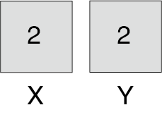

# 1. Pensée algorithmique et principes


Un {glo}`algo|algorithme` est en quelque sorte « une recette » que l’on suit pour **<span style="color:rgb(89, 51, 209)">résoudre un problème</span>**. Voici quelques exemples de problèmes que l’on arrive à résoudre numériquement : calculer le trajet le plus rapide entre deux lieux, gérer les livres d’une bibliothèque, détecter des visages dans une photographie ou recommander des produits. ***<span style="color:rgb(13, 204, 166)">L’algorithme n’est donc pas un programme</span>***. Un {glo}`algo|algorithme` ne se code pas, il ne s’exécute pas et il ne donne pas de solution concrète. L’{glo}`algo|algorithme` décrit plutôt un « mode d’emploi » que l’on peut suivre pour créer un {glo}`programme|programme`. C’est le {glo}`programme|programme` qui sera exécuté par un système informatique pour concrètement résoudre le problème.

## Résolution d'un problème par étapes

Un mode d’emploi ou une recette décrivent **<span style="color:rgb(89, 51, 209)">des étapes</span>** à suivre. La préparation des ingrédients, la cuisson ou le service sont différentes étapes d’une recette de cuisine qu’une personne peut suivre pour réaliser un plat. Prenons un cas précis : ***<span style="color:rgb(13, 204, 166)">réaliser une omelette</span>***. Pour chaque étape de la préparation de l’omelette, il faut prévoir une marche à suivre suffisamment détaillée, afin que la personne qui suit la recette arrive au même résultat. Dans le cas de l’omelette, les opérations pourraient être (voir figure ci-dessous) : 

1. Casser les œufs dans un bol. 
2. Mélanger les œufs jusqu’à obtenir un mélange homogène.
3. Cuire le mélange d’œufs dans une poêle à température moyenne.
4. Lorsque cuite, glisser l’omelette dans une assiette.

```{figure} media/Omelette_1.png

Les opérations à suivre pour la réalisation d’une omelette.

```

Il en est de même pour l’{glo}`algo|algorithme` qui **<span style="color:rgb(89, 51, 209)">décompose le problème en sous-problèmes</span>**. La solution de chaque sous-problème donne lieu à une étape que le système informatique peut suivre pour résoudre le sous-problème. L’{glo}`algo|algorithme` décrit toutes les opérations qu'il faut effectuer pour arriver à un résultat. L’{glo}`algo|algorithme` est donc **<span style="color:rgb(89, 51, 209)">une suite d’opérations</span>** qui permettent de résoudre un problème.  Le langage utilisé dans un {glo}`algo|algorithme` est plus libre que celui utilisé dans un programme, comme le montre cet exemple :

```
Tableau Nombres : numérique
Variable i : numérique
Variable Résultat : numérique
Variable Résultat ← 0
Répéter Pour i = 1 à longueur(Nombres) # par pas de 1
    Résultat ← Résultat + Nombres[i]
Fin Pour
```

````{admonition} Exercice-application 0
:class: note

Que contient la variable résultat à la fin de l'algorithme ci-dessus ? Quel problème cet algorithme permet-il de résoudre ?

````

````{admonition} Solution
:class: hint

```{dropdown} <span style="color:grey">Cliquer ici pour voir la réponse</span>
:animate: fade-in-slide-down

L’algorithme permet de calculer la somme des nombres contenus dans la liste Nombres.
```
````

« Chaque étape d’un algorithme doit être définie précisément » (Knuth, D. E., 2011). En effet, si on ne décompose pas suffisamment la solution du problème, on peut se retrouver face à une recette inutile, par exemple : prendre des œufs et réaliser une omelette. Cette recette ne nous dit pas vraiment comment procéder pour arriver à faire une omelette...

## Les ingrédients d’un algorithme

L’objectif d’un {glo}`algo|algorithme` est de trouver la solution à un problème donné. Concrètement l’{glo}`algo|algorithme` va utiliser des **<span style="color:rgb(89, 51, 209)">données</span>** qu’il reçoit ***<span style="color:rgb(13, 204, 166)">en entrée</span>*** et va retourner un **<span style="color:rgb(89, 51, 209)">résultat</span>** ***<span style="color:rgb(13, 204, 166)">en sortie</span>*** (la solution du problème). Un {glo}`algo|algorithme` qui détecte les visages peut recevoir une image en {glo}`input|entrée` (les {glo}`data|données`) et peut répondre "oui" si l’image contient un visage ou "non" si l’image ne contient pas de visage (le résultat). Les {glo}`data|données` en {glo}`input|entrée` d’un {glo}`algo|algorithme` qui traduit pourraient être un texte à traduire et un dictionnaire. L’{glo}`algo|algorithme` traite ces {glo}`data|données` pour retourner en {glo}`output|sortie` un texte traduit dans une autre langue, dont le sens correspond au texte original.

Entre l’{glo}`input|entrée` et la {glo}`output|sortie`, l’{glo}`algo|algorithme` précise quelles **<span style="color:rgb(89, 51, 209)">opérations</span>** exécuter. Les opérations que l’on peut demander à un humain sont très différentes de celles d’un ordinateur. On peut demander à un humain de casser des œufs, mais un ordinateur ne peut comprendre et réaliser cette opération. Par contre on peut demander à un ordinateur de stocker une valeur dans une variable, de comparer les valeurs de plusieurs variables, de parcourir de longues listes de {glo}`data|données`. Une fois l’{glo}`algo|algorithme` conçu, les opérations qu’il décrit sont retranscrites en une suite d’instructions élémentaires, c’est-à-dire un programme exécutable par un ordinateur.

Le dernier ingrédient d’un {glo}`algo|algorithme`, mais tout aussi important, est l’**<span style="color:rgb(89, 51, 209)">ordre des opérations</span>**. Dans l’exemple de l’omelette, on ne peut cuire les œufs avant de les avoir cassés, sans quoi on obtiendrait des œufs durs. L’ordinateur a besoin de recevoir les instructions élémentaires à exécuter dans le bon ordre. Pour résumer, les ingrédients pour concevoir un {glo}`algo|algorithme` sont les suivants : 

1. Des {glo}`data|données` en {glo}`input|entrée`.
2. Des opérations, dans un ordre précis.
3. Un résultat en {glo}`output|sortie`.

```{figure} media/Diagramme_algorithme.png

Schéma des ingrédients d'un algorithme.

```

Notez que les opérations d’un {glo}`algo|algorithme` doivent être précises et ***<span style="color:rgb(13, 204, 166)">non ambigües</span>***. Il doit y avoir une seule interprétation possible de l’{glo}`algo|algorithme`. Une recette de cuisine ne serait pas assez précise pour un ordinateur : il faudrait indiquer précisément ce que température moyenne et mélange homogène veulent dire. Les êtres humains peuvent interpréter, deviner et supposer, mais pas les ordinateurs.

````{admonition} Le saviez-vous ?
:class: hint

Le jeu d’instructions élémentaires dépend du système informatique. Un algorithme spécifie des opérations à suivre dans un ordre donné. Ces opérations sont transcrites à travers un programme en instructions élémentaires exécutables par la machine, qui peuvent être très différentes d’un système informatique à l’autre. L’algorithmique permet d’aborder la résolution de problème de manière générale, sans se préoccuper des détails de l’implémentation sur différents systèmes. 

````
<br>

````{admonition} Exercice-application 1
:class: note
A quoi correspondent les ingrédients d’un algorithme dans l’exemple de la recette de l’omelette ?
````

````{admonition} Solution
:class: hint

```{dropdown} <span style="color:grey">Cliquer ici pour voir la réponse</span>
:animate: fade-in-slide-down

Les œufs sont les données en entrée, les opérations correspondent aux instructions numérotées de 1 à 4 dans la recette et finalement le résultat en sortie est l’omelette. On peut considérer le matériel culinaire (bol, fourchette, poêle, spatule) comme du matériel informatique à notre disposition, capable de traiter les données. En effet on peut cuire plein d’autres aliments dans une poêle.
```
````

````{admonition} Exercice-application 2
:class: note

Ecrire un algorithme qui échange les valeurs de deux variables. Représenter les deux variables par deux cases. Chaque case a une étiquette (le nom de la variable) et un contenu (la valeur de la variable). Représenter le contenu de chaque variable après chaque opération de votre algorithme.

````


`````{admonition} Solution
:class: hint

````{dropdown} <span style="color:grey">Cliquer ici pour voir la réponse</span>
:animate: fade-in-slide-down

Soient les variables X et Y qui contiennent les valeurs 1 et 2. Une solution naïve consisterait à écrire l’algorithme suivant :

```
X ← Y
Y ← X
```

Nous allons représenter ces deux variables par des cases étiquetées. La première case contient 1 et s’appelle X, la deuxième contient la valeur 2 et est étiquetée Y : 


Après la première opération où on met la valeur de Y dans la variable X on se retrouve avec cette situation, où la valeur contenue dans Y écrase la valeur qui était contenue dans X :



On n’a plus accès à la valeur qui était stockée dans la variable X. Pour remédier à ce problème, il faut utiliser une variable temporaire Z qui va se souvenir de la valeur précédente de X. Un algorithme correct pour échanger les valeurs de deux variables est :

```
Z ← X
X ← Y
Y ← Z
```

Si on dessine l’état des variables après chacune de ces opérations dans des cases, voici ce qu’on obtient :


````

`````

<br>
<br>


````{admonition} Exercice 1
:class: note
<span style="color:green">Niveau débutant</span> ✏️ 📒

L’algorithme suivant contrôle un crayon. Quelle forme dessine-t-il ?
```
Répéter 8 fois :
    Avance de 5 cm
    Tourne à droite de 60°
```
````

````{admonition} Exercice 2
:class: note
<span style="color:orange">Niveau intermédiaire</span> ✏️ 📒

Ecrivez un algorithme qui permet de déterminer le plus petit nombre d’une liste. Pensez à décomposer la solution en différentes étapes.

Appliquez l’algorithme à la liste [3, 6, 2, 8, 1, 9, 7, 5].

Avez-vous trouvé la bonne solution ? Sinon, modifiez votre algorithme afin qu’il permette de trouver la bonne solution.

````

````{admonition} Exercice 3
:class: note
<span style="color:orange">Niveau intermédiaire</span> ✏️ 📒

On souhaite déterminer l’élève dont la date d’anniversaire est la plus proche de la date d’aujourd’hui dans le futur. Ecrivez un algorithme qui permet de trouver cet élève (utiliser un langage familier). Pensez à décomposer le problème en sous-problèmes. 

Comparez votre solution à celle d’un autre élève : avez-vous procédé de la même manière ? Si non, expliquez vos raisonnements.

Un ordinateur peut-il réaliser les opérations décrites par votre algorithme ?

````

````{admonition} Exercice 4
:class: note
<span style="color:red">Niveau avancé</span> ✏️ 📒

Écrivez un algorithme qui effectue la permutation circulaire des variables X, Y et Z : à la fin de l’algorithme, X contient la valeur de Z, Y la valeur de X et Z la valeur de Y. Conseil : pensez à chaque variable comme un tiroir avec une étiquette X, Y ou Z qui contient une valeur. Ce tiroir ne peut stocker qu’une valeur à un moment donné. 

Une fois l’algorithme écrit, représentez les variables par une case qui contient des valeurs de votre choix. Suivez les opérations de l’algorithme une après l’autre et dessinez leur impact sur le contenu des variables. Est-ce que votre algorithme donne le résultat attendu ? Si non, modifiez votre algorithme afin qu’il permette de résoudre le problème correctement.

````

````{admonition} Exercice 5
:class: note
<span style="color:red">Niveau avancé</span> ✏️ 📒

Quel est le résultat de la suite des trois affectations suivantes ? Vérifiez votre solution en dessinant une case par variable et en y mettant des valeurs fictives. Suivez les opérations dans l’ordre et dessinez le contenu des variables après chaque étape.

```
X ← X + Y
Y ← X – Y
X ← X – Y
```

````


````{admonition} Ai-je compris ?
:class: hint

1. Je connais la différence entre un algorithme et un programme.

2. Je sais formuler un algorithme : je décompose le problème en sous-problèmes et je décris les opérations qui permettent de résoudre chaque sous-problème.

````


