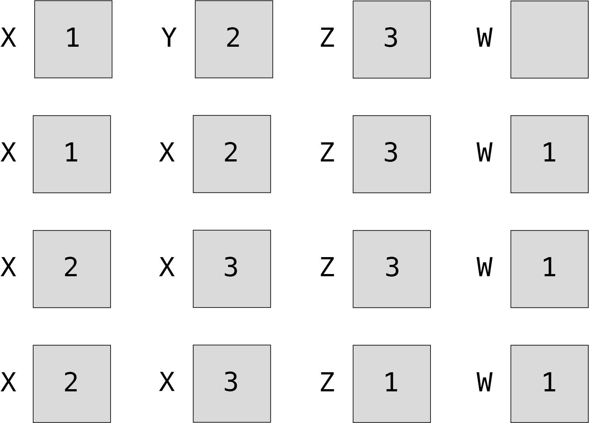

# 1. Les algorithmes

La première question que l'on va se poser est la suivante : c'est quoi un {glo}`algo|algorithme` ? Est-ce qu'un algorithme est la même chose qu'un programme informatique, ou s'agit-il d'autre chose ?

Un {glo}`algo|algorithme` est en quelque sorte « une recette » que l’on peut suivre pour **<span style="color:rgb(89, 51, 209)">résoudre un problème</span>**. De nos jours, il existe énormément de problèmes que les algorithmes nous permettent de résoudre. Il existe des algorithmes pour calculer le trajet le plus rapide entre deux lieux. D'autres algorithmes ont été imaginés pour détecter les visages dans nos photos. Une demande sur un moteur de recherche est analysée par de nombreux algorithmes afin de nous aider à mieux définir ce que l'on cherche ou afin de nous proposer des contenus publicitaires adaptés. 

Ce n'est pas l'{glo}`algo|algorithme` qui est exécuté sur une machine pour nous donner une solution concrète pour tous ces problèmes. *<span style="color:rgb(13, 204, 166)">L’algorithme n’est donc pas un programme</span>*. L’{glo}`algo|algorithme` décrit plutôt un « mode d’emploi », qui permet de réfléchir à un problème de manière générale et ensuite de créer un {glo}`programme|programme`. C'est le {glo}`programme|programme` qui sera exécuté par un système informatique pour concrètement résoudre le problème. En d'autres mots, l'{glo}`algo|algorithme` décrit l'idée humaine derrière la solution d'un problème, alors que c'est le {glo}`programme|programme` qui permet à une machine de trouver une solution numérique dans des cas précis.

```{figure} media/algoprog.png
---
alt: Différence entre un algorithme et un programme.
width: 65%
---

**Différence entre un algorithme et un programme.** Un algorithme doit être compréhensible par un humain, alors qu'un programme est écrit de façon à ce qu'il soit compréhensible par une machine.

```

## Résolution d'un problème par étapes

Un mode d’emploi, ou une recette, décrit les **<span style="color:rgb(89, 51, 209)">étapes</span>** à suivre pour arriver à une solution. Dans le cas d'une recette de cuisine, la préparation des ingrédients, leur cuisson et leur présentation sont différentes étapes que l'on peut suivre pour réaliser un plat. Prenons un cas précis : *<span style="color:rgb(13, 204, 166)">faire une omelette</span>*. Pour chaque étape de la préparation de l’omelette, il faut prévoir une marche à suivre suffisamment détaillée, afin que la personne qui suit la recette arrive au résultat souhaité. Dans le cas de l’omelette, les opérations pourraient être (voir figure ci-dessous) : 

1. Casser les œufs dans un bol. 
2. Mélanger les œufs jusqu’à obtenir un mélange homogène.
3. Cuire le mélange d’œufs dans une poêle à température moyenne.
4. Lorsque cuite, glisser l’omelette dans une assiette.

```{figure} media/Omelette.png
---
alt: Un algorithme est un peu comme une recette de cuisine.
width: 100%
---

**Un algorithme est un peu comme une recette de cuisine.** Cet exemple illustre les opérations à suivre pour la réalisation d’une omelette.

```

Dans le cas de la recette d'une omelette, nous avons décomposé la marche à suivre en étapes à réaliser dans un certain ordre. Il en est de même pour un {glo}`algo|algorithme`. Pour résoudre un problème, il faut d'abord **<span style="color:rgb(89, 51, 209)">décomposer le problème en sous-problèmes</span>** que l'on *sait résoudre*. La solution de chaque sous-problème donne lieu à une étape qu'il faudra exécuter pour arriver à un résultat. Voici les sous-problèmes que certaines étapes ci-dessus permettent de résoudre. Afin d'extraire le contenu édible de l'œuf, il faut casser les oeufs. Pour que l'omelette ait une jolie couleur uniforme, il faut mélanger le jaune et le blanc d'œuf. Cette dernière étape ne serait pas du tout pertinente si le problème que l'on essaie de résoudre est la préparation d'un oeuf au plat. *<span style="color:rgb(13, 204, 166)">L’{glo}`algo|algorithme` décrit donc toutes les opérations qu'il faut effectuer pour arriver à ce résultat</span>*. Nous allons ainsi définir l’{glo}`algo|algorithme` comme **<span style="color:rgb(89, 51, 209)">une suite d’opérations qui permettent de résoudre un problème</span>**. 

Le langage utilisé pour écrire un programme doit être extrêment précis, sans quoi une machine ne pourrait pas le comprendre. Nous avons vu qu'un algorithme n'a pas besoin d'être compris par une machine, mais seulement par les humains. Ainsi, le langage que l'on va utiliser pour exprimer un algorithme sera plus libre que celui utilisé pour coder un programme. Ce langage **peut varier d'une personne à l'autre** et se rapproche dans notre cas de la langue française, comme le montre cet exemple :

<!-- ```
Tableau Nombres : numérique
Variable i : numérique
Variable Résultat : numérique
Variable Résultat ← 0


Répéter Pour i ← 1 à longueur(Nombres)  # incrémente (augemente) i par pas de 1    
    Résultat ← Résultat + Nombres[i]
Fin Pour
``` -->

```
Liste Nombres           # la variable Nombres contient une liste de nombres
n ← longueur(Nombres)   # la variable n contient le nombre d'éléments dans Nombres
i ← 1                   # la variable i contient 1 pour commencer
Résultat ← 0            # la variable Résultat contient 0 pour commencer

Répéter Pour i ← 1 à n  # i prend la valeur de 1, puis 2, puis 3, jusqu'à n    
    Résultat ← Résultat + Nombres[i]
                        # Résultat vaut la somme de lui-même avec l'i-ème élément de Nombres
Fin Pour                # quand i vaut n l'algorithme se termine

Retourner Résultat
```

Dans cet algorithme on mentionne le terme *variable*. Pour rappel, les variables associent un nom (ou un identifiant) à une valeur. Par exemple, ci-dessus on va utiliser une variable que l'on va appeler *i* et qui va stocker pour commencer la valeur 1. Le terme variable prend tout son sens dans l'opération *Répéter*, lorsque *i* contient à tour de rôle des valeurs allant de 1 à *n*, car à ce moment-là la valeur stockée dans *i* **varie**. 

Pour mieux vous représenter une variable, imaginez un grand meuble avec des tiroirs (voir Figure ci-dessous). Les variables sont les tiroirs. Chaque tiroir comporte une étiquette, c'est le nom de la variable, et c'est grâce à ce nom que l'on sait quel tiroir ouvrir et quelle valeur utiliser. Le tiroir est petit et ne peut contenir qu'une valeur. Donc *i* peut valoir 1 ou 2, mais pas 1 et 2 à la fois. Par contre *i* pourrait contenir une liste qui contient les valeurs [1, 2]. Cependant, *i* ne peut contenir qu'une seule liste à la fois et pas par exemple deux listes [1, 2] et [3, 4].

```{figure} media/commode.webp
---
alt: Une variable est un tirroir avec étiquette.
width: 50%
---

**Une variable est un tirroir avec une étiquette.** Cela peut être utile de voir la variable comme un tiroir qui permet de stocker une valeur (contenu du tiroir) sous un nom (étiquette du tiroir). Attention, le tiroir est petit et ne peut contenir qu'une chose (valeur) à la fois. Deux tirroirs différents ne peuvent porter la même étiquette.

```

Lorsque l'on dit que i ← 1, ou que i = 1 en Python, cela veut tout simplement dire que la variable *i* vaut maintenant 1. Cette opération signifie que l'on va prendre le tiroir avec étiquette *i* dans la commode (s'il n'existe pas encore on va noter *i* sur l'étiquette d'un tirroir disponible) et on va mettre la valeur 1 dedans. Ce qui se trouvait dans le tirroir avant la valeur 1 ne s'y trouve plus, on dit que *la valeur précédente est écrasée*. A chaque fois que nous utilisons *i* dans l'algorithme ou dans le code, nous faisons référence à la valeur stockée dans le tiroir.


````{admonition} Exercice 0
:class: note

Lisez bien l'algorithme présenté ci-dessus. 

Quel problème cet algorithme permet-il de résoudre ? Il est plus facile de répondre à cette question, si on imagine que la liste *Nombres* contient par exemple les nombres 4, 5 et 6 (correspond à [4, 5, 6] en Python).

````

`````{admonition} Solution 0
:class: hint

````{dropdown} <span style="color:grey">Cliquer ici pour voir la réponse</span>
:animate: fade-in-slide-down

Pour répondre à cette problématique il faut se poser la question suivante : que contient la variable *Résultat* à la fin de l'algorithme ? 

Pour commencer, la variable *Résultat* vaut 0. En effet, l'opération Résultat ← 0 *<span style="color:rgb(13, 204, 166)">initialise</span>* *Résultat* à 0. Initialiser une variable veut dire qu'on lui assigne une toute première valeur (une valeur initiale). Dans le cas de *Nombres* qui contiendrait les nombres 4, 5 et 6, après le premier passage dans la boucle *Répéter*, *Résultat* vaut 4. En effet, pour commencer *i* vaut 1 et donc Nombres[i] vaut Nombres[1]. Nombres[1] correspond au premier élément de la liste *Nombres* et vaut 4. L'opération Résultat ← Résultat + Nombres[i], additionne alors 0 et 4 (Résultat + Nombres[i]) et l'opérateur ← stocke cette valeur 4 dans la variable *Résultat*.

Au deuxième passage dans la boucle, *i* vaut 2. On additionne à nouveau *Résultat*, qui maintenant vaut 4, au 2ème élément de *Nombres*, qui vaut 5. Après ce deuxième passage de la boucle, *Résultat* contient 9 (4+5). Finalement, au troisième et dernier passage de la boucle, on additionne cette nouvelle valeur de *Résultat* (ou 9) avec le 3ème élément de Nombres, qui vaut 6. Il s'agit du dernier passage de la boucle, parce que lors de ce passage de la boucle *i* atteint la longuer de la liste *Nombres* (ou 3). A la fin de l'algorithme, *Résultat* vaut ainsi 15.

Il est plus facile de se représenter ces valeurs sous forme de tableau :

```{figure} media/Solution0.png
---
alt: Valeurs des variables de l'algorithme pour le cas où Nombres contient 1, 2 et 3.
width: 70%
---

```

Cet algorithme permet calculer la somme des nombres contenus dans une liste (ici la liste Nombres).

````
`````

Pour comprendre ce que fait l'algorithme ci-dessus, il faut se mettre à la place de la machine. On parle de *<span style="color:rgb(13, 204, 166)">simuler</span>* un algorithme, de faire comme si l'algorithme s'exécutait sur une machine. Pour que ce soit plus concret, on peut imaginer des valeurs fictives pour les variables telles que *Nombres*. Dans la vie réelle, *Nombres* pourra contenir tous les nombres possibles, mais cela ne nous aide pas à comprendre. On imagine alors des nombres précis que *Nombres* pourrait contenir, comme par exemple 4, 5 et 6. Lorsqu'on exécute les opérations de l'algorithme l'une après l'autre, avec des valeurs concrètes, on comprend mieux quel effet ces opérations ont sur les valeurs contenues dans les variables. La {glo}`algo|simulation` de l'algorithme nous permet de saisir **<span style="color:rgb(89, 51, 209)">les calculs</span>** réalisés par cet algorithme, ici une simple somme.


````{admonition} Exercice 1
:class: note

Quel objet du quotidien (autre que la calculatrice) fait des additions et utilise cet algorithme pour résoudre un problème ?  

Il y a-t-il des avantages à automatiser cette tâche, à demander à une machine de le faire à la place d'un humain ?

Il y a-t-il des désavantages à automatiser cette tâche ?

````

`````{admonition} Solution 1
:class: hint

````{dropdown} <span style="color:grey">Cliquer ici pour voir la réponse</span>
:animate: fade-in-slide-down

Une caisse enregistreuse ! La caisse enregistreuse calcule la somme des prix des produits contenus dans un panier (une liste de courses) et nous donne le prix total à payer. Il s'agit d'un exemple parmi d'autres.

Au niveau des avantages, la caisse enregistreuse fait bien moins d'erreurs qu'un humain, elle ne se fatigue pas, elle ne se plaint pas et elle est bien plus rapide.

Au niveau des désavantages, l'automatisation est en général énergivore (avec une empreinte empreinte environnementale significative) et provoque une certaine « obsolescence des humains  » en les remplaçant dans leur travail pour un moindre coût financier.

````
`````


« Chaque étape d’un algorithme doit être définie précisément » (Knuth, 2011). En effet, si on ne décompose pas suffisamment la solution du problème, on peut se retrouver face à une recette inutile, par exemple : prendre des œufs et cuire l'omelette. Cette recette ne nous dit pas vraiment comment procéder pour arriver à faire une omelette...


## Les ingrédients d’un algorithme

L’objectif d’un {glo}`algo|algorithme` est de décrire la solution à un problème donné. Concrètement, pour résoudre un problème, l’{glo}`algo|algorithme` va utiliser des **<span style="color:rgb(89, 51, 209)">données</span>** qu’il reçoit ***<span style="color:rgb(13, 204, 166)">en entrée</span>*** et va retourner un **<span style="color:rgb(89, 51, 209)">résultat</span>** ***<span style="color:rgb(13, 204, 166)">en sortie</span>***. Le résultat en sortie va être la solution au problème sur la base des calculs effectués sur les données en entrée. Un exemple d'{glo}`algo|algorithme` qui détecte les visages reçoit en {glo}`input|entrée` une image (ce sont les {glo}`data|données`) et retourne en sortie "oui" ou "non" (c'est le résultat) selon si l’image contient un visage ou pas. Les {glo}`data|données` en {glo}`input|entrée` d’un {glo}`algo|algorithme` qui traduit pourraient être le mot à traduire et un dictionnaire. L’{glo}`algo|algorithme` traiterait ces {glo}`data|données` pour retourner en {glo}`output|sortie` la traduction du mot dans une autre langue.

Entre l’{glo}`input|entrée` et la {glo}`output|sortie`, l’{glo}`algo|algorithme` précise les **<span style="color:rgb(89, 51, 209)">opérations</span>** qu'il faut exécuter sur les données en entrée. Les opérations que l’on peut demander à un humain sont très différentes de celles que l'on peut demander à une machine. On peut demander à un humain de casser des œufs, mais un ordinateur ne peut pas comprendre et réaliser cette opération. Par contre on peut demander à un ordinateur de se souvenir de milliers de valeurs stockées dans des variables et de comparer les valeurs de toutes ces variables entre elles sans faire d'erreur. Pour résoudre un problème, l'humain cherche une solution sur la base des données à disposition, et la décrit sous la forme d'opérations dans un algorithme. Dans un deuxième temps, ces opérations sont retranscrites en une suite d’instructions élémentaires dans un programme informatique, exécutables par une machine. Dans un troisième temps on vérifie si la solution obtenue est correcte, et si besoin on corrige l'algorithme.

Le dernier ingrédient de l'{glo}`algo|algorithme`, mais tout aussi important, est l’**<span style="color:rgb(89, 51, 209)">ordre des opérations</span>**. Dans l’exemple de l’omelette, on ne peut cuire les œufs avant de les avoir cassés, sans quoi on obtiendrait des œufs durs. De même, l’ordinateur a besoin de recevoir les instructions élémentaires à exécuter dans le bon ordre. Pour résumer, les ingrédients pour concevoir un {glo}`algo|algorithme` sont les suivants : 

1. Des {glo}`data|données` en {glo}`input|entrée`.
2. Des opérations, dans un ordre précis.
3. Un résultat en {glo}`output|sortie`.

````{figure} media/Diagramme_algorithme.png 

---
alt: Schéma des ingrédients d'un algorithme.
width: 70%
---

**Schéma des ingrédients d'un algorithme.** Un algorithme reçoit des données en entrée, qu'il traite selon des opérations dans un ordre précis, dans le but de produire un résultat en sortie. Ce résultat représente la solution à un problème donné.

````

Notez que les opérations d’un {glo}`algo|algorithme` doivent être précises et ***<span style="color:rgb(13, 204, 166)">non ambigües</span>***. Il doit y avoir une seule interprétation possible de l’{glo}`algo|algorithme`. Une recette de cuisine ne serait pas assez précise pour une machine, par exemple, il faudrait indiquer précisément ce que température moyenne et mélange homogène veulent dire. Les êtres humains peuvent interpréter, deviner et supposer, mais pas les machines (pour l'instant).

````{admonition} Le saviez-vous ?
:class: hint

Le jeu d’instructions élémentaires dépend du système informatique sur lequel elles s'exécutent. Nous avons vu qu'un algorithme spécifie des opérations à suivre dans un ordre donné afin de résoudre un problème. Ces opérations sont transcrites sous la forme d'un programme informatique en instructions élémentaires exécutables par une machine, qui peuvent être très différentes d’une machine à l’autre pour un même algorithme. Ainsi, l’algorithmique permet d’aborder la résolution de problèmes de manière générale, sans se préoccuper des détails d’implémentation sur différents systèmes. 

````
<br>

````{admonition} Exercice 2
:class: note
A quoi correspondent les ingrédients d’un algorithme dans l’exemple de la recette de l’omelette ?
````

````{admonition} Solution 2
:class: hint

```{dropdown} <span style="color:grey">Cliquer ici pour voir la réponse</span>
:animate: fade-in-slide-down

 Les données en entrée sont les œufs, les opérations sont les étapes 1 à 4 de la recette et finalement le résultat en sortie est l’omelette. On peut considérer le matériel culinaire (bol, fourchette, poêle, spatule) comme du matériel informatique à notre disposition, capable de traiter des données (oeufs). En effet on peut cuire plein d’autres aliments dans une poêle.
```
````

````{admonition} Exercice 3
:class: note

Ecrire un algorithme qui échange les valeurs de deux variables. Par exemple, si la première variable X contient 1 et la deuxième variable Y contient 2, à la fin de l'algorithme X contient 2 et Y contient 1. Pour rappel, une variable peut contenir une seule valeur à la fois. 

Conseil : mettez-vous à la place de la machine et représentez le contenu de chaque variable sous la forme d'un tirroir, dessinez le tirroir avec l'étiquette et son contenu *après chaque opération de votre algorithme*.

````


`````{admonition} Solution 3
:class: hint

````{dropdown} <span style="color:grey">Cliquer ici pour voir la réponse</span>
:animate: fade-in-slide-down

Pour commencer, la variable X contient 1 et la variable Y contient 2. Une solution naïve consisterait à écrire l’algorithme suivant :

```
X ← Y
Y ← X
```

Cet algorithme met la valeur de Y dans X, puis la valeur de X dans Y. Représentons maintenant ces deux variables par des tirroirs étiquetés. Le premier tirroir s’appelle X et contient 1, le deuxième s'appelle Y et contient 2 : 

 &nbsp;  

Après la première opération où on met la valeur de Y dans la variable X on se retrouve avec cette situation, où la valeur contenue dans Y écrase la valeur qui était contenue dans X :

 &nbsp;   

En effet, un tirroir ne peut contenir qu'une seule valeur ! Nous n’avons donc plus accès à la valeur qui était stockée dans la variable X avant d'y mettre celle de Y. Pour remédier à ce problème, il faut penser à utiliser une variable temporaire Z qui permet de se souvenir de la valeur initiale de X. Un algorithme correct pour échanger les valeurs de deux variables est :

```
Z ← X
X ← Y
Y ← Z
```

Si on dessine l’état des variables après chacune de ces opérations dans des tirroirs, voici ce qu’on obtient :

 &nbsp;  

Nous avons donc la confirmation que la solution obtenue résout correctement notre problème d'échange des valeurs de deux variables.

````

`````


````{admonition} Exercice 4
:class: note

L’algorithme suivant contrôle un crayon. Quelle forme dessine-t-il ?
```
Répéter 8 fois :
    Avance de 5 cm
    Tourne à droite de 60°
```
````

`````{admonition} Solution 4
:class: hint

````{dropdown} <span style="color:grey">Cliquer ici pour voir la réponse</span>
:animate: fade-in-slide-down

Un hexagone. On pourrait croire que le fait de répéter l'action qui dessine une ligne 8 fois aboutit à un octogone. Cependant, pour trouver la bonne réponse il faut simuler les effets de l'algorithme sur le crayon. La forme que l'on obtient en tournant de 60° est bien un hexagone et les deux dernières lignes sont dessinées par dessus des lignes déja existantes. Si on change la valeur 8 à 6, on obtient exactement le même dessin.

````
`````


````{admonition} Exercice 5
:class: note

Ecrire un algorithme qui permet de déterminer le plus petit nombre d’une liste. Penser à décomposer la solution en différentes étapes.

Appliquer votre algorithme à la liste [3, 6, 2, 8, 1, 9, 7, 5].

L'algorithme trouve-t-il la bonne solution ? Sinon, modifier votre algorithme afin qu’il trouve la bonne solution.

````

`````{admonition} Solution 5
:class: hint

````{dropdown} <span style="color:grey">Cliquer ici pour voir la réponse</span>
:animate: fade-in-slide-down

Dans un premier temps il faut pouvoir parcourir la liste de nombres.

```
Liste Nombres                               # la variable Nombres contient une liste de nombres
i ← 1

Répéter Pour i ← 1 à longueur(Nombres)      # i prend la valeur de 1, puis 2, puis 3, jusqu'à la fin de la liste  
    afficher Nombres[i]
Fin Répéter
```

Dans un deuxième temps, il nous faut une variable *Nombre_min* qui va stocker le résultat. Il faut lui donner une valeur intiale et on peut supposer que le plus petit élément est le premier élément de *Nombres*.

```
Liste Nombres                               # la variable Nombres contient une liste de nombres
i ← 1                               
Nombre_min ← Nombres[1]

Répéter Pour i ← 1 à longueur(Nombres)      # i prend la valeur de 1, puis 2, puis 3, jusqu'à la fin de la liste  
    afficher Nombres[i]
Fin Répéter
```

Finalement, l'algorithme doit comparer les nombres qu'il parcourt par rapport à la valeur de *Nombre_min*. S'il rencontre une valeur plus petite que celle stockée dans *Nombre_min*, il stocke cette nouvelle plus petite valeur dans *Nombre_min*.

```
Liste Nombres                               # la variable Nombres contient une liste de nombres
i ← 1
Nombre_min ← Nombres[1]

Répéter Pour i ← 1 à longueur(Nombres)      # i prend la valeur de 1, puis 2, puis 3, jusqu'à la fin de la liste  
    Si Nombres[i] < Nombre_min
       Nombre_min ← Nombres[i]
    Fin Si 
Fin Répéter 

Retourner Nombre_min
```

On peut encore améliorer l'algorithme. La première fois que l'algorithme passe dans la boucle *Répéter*, *Nombre_min* contient la même valeur que *Nombres[1]* et nous n'avons pas besoin de les comparer. Voici une version plus optimale de l'algorithme : 

```
Liste Nombres                               # la variable Nombres contient une liste de nombres
i ← 2
Nombre_min ← Nombres[1]

Répéter Pour i ← 2 à longueur(Nombres)      # i prend la valeur de 2, puis 3, jusqu'à la fin de la liste  
    Si Nombres[i] < Nombre_min
       Nombre_min ← Nombres[i]
    Fin Si 
Fin Répéter 

Retourner Nombre_min
```

Il faut encore vérifier que l'algorithme a bien le comportement souhaité. Voici un tableau qui tracke les valeurs des variables après chaque passage dans la boucle *Répéter* :


```{figure} media/AlgoMin.png
---
alt: Valeurs des variables de l'algorithme pour le cas où Nombres contient [3, 6, 2, 8, 1, 9, 7, 5].
width: 70%
---

```

Le résultat obtenu est bien le résultat attendu, l'algorithme a trouvé la plus petite valeur contenue dans la liste. L'algorithme est correct.

````
`````


````{admonition} Exercice 6
:class: note

On souhaite déterminer l’élève dont la date d’anniversaire est la plus proche de la date d’aujourd’hui, dans le futur. Ecrire un algorithme qui permet de trouver cet élève (utiliser un langage familier). Penser à décomposer le problème en sous-problèmes. 

Comparer votre solution à celle de la personne à côté de vous. Avez-vous procédé de la même manière ? Si non, expliquer vos raisonnements.

Un ordinateur peut-il réaliser les opérations décrites par votre algorithme ?

````

`````{admonition} Solution 6
:class: hint

````{dropdown} <span style="color:grey">Cliquer ici pour voir la réponse</span>
:animate: fade-in-slide-down

Voici une solution possible. Une étape de l'algorithme consiste à demander à chaque élève sa date de naissance.

Une autre étape de l'algorithme consiste à calculer la distance du mois de la date d'anniversaire par rapport au mois courant.

Ensuite, pour tous les élèves qui ont une distance 0 par rapport au mois courant (ils sont nés ce mois-ci), on calcule la distance du jour de leur naissance par rapport à la date d'aujourd'hui. Si cette distance est négative, leur anniversaire vient de passer et ils ne sont pas retenus. Pour les autres, on choisit l'élève avec la plus petite distance jour.

Si on se retrouve face à une liste vide (par exemple pas d'élèves nés ce mois-ci), on passe au mois d'après et on choisit l'élève avec la plus petite valeur du jour de naissance. Si on se retrouve à nouveau face à une liste vide (pas d'élèves nés le mois d'après), on passe à nouveau au mois d'après t on choisit l'élève avec la plus petite valeur du jour de naissance, et ainsi de suite.

Oui, un ordinateur peut exécuter ces opérations, mais elles doivent être décomposées davantage.

````
`````


````{admonition} Exercice 7
:class: note

Écrire un algorithme qui effectue la permutation circulaire des variables X, Y et Z : à la fin de l’algorithme, X contient la valeur de Z, Y la valeur de X et Z la valeur de Y. Pour rappel, une variable ne peut contenir qu'une valeur à la fois.

Conseil : mettez-vous à la place de la machine et représentez le contenu de chaque variable sous la forme d'un tirroir, dessinez le tirroir avec l'étiquette et son contenu *après chaque opération de votre algorithme*. Est-ce que votre algorithme donne le résultat attendu ? Si non, modifiez votre algorithme pour qu’il résolve le problème correctement.

````

`````{admonition} Solution 7
:class: hint

````{dropdown} <span style="color:grey">Cliquer ici pour voir la réponse</span>
:animate: fade-in-slide-down

Comme pour l'exercice 3 nous avons besoin d'une variable temporaire W pour nous souvenir de la valeur initiale de X avant qu'elle ne soit écrasée par la valeur de Y :

```
W ← X
X ← Y
Y ← Z
Z ← W
```
Supposons que X contient 1, Y contient 2 et Z contient 3. Si on dessine l’état des variables après chacune de ces opérations dans des tirroirs, voici ce qu’on obtient :

 &nbsp;  

Nous avons donc la confirmation que la solution obtenue résout correctement notre problème d'échange des valeurs de trois variables.

````

`````


````{admonition} Exercice 8
:class: note

Quel est le résultat de la suite des trois affectations suivantes ? 

Vérifier votre solution en représentant chaque variable et en y mettant des valeurs fictives. Suivre les opérations dans l’ordre et dessiner le contenu des variables après chaque étape.

```
X ← X + Y
Y ← X – Y
X ← X – Y
```
````


`````{admonition} Solution 8
:class: hint

````{dropdown} <span style="color:grey">Cliquer ici pour voir la réponse</span>
:animate: fade-in-slide-down

Imaginons que X contient 1 et Y contient 2. 

Après la première opération X ← X + Y, X vaut 1 + 2 = 3. 

Après la deuxième opération Y ← X - Y, Y vaut 3 - 2 = 1. Il faut faire attention à bien utiliser la dernière valeur stockée dans X et non sa veleur initiale.

Après la dernière opération X ← X – Y, X vaut 3 - 1 = 2. 

De manière générale, il faut remplacer les variables X et Y avec les dernières valeurs qu'elles contiennent :

```
X ← X + Y
Y ← (X + Y) – Y, donc Y ← X
X ← X – Y ou X ← (X + Y) - Y, donc X ← Y
```

Cet algorithme échange les valeurs des deux variables sans avoir le besoin d'utiliser une variable temporaire.

````

`````


````{admonition} Ai-je compris ?
:class: hint

1. Je connais la différence entre un algorithme et un programme.

2. Je sais simuler un algorithme : je représente les valeurs des variables après chaque opération de l'algorithme.

2. Je sais formuler un algorithme : je décompose le problème en sous-problèmes et je décris les opérations qui permettent de résoudre chaque sous-problème.

````


