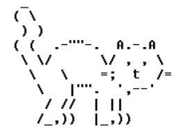

# Ecrire - `str`

Dans ce chapitre nous allons regarder de plus près ce que c'est le texte. Le texte est une catégorie d'information qui est essentiel dans beaucoup de programmes, tel une application messager ou un programme de traitement de texte.

Techniquement un texte est appelé une **chaîne de caractères**, ou string en anglais (`str`). Nous allons voir que

- un texte est délimité par un apostrophe `'` ou un guillemet double `"`,
- l'opérateur `*` répète un texte,
- la fonction `ord(c)` retourne le code pour représenter un caractère.

## Délimiter un texte

Tout caractère imprimable peux être utilisé pour créer un texte :

- lettres (`a...z` et `A...Z`)
- chiffres (`0...9`)
- ponctuations (`.,;:?!`)
- parenthèses (`[]{}<>`)
- symboles (`$*#...`)

Pour différencier un morceau de texte du reste d'un programme, il doit être délimité par des symboles spéciaux qui sont :

- apostrophe (`'`)
- guillemets doubles (`"`)
- trois guillemets doubles (`"""`)

```{codeplay}
print('apostrophe')
print("guillemets doubles")
print("""
Délimité avec trois guillements, 
le texte peut s'étaler sur plusieurs lignes.
""")
```

**Exercice** : Ajoutez des lignes supplémentaires au texte qui est délimité par `"""`.

## Répéter un texte

L'opérateur `*` permet de répéter un texte composé d'un ou de plusieurs caractères.

```{codeplay}
print('ha' * 10)
print('=' * 20)
print('hello ' * 3)
```

**Exercice** : Répétez une chaîne plus longue.

## Concaténer un texte

Le mot **concaténer** veut dire enchaîner ou coller ensemble.

L'opérateur `+` permet de concaténer deux chaînes de texte.
Mais juxtaposer deux chaînes de texte et les séparer par zéro ou plusieurs espaces va aussi concaténer la chaîne.

```{codeplay}
print('bon'    'jour')
print('bon''jour')
print('bon' + 'jour')
```

## La longueur d'une chaîne

La fonction `len()` retourne la longueur d'une chaîne.
La chaîne vide (`""`) a une longueur de 0.

```{codeplay}
print(len('bonjour'))
print(len(""))
print(len("""
Délimité avec trois guillements, 
le texte peut s'étaler sur plusieurs lignes.
"""))
```

**Exercice** : Ajoutez quelques caractères et re-exécutez le code.

Pour savoir combien de fois il faut répéter un symbole, pour obtenir la même longueur qu'un texte donné,  nous pouvons utiliser la fonction `len()` et ainsi créer des lignes qui ont la même longueur qu'un texte.

```{codeplay}
x = input('Entrez une phrase: ')
print('=' * len(x))
print(x)
print('=' * len(x))
```

**Exercice** : Entourez votre texte d'un autre symbole.

## Le code ASCII

Le code ASCII  (American Standard Code for Information Interchange) était un des premiers standards utilisé pour représenter des symboles dans un ordinateur. Avec initialement 7 et plus tard 8 bits il désigne un ensemble de lettres, chiffres, symboles et ponctuations.

Aujourd'hui le standard Unicode permet d'encoder la totalité des symboles utilisé dans les différents langages du monde.

La fonction `ord(c)` retourne le code ASCII (Unicode) qui est associé au caractère `c`.

```{codeplay}
print('A =', ord('A'))
print('B =', ord('B'))
print('a =', ord('a'))
```

Nous constatons que :

- le code ASCII pour la lettre A est 65,
- les codes suivent l'ordre de l'alphabet,
- les codes des minuscules ont un écart de 32 par rapport au code des majuscules.

```{codeplay}
for c in 'Python':
    print(c, '=', ord(c))
```

La fonction `chr(i)` retourne le caractère qui correspond au code `i`.

```{codeplay}
for i in range(65, 75):
    print(i, '=', chr(i))
```

## L'art ASCII

L’**art ASCII** consiste à réaliser des images uniquement à l'aide des lettres et caractères spéciaux contenus dans le code ASCII.

Voici un exemple :



```{codeplay}
print("""
         ((`\ 
      ___ \\ '--._
   .'`   `'    o  )
  /    \   '. __.'
 _|    /_  \ \_\_
{_\______\-'\__\_\ 
""")

```
**Exercice** : Le site https://www.asciiart.eu contient beaucoup d'exemples d'art ASCII. Trouvez-en un et copiez-le dans un programme Python.

## Echapper un caractère

Les symboles `'` et `"` sont utilisés pour délimiter du texte.
Si nous voulons utiliser ces caractères à l'intérieur de la chaîne, nous devons les échapper avec une barre oblique en arrière `\`.

```{codeplay}
print('c\'est bien')
print("\"citation\"")
```

Si nous voulons imprimer le symbole d'échappement, nous devons l'échapper également.

```{codeplay}
print('c\'est la \\barre oblique\\ en arière.')
```

## Retour à la ligne

Chaque commande `print()` termine avec un retour à la ligne.
Pour insérer un retour à la ligne à l'intérieur d'une chaîne de caractères nous utilisons la séquences d'échappement `\n` (newline).

```{codeplay}
print('chaque\nmot\nsur\nune\nligne')
print('\nhello world' * 5)
```

**Exercice** : Ajoutez une nouvelle ligne de code qui contient des `\n`.

## Aligner en colonnes

La séquence `\t` (tabulateur) permet d'aligner des éléments de texte en colonne. Les colonnes sont espacées de 8 caractères.

```{codeplay}
print('qte\tart.\tprix')
print('4\tsouris\t15.95')
print('12\tclavier\t25.95')
```

## Les emojis

Un émoji est une petite image qui peut être utilisée comme un caractère à l'intérieur d'un texte.
Nous pouvons les répéter avec l'opérateur `*` et obtenir leur **Unicode** avec la fonction `ord(c)`.

```{codeplay}
print('😀' * 10)

print(ord('🍎'))
print(ord('😀'))
```

Avec la fonction `chr(i)` nous pouvons afficher les 10 caractères qui suivent l'émoji de pomme.

```{codeplay}
for i in range(10):
    print(chr(i + 127822))
```

**Exercice** : Affichez les 10 emojis qui suivent 😀.

## Les kanji

Le japonais est écrit avec des pictogrammes qui s'appellent des kanjis.
Avec la fonction `ord(c)` nous pouvons obtenir leur **Unicode**.

```{codeplay}
print('日本語')
print('nihongo')
print('japonais\n')

for c in  '日本語': 
    print(c, ord(c))
```

Avec la fonction `chr(i)` nous pouvons afficher les 10 kanjis qui suivent le kanji 日 qui signifie soleil. Si vous regardez bien, vous remarquez qu'ils contiennent tous le radical pour soleil.

```{codeplay}
n = ord('日')
for i in  range(n, n + 10): 
    print(i, chr(i))
```

Exercice : Affichez les 10 kanjis qui suivent 語 (langage).

## Les commentaires

En Python, un commentaire est un bout de code qui est ignoré par Python.
Un commentaire commence par le symbole hashtag (`#`).

Les commentaires sont utilisés pour ajouter à un programme des informations supplémentaires :

- explications,
- nom de l'auteur,
- révision.

Parfois un commentaire est utilisé pour désactiver une ligne de code.
La plupart des éditeurs marquent les commentaires en couleur grisée.

```{codeplay}
# commentaire sur une ligne

print('bonjour')  # commentaire en fin de ligne
print("# ceci n'est pas un commentaire")
# print('au revoir')

"""
Ceci est 
un long commentaire
sur plusieurs lignes.
"""
```

**Exercice** : Enlever le # devant `print('au revoir')` pour l'exécuter.

## La fonction `write()`

Dans le module `turtle` nous avons la fonction `write()` qui permet d'afficher du texte à l'intérieur d'un dessin. Cette fonction permet de spécifier la police sous forme de paire (police, taille).

```{codeplay}
from turtle import *

left(90)
write('texte par défaut')

fillcolor('red')
forward(30)
write('Courier 24', font=('Courier', 24))

fillcolor('blue')
forward(40)
write('Arial 36', font=('Arial', 36))
```

**Exercice** : Essayez d'autres tailles et polices.
