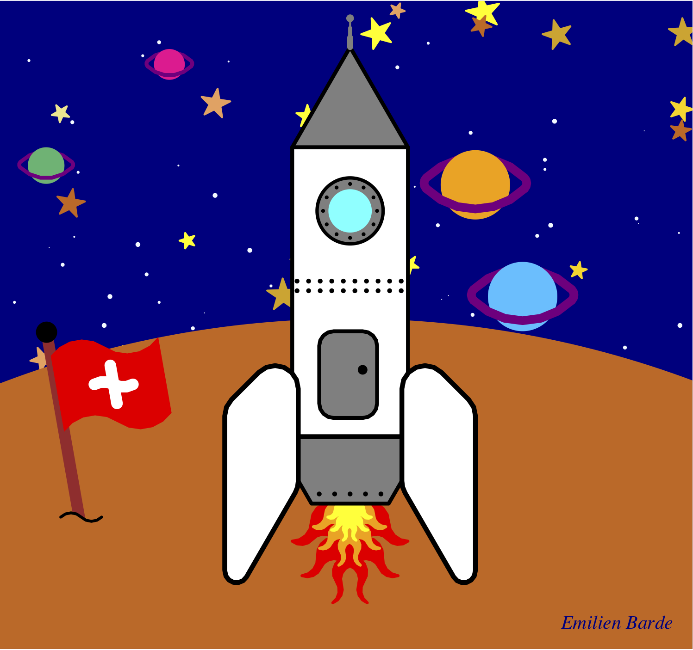
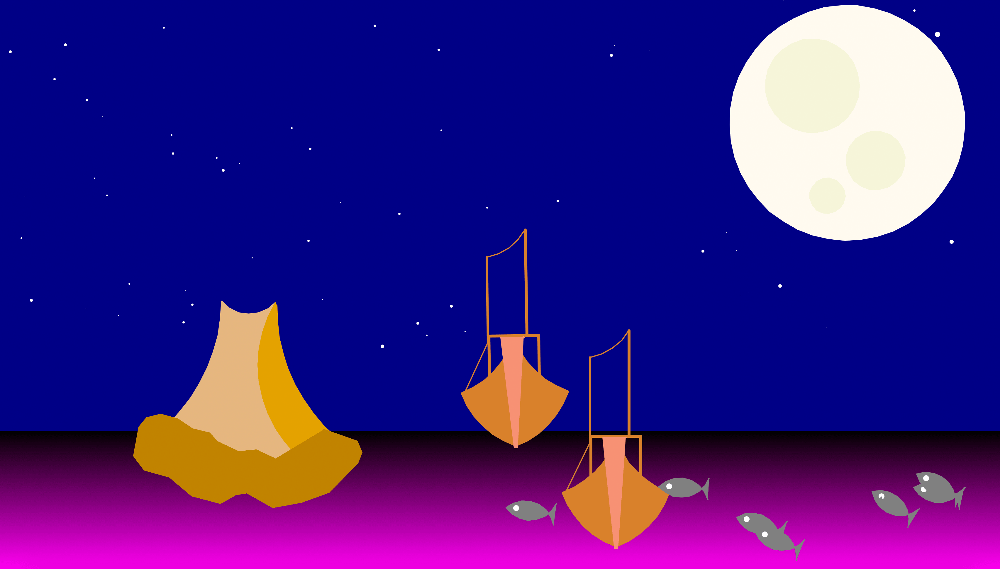

# Projet

Projet dessin (turtle)
Vous devez créer un dessin avec un programme Python en utilisant le module turtle.

## Consignes

Vous devez :

- créer un dessin concret (pas abstrait)
- choisir un sujet libre : nature, ville, intérieur, jeux vidéo, science-fiction, etc.
- utiliser le module turtle pour dessiner
- écrire 500 à 1000 lignes de code
- commencer le programme avec un commentaire (auteur, date, description)
- utiliser des dots, lignes et le remplissage
- varier l'épaisseur du trait
- lever et baisser le stylo
- utiliser des cercles et des arcs de cercle
- utiliser des couleurs de ligne, point, remplissage et arrière-fond
- décomposer en fonctions appropriés, avec une taille de 2-15 lignes
- décrire chaque fonction avec un commentaire de 1-2 lignes
- utiliser des variables pour nommer vos entités (largeur, hauteur, rayon, couleur)
- utiliser des expressions mathématiques (largeur/n, 2*rayon, etc.)
- avoir une hiérarchie de fonctions (des plus complexes qui appellent des plus simples)
- définir d'abord toutes les fonctions pour dessiner
- définir une dernière fonction main() qui utilise ces fonctions pour créer un dessin
- appeler main() vers la fin du programme pour créer le dessin
- suivre la typographie standard PEP8 (espacement, noms des variables)
- vérifier votre code en ligne [pep8online.com](http://pep8online.com)
- parcourir avec for des séquences de couleurs, angles, distances, et tailles
- répéter avec for en 1D (par exemple: hublots, traverses, fenêtres, roues, clôtures)
- répéter avec for en 2D (par exemple: fenêtres, grilles, pixels, etc.)
- utiliser des fonctions aléatoires (module random) pour introduire de la variété
- utiliser la perspective : des objets plus près sont plus grand
- utiliser random.seed(n) pour rendre votre dessin reproductible
- exporter en format image : EPS, PNG, JPG
- déposer sur Moodle 4 fichiers avec un nom de forme prénom_projet1 (par exemple malik_projet1.py, malik_projet1.eps, etc.)

## Exemples

Ces exemples ont été créé par des élèves en 3M, en option complémentaire informatique, après 2 mois de cours sur la programmation en Python (16-24 périodes)

### Jeu vidéo


### Maison de campagne


### Cadre des Pyrénées


### Japon


### Swiss space



### Maison meublé


### Casque d'astronaute


### Urbain et rural


### Star Trek


### Loup sous la lune


### Fantaisie psychédélique


### Bateaux de pêche



## Refactoring (réusinage)

Le Refactoring (réusinage) de code est l'opération consistant à retravailler le code source d'un programme informatique, de façon à en améliorer la lisibilité et, la maintenance, ou à le rendre plus générique.

Le refactoring est une réécriture de code pour le rendre

- plus lisible
- plus standard
- plus réutilisable
- plus général

Téléchargez le code source {download}`project1.py <code/projet1.py>`

## Style standard

PEP est un acronyme anglais signifiant Python Enhancement Proposal que l'on pourrait traduire en français par « Proposition d'Amélioration de Python » (PAP donc 😄).

Le document [PEP 8](https://peps.python.org/pep-0008/) présente les bonnes conventions pour écrire du code lisible.

- Utilisez 4 espaces pour l'indentation
- Limitez les lignes à 79 caractères au maximum
- Séparez des fonctions par 2 lignes vides
- Ecrivez les importations sur des lignes séparés

Espaces

- Ne mettez pas d'espace entre nom de fonction et parenthèse (faux: `f (x)`)
- Ne mettez pas d'espace à l'intérieur des parenthèses (faux: `f( x, y )`)
- Ne mettez pas d'espace avant `,`, `;`, `:` (faux `def f(x , y) :`)
- Mettez un espace avant et après un opérateur (`+`, `-`, `*`, `/`)
- Mettez un espace avant et après le symbole d'affectation `=``

## Vérification en ligne

Allez sur le site [pep8online.com](http://pep8online.com)
et copier votre code.

Corrigez les 77 erreurs de styles.

- Mettez un espace après `#`
- Mettez deux lignes vides entre fonctions
- Mettre un espace après `,`

## Nom de fonctions

En Python les variables sont écrit avec des minuscules. Si une variable consiste de plusieurs mots, les mots sont séparés par le tiret bas `_`.
En Python, les noms commençant avec des majuscules sont réservés pour les classes. Par exemple

`player = Player()`

- Exporter → exporter
- Niveau → niveau
- RepositionnementFin → repositionnement_fin
- PlateformePiques → plateforme_piques
- TriangleDrapeau → triangle_drapeau
- BatonDrapeau → baton_drapeau
- ReplacementPiques → replacement_piques
- Player → player
- Brique → brique
- Mur → mur
- ReplacementMur → replacement_mur
- Plateforme → plateforme

Comme le nom de fonctions est utilisé multiples fois nous avons avantage d'utiliser la fonction rechercher et remplacer


Dans VS Code nous avons aussi une fonction **Remplacer Symbol F2**


## Chaque fonction doit être indépendant

Ce programme est récursive.

La fonction `main()` appelle `begin()` qui appelle `nuages()` qui appelle `soleil()` etc.

Chaque fonction doit être indépendant des autres
ne doit pas inclure sa position.

## Rectangles

Pour dessiner un rectangle, définissez une fonction rectangle. La fonction `begin` dessine un rectangle de taille 1200 x 1000 en cyan.

```python
def main():
    # Mets la tortue au bon endroit,
    # permet de lancer le reste du code et fixe la couleur de fond
    getscreen().bgcolor('black')
    seed(2)
    speed("fastest")
    up()
    backward(600)
    right(90)
    forward(500)
    begin()
    done()
```

```python
def begin():
    # dessine les bordures du Niveau
    down()
    fillcolor("cyan")
    begin_fill()
    width(10)
    for x in (1200, 1000, 1200, 1000):
        left(90)
        forward(x)
    end_fill()
    width(1)
    up()
```

Définissons donc une fonction `rectangle` qui fait tout cela en 1 ligne de code

```python
def rectangle(a, b, couleur):
    fillcolor(couleur)
    begin_fill()
    for x in (a, b, a, b):
        print(x)
        forward(x)
        left(90)
    end_fill()
```

Maintenant `begin()` n'est plus nécessaire et nous pouvons simplifier `main()`

```python
def main():
    # fixe la couleur de fond
    getscreen().bgcolor('black')
    seed(2)
    speed("fastest")
    up()
    # dessine l'arrière-fond du niveau
    goto(-600, -500)
    rectangle(1200, 1000, 'cyan')
```

La fonction `brique` dessine un rectangle de 150 x 90 en darkgoldenrod.

```python
def brique():
    # Composition du mur (voir fonction Mur() ci-dessous)
    width(1)
    color("black")
    fillcolor("darkgoldenrod")
    begin_fill()
    forward(150)
    right(90)
    forward(50)
    right(90)
    forward(150)
    right(90)
    forward(50)
    end_fill()
    backward(50)
    right(90)
```

## Nuages

Dans ce projet, les nuages sont créer par 6 disques des tailles aléatoire avec 2 niveaux de gris.

```{codeplay}
from turtle import *
from random import *
getscreen().bgcolor('cyan')
hideturtle()
up()

def nuage(taille):
    #Dessine un nuage avec une taille aléatoire
    for x in ("darkgray", "darkgray","lightgray") :
        taille = randint(2,4)
        dot(26*taille, x)
        forward(50)
    left(90)
    forward(30)
    left(90)
    forward(50)
    for i in range(3):
        taille = randint(2,4)
        dot(30*taille, "lightgray")
        forward(50)

nuage(100)
goto(-200, 0)
nuage(50)
```

Le fonction `nuage()` possède un argument taille, mais cet argument n'a pas d'effet. La variable `taille` est remplacé par une valeur aléatoire dans l'intervalle [2, 4]. Voici ci-dessous cette fonction corrigé, pour créer des nuages de taille variable.

```{codeplay}
from turtle import *
from random import *
getscreen().bgcolor('cyan')
hideturtle()
up()

def nuage(taille):
    #Dessine un nuage avec une taille aléatoire
    seth(0)
    for x in ("darkgray", "darkgray","lightgray") :
        dot(taille * randint(2, 4), x)
        forward(1.7 * taille)
    left(90)
    forward(taille)
    left(90)
    forward(taille)
    for i in range(3):
        dot(taille * randint(2, 4), "lightgray")
        forward(1.8 * taille)

goto(-200, 0)
nuage(10)

goto(0, 0)
nuage(30)
```
