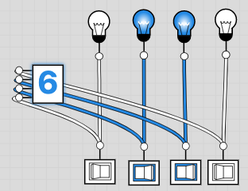
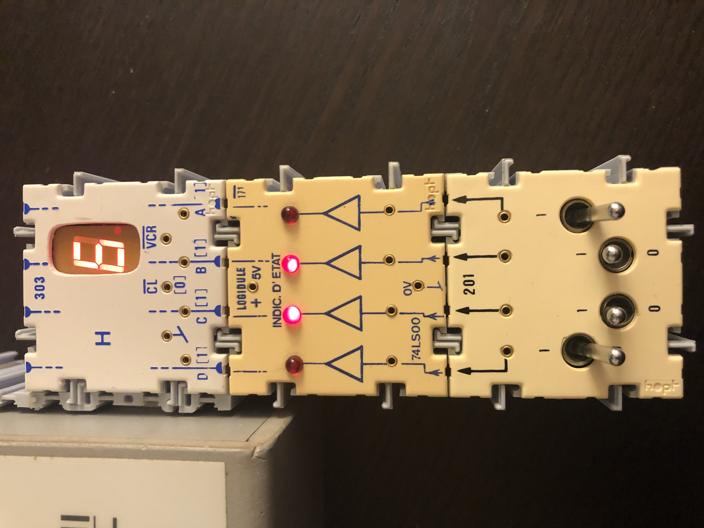

# Exercices de base

````{admonition} Exercice 1: un binary digit (*bit*)
:class: attention

Construisons notre premier circuit le plus simple dans logic.ly. Ce dernier représente une unité d'information, en anglais *binary digit* abrégé bit.

```{dropdown} simple_bit


Un simple bit
```
````

````{admonition} Exercice 2: un demi-octet
:class: attention

Un octet est un ensemble de huit bits. Pour simplifier, nous allons ici construire un demi-octet avec sa représentation binaire et sa représentation hexadécimale[^hexa].
````
````{admonition} Avec logic.ly
:class: note

```{dropdown} demi_octet


Un demi-octet
```

A réaliser:
1. Essayer quelques configurations et observer.
2. Tester la division et la multiplication par deux en décalant à droite et à gauche un nombre binaire.
````

`````{admonition} Avec des logidules
:class: note
Les logidules ont l'avantage de permettre des montages rapides de portes logiques en parallèle. Nous allons ici réaliser le même montage avec un demi-octet.

```{dropdown} logidule_representation


Avec des logidules
```

```{dropdown} simulateur_representation


Dans le simulateur
```

A réaliser: 
1. Effectuer les même tests que précédemment.
2. Etendre le circuit à un octet complet ([figure](simulateur_representation)).

`````


[^SPapert]: On appuiera cette approche avec les théories du constructionnisme de Seymour Pappert, lui-même dans la continuité du constructivisme de Piaget.
[^hexa]: La notation hexadécimale se fait en base 16 avec les chiffres suivants: {1,2,3,4,5,6,7,8,9,A,B,C,D,E,F}
[^2]:Par Teknad — Travail personnel, CC BY-SA 4.0, https://commons.wikimedia.org/w/index.php?curid=36768081
[^3]: CC BY-SA 3.0, https://commons.wikimedia.org/w/index.php?curid=227770