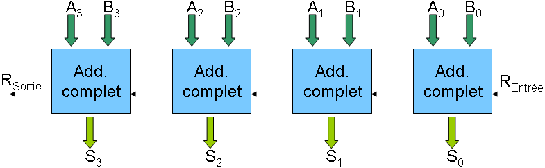

# Systèmes logiques

Dans cette partie, nous allons réaliser des systèmes logiques qui rentrent dans la conception des microprocesseurs tels que ceux utilisés dans votre odrinateur personnel ou votre smartphone.

Nous avons choisi de nous attarder sur l'additionneur et le demi-additionneur parce qu'ils démontrent une fonction facile à comprendre: l'addition en colonnes de nombres binaires.


````{admonition} Exercice 6: demi-additionneur
:class: attention

Le demi-additionneur calcule sur une colonne et reporte la retenue, mais ne prend pas la retenue de la colonne précédente. C'est en fait l'additionneur qui est utilisé pour le premier bit ou première colonne.

En considérant le demi-additionneur comme une *boîte noire*, nous avons donc deux entrées (les opérandes A et B) et deux sorties: la somme des deux entrées et la retenue (ou dépassement, en anglais: *carry*, noté C).

À partir de là, nous pouvons proposer la table de vérité suivante:

|  A  |  B  |  $S=A \oplus B$  | C |
|:---:|:---:|:---:|:---:|
|  0  |  0  |  0  |  0  |
|  0  |  1  |  1  |  0  |
|  1  |  0  |  1  |  0  |
|  1  |  1  |  0  |  1  |

**Consignes:** 
1. Concevoir le circuit logique complet.
2. Réaliser le circuit dans un simulateur et vérifier qu'il produit bien le résultat attendu.

**Illustration:**
Nous avons ci-dessous deux illustrations d'un additionneur sans report de la retenue. On voit donc bien l'erreur de calcul.

```{dropdown} demiAdd1


Demi-additionneur, calcul juste.
```

```{dropdown} demiAdd2


Demi-additionneur, calcul faux, perte de la retenue
```


````

````{admonition} Exercice 7: additionneur
:class: attention

Dans le cas d'un additionneur complet, nous devons reporter la retenue à la colonne suivante: $C_{in}$. Chaque colonne prend donc trois entrées et produit 2 sorties: le résultat de l'addition $S$ et la retenue $C_{out}$ qui devient le $C_{in}$ de la colonne suivante.

Nous avons illustré le problème avec un montage en logidules. Ce dernier calcule uniquement la retenue.

```{dropdown} retenue


Calcul de la retenue (slt)
```


La table de vérité augmente en conséquence et passe à huit cas à énumérer. Voici la forme qu'elle prend:

|  A  |  B  | $C_{in}$  | $S$             | $C_{out}$ |
|:---:|:---:|:---------:|:---------------:|:---------:|
|  0  |  0  |  0        |                 |           |
|  0  |  0  |  1        |                 |           |
|  0  |  1  |  0        |                 |           |
|  0  |  1  |  1        |                 |           |
|  1  |  0  |  0        |                 |           |
|  1  |  0  |  1        |                 |           |
|  1  |  1  |  0        |                 |           |
|  1  |  1  |  1        |                 |           |

À partir du circuit complet de l'additionneur sur un bit, on devrait pouvoir les chaîner pour obtenir le schémas d'ensemble ci-dessous.

```{dropdown} Ripplecarryadder


(source wikipedia[^3])
```


**Consignes:** 
1. Compléter la table.
2. Réaliser le circuit complet pour un demi-octet (évtl. un octet complet)


````


[^SPapert]: On appuiera cette approche avec les théories du constructionnisme de Seymour Pappert, lui-même dans la continuité du constructivisme de Piaget.
[^hexa]: La notation hexadécimale se fait en base 16 avec les chiffres suivants: {1,2,3,4,5,6,7,8,9,A,B,C,D,E,F}
[^2]:Par Teknad — Travail personnel, CC BY-SA 4.0, https://commons.wikimedia.org/w/index.php?curid=36768081
[^3]: CC BY-SA 3.0, https://commons.wikimedia.org/w/index.php?curid=227770