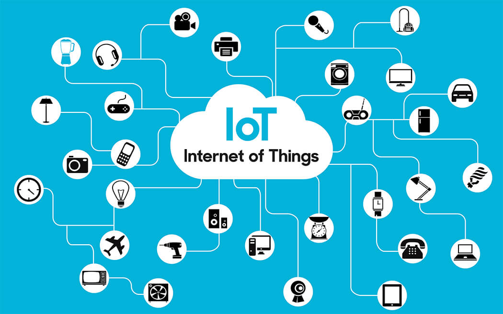

# Introduction

La {glo}`programmation|programmation` est le processus consistant à «dire» à un ordinateur ce qu'il doit faire. L'opérateur humain va communiquer avec la machine via un langage de programmation afin de lui faire exécuter un certain nombre de tâches.

<!-- REVIEW/JPP: les goûts et les couleurs… j'avoue qu'un GIF animé, personnellement, dans un cas comme ça, m'empêche juste de me concentrer sur le texte. Il y a un truc qui bouge, qui est flashy, mais qui est largement inutile car il n'illustre aucun concept qu'on a envie d'expliquer. -->


## Historique

Un ordinateur consiste en trois composantes principales :

- une machine (processeur),
- une mémoire,
- un programme (algorithme).

### Une machine

En 1642, le scientifique et philosophe français Blaise Pascal inventa la première machine à calculer (mécanique), la *pascaline*, initialement dénommée *machine d’arithmétique* puis *roue pascaline* : elle permettait d’additionner et de soustraire deux nombres d'une façon directe et de faire des multiplications et des divisions par répétitions.

Pascal construisit ensuite une vingtaine de pascalines dans la décennie suivante souvent en les perfectionnant, dont huit ont survécu jusqu’à aujourd'hui.

Par sa construction et l'ingéniosité de son mécanisme, en particulier s'agissant du calcul des retenues, la pascaline, seule machine à calculer opérationnelle au XVIIe siècle, est sans aucun doute l'ancêtre de nos ordinateurs modernes.

Il faudra ensuite attendre 200 ans avant l'invention d'un langage de programmation qui permettra de **spécifier des opérations** et de les exécuter de façon automatique.

```{image} Im55.jpeg
:width: 600
:height: 400
```

<!--

-->

### Une mémoire

La première machine programmable est probablement le **métier à tisser de Jacquard**, réalisé en 1801 par le lyonnais Joseph Marie Jacquard. La machine utilisait des cartes perforées pour guider les crochets qui soulevaient les fils de chaînes, et tisser ainsi des motifs complexes.

```{image} Im56.jpeg
:width: 600
:height: 400
```

<!---

-->

<!---
<iframe width="745" height="545" src="https://www.youtube.com/embed/eE5wxtaIcE" title="YouTube video player" frameborder="0" allow="accelerometer; autoplay; clipboard-write; encrypted-media; gyroscope; picture-in-picture" allowfullscreen></iframe> -->

### Un programme

La mathématicienne britannique Ada Lovelace, fille du poète Lord Byron, est connue pour avoir réalisé en 1843 le premier programme informatique pour un ancêtre de l'ordinateur : la machine analytique de Charles Babbage.


## La machine de Turing

En informatique théorique, la **machine de Turing** est un modèle abstrait d'un appareil mécanique de calcul. Ce modèle a été imaginé par le britannique Alan Turing en 1936. Une machine de Turing comporte les éléments suivants :

- un **ruban infini** divisé en cases. Chaque case contient un symbole (par exemple des 0 et des 1),
- une **tête de lecture/écriture** qui permet de lire les symboles sur le ruban,
- un **registre d'état** qui mémorise l'état actuel,
- une **table d'actions** qui indique quel symbole écrire, basé sur l'état actuel et le symbole lu.


L'application ci-dessous simule le fonctionnement d'une machine de Turing : on peut ainsi suivre les étapes «mécaniques» du fonctionnement de la machine de Turing, en ajoutant par exemple 1 au nombre binaire 10011010.

<iframe width="745" height="345" src="https://animations.interstices.info/machine-turing/index.html" title="Simu Turing" frameborder="0" allow="accelerometer; autoplay; clipboard-write; encrypted-media; gyroscope; picture-in-picture" allowfullscreen></iframe>

Les instructions d'un processeur sont représentées avec des séquences binaires (des 0 et des 1). Les ordinateurs, au niveau le plus bas, représentent toutes les données en binaire, avec des 0 et des 1. C'est aussi vrai pour un programme qu'un processeur pourra exécuter : chaque instruction élémentaire sera aussi représentée par une série de 1 et de 0. Il est difficile pour un humain de directement comprendre un tel langage. Donc, rapidement, des **assembleurs et {glo}`compilateurs|compilateurs`** ont été développés, qui permettaient d'écrire un programme avec des commandes exprimées en anglais et plus facilement compréhensibles pour un humain. 

## Le langage machine

Un processeur peut exécuter un certain nombre d'instructions mathématiques et logiques. Pour la machine, ces instructions sont représentées par un code binaire bien défini, le langage machine ; pour les humains, en général par un mot court qui identifie l'action à effectuer. Le langage assembleur est ainsi une première «étape» vers un formalisme humain.

Un exemple typique est une instruction qui charge une valeur (par exemple 10) dans un registre (a).

    load a, #10

Un autre exemple est une instruction qui additionne un nombre (par exemple 2) à un registre.

    add a, #2

Une instruction problématique est le `goto` qui transfère le contrôle vers un autre endroit dans le code.

    goto label

Son utilisation peut rendre un programme difficile à comprendre et conduit facilement à des erreurs.

## Langages haut niveau

Un langage de programmation à haut niveau d'abstraction généralement appelé **langage de haut niveau** est un langage de programmation concentré sur le problème à résoudre, et permet d'écrire des programmes en utilisant une syntaxe usuelle de la langue naturelle, originellement l'anglais, ainsi que des symboles mathématiques familiers. Le niveau du langage est inversément proportionnel à sa proximité machine, à sa technicité propre.

Les langages haut niveau ont pour prétention de simplifier l'écriture des programmes, indépendants de la machine (portabilité).

Apparus dès les années 1950, ils n'ont cessé d'évoluer jusqu'à aujourd'hui, où il en existe plusieurs centaines.

Les langages de haut niveau (C, Java, Python pour citer les plus courants) remplacent en particulier l'instruction `goto` par ce qu'on appelle des **structures de contrôle**, telles que :

- des boucles (for, while),
- des appels de fonctions,
- des instructions conditionnelles (if ... then ... else).

## Langages web

Pour construire des sites web, trois langages sont indispensables :

- **HTML** pour le contenu de la page,
- **CSS** pour le style et le format de la page,
- **JavaScript (JS)** pour programmer l'interactivité de la page.

````{admonition} Remarque
Il faut cependant distinguer les langages de programmation de ces langages, qui sont à ranger plutôt dans la case des langages dits «de balisage» qui ne transmettent en fait aucune instruction.
````

<!--

-->


<!-- ## Tendances actuelles
Le domaine de l'informatique connait plusieurs tendances qui sont à la mode en ce moment. Ces sujets apparaissent régulièrement dans la presse et dans les médias. -->

<!-- ### Machine learning
L'apprentissage automatique, où machine learning (ML) en anglais, est un champ d'intelligence artificielle qui donne à l'ordinateur la capacité d'apprendre à partir de données massives.

<!-- ### Big data
Les données massives, **big data** en anglais, désignent les informations qui résultent d'une explosion quantitative des données durant ces dernières années. Elles nécessitent souvent de multiples machines et des traitements parallélisés.


<!-- ### Intelligence artificielle
L'intelligence artificielle (IA) désigne un ensemble de théories et techniques permettant la résolution de problèmes complexes : c'est cette puissance de calcul qui autorise le terme d'"intelligence" en rapprochement avec l'intelligence humaine.

Une avancée majeure fut l'ordinateur **Deep Blue** développé par IBM, premier ordinateur à battre un champion mondial d'échecs, Garry Kasparov, en 1997.

En 2011 l'ordinateur **IBM Watson** a gagné au jeu télévisé **Jeopardy !** en répondant à des questions et en utilisant un traitement de langage naturel.

<!-- ### Internet des objets
L'**internet des objets**, ou Internet of Things (IoT) en anglais, désigne un nombre croissant d'objets connectés à l'internet, dans le domaine de la santé, de la domotique et de la logistique.



<!-- ### Cybersécurité (blockchain)
Le **blockchain** est une technologie de stockage et de transmission d'informations sans organe de contrôle.
C'est une base de données distribuée, et protégée contre la falsification.

La monnaie virtuelle **bitcoin** utilise cette technologie.
-->

