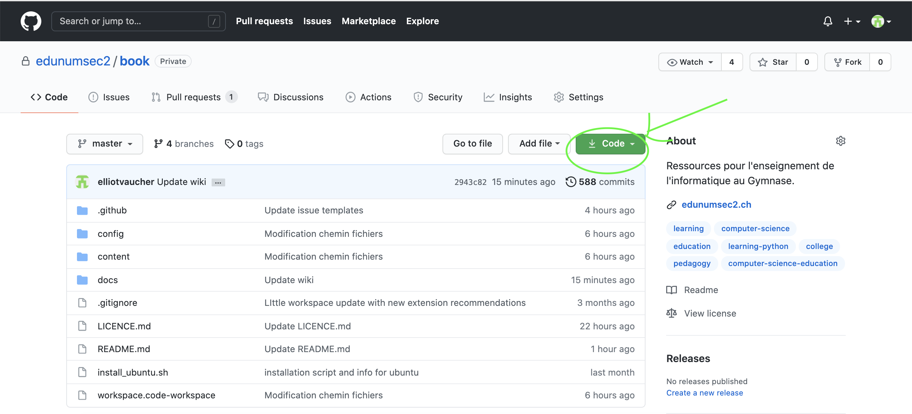

# Clones

Note : il est suggéré de commencer par la lecture du wiki [fork](https://github.com/edunumsec2/book/blob/master/docs/wiki/fork.md)

## Introduction

Vous ne pensez peut-être pas y arriver si vite, mais voilà, les clônes sont présents dans vos vies et désormais vous allez pouvoir en faire plein ! 

Trêve de plaisanteries...

Les *clones* GitHub (du grec "klôn", qui signifie : jeune pousse [mais si, mais si]) sont une fonctionnalité permettant de dupliquer un projet entier (appelé "repository", ou "repo" sur GitHub, que nous traduisons ici dépôt), le stocker n'importe où sur sa machine et le transformer à sa guise.

Très proches des *forks* les *clones* ont la particularité de ne pas nécessairement être reliés à un compte utilisateur GitHub, dans le sens où ils ne s'affichent pas dans les données publiques de votre compte. Seuls les *forks* seront listés sur votre compte. Qui plus est, les *clones* ne sont pas cosidérés comme des "enfants" du dépôt duquel ils sont issus dans un sens strict. Légalement oui, évidemment, mais pas au niveau des droits d'accès et d'écriture. Ce qui signifie que vous êtes tenus aux mêmes obligations décrites dans la licence du dépôt original quand vous effectuez un clone ou un *fork*, mais que dans le cas d'un *clone* l'administrateur du dépôt d'origine ne possédera pas de suivi sur vos modifications. 

En pratique, on utilise bien plus souvent un *clone* qu'un *fork* puisqu'il convient d'utiliser cette fonctionnalité dans tous les cas où on devrait copier tout ou une partie de la documentation d'un projet pour l'utiliser, ou simplement l'archiver sur notre propre machine. 

## Cloner un dépôt

Pour cloner un dépôt, il vous suffit de vous rendre sur la page d'accueil du dépôt et cliquer sur le bouton vert intitulé "code" dans l'angle en haut à droite du menu central affichant la structure de fichiers. 

Un menu déroulant vous proposera ensuite différentes options pour le clonage. La commande git traditionnelle est `git clone https://github(...)`, mais nous recommandons fortement l'utilisation de [GitHub Desktop](https://desktop.github.com/), pour les novices en tous cas, qui propose une interface simplifiant toutes les opérations de ce type. 