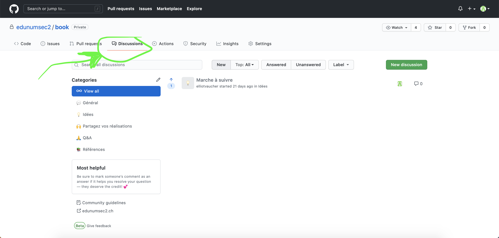
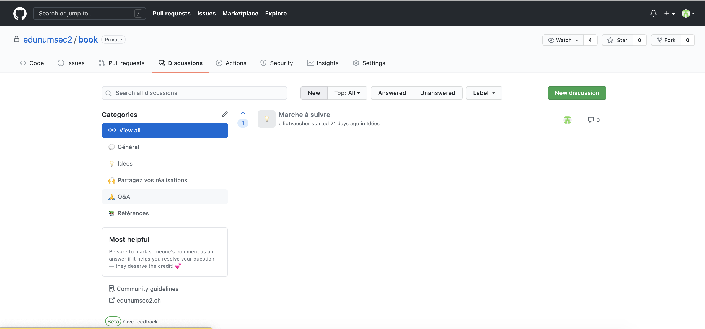
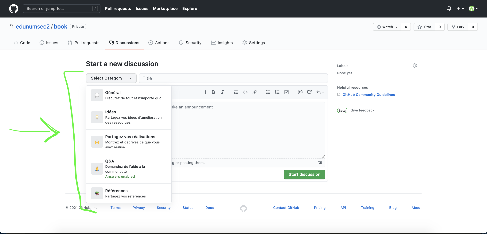

# Discussions

## Introduction

À l'intérieur d'un dépôt GitHub il existe un espace appelé *Discussions*. Les *Discussions* permettent à tout utilisateur d'ouvrir un espace dans lequel partager une idée, suggérer une amélioration, poser une question générale ou spécifique, ou partager ses propres réalisations ou références. 

Contrairement aux *Issues* les *Discussions* ne concernent pas nécessairement un chapitre ou une activité précise. Elles peuvent se situer à un niveau plus général. Dans l'absolu, il faut considérer les discussions comme plus "libres" que les issues, qui concernent la résolution d'un problème spécifique. 

## Ouvrir une discussion 

On commence par se rendre sur l'onglet *Discussions* du dépôt. 

On ouvre une discussion. 

On peut sélectionner, si on le souhaite, une catégorie de discussion parmis les catégories existantes. 

