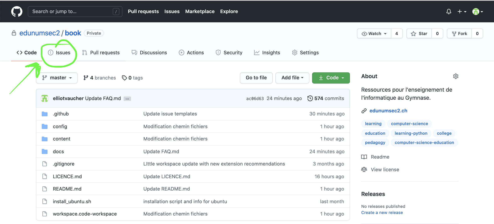
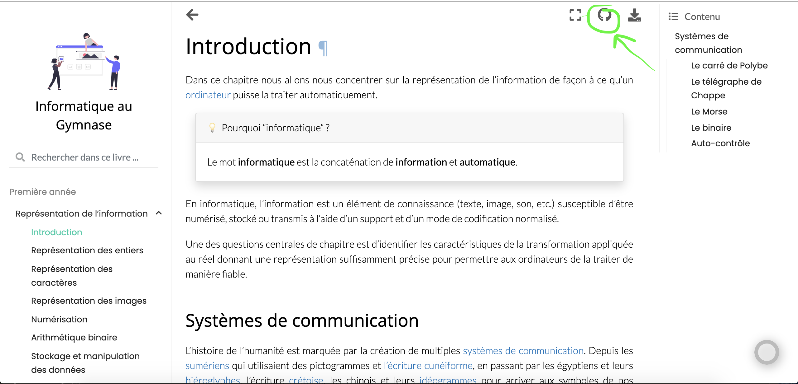
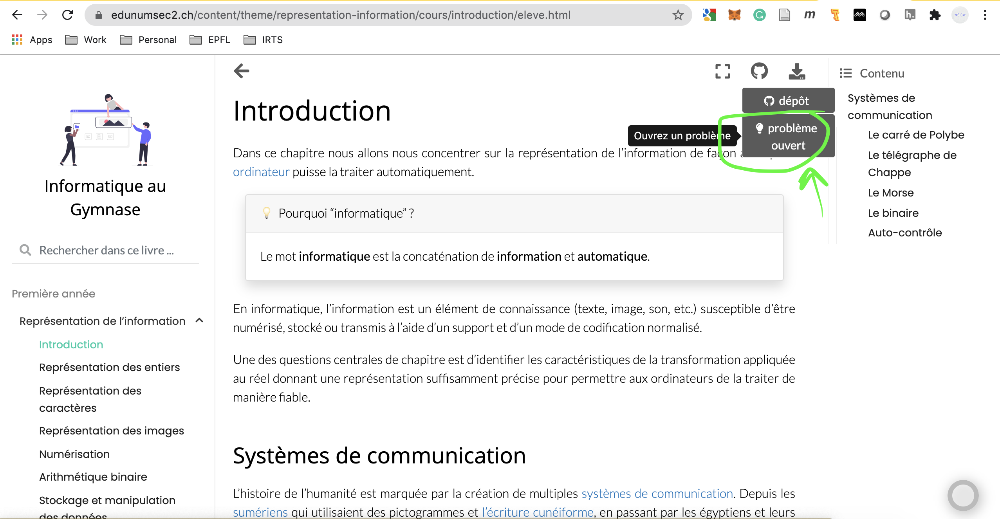
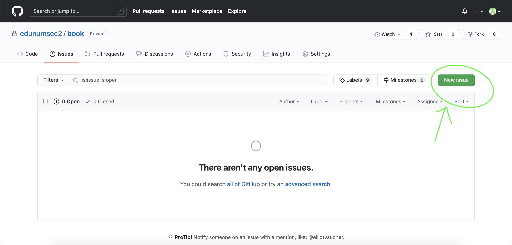
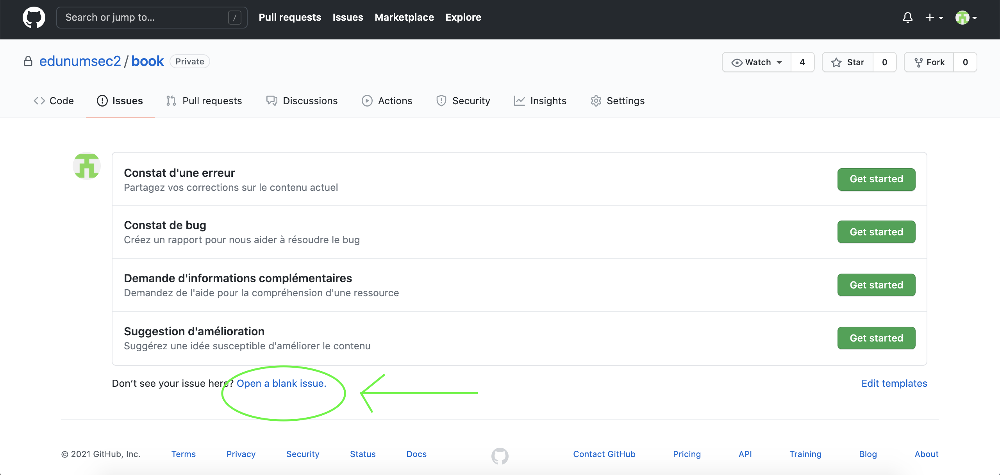

# Issues

## Introduction 

Les *Issues* GitHub (de l'anglais "issue" [prononcé isch-you], qui signifie : problème) sont une fonctionnalité permettant de déclarer un problème rencontré lors de l'utilisation de la ressource en question, dans un projet donné. 

Dans le projet qui nous concerne, la ressource est le site web, et tous les contenus qui lui sont liés. Une issue est donc, dans notre cas, un problème rencontré lors de l'utilisation du site web https://edunumsec2.ch. 

## Déclarer une issue

### Depuis le dépôt GitHub

Quand on se situe dans le dépôt GitHub via un navigateur web, à l'adresse : https://github.com/edunumsec2/book, on peut directement avoir accès aux *Issues* en cliquant sur l'onglet concerné dans le menu de navigation horizontal situé en-dessous du nom du dépôt actif. 

### Depuis le site web edunumsec2.ch

Quand on se situe sur le site web https://edunumsec2.ch, on peut ouvrir une issue concernant un chapitre spécifique du cours directement depuis ce dernier. 

## Création de l'issue

À partir du moment où l'on se situe dans le dépôt GitHub, à l'endroit où sont affichées les issues, on peut facilement en créer une en sélectionnant le bouton vert en haut à droite intitulé "New issue". 

Un certain nombre de templates pré-écrits vous seront proposés. Si aucun de ces derniers ne correspond à votre problème, vous pouvez créer une nouvelle issue. 

## Les templates d'issues

Nous avons pré-écrits un certain nombre de templates qui correspondent à des problèmes fréquemment rencontrés. Si l'un d'entre eux répond à vos besoins, il vous suffit de le sélectionner, et de suivre la procédure qui en découle. Souvenez-vous : tout est réversible sur GitHub. N'ayez pas peur de participer, c'est important. 

### Constat d'erreur

Ce template vous permet de signaler une erreur "conceptuelle" dans la matière du cours. Nous vous prions de bien vouloir n'ouvrir d'issue que si vous êtes convaincu.e que l'erreur est évidente. Prière de ne pas ouvrir d'issue dans le cas où l'erreur est discutable. Dans ce cas, privilégiez plutôt l'ouverture d'une [discussion](https://github.com/edunumsec2/book/discussions). 

### Contat de bug

Ce template vous permet de signaler un constat de bug technique dans un chapitre particulier, une activité, un exercice, un exemple de code interactif. 

### Demande d'informations complémentaires

Ce template vous permet de faire une requête spécifique pour de l'information complémentaire à apporter à une partie de cours, activité, exercice, exemple interactif. Nous vous rappelons au passage que pour des demandes d'aide plus générales, vous pouvez utiliser la catégorie "Q&A" des [discussions](https://github.com/edunumsec2/book/discussions/categories/q-a). 

### Suggestion d'amélioration

Ce template vous permet de suggérer une amélioration à apporter au contenu. Une fois de plus, prière de réserver cette fonctionnalité à une suggestion d'amélioration spécifique à un cours ou un extrait de cours. Les suggestions générales sont à déposer dans les discussions, dans la catégorie "Idées" des [discussions](https://github.com/edunumsec2/book/discussions/categories/id%C3%A9es)

