Systèmes logiques: les portes
=============================

En informatique, les systèmes logiques décrivent comment sont connectés les circuits électroniques des ordinateurs afin de leur permettre de faire des calculs. Même si on a l'impression que les ordinateurs peuvent faire toutes sortes de choses, il y a un ensemble limité d'opérations de base que l'électronique d'une machine peut faire. Parmi ces quelques opérations de base, on trouve l'addition, la soustraction, la multiplication ou la division de nombres. La vaste majorité de ce que fait l'ordinateur repose sur ces quelques opérations (ainsi que sur quelques opérations dites _logiques_, que nous allons découvrir, et sur la possibilité de lire et écrire des valeurs dans sa mémoire).

C'est assez fascinant que se dire que des tâches a priori pas mathématiques, par exemple corriger l'orthographe ou la grammaire d'une texte automatiquement, sont réalisées avec ces opérations de base. 

Comme but de ce chapitre, nous proposons de prendre le cas de l'**addition** et de s'intéresser aux circuits électroniques qui vont permettre à un ordinateur de faire une addition.

Imaginons donc que nous devons additionner deux nombres entiers. Nous allons utiliser leur représentation binaire (avec uniquement des 1 et des 0). Pour faire simple, nous allons chercher à additionner simplement deux bits, disons $A$ et $B$, où chacun peut valoir soit 0 soit 1. Posons que la somme $S = A + B$. En énumérant tous les cas figure, on a:

| $A$ | $B$ | $S$ |
| :-: | :-: | --: |
| 0   | 0   | 0   |
| 1   | 0   | 1   |
| 0   | 1   | 1   |
| 1   | 1   | 10  |

La dernière ligne est intéressante: nous savons que $1+1=2$, mais en binaire, nous savons aussi que nous n'avons droit qu'à des 0 et des 1, et 2 s'écrit ainsi $10$ (TODO REF section). Cela veut dire que, pour traiter tous les cas d'une addition de 2 bits, nous avons besoin aussi de 2 bits de sortie, et qu'un seul ne suffit pas. En explicitant chaque fois le deuxième bit de sortie, notre tableau devient:

| $A$ | $B$ | $S$ |
| :-: | :-: | :-: |
| 0   | 0   | 00  |
| 1   | 0   | 01  |
| 0   | 1   | 01  |
| 1   | 1   | 10  |

La question est de déterminer comment faire calculer les deux bits de la somme $S$ à partir de $A$ et $B$ à un circuit électronique. Pour cela, avons besoin du concept de _portes logiques_. Nous allons maintenant introduire ce concept et voir, petit à petit, comment réaliser cette addition.


## Portes logiques

Les circuits électroniques qui composent un ordinateur sont constitués de composants électroniques comme des résistances, des condensateurs, des transistors, etc., qui déterminent où va passer le courant électrique et sur quelles parties du circuit règnera quelle tension.

Quand on parle de portes et de circuits logiques, nous simplifions tout cela. On considèrera simplement qu'un segment de circuit électronique où la tension est nulle (0 volt) représente la valeur binaire 0, alors qu'une tension non nulle (par exemple, 3 volts) représente la valeur binaire 1. Ainsi, pour véhiculer deux bits comme $A$ et $B$ dans un circuit, nous avons besoin de deux «fils».

Les portes logiques sont des composants électroniques (elles-même constituées en général de transistors et résistances) qui ont une ou plusieurs entrées et qui combinent ces entrées pour produire une sortie donnée. La manière dont la sortie est calculée dépend du type de la porte. Voyons maintenant une de ces portes.

### Porte ET

Une de ces portes est la porte **ET**. Elle a deux entrées, qu'on appellera $X$ et $Y$, et une sortie $Z$. $Z$ sera $1$ si et seulement si aussi bien $X$ que $Y$ valent $1$. D'où son nom: il faut que $X$ **_et_** $Y$ soient à 1 pour obtenir un 1 sur la sortie.

En énumérant les quatre possibilités pour les entrées, on peut écrire ce qu'on appelle _table de vérité_ pour la porte **ET**:

| $X$ | $Y$ | $Z$ |
| :-: | :-: | :-: |
| 0   | 0   | 0   |
| 1   | 0   | 0   |
| 0   | 1   | 0   |
| 1   | 1   | 1   |

On peut dessiner des diagrammes avec des portes logiques. (Ce ne sont pas des diagrammes électroniques, ils cachent une partie de la complexité réelle des circuits.) Dans un tel diagramme logique, la porte **ET** est représentée ainsi:

```{logic}
:height: 60
:mode: static

{"gates": [{"type": "AND", "pos": [50, 30], "in": [0, 1], "out": 2}]}
```

Sur ce schéma logique, les entrées sont à gauche, la sortie à droit et la porte est connectée au milieu. Les circuits sont représentés en noir s'ils véhiculent un «0» et avec une couleur s'ils véhiculent un «1».

Cliquez sur les entrées $X$ et $Y$ pour changer leurs valeurs et observez le comportement de la sortie $Z$. Est-ce que cela correspond à la table de vérité ci-dessus?

```{logic}
:height: 100
:mode: tryout

{
  "in": [
    {"pos": [50, 30], "id": 3, "name": "X", "val": 0},
    {"pos": [50, 70], "id": 4, "name": "Y", "val": 0}
  ],
  "out": [{"pos": [220, 50], "id": 5, "name": "Z"}],
  "gates": [{"type": "AND", "pos": [150, 50], "in": [0, 1], "out": 2}],
  "wires": [[3, 0], [4, 1], [2, 5]]
}
```

### Porte OU

Il existe d'autres portes logiques. La porte **OU**, par exemple. Pour que la sortie de la porte **OU** vaille 1, il suffit que l'une des deux entrées $X$ ou $Y$ vaille 1.

Voici sa table de vérité:

| $X$ | $Y$ | $Z$ |
| :-: | :-: | :-: |
| 0   | 0   | 0   |
| 1   | 0   | 1   |
| 0   | 1   | 1   |
| 1   | 1   | 1   |

On notera que le **OU** logique est un peu différent du «ou» que l'on utilise en général à l'oral: on voit à la dernière ligne de la table de vérité que la sortie $Z$ vaut également $1$ si les deux entrées $X$ et $Y$ valent $1$. À l'oral, le «ou» est en général interprété comme _exclusif_: si l'on propose à un enfant un bonbon _ou_ une glace, on exclut la possibilité qu'il choisisse les deux. Ce n'est pas le cas pour le **OU** logique.

Essayez la porte **OU**:

```{logic}
:height: 100
:mode: tryout

{
  "in": [
    {"pos": [50, 30], "id": 3, "name": "X", "val": 0},
    {"pos": [50, 70], "id": 4, "name": "Y", "val": 0}
  ],
  "out": [{"pos": [220, 50], "id": 5, "name": "Z"}],
  "gates": [{"type": "OR", "pos": [150, 50], "in": [0, 1], "out": 2}],
  "wires": [[3, 0], [4, 1], [2, 5]]
}
```


### Porte NON

Cette porte est plus simple: elle n'a qu'une entrée, et sa sortie se contente d'inverser la valeur en entrée. On l'appelle d'ailleurs aussi un _inverseur_.

Voici sa table de vérité:

| $X$ | $Z$ |
| :-: | :-: |
| 0   | 1   |
| 1   | 0   |

Essayez l'inverseur:

```{logic}
:height: 60
:mode: tryout

{
  "in": [{"pos": [50, 30], "id": 0, "name": "X", "val": 0}],
  "out": [{"pos": [220, 30], "id": 2, "name": "Z"}],
  "gates": [{"type": "NOT", "pos": [130, 30], "in": 1, "out": 3}],
  "wires": [[0, 1], [3, 2]]
}
```

### Combinaisons de portes

Les portes peuvent être connectées les unes aux autres. Voici par exemple un diagramme logique réalisant en sortie $Z$ la fonction appelée **OU-X**, qui est un «ou exclusif» et dont la sortie $Z$ vaut 1 lorsque soit $A$, soit $B$ vaut $1$, mais pas les deux en même temps:

<!-- 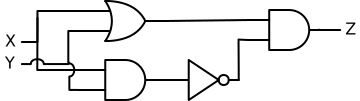 -->

```{logic}
:height: 150
:mode: tryout

{
  "in": [
    {"pos": [50, 30], "id": 0, "name": "X", "val": 0},
    {"pos": [50, 90], "id": 1, "name": "Y", "val": 0}
  ],
  "out": [{"pos": [390, 50], "id": 2, "name": "Z"}],
  "gates": [
    {"type": "OR", "pos": [190, 40], "in": [3, 4], "out": 5},
    {"type": "AND", "pos": [330, 50], "in": [6, 7], "out": 8},
    {"type": "NOT", "pos": [230, 120], "in": 9, "out": 10},
    {"type": "AND", "pos": [160, 120], "in": [11, 12], "out": 13}
  ],
  "wires": [[0, 3], [0, 11], [1, 4], [1, 12], [13, 9], [10, 7], [5, 6], [8, 2]]
}
```


Ce circuit contient une porte **OU**, deux portes **ET** et un inverseur, tous interconnectés.

Discutons d'abord comment interpréter ce circuit avec papier et crayon pour vérifier s'il effectue bien un **OU-X**.


#### Analyse d'un circuit

Pour analyser un circuit logique comme celui présenté ci-dessus, on cherchera à établir sa table de vérité. En l'occurrence, comme pour les portes précédentes, ce circuit a deux entrées: si chaque entrée peut valoir $1$ ou $0$, nous avons en tout, de nouveau, 4 configurations possibles à examiner dans le but de remplir la dernière colonne:

| $X$ | $Y$ | $Z$   |
| :-: | :-: | :-:   |
| 0   | 0   | $???$ |
| 1   | 0   | $???$ |
| 0   | 1   | $???$ |
| 1   | 1   | $???$ |


 Pour remplir chaque ligne, nous allons changer les entrées selon les valeurs de $X$ et $Y$ et observer l'effet des portes et ainsi voir le circuit se comporte. ligne. Prenons $X=Y=0$: c'est le cas représenté par l'état initial du circuit ci-dessus. Rappelons qu'un segment noir véhicule un «0», alors qu'un segment coloré véhicule un «1».

<!-- 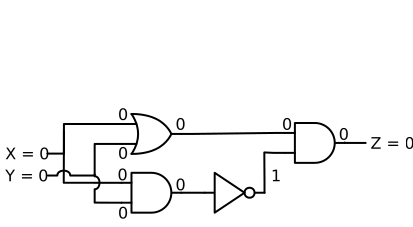 -->

Le résultat intermédiaire des deux portes de gauche sera 0. L'inverseur transforme en 1 la sortie de la porte **ET**, mais la porte finale, qui est aussi une porte **ET**, n'obtient qu'un seul 1 en entrée et donc livre une sortie de 0.

Le cas est différent si l'une des deux entrées vaut 1. Voici deux diagrammes fixes, une fois pour $X=1, Y=0$ et une fois pour $Y=1, X=0$:

<!-- 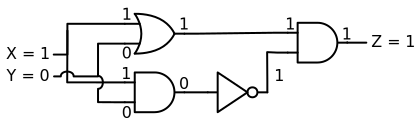 -->
<!-- 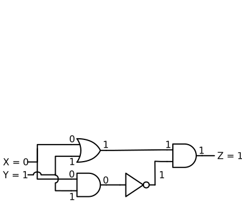 -->

```{logic}
:height: 150
:mode: static

{
  "in": [
    {"pos": [50, 30], "id": 0, "name": "X", "val": 1},
    {"pos": [50, 90], "id": 1, "name": "Y", "val": 0}
  ],
  "out": [{"pos": [390, 50], "id": 2, "name": "Z"}],
  "gates": [
    {"type": "OR", "pos": [190, 40], "in": [3, 4], "out": 5},
    {"type": "AND", "pos": [330, 50], "in": [6, 7], "out": 8},
    {"type": "NOT", "pos": [230, 120], "in": 9, "out": 10},
    {"type": "AND", "pos": [160, 120], "in": [11, 12], "out": 13}
  ],
  "wires": [[0, 3], [0, 11], [1, 4], [1, 12], [13, 9], [10, 7], [5, 6], [8, 2]]
}
```

```{logic}
:height: 150
:mode: static

{
  "in": [
    {"pos": [50, 30], "id": 0, "name": "X", "val": 0},
    {"pos": [50, 90], "id": 1, "name": "Y", "val": 1}
  ],
  "out": [{"pos": [390, 50], "id": 2, "name": "Z"}],
  "gates": [
    {"type": "OR", "pos": [190, 40], "in": [3, 4], "out": 5},
    {"type": "AND", "pos": [330, 50], "in": [6, 7], "out": 8},
    {"type": "NOT", "pos": [230, 120], "in": 9, "out": 10},
    {"type": "AND", "pos": [160, 120], "in": [11, 12], "out": 13}
  ],
  "wires": [[0, 3], [0, 11], [1, 4], [1, 12], [13, 9], [10, 7], [5, 6], [8, 2]]
}
```


Ici, dans les deux cas, la porte **OU**, en haut, livrera un 1, dont a besoin la porte **ET** finale de droite pour donner une sortie de 1. La porte **ET** du bas, elle, continue de livrer un 0.

Mais dans le cas $X = Y = 1$, représenté ici, la situation est différente:

<!--  -->
```{logic}
:height: 150
:mode: static

{
  "in": [
    {"pos": [50, 30], "id": 0, "name": "X", "val": 1},
    {"pos": [50, 90], "id": 1, "name": "Y", "val": 1}
  ],
  "out": [{"pos": [390, 50], "id": 2, "name": "Z"}],
  "gates": [
    {"type": "OR", "pos": [190, 40], "in": [3, 4], "out": 5},
    {"type": "AND", "pos": [330, 50], "in": [6, 7], "out": 8},
    {"type": "NOT", "pos": [230, 120], "in": 9, "out": 10},
    {"type": "AND", "pos": [160, 120], "in": [11, 12], "out": 13}
  ],
  "wires": [[0, 3], [0, 11], [1, 4], [1, 12], [13, 9], [10, 7], [5, 6], [8, 2]]
}
```

La porte **ET** du bas livre un 1, qui est inversé en 0 avant d'atteindre la porte finale, qui ne peut dès lors elle-même que livrer un 0 comme sortie.

La table de vérité complétée de ce circuit est ainsi:

| $X$ | $Y$ | $Z$ |
| :-: | :-: | :-: |
| 0   | 0   | 0   |
| 1   | 0   | 1   |
| 0   | 1   | 1   |
| 1   | 1   | 0   |

Cette fonction s'appelle «ou exclusif», car pour avoir un 1 de sortie, elle exclut le cas où les deux entrées sont 1 en même temps. Elle est souvent utilisée, au point qu'on la représente en fait dans les diagrammes simplement par le dessin de cette porte, appelée **OU-X**, comme simplification du diagramme ci-dessus:

<!-- 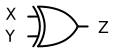 -->
```{logic}
:height: 100
:mode: tryout

{
  "in": [
    {"pos": [50, 30], "id": 3, "name": "X", "val": 0},
    {"pos": [50, 70], "id": 4, "name": "Y", "val": 0}
  ],
  "out": [{"pos": [220, 50], "id": 5, "name": "Z"}],
  "gates": [{"type": "XOR", "pos": [150, 50], "in": [0, 1], "out": 2}],
  "wires": [[3, 0], [4, 1], [2, 5]]
}
```

:::{admonition} Exercice: vérification d’une porte
Vérifiez que la porte **OU-X** se comporte bien comme le circuit ci-dessous réalisé avec des portes **ET**, **OU** et **NON**.
:::


#### Création d'un circuit

Discutons maintenant de comment on a pu créerait de zéro ce diagramme réalisant un **OU-X** à avec les portes à notre disposition à partir de sa table de vérité. Plusieurs approches sont possibles, et nous verrons que, suivant l'approche, on aurait très bien pu créer un circuit logique différent réalisant la même fonction.


##### Approche ad hoc

On se dit donc, selon la table de vérité, que la sortie de notre circuit «ou exclusif» doit être 1 sur l'une ou l'autre des entrées $X$ et $Y$ est à 1, mais pas les deux. On peut ainsi commencer par insérer une porte **OU** dans le diagramme, qui fait une partie du travail. Mais il faut modifier sa sortie, pour ne pas avoir la valeur 1 lorsque les deux entrées sont à 1: cela contredirait la quatrième ligne de la table de vérité. Comment effectuer cela? En connectant la sortie de cette porte **OU** à une nouvelle porte **ET** à droite (dont on n'a pas encore déterminé la seconde entrée).

Pourquoi rajouter une porte **ET**? On utilise ici le fait que connecter une porte **ET** à un signal peut _restreindre_ les conditions sous lesquelles la nouvelle sortie $Z$ sera 1 (alors qu'au contraire, on aurait pu pourrait _étendre_ ces conditions si on avait connecté une nouvelle porte **OU**). Comme si, pour être d'accord de finalement livrer 1 sur la sortie, la porte **ET** voulait la «confirmation» d'un autre signal avant de livrer 1.

À ce moment, on a ce diagramme partiel, qui peut être lu comme: «la sortie $Z$ sera $1$ lorsque ces deux conditions sont vraies en même temps: (1) le **OU** de $X$ et $Y$ vaut 1, et (2) quelque chose qui reste ici à définir, qui sera connecté à la seconde entrée de la porte **ET**».

<!-- 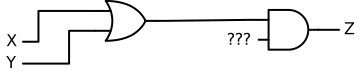 -->

```{logic}
:height: 120
:mode: tryout

{
  "in": [
    {"pos": [50, 30], "id": 0, "name": "X", "val": 0},
    {"pos": [50, 90], "id": 1, "name": "Y", "val": 0}
  ],
  "out": [{"pos": [390, 50], "id": 2, "name": "Z"}],
  "gates": [
    {"type": "OR", "pos": [190, 40], "in": [3, 4], "out": 5},
    {"type": "AND", "pos": [330, 50], "in": [6, 7], "out": 8}
  ],
  "wires": [[0, 3], [1, 4], [5, 6], [8, 2]]
}
```


Ce qui reste à définir en complétant avant la porte **ET**, c'est l'exclusion du cas où $X$ et $Y$ valent les deux 1, de manière à ce que la condition (2) puisse être lue comme «$X$ et $Y$ ne sont pas les deux à 1». Avec une porte **ET** connectée directement aux deux entrées $X$ et $Y$, on obtient une partie de ceci en créant le signal «$X$ et $Y$ sont les deux à 1» C'est en fait la condition inverse que celle que l'on cherche! Pour l'inverser, on insère à la sortie de cette nouvelle porte **ET** un inverseur, ce qui complète le circuit:

<!--  -->
```{logic}
:height: 150
:mode: tryout

{
  "in": [
    {"pos": [50, 30], "id": 0, "name": "X", "val": 0},
    {"pos": [50, 90], "id": 1, "name": "Y", "val": 0}
  ],
  "out": [{"pos": [390, 50], "id": 2, "name": "Z"}],
  "gates": [
    {"type": "OR", "pos": [190, 40], "in": [3, 4], "out": 5},
    {"type": "AND", "pos": [330, 50], "in": [6, 7], "out": 8},
    {"type": "NOT", "pos": [230, 120], "in": 9, "out": 10},
    {"type": "AND", "pos": [160, 120], "in": [11, 12], "out": 13}
  ],
  "wires": [[0, 3], [0, 11], [1, 4], [1, 12], [13, 9], [10, 7], [5, 6], [8, 2]]
}
```

La lecture finale du circuit est donc «la sortie $Z$ sera $1$ lorsque ces deux conditions sont vraies en même temps: (1) le **OU** de $X$ et $Y$ vaut 1, et (2) $X$ et $Y$ ne sont pas les deux en même temps à 1».

:::{admonition} Exercice: analyse d'un circuit
Ceci est le même circuit que ci-dessus, mais sans la porte **ET** finale. À la place, on a inséré deux sorties intermédiaires, $I$ et $J$, qui sont les deux signaux qui allaient précédemment à la porte **ET**:

```{logic}
:height: 150
:mode: tryout

{
  "in": [
    {"pos": [50, 30], "id": 0, "name": "X", "val": 0},
    {"pos": [50, 90], "id": 1, "name": "Y", "val": 0}
  ],
  "out": [
    {"pos": [310, 40], "id": 15, "name": "I"},
    {"pos": [310, 120], "id": 14, "name": "J"}
  ],
  "gates": [
    {"type": "OR", "pos": [190, 40], "in": [3, 4], "out": 5},
    {"type": "NOT", "pos": [230, 120], "in": 9, "out": 10},
    {"type": "AND", "pos": [160, 120], "in": [11, 12], "out": 13}
  ],
  "wires": [[0, 3], [0, 11], [1, 4], [1, 12], [13, 9], [10, 14], [5, 15]]
}
```

 1. Combien de lignes a une table de vérité pour $I$ et $Y$ en fonction des deux entrées $X$ et $Y$? Écrivez cette table de vérité.
 1. Quelle différence y a-t-il entre $J$ et ce qu'on obtient en connectant directement une porte **ET** aux entrées $X$ et $Y$? Quel élément du schéma réalise cette différence?
 1. Dans votre table de vérité, ajoutez une colonne et remplissez-là: elle doit représenter une nouvelle sortie $K$, qui serait produite si on connectait une porte **OU** en lui donnant $I$ et $J$ comme entrées, comme montré ci-dessous. Le schéma représente ici le circuit dans un état indéterminé, mais les types des portes ont été ajoutés pour vous aider. La sortie $K$ est-elle ici toujours la même que la sortie $Z$ plus haut? Quelles sont les éventuelles différences? Finalement, la sortie $K$ a-t-elle un intérêt?

```{logic}
:height: 150
:mode: static

{
  "opts": {"showGateTypes": true},
  "in": [
    {"pos": [50, 30], "id": 0, "name": "X", "val": "?"},
    {"pos": [50, 90], "id": 1, "name": "Y", "val": "?"}
  ],
  "out": [{"pos": [390, 50], "id": 2, "name": "K"}],
  "gates": [
    {"type": "OR", "pos": [190, 40], "in": [3, 4], "out": 5},
    {"type": "OR", "pos": [330, 50], "in": [6, 7], "out": 8},
    {"type": "NOT", "pos": [230, 120], "in": 9, "out": 10},
    {"type": "AND", "pos": [160, 120], "in": [11, 12], "out": 13}
  ],
  "wires": [[0, 3], [0, 11], [1, 4], [1, 12], [13, 9], [10, 7], [5, 6], [8, 2]]
}
```
:::


##### Approche systématique

Il est parfois difficile d'avoir l'«intuition» nécessaire pour suivre une telle approche ad hoc. Voici donc une autre technique, illustrée avec le même exemple.

La table de vérité nous montre qu'il y a deux lignes où la sortie doit valoir $1$: (a) la ligne où $X=1$ et $Y=0$, et (b) la ligne où $X=0$ et $Y=1$. Si l'on pouvait créer un sous-circuit qui nous livrent un $1$ lorsque qu'on se trouve dans la circonstance (a) et un autre qui nous livre un $1$ lorsqu'on se trouve dans la circonstance (b), on pourrait ensuite les combiner avec une porte **OU** et ainsi construire notre sortie $Z$ ainsi:

<!-- 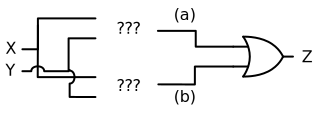 -->
```{logic}
:height: 180
:mode: static

{
  "opts": {"showGateTypes": true},
  "in": [
    {"pos": [50, 30], "id": 0, "name": "X", "val": "?"},
    {"pos": [50, 150], "id": 1, "name": "Y", "val": "?"}
  ],
  "out": [{"pos": [400, 90], "id": 2, "name": "Z"}],
  "gates": [
    {"type": "OR", "pos": [340, 90], "in": [6, 7], "out": 8},
    {"type": "AND", "pos": [200, 60], "in": [3, 4], "out": 5, "showAsUnknown": true},
    {"type": "AND", "pos": [200, 130], "in": [9, 10], "out": 11, "showAsUnknown": true}
  ],
  "wires": [[8, 2], [0, 3], [1, 10], [5, 6], [11, 7], [0, 9], [1, 4]]
}
```

Ici, les deux sous-circuits notés avec «?» et encadrés donc encore à définir — potentiellement avec plus d'une seule porte. Essayons de les créer.

Disons que le sous-circuit du haut correspond à la deuxième ligne de la table de vérité, le cas de figure (a). Pour cette ligne, nous voulons un $1$ de sortie lorsque $X=1$ et $Y=0$. En lisant littéralement cette dernière phrase,on y détecte un **ET** de deux conditions qui doivent être remplies: $X=1$ et $Y=0$. Mais ajouter une porte **ET** directement avec les signaux $X$ et $Y$ ne fera pas l'affaire, parce que cela livrerait un $1$ lors que les _deux_ entrées $X$ et $Y$ sont à $1$. La solution ici, c'est d'_inverser_ $Y$ avant l'entrée dans la porte **ET** — ce qui nous donne bel et bien la condition (a).

On avance ainsi à ceci:

<!-- 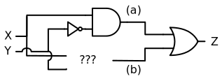 -->
```{logic}
:height: 180
:mode: static

{
  "opts": {"showGateTypes": true},
  "in": [
    {"pos": [50, 30], "id": 0, "name": "X", "val": "?"},
    {"pos": [50, 150], "id": 1, "name": "Y", "val": "?"}
  ],
  "out": [{"pos": [400, 90], "id": 2, "name": "Z"}],
  "gates": [
    {"type": "OR", "pos": [340, 90], "in": [6, 7], "out": 8},
    {"type": "AND", "pos": [230, 50], "in": [3, 4], "out": 5},
    {"type": "AND", "pos": [200, 130], "in": [9, 10], "out": 11, "showAsUnknown": true},
    {"type": "NOT", "pos": [160, 60], "in": 12, "out": 13}
  ],
  "wires": [[8, 2], [13, 4], [0, 3], [1, 12], [1, 10], [5, 6], [11, 7], [0, 9]]
}
```

Pour la condition (b), qui correspond à la troisième ligne de la table de vérité, un raisonnement similaire s'applique. À la place d'inverser $X$, on inversera cette fois $Y$ afin d'obtenir, à la sortie de la nouvelle porte **ET** du bas, un signal qui vaut $1$ lorsque $X=1$ et $Y=0$.

Voici le circuit final ainsi réalisé:

<!-- 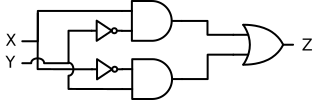 -->
```{logic}
:height: 180
:mode: static

{
  "opts": {"showGateTypes": true},
  "in": [
    {"pos": [50, 30], "id": 0, "name": "X", "val": "?"},
    {"pos": [50, 150], "id": 1, "name": "Y", "val": "?"}
  ],
  "out": [{"pos": [400, 90], "id": 2, "name": "Z"}],
  "gates": [
    {"type": "OR", "pos": [340, 90], "in": [6, 7], "out": 8},
    {"type": "AND", "pos": [230, 50], "in": [3, 4], "out": 5},
    {"type": "AND", "pos": [230, 130], "in": [9, 10], "out": 11},
    {"type": "NOT", "pos": [160, 60], "in": 12, "out": 13},
    {"type": "NOT", "pos": [160, 120], "in": 14, "out": 15}
  ],
  "wires": [
    [8, 2], [13, 4], [15, 9], [0, 3], [0, 14], [1, 12], [1, 10],
    [5, 6], [11, 7]
  ]
}
```

(Ce schéma ne peut être simulé quand dans l'indice de l'exercice suivant.)

Ce que cette approche systématique nous apprend, c'est que nous pouvons toujours penser un circuit comme un **OU** de toutes les conditions sous lesquelles la sortie doit être à $1$. Ces conditions sont elles-mêmes réalisables avec les entrées du circuit avec des portes **ET** et des inverseurs.

Nous faisons aussi les constats suivants:
 * Plusieurs circuits logiques différents peuvent réaliser la même fonction de sortie
 * L'approche systématique décrite ici ne livre pas forcément le circuit le plus compact: on a obtenu un circuit avec 5 portes pour réaliser un **OU-X** alors que l'approche ad hoc nous a fait construire un circuit à 4 portes


::::{admonition} Exercice: analyse d'un circuit
En annotant le schéma logique avec les quatre cas de figure possibles pour les entrées $X$ et $Y$, faites l'analyse du circuit **OU-X** ci-dessus construit avec l'approche systématique et montrez que la table de vérité ainsi reconstituée est la même que celle de la porte **OU-X**.

:::{admonition,dropdown} Indice
```{logic}
:height: 180
:mode: tryout

{
  "in": [
    {"pos": [50, 30], "id": 0, "name": "X", "val": 0},
    {"pos": [50, 150], "id": 1, "name": "Y", "val": 0}
  ],
  "out": [{"pos": [400, 90], "id": 2, "name": "Z"}],
  "gates": [
    {"type": "OR", "pos": [340, 90], "in": [6, 7], "out": 8},
    {"type": "AND", "pos": [230, 50], "in": [3, 4], "out": 5},
    {"type": "AND", "pos": [230, 130], "in": [9, 10], "out": 11},
    {"type": "NOT", "pos": [160, 60], "in": 12, "out": 13},
    {"type": "NOT", "pos": [160, 120], "in": 14, "out": 15}
  ],
  "wires": [
    [8, 2], [13, 4], [15, 9], [0, 3], [0, 14], [1, 12], [1, 10],
    [5, 6], [11, 7]
  ]
}
```
:::

::::


# Exercices

::::{admonition} Exercice: porte cachée
Quelle est la porte cachée de ce circuit?
```{logic}
:height: 100
:mode: tryout

{
  "in": [
    {"pos": [50, 30], "id": 3, "name": "X", "val": 0},
    {"pos": [50, 70], "id": 4, "name": "Y", "val": 0}
  ],
  "out": [{"pos": [220, 50], "id": 5, "name": "Z"}],
  "gates": [{"type": "OR", "pos": [150, 50], "in": [0, 1], "out": 2, "showAsUnknown": true}],
  "wires": [[3, 0], [4, 1], [2, 5]]
}
```
:::{admonition,dropdown} Corrigé
C'est une porte **OU**.
:::

::::

::::{admonition} Exercice: circuit défectueux
Analysez ce circuit. Fonctionne-t-il correctement? Déterminez ce qui pose problème. Dites ce que fait ce circuit une fois corrigé et écrivez sa table de vérité.

```{logic}
:height: 140
:mode: tryout

{
  "in": [
    {"pos": [50, 30], "id": 3, "name": "X", "val": 0},
    {"pos": [50, 70], "id": 4, "name": "Y", "val": 0},
    {"pos": [50, 110], "id": 6, "name": "W", "val": 0}
  ],
  "out": [{"pos": [320, 70], "id": 5, "name": "Z"}],
  "gates": [
    {"type": "AND", "pos": [150, 50], "in": [0, 1], "out": 2},
    {"type": "OR", "pos": [260, 70], "in": [7, 8], "out": 9, "poseAs": "AND"}
  ],
  "wires": [[3, 0], [4, 1], [6, 8], [2, 7], [9, 5]]
}
```

:::{admonition,dropdown} Indice
Voici le circuit corrigé:
```{logic}
:height: 140
:mode: tryout

{
  "in": [
    {"pos": [50, 30], "id": 3, "name": "X", "val": 0},
    {"pos": [50, 70], "id": 4, "name": "Y", "val": 0},
    {"pos": [50, 110], "id": 6, "name": "W", "val": 0}
  ],
  "out": [{"pos": [320, 70], "id": 5, "name": "Z"}],
  "gates": [
    {"type": "AND", "pos": [150, 50], "in": [0, 1], "out": 2},
    {"type": "AND", "pos": [260, 70], "in": [7, 8], "out": 9}
  ],
  "wires": [[3, 0], [4, 1], [6, 8], [2, 7], [9, 5]]
}
```
:::
::::


::::{admonition} Exercice: conception d'un circuit

Écrivez la table de vérité de ce circuit, dont une partie est masquée:

```{logic}
:height: 100
:mode: tryout

{
  "in": [
    {"pos": [50, 30], "id": 3, "name": "X", "val": 0},
    {"pos": [50, 70], "id": 4, "name": "Y", "val": 0}
  ],
  "out": [{"pos": [220, 50], "id": 5, "name": "Z"}],
  "gates": [{"type": "RIMPLY", "pos": [150, 50], "in": [0, 1], "out": 2, "showAsUnknown": true}],
  "wires": [[3, 0], [4, 1], [2, 5]]
}
```

:::{admonition,dropdown} Corrigé
| $X$ | $Y$ | $Z$ |
| :-: | :-: | :-: |
| 0   | 0   | 1   |
| 0   | 1   | 0   |
| 1   | 0   | 1   |
| 1   | 1   | 1   |
:::


Réalisez ensuite un circuit logique avec les mêmes deux entrées $X$ et $Y$ et la même sortie $Z$ qui implémente cette table de vérité. On peut utiliser des portes **ET** et **OU** et des inverseurs. Glissez les portes depuis la gauche pour en ajouter, et glissez entre les connecteurs rond pour les connecter.

```{logic}
:height: 200
:showonly: AND OR NOT

{
  "in": [
    {"pos": [50, 40], "id": 3, "name": "X", "val": 0},
    {"pos": [50, 160], "id": 4, "name": "Y", "val": 0}
  ],
  "out": [{"pos": [380, 100], "id": 5, "name": "Z"}]
}
```

:::{admonition,dropdown} Indice 1
On peut lire cette fonction comme «$Z$ vaut 1 lorsque $X$ et $Y$ sont les deux à 0 (la première ligne de la table de vérité) ou lorsque $X$ est à 1 (les deux dernières lignes)».
:::

:::{admonition,dropdown} Indice 2
$Z$ est donc le **OU** de $X$ et du **ET** de l'inverse de $X$ et de $Y$.
:::

:::{admonition,dropdown} Corrigé
<!-- 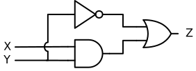 -->
Il y plusieurs solutions possible. Celle qui correspond aux indices est la suivante:

```{logic}
:height: 200
:mode: tryout

{
  "in": [
    {"pos": [50, 40], "id": 3, "name": "X", "val": 0},
    {"pos": [50, 160], "id": 4, "name": "Y", "val": 0}
  ],
  "out": [{"pos": [380, 100], "id": 5, "name": "Z"}],
  "gates": [
    {"type": "AND", "pos": [230, 110], "in": [0, 1], "out": 2},
    {"type": "OR", "pos": [320, 100], "in": [6, 7], "out": 8},
    {"type": "NOT", "pos": [130, 100], "in": 9, "out": 10},
    {"type": "NOT", "pos": [130, 160], "in": 11, "out": 12}
  ],
  "wires": [[3, 6], [8, 5], [2, 7], [3, 9], [10, 0], [4, 11], [12, 1]]
}
```

Voici un circuit plus simple, qui fait la même chose mais qui est plus difficile à concevoir d'emblée:
```{logic}
:height: 120
:mode: tryout

{
  "in": [
    {"pos": [50, 40], "id": 3, "name": "X", "val": 0},
    {"pos": [50, 80], "id": 4, "name": "Y", "val": 0}
  ],
  "out": [{"pos": [290, 60], "id": 5, "name": "Z"}],
  "gates": [
    {"type": "OR", "pos": [230, 60], "in": [6, 7], "out": 8},
    {"type": "NOT", "pos": [120, 80], "in": 11, "out": 12}
  ],
  "wires": [[3, 6], [8, 5], [4, 11], [12, 7]]
}
```
:::

::::


## De la logique à l'arithmétique

Ces portes logiques vont nous permettre de finalement réaliser notre petit additionneur. Nous avons déjà dit que nous avions deux bits de sorties à calculer pour notre sortie $S = A + B$. Disons donc que $S$ est donc constitué de $S_0$, le bit des unités, et de $S_1$, le bit représentant la valeur décimale 2. La table de vérité pour $S_0$, tirée directement de la première section ci-dessous, est:

| $A$ | $B$ |$S_0$|
| :-: | :-: | :-: |
| 0   | 0   | 0   |
| 1   | 0   | 1   |
| 0   | 1   | 1   |
| 1   | 1   | 0   |

En comparant cette table de vérité avec celles des portes logiques, on se rend compte que $S_0$ n'est autre qu'un **OU-X** de $A$ et $B$.

La table de vérité pour $S_1$ est:

| $A$ | $B$ |$S_1$|
| :-: | :-: | :-: |
| 0   | 0   | 0   |
| 1   | 0   | 0   |
| 0   | 1   | 0   |
| 1   | 1   | 1   |

Et on constate que $S_1$ n'est autre qu'un **ET** logique de $A$ et $B$. Ainsi, on peut dessiner notre petit additionneur de deux bits ainsi:

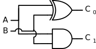

Ce circuit est spécialement intéressant en montrant comment des opérateurs logiques sont utilisés pour réaliser l'opération arithmétique de l'addition. Notre additionneur est limité: en fait, on l'appelle un _demi-additionneur_. Il n'est capable d'additionner que deux nombres à 1 bit, c'est très limité. En fait, il serait intéressant d'avoir un additionneur de _trois_ nombres à un bit. Pourquoi? À cause de la manière dont nous faisons les additions en colonnes.

Lorsque nous faisons une addition de deux nombres à plusieurs chiffres, que ce soit en base 10 ou en base 2, on commence par la colonne de droite, les unités. Nous connaissons le concept de _retenue_: en base 10, si l'addition des unités dépasse 9, on retient 1 dans la colonne des dizaines. En base 2, de façon similaire, si l'addition des unités dépasse… 1, on retient 1 dans la colonne suivante à gauche. C'est ce qu'on a fait avec le demi-additionneur: on peut considérer que la sortie $S_0$ représente la colonne des unités dans la somme, et la sortie $S_1$ représente la retenue à prendre en compte dans la colonne suivante.

C'est ici que ça se complique: pour additionner les chiffres de la deuxième colonne, nous devons potentiellement additionner trois chiffres, et plus seulement deux. Il y a en effet peut-être cette retenue qui nous vient de la colonne des unités. Ceci est vrai en base 2 comme en base 10. Il nous faut donc un additionneur plus puissant, à trois entrées, pour prendre en compte cette retenue. Il s'appelle _additionneur complet_.


### Exercice

 * Déterminer combien de combinaisons différentes sont possibles pour trois signaux d'entrées $A$, $B$ et $C$ qui chacun peuvent valoir soit $1$ soit $0$.
 * Lister toutes ces combinaisons.
 * Pour chaque combinaisons, déterminer la valeur binaire qui est la somme des 3 signaux d'entrée.
 * Finalement, avec les informations ainsi obtenues, compléter la table de vérité d'un additionneur complet qui a deux sorties $S_0$ et $S_1$

:::{admonition,dropdown} Corrigé
 Il y a $2 \cdot 2 \cdot 2 = 2^3 = 8$ combinaisons différentes. Avec la notation $A + B + C =$ valeur en décimal $=$ valeur en binaire, les voici:
  * $0 + 0 + 0 = 0_d = 00_b$
  * $0 + 0 + 1 = 1_d = 01_b$
  * $0 + 1 + 0 = 1_d = 01_b$
  * $0 + 1 + 1 = 2_d = 10_b$
  * $1 + 0 + 0 = 1_d = 01_b$
  * $1 + 0 + 1 = 2_d = 10_b$
  * $1 + 1 + 0 = 2_d = 10_b$
  * $1 + 1 + 1 = 3_d = 11_b$

La table de vérité est ainsi:

| $A$ | $B$ | $C$ | $S_0$ | $S_1$ |
| :-: | :-: | :-: | :-: | :-: |
| 0   | 0   | 0   | 0   | 0   |
| 0   | 0   | 1   | 0   | 1   |
| 0   | 1   | 0   | 0   | 1   |
| 0   | 1   | 1   | 1   | 0   |
| 1   | 0   | 0   | 0   | 1   |
| 1   | 0   | 1   | 1   | 0   |
| 1   | 1   | 0   | 1   | 0   |
| 1   | 1   | 1   | 1   | 1   |
:::

Faisons pour l'instant abstraction des détails d'un additionneur complet. On peut se dire qu'on le dessine simplement ainsi:

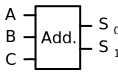

La flexibilité de ce composant fait qu'on peut maintenant facilement l'utiliser pour construire un circuit qui additionne deux nombres $A$ et $B$ à 2 bits chacun (donc de $0 + 0 = 0$ à $3 + 3 = 6$). Si $A$ est formé de deux bits $A_0$ et $A_1$ et que $B$ est formé des deux bits $B_0$ et $B_1$ et avec une sortie $S$ sur trois bits $S_0$, $S_1$ et $S_2$, on a:

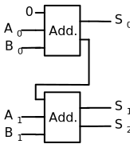

L'additionneur du haut, comme précédemment, additionne les deux bits des unités. Son entrée $C$, qui représente l'éventuelle troisième chiffre à additionner issu d'une retenue, est toujours 0, vu qu'il n'y a aucune colonne précédente dans l'addition qui aurait pu en livrer une. Il livre comme première sortie $S_0$, le chiffre des unités, et sa seconde sortie est la retenue à utiliser pour l'addition des chiffres suivants. C'est pourquoi elle est connectée à l'entrée de la retenue du second additionneur, qui va lui ajouter également les deux bits de la colonne suivante, $A_1$ et $B_1$. Les sorties du second additionneur livrent le deuxième bit $S_1$ de la valeur de sortie, ainsi que la retenue pour la troisième colonne. Comme il n'y a plus de bits d'entrée pour la troisième colonne, cette retenue peut directement être considérée comme le troisième bit de sortie.


### Exercice

En connectant des additionneurs complets, réaliser un circuit qui additionne deux nombres $A$ et $B$ de huit bits, numérotés $A_0$ à $A_7$ et $B_0$ à $B_7$, respectivement. Combien de bits de sortie doit-il y avoir pour traiter toutes les valeurs possibles?

:::{admonition,dropdown} Corrigé
Nous avons besoin de neuf bits de sortie. Le schéma, représenté horizontalement, est:

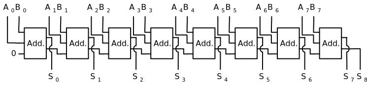

Les trois entrées de chaque additionneur sont interchangeables (reflétant la commutativité de l'addition), mais pas les sorties.

Cet exercice démontre l'opportunité de penser en termes modulaires, ce qui revient souvent en informatique. Ici, on a réalisé qu'un additionneur complet résout un sous-problème bien défini d'une addition générale d'un nombre à $n$ bits, et que, une fois qu'on a créé un tel additionneur, il suffit d'en connecter plusieurs les uns derrière les autres de manière structurée pour additionner des nombres plus grands.
:::


### Exercice

En s'aidant de la table de vérité d'un seul additionneur complet, créer un circuit logique qui calcule ses sorties $S_0$ et $S_1$ en fonction des entrées $A$, $B$ et $C$.

:::{admonition,dropdown} Indice
 * La sortie $S_0$ doit être $1$ soit lorsque les trois entrées valent $1$, soit lors qu'une seule des trois entrée vaut $1$.
 * La sortie $S_1$, qui est la retenue, doit être $1$ lorsque deux ou trois des trois entrées sont à $1$.
:::

:::{admonition,dropdown} Corrigé
TODO

:::


## ALU

TODO


## Bascules

TODO


## Conclusion

Dans ce chapitre nous avons donc vu les briques de base des ordinateurs. À savoir les éléments suivants:
* Les portes logiques qui s'assemblent en systèmes logiques qui effectuent des opérations logiques qui aboutissent à des fonctions arithmétiques et logiques dans une ALU
* Les bascules qui permettent de mémoriser une information et s'assemblent dans des registres

Nous pouvons les assembler dans des microprocesseurs que nous allons détailler au chapitre suivant.

````{panels}
:column: col-lg-12 p-2
:card: bg-info

**Vite ... très vite**
^^^^
Nous avons démontré que finalement nos ordinateurs ont un cerveau très simple dans le fonction de ses éléments de base : des portes logiques qui traitent des **0** ou des **1**. Il est cependant très difficile de se représenter à quel point ces traitement vont vite.
Imaginons pour cela que le processeur écrive toutes les opérations qu'il effectue sur un ruban de papier et calculons la vitesse de défilement de ce papier. 

Pour cela nous faisons les hypothèses suivantes:
* Les processeurs actuels ont une cadence d'horloge de 3GHz, c'est à dire $3·10^9 [s^{-1}]$. Pour simplifier nous allons supposer qu'ils effectuent une opération par cycle[^1].
* Nous transcrivons un mot de 64 bit (taille standard pour les processeurs) sur une longueur de 15cm, ce qui correspond à $15·10^{-2}[m]$.

Le calcul devient alors :

$$
    3·10^9 [s^{-1}] · 15·10^{-2}[m] \\
    45·10^7 [m/s]
$$

Que nous convertissons en km :

$$
    45·10^5 [km/s] ou encore : 450'000 [km/s]
$$

Rappelons que la vitesse de la lumière est :

$$
    c \cong 300'000 [km/s]
$$

Ce qui veut dire que si un microprocesseur, tel que ceux que l'on trouve dans son ordinateur ou son smartphone, écrivait sur un ruban de papier tout ce qu'il fait, ce ruban de papier devrait se déplacer à une fois et demi la vitesse de la lumière. Ou encore, ce ruban ferait chaque seconde plus de 11 fois le tour de la terre.

Si les éléments de base sont simples, la complexité et la richesse des expériences numériques comme l'immersion dans un jeu vidéo proviennent de la quantité extraordinaire d'opérations effectuées.

[^1]: En fait le opérations d'un processeur prennent plus d'un cycle pour être réalisées, mais comme les processeurs ont plusieurs coeurs et un pipeline dont nous n'abordons pas ici le fonctionnement, la simplification proposée n'est pas aberrante.


````