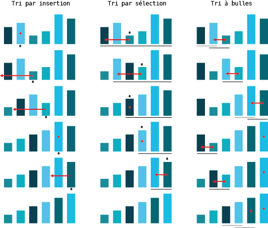

Algorithmes classiques
======================

::::{admonition,note} Matière à réfléchir I

Imaginez une bibliothèque scolaire un peu spéciale : les livres n’y sont pas rangés par ordre alphabétique ! Ils sont bien rangés sur des étagères, mais sans aucune logique particulière. Vous entrez dans cette bibliothèque un peu spéciale et vous vous mettez à chercher l’ouvrage ***Le Guide du voyageur galactique.***

Pensez-vous pouvoir retrouver ce livre ?

Combien de temps cela vous prendrait-il ? 

Y a -t-il des objets que vous rangez chez vous dans un ordre bien particulier ?

::::

## Algorithmes de tris

Pour apprendre à cuisiner, on commence par suivre des recettes classiques. Ainsi, pour appréhender l’algorithmique, nous étudierons une classe d’algorithmes classiques : les **algorithmes de tri**. 

:::{figure} 

Figure 2. Des objets peuvent être triés selon une relation d’ordre, en lien avec une propriété. Sur la ligne du haut, les rectangles sont organisés selon leur couleur (de la plus sombre à la plus lumineuse), alors que sur la ligne du bas, ils sont triés selon leur taille (du plus petit au plus grand).

:::

Un algorithme de tri permet de trier des données, de les organiser selon **une relation d’ordre**. Dans la figure ci-dessus, les objets sont organisés soit par la luminosité de leur couleur, soit par leur taille, dans un ordre croissant.

Toutes les recettes de cuisine ne se valant pas, un algorithme peut aussi être ***plus adéquat qu’un autre algorithme***. Il existe des dizaines d’algorithmes qui trient avec des approches différentes (nous en verrons quelques-uns). Certains sont plus rapides, d’autres moins gourmands en mémoire ou bien plus simples à coder. Ainsi, selon la situation, il faut choisir le bon algorithme.

::::{admonition,attention} Exercice 4

Trier les rectangles de la ligne du haut de la Figure 2 en fonction de leur taille (comme sur la ligne de bas). Dessiner toutes les étapes intermédiaires par lesquelles on passe avant d’arriver à la solution finale.

En lien avec les ingrédients d’un algorithme, déterminer les données en entrée et le résultat en sortie de l’algorithme.

Quelles opérations avez-vous effectuées ? 

::::

### Tri par insertion

Voici l’algorithme du **tri par insertion**. Parcourir la liste d’éléments à trier du deuxième au dernier élément. Insérer chaque élément au bon emplacement de la liste déjà parcourue. Notez que la liste déjà parcourue (jusqu’à l’élément considéré à ce moment-là) est toujours bien triée.

### Tri par sélection

L’algorithme du **tri par sélection** commence par rechercher le plus petit élément de la liste et l’échange avec le premier élément de la liste. Il recherche ensuite le plus petit élément de la liste restante, en excluant le nouveau premier élément, et l’échange avec le deuxième élément de la liste. Et ainsi de suite, il recherche le plus petit élément de la liste restante, en excluant les éléments déjà triés, et échange cet élément avec le premier élément pas encore trié. Il continue de la sorte jusqu’à ce que toute la liste est triée.

### Tri à bulles

L’algorithme du **tri à bulles** compare les éléments voisins. Commencer par comparer les deux premiers éléments de la liste et les mettre dans le bon ordre (le plus petit des deux éléments précède le plus grand). Comparer ensuite les deux éléments suivants (le nouveau deuxième et troisième élément de la liste) et les mettre dans le bon ordre. Continuer de la sorte jusqu’à la fin de la liste. Après ce premier parcours de la liste, le plus grand élément se retrouve en dernière position de la liste. Parcourir à nouveau la liste, en comparant et déplaçant les éléments voisins et en excluant le dernier élément qui est déjà bien trié. Parcourir la liste de la sorte, autant de fois qu’elle possède d’éléments, en excluant les éléments bien triés à la fin de la liste.

::::{admonition,attention} Exercice 5

Résoudre cet exercice avant d’avancer dans le chapitre. Appliquer les trois algorithmes ci-dessus pour trier les rectangles de la ligne du haut de la Figure 2 en fonction de leur taille (le résultat est illustré dans la ligne du bas), en dessinant l’ordre des éléments à chaque fois qu’il change. 

::::

::::{admonition,hint} Le saviez-vous ? II

Pour trier 1 million d’éléments, selon l’algorithme choisi, cela peut prendre de l’ordre de 20 millions à 1 billion d’opérations. 

Si chaque opération prend 1 microseconde (10-6 s) à s’exécuter, trier 1 million d’éléments pourrait prendre de 20 secondes (algorithme efficace) à 11 jours (pour un algorithme lent). 

::::

:::{figure} 

Figure 3. Etapes intermédiaires lors de l’application des différents algorithmes de tri. L’étoile en dessous des rectangles dénote l’élément que l’on est en train de considérer à un moment donné. La flèche rouge montre les mouvements des éléments suite à l’opération de tri. Si l’élément ne bouge pas, la flèche rouge est remplacée par un point rouge. **A gauche**, le tri par insertion. On parcourt la liste dans l’ordre, un élément après l’autre (voir étoiles). A chaque étape, on cherche à insérer le rectangle considéré (dénoté par l’étoile) à la bonne place dans la liste précédemment triée. La flèche rouge montre la position à laquelle le rectangle sera inséré. Un point rouge montre que l’élément est déjà bien trié (aucune action n’est requise dans ce cas). La liste qui précède le rectangle considéré (avec étoile) est toujours bien triée. **Au milieu**, le tri par sélection. On parcourt la liste pour sélectionner son plus petit élément, et on le met à la bonne position. La ligne noire au‑dessous des rectangles montre la liste parcourue pour rechercher le plus petit élément. L’étoile désigne le plus petit élément de cette liste. Finalement, la flèche rouge montre les éléments à échanger, le plus petit élément sélectionné (avec étoile) se retrouve à la fin de la liste déjà triée (pas soulignée). Le point rouge indique que l’élément est déjà bien trié et qu’aucune action n’est requise. **A droite**, le tri à bulles. Les lignes en dessous des rectangles montrent les éléments voisins qui sont comparés à chaque étape. Lorsque cette ligne est grise, les éléments sont déjà bien ordonnés et aucune action n’est requise. Lorsque la ligne est noire, les éléments ne sont pas dans le bon ordre est doivent être inversés (flèche rouge). Après un passage complet de la liste, l’élément le plus grand se retrouve en dernière position (4e ligne). Le point rouge indique ici les éléments déjà bien triés. Dans ce cas, la liste est triée après trois passages complets de la liste.

:::

Avant de continuer la lecture, assurez-vous que vous avez bien résolu l’exercice 4. La figure sur la page précédente détaille les étapes intermédiaires des trois algorithmes de tri vus précédemment. Notez que même si tous les algorithmes arrivent à la même solution finale, ils y arrivent de manière très différente et avec plus ou moins de mouvements. 

::::{admonition,attention} Exercice 6

Rappelez-vous la méthode que vous avez utilisée pour résoudre l’exercice 3. De quel algorithme de tri se rapproche-t-elle le plus ? 

::::

::::{admonition,attention} Exercice 7

Pour chaque algorithme, compter le nombre de comparaisons, le nombre de mouvements (le rectangle considéré change de place) et le nombre de rectangles à la bonne position (la position du rectangle à une étape intermédiaire est la même que la position finale de la dernière ligne).

Imaginons que ce qui prend le plus de temps est la comparaison de la taille de deux rectangles. Dans ce cas précis, lequel des trois algorithmes faudrait-il utiliser ?

Imaginons que ce qui prend le plus de temps est le mouvement d’un rectangle (le rectangle est déplacé). Dans ce cas précis, lequel des trois algorithmes serait le plus rapide ? Quel serait l’algorithme le plus lent ?

Imaginons que le meilleur algorithme est celui qui propose le plus de rectangles déjà à la bonne position (à leur position finale une fois les rectangles triés) en considérant toutes les étapes. Cela peut être le cas si l’on n’a pas le temps d’attendre que l’algorithme termine et on souhaite que les étapes intermédiaires nous donnent une réponse aussi proche que possible de la solution finale. Dans ce cas précis, lequel des trois algorithmes serait le plus rapide ? 

Quel est le meilleur algorithme de tous les algorithmes considérés ?

::::

## Comparaison d’algorithmes

La qualité d’un algorithme dépend de l’aspect que l’on souhaite optimiser (ou minimiser). Cela peut être la vitesse d’exécution (mesurée par le nombre d’instructions élémentaires exécutées), la place occupée en mémoire, ou encore le coût de certaines opérations comme le déplacement d’un élément. L’algorithme utilisé devrait être choisi en fonction de la situation.

La vitesse d’un algorithme dépend également des données en entrée. Selon la situation initiale des données en entrée (correspond à la ligne du haut de la Figure 2 et de la Figure 3), un algorithme « rapide » peut devenir « lent ». Il faut savoir que les algorithmes vus jusqu’ici sont des algorithmes lents, nous verrons un algorithme de tri rapide ultérieurement.

::::{admonition,note} Pour aller plus loin II

Imaginez que les quatre éléments d’une liste sont triés dans le sens inverse de ce que l’on souhaite (ils sont placés du plus grand au plus petit). Trier la liste selon les trois algorithmes de tri vus précédemment : le tri par insertion, le tri par sélection et le tri à bulles. 

Quel algorithme est le plus rapide dans cette configuration précise (présente le moins d’étapes intermédiaires) ? Quel algorithme est le plus lent ?

::::

## Solutions des exercices

::::{admonition,attention} Exercice 4 

Les données en entrée sont les rectangles sur la ligne du haut : leur taille et leur ordre. Le résultat en sortie correspond aux rectangles sur la ligne du bas : leur taille et leur ordre.

::::

::::{admonition,attention} Exercice 5

La solution est donnée dans la légende de la Figure 3.

::::

::::{admonition,attention} Exercice 6

La solution dépend de votre solution de l’exercice 3. 

::::

::::{admonition,attention} Exercice 7

Le décompte des opérations effectuées est comme suit :

Tri par insertion : 15 comparaisons, 3 mouvements (flèches rouges) et 7 rectangles bien placés. 
Tri par sélection : 15 comparaisons (lignes en dessous), 4 mouvements (flèches rouges) et 12 rectangles bien placés. 
Tri à bulles : 12 comparaisons (lignes en dessous) et 5 mouvements (flèches rouges) et 7 rectangles bien positionnés. 

Si c’est la comparaison de deux éléments qui prend beaucoup de temps, il vaudrait mieux utiliser le tri à bulles, parce qu’il exécute moins de comparaisons que les autres algorithmes.

Si c’est le mouvement d’un rectangle qui coûte beaucoup de temps, l’algorithme le plus rapide serait le tri par insertion (3 mouvements) au lieu des 6 mouvements du tri par insertion (l’algorithme le plus lent).

Si le meilleur algorithme est celui qui dénombre le maximum de rectangles bien placés toutes étapes confondues, le meilleur algorithme serait le tri par sélection.

Le meilleur algorithme dépend de la situation, tous les algorithmes étaient les meilleurs dans un des cas considérés. Il existe des algorithmes de tri bien plus rapides que les trois algorithmes considérés que l’on verra ultérieurement.

::::

## Exercices supplémentaires

::::{admonition,attention} Exercice 5 

Réfléchir à votre journée : y a-t-il des actions qui se retrouvent chaque jour ouvrable ? Arrivez-vous à esquisser un algorithme que vous suivez sans que vous en ayez conscience ?

::::

::::{admonition,attention} Exercice 6

Trier la liste [2,5,3,4,7,1,6] en utilisant les trois algorithmes de tri vus au cours. Essayer de représenter l’état de la liste après chaque étape qui change l’ordre des éléments.

::::

::::{admonition,attention} Exercice 7 

Ecrire un algorithme qui vérifie si une liste est triée. 

Que prend l’algorithme en entrée et qu’est-ce qu’il retourne en sortie ?

Demander ensuite à un autre élève de suivre les opérations décrites par votre algorithme. Est-ce que votre algorithme est correct ?

Comparer vos algorithmes. Sont-ils différents ?

::::

::::{admonition,attention} Exercice 8

Analyser les oeuvres cubiques de Piet Mondrian. Trouver un algorithme qui permet de créer une oeuvre qui pourrait être attribuée à Mondrian.

::::