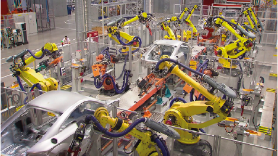

Conséquences de l'automatisation
================================

::::{admonition,hint} Pourquoi est-ce important ?

l’ordinateur dans un temps raisonnable.
L’étude des algorithmes a un effet bénéfique sur votre manière de réfléchir et de résoudre des problèmes de votre vie quotidienne. Elle permet de structurer la pensée et de prendre des décisions fondées sur une réflexion argumentée.
Les algorithmes sont omniprésents. «Ils» décident de ce que vous voyez sur les réseaux sociaux, ils savent mieux que vous quelle personne vous correspond le mieux, ils vous suggèrent des livres à lire et des films à regarder, corrigent vos textes, vous traduisent ou encore embellissent vos photos en un clic. Ils font la pluie et le beau temps en bourse, décident si un prévenu doit être emprisonné, rédigent des articles de journal, conduisent des voitures autonomes. La liste s’allonge chaque jour.

::::

## Automatisation

:::{figure} 

Usine du début du siècle dernier. Les machines sont au service des ouvriers.

:::

Grâce aux algorithmes, la machine a pu remplacer l’homme dans de nombreuses tâches, en allant des robots constructeurs d’automobiles (comparez les deux images) aux pilotes d’avion automatiques, ou encore aux logiciels de trading. L’automatisation permet aux employés de se concentrer sur des tâches plus valorisantes et permet aux entreprises  de réaliser des économies. 

**Quelles difficultés voyez-vous dans l’automatisation ?**

Selon la chasseuse de têtes Isabelle Rouhan, 85 % des métiers de 2030 n’ont pas encore été inventés.  

**Souhaiteriez-vous devenir neuro-manageur.euse ou éducateur.rice de robots ?**

:::{figure} 

Usine du début de ce siècle. Les machines ont remplacé les ouvriers.

:::

