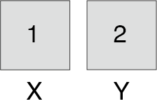

Décomposition d'un problème en étapes
=====================================

## Algorithme ou la décomposition d’un problème

Un **algorithme** est en quelque sorte « une recette » que l’on suit pour **résoudre un problème**. Voici quelques exemples de problèmes que l’on arrive à résoudre numériquement : calculer le trajet le plus court, gérer les livres d’une bibliothèque, détecter des visages dans une photographie ou recommander des produits. ***L’algorithme n’est donc pas un programme***. Un algorithme ne se code pas, il ne s’exécute pas et il ne donne pas de solution concrète. L’algorithme décrit plutôt un « mode d’emploi » que l’on peut suivre pour créer un programme. C’est le programme qui sera exécuté par un système informatique pour concrètement résoudre le problème.

Un mode d’emploi ou une recette décrivent **des étapes** à suivre. La préparation des ingrédients, la cuisson ou le service sont différentes étapes d’une recette de cuisine, qu’une personne peut suivre pour réaliser un plat. Prenons un cas précis : ***réaliser une omelette***. Pour chaque étape il faut prévoir une marche à suivre suffisamment détaillée, afin que la personne qui suit la recette arrive au même résultat. Dans le cas de l’omelette, les opérations pourraient être (voir figure ci-dessous) : 

1. Casser les oeufs dans un bol. 
2. Mélanger les œufs jusqu’à obtenir un mélange homogène.
3. Cuire le mélange d’oeufs dans une poêle à température moyenne.
4. Lorsque cuite, glisser l’omelette dans une assiette.

:::{figure} 


Les opérations à suivre pour la réalisation d’une omelette.

:::

Il en est de même pour l’algorithme qui **décompose le problème** en étapes à suivre pour permettre au système informatique de résoudre le problème. L’algorithme décrit toutes les opérations à effectuer pour arriver à un résultat. L’algorithme est donc **une suite d’opérations** qui permettent de résoudre un problème.  Le langage utilisé dans un algorithme est plus libre que celui utilisé dans un programme, comme le montre cet exemple :

```
Tableau Nombres : numérique
Variable i : numérique
Variable résultat : numérique
Répéter Pour i = 1 à longueur(Nombres)
    Resultat ← Resultat + Nombres[i]
Fin Pour
```

::::{admonition,attention} Exercice 1

 Que contient la variable résultat à la fin de cet algorithme ? Quel est le problème que cet algorithme permet de résoudre ?

::::

« Chaque étape d’un algorithme doit être définie précisément » (Knuth, D. E., 2011). En effet, si on ne décompose pas suffisemment la solution du problème, on peut se retrouver face à une recette inutile, par exemple prendre des oeufs et réaliser une omelette. Cette recette ne nous dit pas vraiment comment procéder pour arriver à faire une omelette.

### Les ingrédients d’un algorithme

L’objectif d’un algorithme est de résoudre un problème, donc de trouver la solution à un problème donné. Concrètement l’algorithme va utiliser des **données** qu’il reçoit ***en entrée*** et va retourner un **résultat** ***en sortie*** (la solution du problème). Un algorithme qui détecte les visages peut recevoir une image en entrée (les données) et peut répondre "oui" si l’image contient un visage ou "non" si l’image ne contient pas de visage (le résultat). Les données en entrée d’un algorithme qui traduit pourraient être un texte à traduire et un dictionnaire. L’algorithme traite ces données pour retourner en sortie un texte traduit dans une autre langue, dont le sens correspond au texte original.

Entre l’entrée et la sortie, l’algorithme précise quelles **opérations** exécuter. Les opérations que l’on peut demander à un humain sont très différentes de celle d’un ordinateur. On peut demander à un humain de casser des oeufs, mais un ordinateur ne peut comprendre et réaliser cette opération. Par contre on peut demander à un ordinateur de stocker une valeur dans une variable, de comparer les valeurs de plusieurs variables, de parcourir de longues listes de données. Une fois l’algorithme conçu, les opérations qu’il décrit sont retranscrites en instructions élémentaires (un programme)exécutables par un ordinateur.

Le dernier ingrédient d’un algorithme, mais tout aussi important, est l’**ordre des opérations**. Dans l’exemple de l’omelette, on ne peut cuire les œufs avant de les avoir cassés, sans quoi on obtiendrait des oeufs durs. L’ordinateur a besoin de recevoir les instructions élémentaires à exécuter dans le bon ordre. Pour résumer, les ingrédients pour concevoir un algorithme sont les suivants : 

1. Des données en entrée
2. Des opérations, dans un ordre précis
3. Un résultat en sortie

:::{figure} 


Schéma des ingrédients d'un algorithme.

:::

Notez que les opérations d’un algorithme doivent être précises et ***non ambigües***. Il doit y avoir une seule interprétation possible de l’algorithme. Une recette de cuisine ne serait pas assez précise pour un ordinateur : il faudrait indiquer précisément ce que température moyenne et mélange homogène veulent dire. Les hommes peuvent interpréter, deviner et supposer, mais pas les ordinateurs.

::::{admonition,hint} Le saviez-vous ? I

Le jeu d’instructions élémentaires va dépendre du système informatique. Un algorithme spécifie des opérations à suivre dans un ordre donné. Ces opérations seront transcrites à travers un programme en instructions exécutables par la machine. La manière dont ces instructions exécutables seront décomposées en instructions élémentaires, puis exécutées, peut être très différente d’un système informatique à l’autre. L’algorithmique permet d’aborder la résolution de problème de manière générale, sans se préoccuper des détails de l’implémentation sur différents systèmes. 

::::

::::{admonition,attention} Exercice 2

A quoi correspondent les ingrédients d’un algorithme dans l’exemple de la recette de l’omelette ?

::::

::::{admonition,attention} Exercice 3

Ecrire un algorithme qui échange les valeurs de 2 variables. Après chaque opération, dessiner le contenu de chaque variable dans une case.

::::

## Solutions des exercices 

::::{admonition,attention} Exercice 1

L’algorithme permet de calculer la somme des nombres contenus dans la liste Nombres.

::::

::::{admonition,attention} Exercice 2

Les oeufs sont les données en entrée, les opérations correspondent aux instructions numérotées de 1 à 4 dans la recette et finalement le résultat en sortie est l’omelette. On peut considérer le matériel culinaire (bol, fourchette, poêle, spatule) comme du matériel informatique à notre disposition, capable de traiter les données. En effet on peut cuire plein d’autres aliments dans une poêle.

::::

::::{admonition,attention} Exercice 3

Soit les variables X et Y qui contiennent les valeurs 1 et 2. Une solution naïve consisterait à écrire l’algorithme suivant :

```
X ← Y
Y ← X
```

Nous allons représenter ces deux variables par des cases étiquetées. La première case contient 1 et s’appelle X, la deuxième contient la valeur 2 et est étiquetée Y : 



Après la première opération où on met la valeur de Y dans la variable X on se retrouve avec cette situation : 


La valeur contenue dans Y écrase la valeur qui était contenue dans X. On n’a plus accès à la valeur qui était stockée dans la variable X. Pour remédier à ce problème, il faut utiliser une variable temporaire Z qui va se souvenir de la valeur précédente de X. Un algorithme correct pour échanger les valeurs de deux variables est :

```
Z ← X
X ← Y
Y ← Z
```

Si on dessine l’état des variables après chacune de ces opérations dans des cases, voici ce qu’on obtient :


::::

## Exercices supplémentaires

::::{admonition,attention} Exercice 1 

L’algorithme suivant contrôle un crayon. Quelle forme dessine-t-il ?
```
Répéter 8 fois :
    Avance de 5 cm
    Tourne à droite de 60°
```
::::

::::{admonition,attention} Exercice 2

On souhaite déterminer l’élève dont la date d’anniversaire est la plus proche de la date d’aujourd’hui (dans le futur). Comment procéderiez-vous pour trouver cet élève ? 

Ecrire un algorithme qui permet de trouver cet élève, en décomposant toutes les étapes nécessaires pour trouver la solution. Décrire ces étapes avec un langage familier. 

Demander ensuite à un autre élève de suivre les opérations décrites par votre algorithme. A-t-il pu trouver l’élève en question ? Si non, modifier votre algorithme en conséquence.

Un ordinateur peut-il réaliser les opérations décrites par votre algorithme ?

::::

::::{admonition,attention} Exercice 3

Écrire un algorithme qui effectue la permutation circulaire des variables X, Y et Z: à la fin de l’algorithme : X contient la valeur de Z, Y la valeur de X et Z la valeur de Y. Conseil : penser à chaque variable comme un tiroir avec une étiquette X, Y ou Z qui contient une valeur. Ce tiroir ne peut stocker qu’une valeur à un moment donné. 

Une fois l’algorithme écrit, représenter les variables par une case qui contient des valeurs de votre choix. Suivre les opérations de l’algorithme une après l’autre et dessiner leur impact sur le contenu des variables ? Est-ce que votre algorithme donne le résultat attendu ? Si non, modifier votre algorithme afin qu’il permette de résoudre le problème correctement.

::::

::::{admonition,attention} Exercice 4

Quel est le résultat de la suite des trois affectations suivantes ? Vérifier votre solution en dessinant une case par variable et en y mettant des valeurs fictives. Suivre les opérations dans l’ordre et dessiner le contenu des variables après chaque étape.

```
X ← X + Y
Y ← X – Y
X ← X – Y
```

::::

