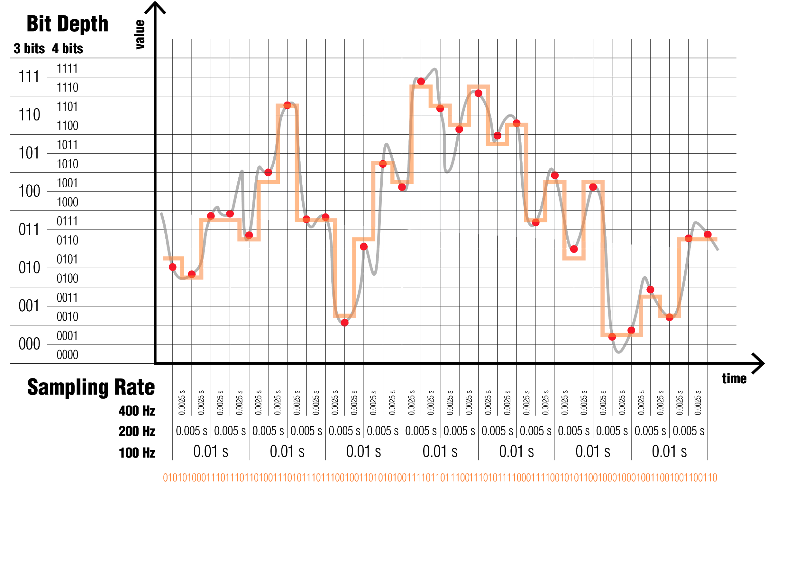

Représentation des entiers, des caractères, des images et des sons
==================================================================

Objectif
--------

- Comprendre le système et l’arithmétique binaire.

- Découvrir la représentation des nombres entiers, des caractères, des images et des sons.

- Comprendre le stockage et la manipulation des données.

- Appréhender l’importance de la redondance.

Accroche
--------

Au milieu du XIXe siècle, les fragments d’un papyrus vieux de plus 4000 ans découvert sur le site de Thèbes sont rassemblés par l’égyptologue écossais Henry Rhind. Aujourd’hui exposés au British Museum de Londres, les cinq mètres du document montrent que les égyptiens utilisaient une représentation binaire des nombres pour effectuer les opérations arithmétiques de base – addition, soustraction, multiplication et division – pour résoudre des problèmes d’algèbre et de géométrie.

Au milieu du XXe siècle, les difficultés liées à l’utilisation du système décimal dans les premiers calculateurs amène les chercheurs à exploiter cette ancienne notion que les multiplications et les divisions dans le système binaire se réalisent au moyen de simples additions et soustractions. L’informatique digitale, basée sur le système binaire, s’est imposée jusqu’à ce jour. 

Introduction
------------

Bases 10, 2, 8 et 16
--------------------

Notation des nombres entiers positifs ; complément à 2. 

Représentation des caractères
-----------------------------

Jeu de caractères ASCII et UTF.

Codage des couleurs
-------------------

Images matricielles

Numérisation
------------

La conversion d’une grandeur physique continue  – intensité sonore, température… – en données numériques manipulables par un ordinateur est appelée numérisation. Elle requiert un échantillonnage et une quantification/encodage. 

L’intervalle temporel auquel les mesures sont prises est la fréquence d’échantillonnage (sampling rate). 

Les limites pratiques d’un échantillonnage sont fixées par la fréquence de Nyquist, qui, de façon très simplifiée, indique que l’information découlant d’un processus dont la fréquence est deux fois supérieure à celle de l’échantillonnage sera perdue lors de la numérisation. 
Sachant que l’oreille humaine perçoit globalement les fréquences entre 20 et 20 kHz, une fréquence d’échantillonnage supérieure à 40 kHz permettra de restituer l’ensemble de l’information physiologiquement perceptible par l’oreille humaine, raison pour laquelle l’échantillonnage de la musique en qualité “CD” est réalisé à 44.1 kHz. Une fréquence d’échantillonnage supérieure ne générerait que plus d’information sans ajouter de valeur qualitative pour la plupart des auditeurs.  

La quantification de la valeur requiert de déterminer la précision (bit depth) de chaque échantillon, ce qui détermine le volume de données générées. 

Ici encore, plus on augmente la profondeur de l’encodage, plus la quantité d’information générée augmente, de même que la discrimination du signal, exprimée en amplitude (la différence entre l’intensité la plus faible et la plus élevée).

La distorsion découle d’un signal dont l’amplitude dépasse les capacités d’encodage du système. Dans ces conditions, un ajustement du gain d’entrée est nécessaire pour rester au plus proche des limites du système, sans les franchir. La numérisation d’un signal dont l’amplitude serait par trop réduite débouche sur un encodage qui contient moins d’information.

