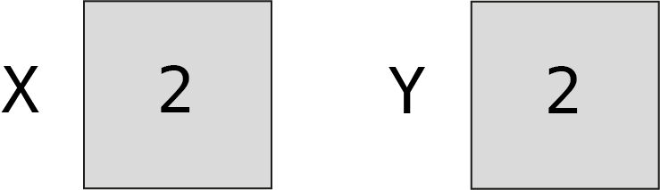
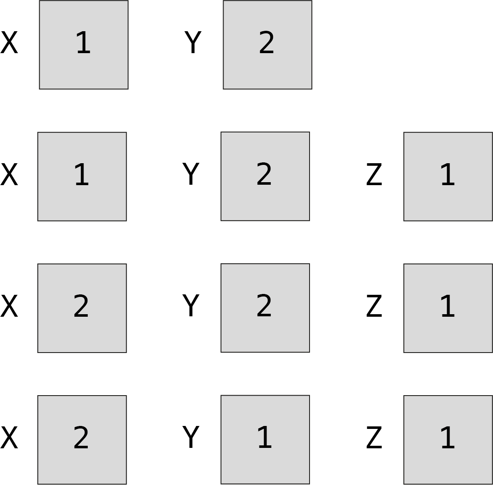

# Les algorithmes

La première question que l'on va se poser est la suivante : qu'est&#8209;ce qu'un {glo}`algo|algorithme` ? Est&#8209;ce la même chose qu'un programme informatique, ou s'agit&#8209;il d'autre chose ?

Un algorithme est en quelque sorte « une recette » que l’on peut suivre pour **<span style="color:rgb(89, 51, 209)">résoudre un problème</span>**. De&nbsp;nos&nbsp;jours, il existe énormément de problèmes que les algorithmes nous permettent de résoudre. Il existe des algorithmes pour calculer le trajet le plus rapide entre deux lieux ; d'autres algorithmes ont été imaginés pour détecter les visages dans nos photos ; une demande sur un moteur de recherche est analysée par de nombreux algorithmes afin de nous aider à mieux définir ce que l'on cherche ou afin de nous proposer des contenus publicitaires adaptés. 

Ce n'est pas l'algorithme qui est exécuté sur une machine pour nous donner une solution concrète pour tous ces problèmes. *<span style="color:rgb(13, 204, 166)">L’algorithme n’est donc pas un programme</span>*. L’algorithme décrit plutôt un « mode d’emploi », qui permet de réfléchir à un problème de manière générale et ensuite de créer un {glo}`programme|programme`. C'est le programme qui sera exécuté par un système informatique pour concrètement résoudre le problème. En d'autres mots, l'algorithme décrit l'idée humaine derrière la solution d'un problème, alors que c'est le programme qui permet à une machine de trouver une solution numérique dans des cas précis.

```{figure} media/Algoprog.png
---
alt: Différence entre un algorithme et un programme.
width: 70%
align: center
class: longcaption
---
**Différence entre un algorithme et un programme.** </br> Un algorithme doit être compréhensible par un humain, alors qu'un programme est écrit de façon à ce qu'il soit compréhensible par une machine.
```

## Résolution d'un problème par étapes

```{htmlonly}
Un mode d’emploi, ou une recette, décrit les **<span style="color:rgb(89, 51, 209)">étapes</span>** à suivre pour arriver à une solution. Dans le cas d'une recette de cuisine, la préparation des ingrédients, leur cuisson et leur présentation sont différentes étapes que l'on peut suivre pour réaliser un plat. Prenons un cas précis : *<span style="color:rgb(13, 204, 166)">faire une omelette</span>*. Pour chaque étape de la préparation de l’omelette, il faut prévoir une marche à suivre suffisamment détaillée, afin que la personne qui suit la recette arrive au résultat souhaité. Dans le cas de l’omelette, les opérations pourraient être (voir figure ci-dessous) : 
```
```{latexonly}
Un mode d’emploi, ou une recette, décrit les **<span style="color:rgb(89, 51, 209)">étapes</span>** à suivre pour arriver à une solution. Dans le cas d'une recette de cuisine, la préparation des ingrédients, leur cuisson et leur présentation sont différentes étapes que l'on peut suivre pour réaliser un plat. Prenons un cas précis : *<span style="color:rgb(13, 204, 166)">faire une omelette</span>*. Pour chaque étape de la préparation de l’omelette, il faut prévoir une marche à suivre suffisamment détaillée, afin que la personne qui suit la recette arrive au résultat souhaité. Dans le cas de l’omelette, les opérations pourraient être (voir la figure suivante) : 
```

1. Casser les œufs dans un bol. 
2. Mélanger les œufs jusqu’à obtenir un mélange homogène.
3. Cuire le mélange d’œufs dans une poêle à température moyenne.
4. Lorsque cuite, glisser l’omelette dans une assiette.

````{figure} media/Omelette.png 
---
alt: Un algorithme est un peu comme une recette de cuisine.
width: 100%
align: center
class: longcaption
---

**Un algorithme est un peu comme une recette de cuisine.** Cet exemple illustre les opérations à suivre pour la réalisation d’une omelette.&nbsp;&nbsp;&nbsp;&nbsp;&nbsp;&nbsp;

````

Dans le cas de la recette d'une omelette, nous avons décomposé la marche à suivre en étapes à réaliser dans un certain ordre. Il en est de même pour un algorithme. Pour résoudre un problème, il faut d'abord **<span style="color:rgb(89, 51, 209)">décomposer le problème en sous&#8209;problèmes</span>** que l'on *sait résoudre*. La solution de chaque sous&#8209;problème donne lieu à une étape qu'il faudra exécuter pour arriver à un résultat. Voici les sous&#8209;problèmes que certaines étapes ci&#8209;dessus permettent de résoudre. Afin d'extraire le contenu comestible de l'œuf, il faut casser les œufs. Pour que l'omelette ait une jolie couleur uniforme, il faut mélanger le jaune et le blanc d'œuf. Cette étape ne serait pas du tout pertinente si le problème que l'on essaie de résoudre est la préparation d'un œuf au plat. *<span style="color:rgb(13, 204, 166)">L’algorithme décrit donc toutes les opérations qu'il faut effectuer pour arriver à ce résultat</span>*. Nous allons ainsi définir l’algorithme comme **<span style="color:rgb(89, 51, 209)">une suite d’opérations qui permettent de résoudre un problème</span>**. 

Le langage utilisé pour écrire un programme doit être extrêmement précis, sans quoi une machine ne pourrait pas le comprendre. Nous avons vu qu'un algorithme n'a pas besoin d'être compris par une machine, mais seulement par les humains. Ainsi, le langage que l'on va utiliser pour exprimer un algorithme sera plus libre que celui utilisé pour coder un programme. Ce langage **peut varier d'une personne à l'autre** et se rapproche dans notre cas de la langue française, comme le montre cet exemple :


```{code-block}
Liste Nombres           # la variable Nombres contient une liste de nombres
n ← longueur(Nombres)   # la variable n contient le nombre d'éléments dans Nombres
i ← 1                   # la variable i contient 1 pour commencer
Résultat ← 0            # la variable Résultat contient 0 pour commencer

Répéter Pour i ← 1 à n  # i prend la valeur de 1, puis 2, puis 3, jusqu'à n    
    Résultat ← Résultat + Nombres[i]
                        # Résultat est incrémenté de l'i-ème élément de Nombres
Fin Répéter             # quand i vaut n l'algorithme se termine

Retourner Résultat      # la solution se trouve dans Résultat 
```

Dans cet algorithme on mentionne le terme *variable*. Pour rappel, les variables associent un nom (ou un identifiant) à une valeur. Par exemple, ci&#8209;dessus on va utiliser une variable que l'on va appeler `i` et qui va stocker pour commencer la valeur `1`. Le terme variable prend tout son sens dans l'opération *Répéter*, lorsque `i` contient à tour de rôle des valeurs allant de `1` à `n`, car à ce moment&#8209;là la valeur stockée dans `i` **varie**. 

```{htmlonly}
Pour&nbsp;mieux vous représenter une variable, imaginez un grand meuble avec des tiroirs (voir figure&nbsp;ci&#8209;dessous). Les variables sont les tiroirs. Chaque tiroir comporte une étiquette, c'est le nom de la variable, et c'est grâce à ce nom que l'on sait quel tiroir ouvrir et quelle valeur utiliser. Le tiroir est petit et ne peut contenir qu'une valeur. Donc `i` peut valoir `1`&nbsp;ou&nbsp;`2`, mais pas `1`&nbsp;et&nbsp;`2` à la fois. Par contre *i* pourrait contenir une liste qui contient les valeurs `[1, 2]`. Cependant, *i* ne peut contenir qu'une seule liste à la fois et pas par exemple deux listes `[1, 2]` et `[3, 4]`.
```
```{latexonly}
Pour&nbsp;mieux vous représenter une variable, imaginez un grand meuble avec des tiroirs (voir la figure suivante). Les variables sont les tiroirs. Chaque tiroir comporte une étiquette, c'est le nom de la variable, et c'est grâce à ce nom que l'on sait quel tiroir ouvrir et quelle valeur utiliser. Le tiroir est petit et ne peut contenir qu'une valeur. Donc `i` peut valoir `1`&nbsp;ou&nbsp;`2`, mais pas `1`&nbsp;et&nbsp;`2` à la fois. Par contre *i* pourrait contenir une liste qui contient les valeurs `[1, 2]`. Cependant, *i* ne peut contenir qu'une seule liste à la fois et pas par exemple deux listes `[1, 2]` et `[3, 4]`.
```


```{figure} media/Commode.png
---
alt: Une variable est un tiroir avec une étiquette.
width: 50%
align: center
class: longcaption
---

**Une variable est un tiroir avec une étiquette.** </br> Cela peut être utile de voir la variable comme un tiroir qui permet de stocker une valeur (contenu du tiroir) sous un nom (étiquette du tiroir). Attention, le tiroir est petit et ne peut contenir qu'une chose (valeur) à la fois. Deux tiroirs différents ne peuvent porter la même étiquette.

```

Lorsque l'on dit que `i ← 1`, ou que `i = 1` en Python, cela veut tout simplement dire que la variable `i` vaut maintenant `1`. Cette opération signifie que l'on va prendre le tiroir avec étiquette `i` dans la commode (s'il n'existe pas encore on va noter *i* sur l'étiquette d'un tiroir disponible) et on va mettre la valeur `1` dedans. Ce qui se trouvait dans le tiroir avant la valeur `1` ne s'y trouve plus, on dit que *la valeur précédente est écrasée*. A&nbsp;chaque fois que nous utilisons `i` dans l'algorithme ou dans le code, nous faisons référence à la valeur stockée dans le tiroir.


````{exercise} Algorithme mystère

Lisez bien l'algorithme présenté ci&#8209;dessus. Quel problème cet algorithme permet&#8209;il de résoudre ? Il est plus facile de répondre à cette question, si l'on imagine que la liste *Nombres* contient par exemple les nombres `4`, `5` et `6` (correspond à `[4, 5, 6]` en Python).

````

``````{htmlonly} 
`````{solution}
````{dropdown} <span style="color:grey">Cliquer ici pour voir la réponse</span>
:animate: fade-in-slide-down

Pour répondre à cette problématique il faut se poser la question suivante : que contient la variable `Résultat` à la fin de l'algorithme ? 

Pour commencer, la variable `Résultat` vaut&nbsp;0. En&nbsp;effet, l'opération `Résultat ← 0` *<span style="color:rgb(13, 204, 166)">initialise</span>* `Résultat` à&nbsp;0. Initialiser une variable veut dire qu'on lui assigne une toute première valeur (une valeur initiale). Dans le cas de `Nombres` qui contiendrait les nombres `4`, `5` et&nbsp;`6`, après le premier passage dans la boucle `Répéter`, `Résultat` vaut&nbsp;`4`. En&nbsp;effet, pour commencer `i` vaut&nbsp;`1` et donc `Nombres[i]` vaut `Nombres[1]`. `Nombres[1]` correspond au premier élément de la liste *Nombres* et vaut&nbsp;`4`. L'opération `Résultat ← Résultat + Nombres[i]`, additionne alors 0 et&nbsp;`4` (`Résultat + Nombres[i]`) et l'opérateur `←` stocke cette valeur 4 dans la variable `Résultat`.

Au deuxième passage dans la boucle, `i` vaut `2`. On additionne à nouveau `Résultat`, qui maintenant vaut `4`, au 2ème élément de *Nombres*, qui vaut 5. Après ce deuxième passage de la boucle, `Résultat` contient&nbsp;`9` (`4`&nbsp;+&nbsp;`5`). Finalement, au troisième et dernier passage de la boucle, on additionne cette nouvelle valeur de `Résultat` (ou&nbsp;`9`) avec le 3ème élément de Nombres, qui vaut&nbsp;`6`. Il s'agit du dernier passage de la boucle, parce que lors de ce passage de la boucle `i` atteint la longueur de la liste `Nombres` (ou&nbsp;`3`). À la fin de l'algorithme, `Résultat` vaut ainsi `15`.

Il est plus facile de se représenter ces valeurs sous forme de tableau :

```{image} media/Solution0.png
---
alt: Valeurs des variables de l'algorithme pour le cas où `Nombres` contient `1`, `2` et&nbsp;`3`.
width: 50%
align: left
---

```

Cet algorithme permet de calculer la somme des nombres contenus dans une liste (ici la liste `Nombres`).

````
`````
``````
`````{latexonly} 
````{solution}

Pour répondre à cette problématique il faut se poser la question suivante : que contient la variable `Résultat` à la fin de l'algorithme ? 

Pour commencer, la variable `Résultat` vaut&nbsp;0. En&nbsp;effet, l'opération `Résultat ← 0` *<span style="color:rgb(13, 204, 166)">initialise</span>* `Résultat` à&nbsp;0. Initialiser une variable veut dire qu'on lui assigne une toute première valeur (une valeur initiale). Dans le cas de `Nombres` qui contiendrait les nombres `4`, `5` et&nbsp;`6`, après le premier passage dans la boucle `Répéter`, `Résultat` vaut&nbsp;`4`. En&nbsp;effet, pour commencer `i` vaut&nbsp;`1` et donc `Nombres[i]` vaut `Nombres[1]`. `Nombres[1]` correspond au premier élément de la liste *Nombres* et vaut&nbsp;`4`. L'opération `Résultat ← Résultat + Nombres[i]`, additionne alors 0 et&nbsp;`4` (`Résultat + Nombres[i]`) et l'opérateur `←` stocke cette valeur 4 dans la variable `Résultat`.

Au deuxième passage dans la boucle, `i` vaut `2`. On additionne à nouveau `Résultat`, qui maintenant vaut `4`, au 2ème élément de *Nombres*, qui vaut 5. Après ce deuxième passage de la boucle, `Résultat` contient&nbsp;`9` (`4`&nbsp;+&nbsp;`5`). Finalement, au troisième et dernier passage de la boucle, on additionne cette nouvelle valeur de `Résultat` (ou&nbsp;`9`) avec le 3ème élément de Nombres, qui vaut&nbsp;`6`. Il s'agit du dernier passage de la boucle, parce que lors de ce passage de la boucle `i` atteint la longueur de la liste `Nombres` (ou&nbsp;`3`). À la fin de l'algorithme, `Résultat` vaut ainsi `15`.

Il est plus facile de se représenter ces valeurs sous forme de tableau :

```{image} media/Solution0.png
---
alt: Valeurs des variables de l'algorithme pour le cas où `Nombres` contient `1`, `2` et&nbsp;`3`.
width: 50%
align: left
---

```

Cet algorithme permet de calculer la somme des nombres contenus dans une liste (ici la liste `Nombres`).

````
`````


Pour comprendre ce que fait l'algorithme ci&#8209;dessus, il faut se mettre à la place de la machine. On parle de *<span style="color:rgb(13, 204, 166)">simuler</span>* un algorithme, de faire comme si l'algorithme s'exécutait sur une machine. Pour que ce soit plus concret, on peut imaginer des valeurs fictives pour les variables telles que `Nombres`. Dans la vie réelle, `Nombres` pourra contenir tous les nombres possibles, mais cela ne nous aide pas à comprendre. On imagine alors des nombres précis que `Nombres` pourrait contenir, comme par exemple `4`, `5` et `6`. Lorsqu'on exécute les opérations de l'algorithme l'une après l'autre, avec des valeurs concrètes, on comprend mieux quel effet ces opérations ont sur les valeurs contenues dans les variables. La simulation de l'algorithme nous permet de saisir **<span style="color:rgb(89, 51, 209)">les calculs</span>** réalisés par cet algorithme, ici une simple somme.


````{exercise} Machine mystère

Quel objet du quotidien (autre que la calculatrice) fait des additions et utilise cet algorithme pour résoudre un problème ?  

Il y a-t-il des avantages à automatiser cette tâche, à demander à une machine de le faire à la place d'un humain ?

Il y a-t-il des désavantages à automatiser cette tâche ?

````

``````{htmlonly}
`````{solution}
````{dropdown} <span style="color:grey">Cliquer ici pour voir la réponse</span>
:animate: fade-in-slide-down

Une caisse enregistreuse ! La caisse enregistreuse calcule la somme des prix des produits contenus dans un panier (une liste de courses) et nous donne le prix total à payer. Il s'agit d'un exemple parmi d'autres.

Au niveau des avantages, la caisse enregistreuse fait bien moins d'erreurs qu'un humain, elle ne se fatigue pas, elle ne se plaint pas et elle est bien plus rapide.

Au niveau des désavantages, l'automatisation est en général énergivore (avec une empreinte environnementale significative) et provoque une certaine « obsolescence&nbsp;des&nbsp;humains » en les remplaçant dans leur travail pour un moindre coût financier.
````
`````
``````
`````{latexonly}
````{solution}
Une caisse enregistreuse ! La caisse enregistreuse calcule la somme des prix des produits contenus dans un panier (une liste de courses) et nous donne le prix total à payer. Il s'agit d'un exemple parmi d'autres.

Au niveau des avantages, la caisse enregistreuse fait bien moins d'erreurs qu'un humain, elle ne se fatigue pas, elle ne se plaint pas et elle est bien plus rapide.

Au niveau des désavantages, l'automatisation est en général énergivore (avec une empreinte environnementale significative) et provoque une certaine « obsolescence&nbsp;des&nbsp;humains » en les remplaçant dans leur travail pour un moindre coût financier.
````
`````


« Chaque étape d’un algorithme doit être définie précisément » (Knuth, 2011). En&nbsp;effet, si on ne décompose pas suffisamment la solution du problème, on peut se retrouver face à une recette inutile, par exemple : prendre des œufs et cuire l'omelette. Cette recette ne nous dit pas vraiment comment procéder pour arriver à faire une omelette...


````{related} 

Lorsqu'on sauve un fichier dans un ordinateur, il est stocké dans une mémoire. La mémoire d'un ordinateur pourrait être comparée a une grande commode de tiroirs étiquetés. Ainsi, lorsqu'un fichier est stocké en mémoire, la taille du fichier correspond au nombre de tiroirs qu'il occupe. Si&nbsp;c'est un fichier de texte par exemple, on peut imaginer qu'un tiroir contient un caractère simple (un octet). Si&nbsp;c'est une image en couleur, un&nbsp;pixel de cette image occuperait 3 tiroirs (un&nbsp;octet par&nbsp;couleur rouge, vert et bleu).

````

## Les ingrédients d’un algorithme

L’objectif d’un algorithme est de décrire la solution à un problème donné. Concrètement, pour résoudre un problème, l’algorithme va utiliser des **<span style="color:rgb(89, 51, 209)">données</span>** qu’il reçoit ***<span style="color:rgb(13, 204, 166)">en entrée</span>*** et va retourner un **<span style="color:rgb(89, 51, 209)">résultat</span>** ***<span style="color:rgb(13, 204, 166)">en sortie</span>***. Le&nbsp;résultat en sortie va être la solution au problème sur la base des calculs effectués sur les données en entrée. Un exemple d'algorithme qui détecte les visages reçoit en {glo}`input|entrée` une image (ce sont les {glo}`data|données`) et retourne en sortie «oui» ou «non» (c'est le résultat) selon si l’image contient un visage ou pas. Les données en entrée d’un algorithme qui traduit pourraient être le mot à traduire et un dictionnaire. L’algorithme traiterait ces données pour retourner en {glo}`output|sortie` la traduction du mot dans une autre langue.

Entre l’entrée et la sortie, l’algorithme précise les **<span style="color:rgb(89, 51, 209)">opérations</span>** qu'il faut exécuter sur les données en entrée. Les opérations que l’on peut demander à un humain sont très différentes de celles que l'on peut demander à une machine. On peut demander à un humain de casser des œufs, mais un ordinateur ne peut pas comprendre et réaliser cette opération. Par contre on peut demander à un ordinateur de se souvenir de milliers de valeurs stockées dans des variables et de comparer les valeurs de toutes ces variables entre elles sans faire d'erreur. Pour résoudre un problème, l'humain cherche une solution sur la base des données à disposition, et la décrit sous la forme d'opérations dans un algorithme. Dans un deuxième temps, ces opérations sont retranscrites en une suite d’instructions élémentaires dans un programme informatique, exécutable par une machine. Dans un troisième temps on vérifie si la solution obtenue est correcte, et si besoin on corrige l'algorithme.

Le dernier ingrédient de l'algorithme, mais tout aussi important, est l’**<span style="color:rgb(89, 51, 209)">ordre des opérations</span>**. Dans l’exemple de l’omelette, on ne peut cuire les œufs avant de les avoir cassés, sinon on obtiendrait des œufs durs. De&nbsp;même, l’ordinateur a besoin de recevoir les instructions élémentaires à exécuter dans le bon ordre. Pour&nbsp;résumer, les ingrédients pour concevoir un algorithme sont les suivants : 

1. Des données en entrée.
2. Des opérations, dans un ordre précis.
3. Un résultat en sortie.


```{figure} media/Diagramme_algorithme.png
---
alt: Schéma des ingrédients d'un algorithme.
width: 70%
align: center
class: longcaption
---
**Schéma des ingrédients d'un algorithme.** Un algorithme reçoit des données en entrée, qu'il traite selon des opérations dans un ordre précis, dans le but de produire un résultat en sortie. Ce résultat représente la solution à un problème donné.

```

Notez que les opérations d’un algorithme doivent être précises et ***<span style="color:rgb(13, 204, 166)">non&nbsp;ambigües</span>***. Il doit y avoir une seule interprétation possible de l’algorithme. Une recette de cuisine ne serait pas assez précise pour une machine, par exemple, il faudrait indiquer clairement ce que température moyenne et mélange homogène veulent dire. Les êtres humains peuvent interpréter, deviner et supposer, mais pas les machines (pour l'instant).

````{didyouknow} Jeu d'instructions

Le jeu d’instructions élémentaires dépend du système informatique sur lequel elles s'exécutent. Nous avons vu qu'un algorithme spécifie des opérations à suivre dans un ordre donné afin de résoudre un problème. Ces opérations sont transcrites sous la forme d'un programme informatique en instructions élémentaires exécutables par une machine, qui peuvent être très différentes d’une machine à l’autre pour un même algorithme. Ainsi, l’algorithmique permet d’aborder la résolution de problèmes de manière générale, sans se préoccuper des détails d’implémentation sur différents systèmes. 

````


````{exercise} Ingrédients de l'algorithme mystère
A quoi correspondent « les ingrédients d’un algorithme » dans l’exemple de la recette de l’omelette ?
````

`````{htmlonly}
````{solution}
```{dropdown} <span style="color:grey">Cliquer ici pour voir la réponse</span>
:animate: fade-in-slide-down

 Les données en entrée sont les œufs, les opérations sont les étapes 1 à 4 de la recette et finalement le résultat en sortie est l’omelette. On peut considérer le matériel culinaire (bol, fourchette, poêle, spatule) comme du matériel informatique à notre disposition, capable de traiter des données (œufs). En&nbsp;effet, on peut cuire plein d’autres aliments dans une poêle.
```
````
`````
````{latexonly}
```{solution}
 Les données en entrée sont les œufs, les opérations sont les étapes 1 à 4 de la recette et finalement le résultat en sortie est l’omelette. On peut considérer le matériel culinaire (bol, fourchette, poêle, spatule) comme du matériel informatique à notre disposition, capable de traiter des données (œufs). En&nbsp;effet, on peut cuire plein d’autres aliments dans une poêle.
```
````


````{exercise} Échange de deux variables

Écrire un algorithme qui échange les valeurs de deux variables. Par exemple, si la première variable `X` contient `1` et la deuxième variable `Y` contient `2`, à la fin de l'algorithme `X` contient `2` et `Y` contient `1`. Pour rappel, une variable peut contenir une seule valeur à la fois. 

Conseil : cela aide de se mettre à la place de la machine et de représenter le contenu de chaque variable sous la forme d'un tiroir, en la dessinant avec son étiquette et son contenu *après chaque opération de votre algorithme*.

````

``````{htmlonly}
`````{solution}
````{dropdown} <span style="color:grey">Cliquer ici pour voir la réponse</span>
:animate: fade-in-slide-down

Pour commencer, la variable&nbsp;`X` contient&nbsp;`1` et la variable&nbsp;`Y` contient&nbsp;`2`. Une solution naïve consisterait à écrire l’algorithme suivant :

```
X ← Y
Y ← X
```

Cet algorithme met la valeur de&nbsp;`Y` dans&nbsp;`X`, puis la valeur de&nbsp;`X` dans&nbsp;`Y`. Représentons maintenant ces deux variables par des tiroirs étiquetés. Le premier tiroir s’appelle&nbsp;`X` et contient&nbsp;`1`, le deuxième s'appelle&nbsp;`Y` et contient&nbsp;`2` : 

 &nbsp;  

Après la première opération où on met la valeur de&nbsp;`Y` dans la variable&nbsp;`X` on se retrouve avec cette situation, où la valeur contenue dans&nbsp;`Y` écrase la valeur qui était contenue dans&nbsp;`X` :

 &nbsp;   

En&nbsp;effet, un tiroir ne peut contenir qu'une seule valeur ! Nous n’avons donc plus accès à la valeur qui était stockée dans la variable&nbsp;`X` avant d'y mettre celle de&nbsp;`Y`. Pour remédier à ce problème, il faut penser à utiliser une variable temporaire&nbsp;`Z` qui permet de se souvenir de la valeur initiale de&nbsp;`X`. 

Un algorithme correct pour échanger les valeurs de deux variables est :

```
Z ← X
X ← Y
Y ← Z
```

Si on dessine l’état des variables après chacune de ces opérations dans des tiroirs, voici ce qu’on obtient :

 &nbsp;  

Nous avons donc la confirmation que la solution obtenue résout correctement notre problème d'échange des valeurs de deux variables.

````
`````
``````
`````{latexonly}
````{solution}

Pour commencer, la variable&nbsp;`X` contient&nbsp;`1` et la variable&nbsp;`Y` contient&nbsp;`2`. Une solution naïve consisterait à écrire l’algorithme suivant :

```
X ← Y
Y ← X
```

Cet algorithme met la valeur de&nbsp;`Y` dans&nbsp;`X`, puis la valeur de&nbsp;`X` dans&nbsp;`Y`. Représentons maintenant ces deux variables par des tiroirs étiquetés. Le premier tiroir s’appelle&nbsp;`X` et contient&nbsp;`1`, le deuxième s'appelle&nbsp;`Y` et contient&nbsp;`2` : 

 &nbsp;  

Après la première opération où on met la valeur de&nbsp;`Y` dans la variable&nbsp;`X` on se retrouve avec cette situation, où la valeur contenue dans&nbsp;`Y` écrase la valeur qui était contenue dans&nbsp;`X` :

 &nbsp;   

En&nbsp;effet, un tiroir ne peut contenir qu'une seule valeur ! Nous n’avons donc plus accès à la valeur qui était stockée dans la variable&nbsp;`X` avant d'y mettre celle de&nbsp;`Y`. Pour remédier à ce problème, il faut penser à utiliser une variable temporaire&nbsp;`Z` qui permet de se souvenir de la valeur initiale de&nbsp;`X`. 

Un algorithme correct pour échanger les valeurs de deux variables est :

```
Z ← X
X ← Y
Y ← Z
```

Si on dessine l’état des variables après chacune de ces opérations dans des tiroirs, voici ce qu’on obtient :

 &nbsp;  

Nous avons donc la confirmation que la solution obtenue résout correctement notre problème d'échange des valeurs de deux variables.

````
`````

## Exercices

````{exercise} Forme mystère

L’algorithme suivant contrôle un crayon. Quelle forme dessine-t-il ?
```
Répéter 8 fois :
    Avance de 2 cm
    Tourne à droite de 60°
```
````


````{exercise} Nombre minimum

Ecrire un algorithme qui permet de trouver le plus petit nombre d’une liste. Penser à décomposer la solution en différentes étapes.

Appliquer l'algorithme à la liste `[3, 6, 2, 8, 1, 9, 7, 5]`.

L'algorithme trouve-t-il la bonne solution ? Si non, modifier l'algorithme afin qu’il trouve la bonne solution.

````


````{exercise} Le prochain anniversaire

On souhaite déterminer l’élève dont la date d’anniversaire est la plus proche de la date d’aujourd’hui, dans le futur. Ecrire un algorithme (en langage familier) qui permet de trouver cet élève. Penser à décomposer le problème en sous&#8209;problèmes. 

Comparer la solution trouvée à celle de la personne à côté de vous. Avez&#8209;vous procédé de la même manière ? Si non, expliquer vos raisonnements.

Un ordinateur peut&#8209;il réaliser les opérations décrites par cet algorithme ?

````


````{exercise} Échange de trois variables

Écrire un algorithme qui effectue la permutation circulaire des variables `X`, `Y` et `Z` : à la fin de l’algorithme, `X` contient la valeur de `Z`, `Y` la valeur de `X` et `Z` la valeur de `Y`. Pour rappel, une variable ne peut contenir qu'une valeur à la fois.

Conseil : il est très utile de se mettre à la place de la machine et de représenter le contenu de chaque variable sous la forme d'un tiroir, en dessinant le tiroir avec son étiquette et son contenu *après chaque opération de l'algorithme*. Est&#8209;ce que votre algorithme donne le résultat attendu ? Si non, modifier l'algorithme pour qu’il résolve le problème correctement.

````


````{exercise} Affectations

Quel est le résultat de la suite des trois affectations suivantes ? On parle d'*affectation* lorsqu'on attribue une valeur à une variable.

```
X ← X + Y
Y ← X – Y
X ← X – Y
```

Vérifier la solution que vous avez trouvée en représentant chaque variable avec une valeur fictive. Suivre les opérations dans l’ordre et dessiner le contenu des variables après chaque étape.

````


````{eval}

Vérifiez votre compréhension :

1. Je connais la différence entre un algorithme et un programme.

2. Je sais simuler un algorithme : je représente les valeurs des variables après chaque opération de l'algorithme.

3. Je sais formuler un algorithme : je décompose le problème en sous&#8209;problèmes et je décris les opérations qui permettent de résoudre chaque sous&#8209;problème.

````


