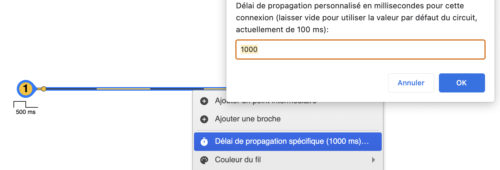

# TP Additionneur

Dans cette section, nous allons explorer d'abord la porte **ou exclusif** (OU-X), qui nous sert à construire un **additionneur simple**. Nous modifions l'additionneur simple pour en créer un **additionneur complet** qui prend en compte la retenue. Cet additionneur 1 bit nous sert à construire des circuits pour créer d'autres opérations telles que :

- addition
- soustraction
- incrémentation
- décrémentation

## Clock et fréquence

L'entrée horloge (clock) produit un signal qui alterne entre 0 et 1. L'horloge ci-dessous a une période de 500 ms. Le délai de transmission a été mis à 1000 ms. Ceci fait apparaitre 2 cycles du signal (en jaune). On peut donc visualiser la fréquence du signal qui est de 2 Hz.

- Ajoutez une deuxième horloge avec une période de 250 ms.
- Visualisez cette fréquence avec un délai de propagation de 1000 ms.
- Quelle est sa fréquence ? Mettez-la comme étiquette.
- Faites la même chose avec une troisième horloge qui a une période de 100 ms.

```{logic}
:ref: clock
:height: 300
:showonly: clock out
{
  "v": 4,
  "in": [
    {"type": "clock", "pos": [40, 30], "id": 5, "period": 500}
  ],
  "out": [
    {"pos": [450, 30], "id": 6, "name": "2 Hz"}
  ],
  "wires": [[5, 6, {"propagationDelay": 1000}]]
}
```

**Rappel** : pour choisir le délai de propagation, cliquez avec le bouton droit sur le fil et sélectionnez le menu contextuel *Délai de propagation spécifique...*. Mettez-le à 1000.



## Porte OU-X

Une porte OU-X (ou exclusif) avec 2 entrées donne une sortie 1 si **exactement une** des entrées est 1.

- Montrez la table de vérité pour la porte OU-X.
- Ajoutez 3 portes OU-X et mettez les entrées à 01, 10, et 11
- Créez une porte OU-X avec 3 entrées et observez son comportement

Comment se comporte une porte OU-X avec plus que 2 entrées ?

```{logic}
:ref: or
:height: 400
:showonly: in out xor
{
  "v": 4,
  "in": [
    {"pos": [40, 60], "id": 7, "val": 0},
    {"pos": [40, 80], "id": 8, "val": 0},
    {"pos": [270, 50], "id": 16, "val": 0},
    {"pos": [270, 90], "id": 17, "val": 0},
    {"pos": [270, 130], "id": 18, "val": 0}
  ],
  "out": [
    {"pos": [180, 70], "id": 9},
    {"pos": [510, 90], "id": 19}
  ],
  "gates": [
    {"type": "XOR", "pos": [110, 70], "in": [4, 5], "out": 6}
  ],
  "labels": [
    {"pos": [110, 20], "text": "table de vérité"},
    {"pos": [390, 20], "text": "porte OU-X avec 3 entrées"}
  ],
  "wires": [[7, 4], [8, 5], [6, 9]]
}
```

## Construire un OU-X

Comment peut-on construire un circuit OU-X avec des portes de base (NON, OU, ET) ?
Regardons d'abord la table de vérité.

| a | b | OU-X |
|---|---|:----:|
| 0 | 0 |   0  |
| 0 | 1 |   1  |
| 1 | 0 |   1  |
| 1 | 1 |   0  |

Le circuit ci-dessous représente une porte OU exclusive (OU-X). Mais il y a multiples façons de créer un circuit logique spécifique à partir des éléments de base.

Créez une deuxième façon pour obtenir une porte OU exclusive en partant de l'observation :

`(a and not b) or (b and not a)`

Utilisez donc :

- 2 portes NON
- 2 portes ET
- 1 porte OU

```{logic}
:ref: add
:height: 400
:showonly: in out not and or
{
  "v": 4,
  "in": [
    {"pos": [40, 30], "id": 0, "val": 0},
    {"pos": [40, 110], "id": 47, "val": 0}
  ],
  "out": [
    {"pos": [430, 50], "id": 59}
  ],
  "gates": [
    {"type": "OR", "pos": [170, 40], "in": [48, 49], "out": 50},
    {"type": "AND", "pos": [170, 100], "in": [51, 52], "out": 53},
    {"type": "NOT", "pos": [250, 100], "in": 54, "out": 55},
    {"type": "AND", "pos": [360, 50], "in": [56, 57], "out": 58}
  ],
  "wires": [[0, 48], [47, 49], [0, 51], [47, 52], [53, 54], [50, 56], [55, 57], [58, 59]]
}
```

## Détecteur de parité

Une porte ou exclusif est un détecteur de parité (pair/impair). La sortie d'une porte ou exclusif est 1 si le nombre des entrées actives est impair.

Ajoutez encore 6 portes OU-X et complétez la table de vérité pour les 8 combinaisons possibles:

- pair : 000, 011, 101, 110
- impair : 001, 010, 100, 111

```{logic}
:ref: xor3
:height: 400
:showonly: in out xor3
{
  "v": 4,
  "in": [
    {"pos": [50, 60], "id": 23, "val": 0},
    {"pos": [50, 80], "id": 24, "val": 0},
    {"pos": [50, 100], "id": 25, "val": 0},
    {"pos": [310, 60], "id": 33, "val": 1},
    {"pos": [310, 80], "id": 34, "val": 0},
    {"pos": [310, 100], "id": 35, "val": 0}
  ],
  "out": [
    {"pos": [210, 80], "id": 28},
    {"pos": [470, 80], "id": 36}
  ],
  "gates": [
    {"type": "XOR3", "pos": [130, 80], "in": [19, 20, 21], "out": 22},
    {"type": "XOR3", "pos": [390, 80], "in": [29, 30, 31], "out": 32}
  ],
  "labels": [
    {"pos": [110, 20], "text": "entrée pair"},
    {"pos": [390, 20], "text": "entrée impair"}
  ],
  "wires": [[23, 19], [24, 20], [25, 21], [22, 28], [33, 29], [34, 30], [35, 31], [32, 36]]
}
```

Pour détecter si un nombre d'entrées est pair, il suffit d'ajouter un NON à la sortie du OU-X. On appelle ce circuit un NON-OU-X.

## Multiples commutateurs

La porte OU-X permet d'allumer et éteindre une lampe avec des commutateurs multiples.

Dans le schéma ci-dessous, on peut allumer la lumière dans une pièce à partir de la porte d'entrée et de la cuisine.

Ajoutez un circuit pour qu'on puisse également l'allumer depuis la chambre.

```{logic}
:ref: xor
:height: 500
:showonly: in out not and or xor label.rect
{
  "v": 3,
  "labels": [{"type": "rect", "pos": [290, 120], "w": 300, "h": 200, "color": "yellow", "strokeWidth": 2}],
  "in": [
    {"pos": [100, 150], "id": 9, "name": "entrée", "val": 0},
    {"pos": [290, 250], "orient": "n", "id": 14, "name": "chambre", "val": 0},
    {"pos": [470, 120], "orient": "w", "id": 15, "name": "cuisine", "val": 0}
  ],
  "out": [{"type": "bar", "pos": [300, 40], "id": 10, "display": "px", "color": "yellow"}],
  "gates": [{"type": "XOR", "pos": [220, 90], "orient": "n", "in": [11, 12], "out": 13}],
  "wires": [[13, 10], [9, 11], [15, 12]]
}
```

## Addition binaire

Nous avons maintenant tous les éléments pour construire un additionneur binaire. Rappelons-nous que l'addition binaire est très simple.

| A | B | A+B | C | S |
|---|---|:---:|---|---|
| 0 | 0 |  0  | 0 | 0 |
| 0 | 1 |  1  | 0 | 1 |
| 1 | 0 |  1  | 0 | 1 |
| 1 | 1 |  2  | 1 | 0 |

Le résultat `A+B` peut être 0, 1 ou 2.  Nous avons besoin de deux bits pour représenter le résultat :

- le bit de somme `S`
- le bit de retenue `C` (*carry* en anglais)

En regardant la table de vérité, on constate que :

- la somme `S` est exprimée par la fonction OU-X
- la retenue `C` est exprimée par la fonction ET

Vous trouvez le circuit ci-dessous à droite. Vérifiez sa fonction en cliquant sur ses entrées.

Ajoutez encore 3 demi-additionneurs et montrez la table de vérité pour les 4 conditions d'entrée : 00, 01, 10, 11.

```{logic}
:ref: add
:height: 450
:showonly: in out and xor halfadder
{
  "v": 4,
  "in": [
    {"pos": [370, 270], "id": 0, "name": "A", "val": 0},
    {"pos": [370, 320], "id": 1, "name": "B", "val": 0},
    {"pos": [50, 60], "id": 18, "name": "A", "val": 0},
    {"pos": [50, 100], "id": 19, "name": "B", "val": 0}
  ],
  "out": [
    {"pos": [550, 280], "id": 8, "name": "S"},
    {"pos": [550, 340], "ref": "c", "id": 9, "name": "C"},
    {"pos": [190, 60], "id": 20, "name": "S (somme)"},
    {"pos": [190, 100], "id": 21, "name": "C (retenue)"}
  ],
  "gates": [
    {"type": "XOR", "pos": [480, 280], "in": [2, 3], "out": 4},
    {"type": "AND", "pos": [480, 340], "in": [5, 6], "out": 7}
  ],
  "components": [
    {"type": "halfadder", "pos": [120, 80], "in": [10, 11], "out": [12, 13]}
  ],
  "labels": [
    {"pos": [100, 20], "text": "table de vérité"}
  ],
  "wires": [[0, 2], [0, 5], [1, 3], [1, 6], [4, 8], [7, 9], [18, 10], [19, 11], [12, 20], [13, 21]]
}
```

## Additionneur complet

Dans le cas général de l'addition, nous n'additionnons pas deux bits, mais deux nombres à plusieurs bits. Voici l'addition en colonne de deux nombres 4 bits (3+11=14).

```text
 0011
+1011
-----
 1110
 ```

 Pour être explicite, nous introduisons une ligne supplémentaire qui représente la retenue (C = carry).

```text
 0110 (retenue)
 0011
+1011
-----
 1110
 ```

L'additionneur de 2 bits de la section précédente n'est plus suffisant. Pour le cas général, nous avons besoin d'un additionneur qui additionne 3 bits. Il faut tenir compte de la retenue (`Cin`), qu'il faut inclure dans l'addition. Voici donc la table de vérité pour un additionneur complet.

| Cin | A | B |Cin+A+B| Cout | S |
|:---:|:-:|:-:|:-----:|:----:|:-:|
| 0   | 0 | 0 | 0     |   0  | 0 |
| 0   | 0 | 1 | 1     |   0  | 1 |
| 0   | 1 | 0 | 1     |   0  | 1 |
| 0   | 1 | 1 | 2     |   1  | 0 |
| 1   | 0 | 0 | 1     |   0  | 1 |
| 1   | 0 | 1 | 2     |   1  | 0 |
| 1   | 1 | 0 | 2     |   1  | 0 |
| 1   | 1 | 1 | 3     |   1  | 1 |

Regardez les colonnes et essayez de comprendre avec quelles portes on pourrait le construire.
Vous constatez que la colonne `S` représente la parité. On pourra donc la construire avec des portes OU-X.

- Ajoutez les deux fils qui manquent à l'entrée de la porte ET pour que le circuit produise le signal `Cout` et se comporte comme un additionneur complet.
- Ajoutez des entrées et sorties au bloc de l'additionneur complet et vérifiez son fonctionnement.

```{logic}
:ref: adder
:height: 450
:showonly: in out and or adder
{
  "v": 4,
  "in": [
    {"pos": [70, 40], "id": 0, "name": "A", "val": 0},
    {"pos": [70, 90], "id": 1, "name": "B", "val": 0},
    {"pos": [70, 140], "id": 2, "name": "Cin", "val": 0}
  ],
  "out": [
    {"pos": [420, 60], "id": 7, "name": "S"},
    {"pos": [420, 130], "id": 26, "name": "Cout"}
  ],
  "gates": [
    {"type": "AND", "pos": [270, 120], "in": [8, 9], "out": 10},
    {"type": "AND", "pos": [220, 170], "in": [14, 15], "out": 16},
    {"type": "XOR", "pos": [170, 50], "in": [17, 18], "out": 19},
    {"type": "XOR", "pos": [290, 60], "in": [20, 21], "out": 22},
    {"type": "OR", "pos": [350, 130], "in": [23, 24], "out": 25}
  ],
  "components": [
    {"type": "adder", "pos": [140, 310], "orient": "n", "in": [27, 28, 29], "out": [30, 31]}
  ],
  "wires": [[0, 17], [1, 18], [19, 20], [2, 21], [22, 7], [19, 8], [10, 23], [16, 24], [25, 26], [2, 9]]
}
```

## Additionneur 4 bits

Pour additionner deux nombres 4-bits (quartets) nous avons besoin de 4 additionneurs complets.
Chaque sortie `Cout` est liée à la l'entrée `Cin` de l'additionneur suivant.

Pour additionner **a** et **b** vous devez additionner les bits correspondants: a0+b0, a1+b1, etc.

- Ajoutez les circuits manquants pour additionner deux nombres 4-bits.
- Montrez l'addition de 7+5 dont le résultat devrait être 12.

```{logic}
:ref: add2
:height: 500
:showonly: adder
{
  "v": 4,
  "in": [
    {"type": "nibble", "pos": [50, 160], "id": [37, 38, 39, 40], "val": [1, 0, 1, 0], "name": "b"},
    {"type": "nibble", "pos": [50, 290], "id": [74, 75, 76, 77], "val": [0, 1, 1, 0], "name": "a"}
  ],
  "out": [
    {"type": "nibble-display", "pos": [430, 180], "id": [41, 42, 43, 44], "name": "s"},
    {"type": "nibble-display", "pos": [170, 160], "id": [53, 54, 55, 56]},
    {"type": "nibble-display", "pos": [170, 290], "id": [78, 79, 80, 81]}
  ],
  "components": [
    {"type": "adder", "pos": [320, 170], "orient": "n", "in": [25, 26, 27], "out": [28, 29]},
    {"type": "adder", "pos": [320, 70], "orient": "n", "in": [30, 31, 32], "out": [33, 34]}
  ],
  "wires": [[34, 27], [37, 31], [38, 26], [33, 41], [28, 42], [37, 53], [38, 54], [39, 55], [40, 56], [74, 78], [75, 79], [76, 80], [77, 81], [74, 30], [75, 25]]
}
```

## Incrémenter (`i++`)

Additionner 1 à un nombre binaire est une opération très fréquente. Elle est utilisée pour incrémenter le compteur de programme `pc` (program counter), pour pointer à la prochaine instruction.

Complétez le circuit pour incrémenter la variable `i`.
Dans beaucoup de langages de programmation, une variable incrémentée est désignée par `i++`.  
En Python nous écrivons ``i = i + 1``.

D'ailleurs le nom du langage de programmation C++ est une référence à cet opérateur d'incrémentation.

```{logic}
:ref: inc
:height: 400
:showonly: in out in.nibble out.nibble-display adder
{
  "v": 4,
  "in": [
    {"type": "nibble", "pos": [50, 70], "id": [0, 1, 2, 3], "val": [0, 1, 1, 1]}
  ],
  "out": [
    {"type": "nibble-display", "pos": [440, 70], "id": [4, 5, 6, 7], "name": "i"},
    {"type": "nibble-display", "pos": [440, 300], "id": [56, 57, 58, 59], "name": "i++"}
  ],
  "components": [
    {"type": "adder", "pos": [390, 190], "in": [25, 26, 27], "out": [28, 29]},
    {"type": "adder", "pos": [190, 190], "in": [35, 36, 37], "out": [38, 39]},
    {"type": "adder", "pos": [90, 190], "in": [42, 43, 44], "out": [45, 46]},
    {"type": "adder", "pos": [290, 190], "in": [47, 48, 49], "out": [50, 51]}
  ],
  "wires": [[0, 4], [1, 5], [2, 6], [3, 7], [39, 44], [29, 49], [51, 37]]
}
```

## Décrémenter (`i--`)

Soustraire 1 à un nombre binaire est une opération très fréquente. Elle est utilisée pour décrémenter un compteur de boucle `i`, un pointeur de pile `sp` (stack pointer), ou un pointeur `p` vers les adresses de la mémoire.

Complétez le circuit pour décrémenter la variable `i`.
Dans beaucoup de langages de programmation, une variable incrémentée est désignée par `i--`.  
En Python nous écrivons ``i = i - 1``.

Astuce : pour décrémenter la valeur `i` il suffit d'additionner `1111` qui représente la valeur -1 en format signé.

```{logic}
:ref: inc
:height: 400
:showonly: in out in.nibble out.nibble-display adder
{
  "v": 4,
  "in": [
    {"type": "nibble", "pos": [50, 70], "id": [0, 1, 2, 3], "val": [0, 1, 1, 1]}
  ],
  "out": [
    {"type": "nibble-display", "pos": [440, 70], "id": [4, 5, 6, 7], "name": "i"},
    {"type": "nibble-display", "pos": [440, 350], "id": [56, 57, 58, 59], "name": "i--"}
  ],
  "components": [
    {"type": "adder", "pos": [390, 240], "in": [25, 26, 27], "out": [28, 29]},
    {"type": "adder", "pos": [190, 240], "in": [35, 36, 37], "out": [38, 39]},
    {"type": "adder", "pos": [90, 240], "in": [42, 43, 44], "out": [45, 46]},
    {"type": "adder", "pos": [290, 240], "in": [47, 48, 49], "out": [50, 51]}
  ],
  "wires": [[0, 4], [1, 5], [2, 6], [3, 7], [39, 44], [29, 49], [51, 37]]
}
```

## Changer de signe (`-i`)

Les nombres signés sont représentés avec le format *complément à deux*. Pour un nombre 4-bits, ceci nous donne une plage de -8 à +7 pour des entiers relatifs, et une plage de 0 à 15 pour des entiers naturels. Nous constatons que la plage signée n'est pas symétrique: le côté négatif compte un nombre en plus.

```{figure} media/4bits_Integers.svg
:width: 100%
```

L'opération pour trouver le nombre négatif est: inverser tous les bits (symbolisé par ~) et additionner 1.  
Mathématiquement nous pouvons exprimer cette opération comme:

`-i = ~i + 1`

Par exemple, pour obtenir la représentation binaire de -1 nous inversons `0001`, ce qui donne `1110` et nous additionnons 1, ce qui donne `1111`.

Complétez le circuit pour inverser le signe de la variable `i` et obtenir son négatif `-i`

```{logic}
:ref: inc
:height: 500
:showonly: in out not in.nibble out.nibble-display adder
{
  "v": 4,
  "in": [
    {"type": "nibble", "pos": [50, 70], "id": [0, 1, 2, 3], "val": [0, 1, 1, 1]}
  ],
  "out": [
    {"type": "nibble-display", "pos": [440, 70], "id": [4, 5, 6, 7], "name": "i", "radix": -10},
    {"type": "nibble-display", "pos": [460, 370], "id": [56, 57, 58, 59], "name": "-i", "radix": -10}
  ],
  "gates": [
    {"type": "NOT", "pos": [90, 180], "orient": "s", "in": 61, "out": 62}
  ],
  "components": [
    {"type": "adder", "pos": [410, 260], "in": [25, 26, 27], "out": [28, 29]},
    {"type": "adder", "pos": [210, 260], "in": [35, 36, 37], "out": [38, 39]},
    {"type": "adder", "pos": [110, 260], "in": [42, 43, 44], "out": [45, 46]},
    {"type": "adder", "pos": [310, 260], "in": [47, 48, 49], "out": [50, 51]}
  ],
  "wires": [[0, 4], [1, 5], [2, 6], [3, 7], [39, 44], [29, 49], [51, 37], [62, 42], [3, 61], [45, 59]]
}
```

## Soustraction (`a-b`)

Pour soustraire deux nombres `a-b` il suffit d'additionner le nombre négatif du deuxième (`-b`).
Ce nombre négatif peut être obtenu en inversant tous les bits et additionner 1.  
Donc ``-b = ~b + 1``.

Complétez le circuit pour soustraire `a-b`. Le résultat de 10-3 devrait être 7.

```{logic}
:ref: inc
:height: 500
:showonly: in out not in.nibble out.nibble-display adder
{
  "v": 4,
  "in": [
    {"type": "nibble", "pos": [40, 100], "id": [0, 1, 2, 3], "val": [0, 1, 0, 1]},
    {"type": "nibble", "pos": [40, 210], "id": [63, 64, 65, 66], "val": [1, 1, 0, 0]}
  ],
  "out": [
    {"type": "nibble-display", "pos": [110, 100], "id": [4, 5, 6, 7], "name": "a"},
    {"type": "nibble-display", "pos": [440, 140], "id": [56, 57, 58, 59], "name": "a-b"},
    {"type": "nibble-display", "pos": [110, 210], "id": [76, 77, 78, 79], "name": "b"}
  ],
  "gates": [
    {"type": "NOT", "pos": [250, 90], "in": 86, "out": 87}
  ],
  "components": [
    {"type": "adder", "pos": [330, 110], "orient": "n", "in": [25, 26, 27], "out": [28, 29]},
    {"type": "adder", "pos": [330, 300], "orient": "n", "in": [35, 36, 37], "out": [38, 39]},
    {"type": "adder", "pos": [330, 400], "orient": "n", "in": [42, 43, 44], "out": [45, 46]},
    {"type": "adder", "pos": [330, 210], "orient": "n", "in": [47, 48, 49], "out": [50, 51]}
  ],
  "wires": [[0, 4], [1, 5], [2, 6], [3, 7], [39, 44], [29, 49], [51, 37], [28, 56], [0, 25], [63, 76], [64, 77], [65, 78], [66, 79], [87, 26], [63, 86]]
}
```

## Inversion commutée

L'inverseur commuté permet d'inverser tous les 4 bits d'un nombre avec un signal de contrôle `inv` :

- pour `inv = 0` la sortie est inchangée (`a`)
- pour `inv = 1` la sortie est inversée (`~a`)

Ajoutez un inverseur commuté pour obtenir `~a` ou `a` selon l'état du sélecteur.

```{logic}
:ref: inc
:height: 400
:showonly: in out in.nibble out.nibble switched-inverter
{
  "v": 4,
  "in": [
    {"type": "nibble", "pos": [60, 60], "id": [0, 1, 2, 3], "val": [1, 1, 0, 0], "name": "a"},
    {"pos": [60, 130], "id": 32, "name": "inv", "val": 1}
  ],
  "out": [
    {"type": "nibble", "pos": [330, 60], "id": [20, 21, 26, 27], "name": "a"},
    {"type": "nibble", "pos": [330, 230], "id": [28, 29, 30, 31], "name": "a/~a"}
  ],
  "wires": [[0, 20], [1, 21], [2, 26], [3, 27]]
}
```

## Négation commutée

Complétez le circuit pour pouvoir obtenir `-a` ou `a` selon l'état du sélecteur **neg** :

- pour `neg = 0` la sortie est inchangée (`a`)
- pour `neg = 1` la sortie change de signe (`-a`)

```{logic}
:ref: neg2
:height: 450
:showonly: in out in.nibble switched-inverter
{
  "v": 4,
  "in": [
    {"type": "nibble", "pos": [40, 70], "id": [0, 1, 2, 3], "val": [0, 1, 0, 0]},
    {"pos": [70, 270], "id": 31, "name": "neg", "val": 1}
  ],
  "out": [
    {"type": "nibble-display", "pos": [160, 70], "id": [4, 5, 6, 7], "name": "a", "radix": -10},
    {"type": "nibble-display", "pos": [440, 110], "id": [56, 57, 58, 59], "name": "a/-a", "radix": -10}
  ],
  "components": [
    {"type": "adder", "pos": [330, 80], "orient": "n", "in": [25, 26, 27], "out": [28, 29]},
    {"type": "adder", "pos": [330, 270], "orient": "n", "in": [35, 36, 37], "out": [38, 39]},
    {"type": "adder", "pos": [330, 370], "orient": "n", "in": [42, 43, 44], "out": [45, 46]},
    {"type": "adder", "pos": [330, 180], "orient": "n", "in": [47, 48, 49], "out": [50, 51]},
    {"type": "switched-inverter", "pos": [160, 190], "in": [17, 18, 19, 20, 21], "out": [22, 23, 24, 30]}
  ],
  "wires": [[0, 4], [1, 5], [2, 6], [3, 7], [39, 44], [29, 49], [51, 37], [45, 59], [28, 56], [50, 57], [38, 58], [31, 21]]
}
```

## Soustraction commutée

Complétez le circuit pour pouvoir obtenir une opération différente selon l'état du sélecteur **sub** :

- pour `sub = 1` les opérandes sont soustraits (`a-b`)
- pour `sub = 0` les opérandes sont additionnés (`a+b`)

```{logic}
:ref: neg2
:height: 450
:showonly: in out in.nibble switched-inverter
{
  "v": 4,
  "in": [
    {"type": "nibble", "pos": [40, 60], "id": [0, 1, 2, 3], "val": [0, 1, 0, 0]},
    {"pos": [80, 340], "id": 31, "name": "sub", "val": 0},
    {"type": "nibble", "pos": [40, 170], "id": [32, 33, 34, 40], "val": [0, 0, 0, 0]}
  ],
  "out": [
    {"type": "nibble-display", "pos": [120, 60], "id": [4, 5, 6, 7], "name": "a", "radix": -10},
    {"type": "nibble-display", "pos": [440, 210], "id": [56, 57, 58, 59], "name": "a+/-b"},
    {"type": "nibble-display", "pos": [120, 170], "id": [41, 52, 53, 54], "name": "b"}
  ],
  "components": [
    {"type": "adder", "pos": [330, 70], "orient": "n", "in": [25, 26, 27], "out": [28, 29]},
    {"type": "adder", "pos": [330, 260], "orient": "n", "in": [35, 36, 37], "out": [38, 39]},
    {"type": "adder", "pos": [330, 360], "orient": "n", "in": [42, 43, 44], "out": [45, 46]},
    {"type": "adder", "pos": [330, 170], "orient": "n", "in": [47, 48, 49], "out": [50, 51]},
    {"type": "switched-inverter", "pos": [160, 270], "in": [17, 18, 19, 20, 21], "out": [22, 23, 24, 30]}
  ],
  "wires": [[0, 4], [1, 5], [2, 6], [3, 7], [39, 44], [29, 49], [51, 37], [45, 59], [28, 56], [50, 57], [38, 58], [31, 21], [32, 41], [33, 52], [34, 53], [40, 54], [32, 17], [33, 18], [34, 19], [40, 20]]
}
```

## Les fanions (flags)

Les fanions (flag) sont des signaux qui caractérisent un nombre.

- N pour indiquer que le nombre est négatif
- Z pour indiquer que le nombre est zéro
- P pour indiquer que le nombre de bits à 1 est pair

Par exemple pour le nombre `1001` (-7) on aura `N=1`, `Z=0` et `P=1`.

```{caution}
Faites attention à la différence entre la **parité du nombre** et la **parité des bits**.
- la parité du nombre est exprimée par le bit de poids faible (b0),
- la parité du nombre des bits est obtenue avec une opération OU-X (ou exclusif).
```

Complétez le circuit pour correctement afficher les fanions N, Z et P.

```{logic}
:ref: flag
:height: 400
:showonly: in out in.nibble nor4 xnor4
{
  "v": 4,
  "in": [
    {"type": "nibble", "pos": [40, 70], "id": [0, 1, 2, 3], "val": [1, 0, 0, 1]}
  ],
  "out": [
    {"type": "nibble-display", "pos": [320, 70], "id": [4, 5, 6, 7], "radix": -10},
    {"pos": [320, 190], "id": 13, "name": "Z"},
    {"pos": [320, 150], "id": 14, "name": "N"},
    {"pos": [320, 290], "id": 20, "name": "P"}
  ],
  "wires": [[0, 4], [1, 5], [2, 6], [3, 7]]
}
```
