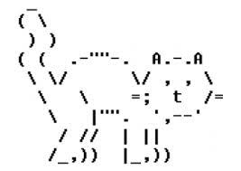

(prog.ecrire)=

# Ecrire - `str`

Dans ce chapitre, nous allons nous intéresser au texte. Le texte est une catégorie d'information qui est essentielle dans beaucoup de programmes, tels qu'une application de messagerie ou un programme de traitement de texte.

Techniquement un texte est appelé une **chaîne de caractères**, ou string en anglais (`str`). Nous allons voir que :

- un texte est délimité par une apostrophe `'text'` ou un guillemet double `"text"`,
- l'opérateur `*` répète un texte,
- la fonction `ord(c)` retourne l'entier `i` qui représenter le caractère `c`.

```{question}
Un string informatique est

{f}`un sous-vêtement pour informaticien`  
{f}`une ficelle de données`  
{v}`un enchaînement de lettres`  
{f}`un instrument de musique`
```

## Dire bonjour

Nous commençons par le grand classique des livres d'introduction à la programmation : afficher la fameuse phrase *hello world*.
La fonction `print()` permet d'écrire du texte vers la console.
Ici, la console est la zone rectangulaire qui s'affiche sous le code du programme.

```{exercise}
Affichez encore 2-3 lignes de texte en plus avec la fonction `print()`.
```

```{codeplay}
:file: input0.py
print('hello world.')
```

## Délimiter un texte

Tout caractère imprimable peut être utilisé pour créer un texte :

- lettres (`a...z` et `A...Z`)
- chiffres (`0...9`)
- ponctuations (`.,;:?!`)
- parenthèses (`[]{}<>`)
- symboles (`$*#...`)

Pour marquer une partie du code comme texte, cette partie doit être délimité par l'un des symboles spéciaux qui sont :

- apostrophe (`'`)
- guillemets doubles (`"`)
- trois guillemets doubles (`"""`)

```{exercise}
Ajoutez des lignes supplémentaires au texte qui est délimité par `"""`.
```

```{codeplay}
:file: str1.py
print('apostrophe')
print("guillemets doubles")
print("""
Délimité avec trois guillemets, 
le texte peut s'étaler sur plusieurs lignes.
""")
```

## Répéter un texte

L'opérateur `*` permet de répéter un texte composé d'un ou de plusieurs caractères.

```{exercise}
Répétez une chaîne plus longue.
```

```{codeplay}
:file: str2.py
print('ha' * 10)
print('=' * 20)
print('hello ' * 3)
```

## Concaténer un texte

Le mot **concaténer** veut dire enchaîner ou coller ensemble.

L'opérateur `+` permet de concaténer deux chaînes de texte.
Mais juxtaposer deux chaînes de texte et les séparer par zéro ou plusieurs espaces va aussi concaténer la chaîne.

```{codeplay}
:file: str3.py
print('bon'    'jour')
print('bon''jour')
print('bon' + 'jour')
```

## La longueur d'une chaîne

La fonction `len()` retourne la longueur d'une chaîne.
La chaîne vide (`""`) a une longueur de 0.

```{exercise}
Ajoutez quelques caractères et re-exécutez le code.
```

```{codeplay}
:file: str4.py
print(len('bonjour'))
print(len(""))
print(len("""
Délimité avec trois guillemets, 
le texte peut s'étaler sur plusieurs lignes.
"""))
```

Pour savoir combien de fois il faut répéter un symbole dans le but d'obtenir la même longueur qu'un texte donné, nous pouvons utiliser la fonction `len()` et ainsi créer des lignes qui ont la même longueur qu'un texte.

```{exercise}
Entourez votre texte d'un autre symbole.
```

```{codeplay}
:file: str5.py
x = input('Entrez une phrase: ')
print('=' * len(x))
print(x)
print('=' * len(x))
```

## Le code ASCII

Le code ASCII  (American Standard Code for Information Interchange) était un des premiers standards utilisés pour représenter des symboles dans un ordinateur. Avec initialement 7 et plus tard 8 bits, il désigne un ensemble de lettres, chiffres, symboles et ponctuations.

Aujourd'hui le standard Unicode permet d'encoder la totalité des symboles utilisés dans les différents langages du monde.

La fonction `ord(c)` retourne le code ASCII (Unicode) qui est associé au caractère `c`.

```{codeplay}
:file: str6.py
print('A =', ord('A'))
print('B =', ord('B'))
print('a =', ord('a'))
```

Nous constatons que :

- le code ASCII pour la lettre A est 65,
- les codes suivent l'ordre de l'alphabet,
- les codes des minuscules ont un écart de 32 par rapport au code des majuscules.

```{codeplay}
:file: str7.py
for c in 'Python':
    print(c, '=', ord(c))
```

La fonction `chr(i)` retourne le caractère qui correspond au code `i`.

```{codeplay}
:file: str8.py
for i in range(65, 75):
    print(i, '=', chr(i))
```

## L'art ASCII

L’**art ASCII** consiste à réaliser des images uniquement à l'aide des lettres et caractères spéciaux contenus dans le code ASCII.

Précéder la chaîne de caractères avec `r` permet de ne pas tenir compte des symboles d'échappement (barre oblique en arrière `\`).

Voici un exemple :



```{exercise}
Le site [asciiart.eu](https://www.asciiart.eu) contient beaucoup d'exemples d'art ASCII. Trouvez-en un et copiez-le dans un programme Python.
```

```{codeplay}
:file: str9.py
print(r"""
         ((`\ 
      ___ \\ '--._
   .'`   `'    o  )
  /    \   '. __.'
 _|    /_  \ \_\_
{_\______\-'\__\_\
""")

```

## Échapper un caractère

Les symboles `'` et `"` sont utilisés pour délimiter du texte.
Si nous voulons utiliser ces caractères à l'intérieur de la chaîne, nous devons les échapper avec une barre oblique en arrière `\`.

```{codeplay}
:file: str10.py
print('c\'est bien')
print("\"citation\"")
```

Si nous voulons imprimer le symbole d'échappement, nous devons l'échapper également.

```{codeplay}
:file: str11.py
print('c\'est la \\barre oblique\\ en arrière.')
```

## Une chaîne brute

Les chaînes de texte peuvent être préfixées par la lettre `r`; de telles chaînes sont appelées chaines brutes (raw strings en anglais) et traitent la barre oblique inversée comme un caractère normal.

```{codeplay}
:file: str12.py
print(r'c\'est bien')
print(r"\"citation\"")
print(r'c\'est la \\barre oblique\\ en arrière.')
```

## Retour à la ligne

Chaque commande `print()` se termine avec un retour à la ligne.
Pour insérer un retour à la ligne à l'intérieur d'une chaîne de caractères nous utilisons la séquence d'échappement `\n` (newline).

```{exercise}
Ajoutez une nouvelle ligne de code qui contient des `\n`.
```

```{codeplay}
:file: str13.py
print('chaque\nmot\nsur\nune\nligne')
print('\nhello world' * 5)
```

## Aligner en colonnes

La séquence `\t` (tabulateur) permet d'aligner des éléments de texte en colonne. Les colonnes sont espacées de 8 caractères.

```{codeplay}
:file: str14.py
print('qte\tart.\tprix')
print('4\tsouris\t15.95')
print('12\tclavier\t25.95')
```

## Les émojis

Un  émoji (絵文字) est un terme issu du japonais pour désigner les pictogrammes utilisés dans les messages électroniques et les pages web japonaises, qui se sont répandus dans le monde entier.

Le mot émoji signifie littéralement « image » (e) + « lettre » (moji) ; la ressemblance avec « émotion » est un jeu de mots interculturel.

Un émoji peut être utilisé comme un caractère à l'intérieur d'un texte.
Nous pouvons le répéter avec l'opérateur `*` et obtenir son code **Unicode** avec la fonction `ord(c)`.

```{codeplay}
:file: str15.py
print('😀' * 10)

print(ord('🍎'))
print(ord('😀'))
```

Avec la fonction `chr(i)` nous pouvons afficher les 10 caractères qui suivent l'émoji de pomme.

```{exercise}
Affichez les 10 emojis qui suivent 😀.
```

```{codeplay}
:file: str16.py
for i in range(10):
    print(chr(i + 127822))
```

## Les kanji

Le japonais est écrit avec des pictogrammes qui s'appellent des kanjis.
Avec la fonction `ord(c)` nous pouvons obtenir leur **Unicode**.

```{codeplay}
:file: str18.py
print('日本語')
print('nihongo')
print('japonais\n')

for c in  '日本語': 
    print(c, ord(c))
```

Avec la fonction `chr(i)` nous pouvons afficher les 10 kanjis qui suivent le kanji 日 qui signifie soleil. Si vous regardez bien, vous remarquez qu'ils contiennent tous le radical pour soleil.

```{exercise}
Affichez les 10 kanjis qui suivent 語 (langage).
```

```{codeplay}
:file: str19.py
n = ord('日')
for i in  range(n, n + 10): 
    print(i, chr(i))
```

## Les commentaires

En Python, un commentaire est un bout de code qui est ignoré par Python.
Un commentaire commence par le symbole hashtag (`#`).

Les commentaires sont utilisés pour ajouter à un programme des informations supplémentaires :

- explications,
- nom de l'auteur,
- révision.

Parfois un commentaire est utilisé pour désactiver une ligne de code.
La plupart des éditeurs marquent les commentaires en couleur grisée.

```{exercise}
Enlevez le # devant `print('au revoir')` pour l'exécuter.
```

```{codeplay}
:file: str20.py
# commentaire sur une ligne

print('bonjour')  # commentaire en fin de ligne
print("# ceci n'est pas un commentaire")
# print('au revoir')

"""
Ceci est 
un long commentaire
sur plusieurs lignes.
"""
```

## Parcourir une chaîne

La ligne de code `for c in mot:` signifie que la variable `c` va prendre à chaque répétition un caractère différent de la chaîne `mot`.

Quand la variable d'itération est un caractère on l'appelle souvent `c`.

```{exercise}
Testez avec des textes différents.
```

```{codeplay}
:file: str21.py
from time import sleep
mot = input('Entrez un mot: ')

for c in mot:
    print(c)
    sleep(0.1)
```

## Narration

Voici un exemple qui reproduit une conversation entre deux personnes, affichée au ralenti, lettre par lettre, pour simuler une sorte de communication chat en ligne.

La méthode `split('\n')` découpe la chaine `histoire` en lignes séparées, et retourne une liste.

```{codeplay}
:file: narration.py
from time import sleep

histoire = """
Une histoire d'aventure
-----------------------
A: comment vas-tu ?
B: très bien !
A: veux-tu faire un voyage ?
B: oui, vers où ?
A: à Rio de Janeiro.
B: chouette, on part quand ?
A: il y a un vol ce soir.
"""

for line in histoire.split('\n'):
    for c in line:
        print(c, end='')
        sleep(0.1)
    sleep(1)
    print()
```

## Le pendu

Le jeu du [pendu](https://fr.wikipedia.org/wiki/Pendu_(jeu)) consiste à trouver un mot en devinant les lettres qui le composent. Le jeu se joue traditionnellement à deux, avec un papier et un crayon, avec le dessin d'une potence, dans lequel pour chaque erreur un trait d'un bonhomme allumette est ajouté.

### Dévoiler un mot

Dans le jeu du pendu, un mot est affiché avec des traits au début `_ _ _ _ _`

```{codeplay}
mot = 'potiron'
lettres = 'abctin'

mot2 = ''
for c in mot:
    if c in lettres:
        mot2 += c
    else:
        mot2 += '_'
    mot2 += ' '

print(mot2)
```

Nous pouvons écrire ce code plus compact en utilisant l'expression
`valeur1 if condition else valeur2`

```{codeplay}
mot = 'potiron'
lettres = 'abctin'

mot2 = ''
for c in mot:
    mot2 += c if c in lettres else '_'
    mot2 += ' '

print(mot2)
```

### Jouer en boucle

```{codeplay}
mot = 'potiron'
lettres = ''
n = 0

for i in range(10):
    mot2 = ''
    for c in mot:
        mot2 += c if c in lettres else '_'
        mot2 += ' '

    x = input(mot2 + '  lettre: ')
    if x in mot:
        lettres += x
    else:
        n = n + 1
```

### Dessin du pendu

Une première approche pour dessiner la potence avec le pendu pourrait être d'enchaîner les instructions de dessin sans aucune structure.

```{codeplay}
from turtle import *

a = 40
forward(100)
backward(50)
left(90)
forward(180)
right(90)
forward(40)
left(45)
backward(56)
forward(56)
right(45)
forward(50)
right(90)
forward(40)
dot(20)
forward(20)
right(45)
forward(a)
backward(a)
left(90)
forward(a)
backward(a)
right(45)
forward(a)
right(45)
forward(a)
backward(a)
left(90)
forward(a)
backward(a)
right(45)
hideturtle()
```

### Structurer le code

Nous découpons le programme en sous-programme que nous nommons avec des noms descriptifs. Ensuite nous appelons toutes les fonctions pour dessiner la potence avec le pendu.

```{codeplay}
from turtle import *

a = 40
def potence():
    forward(100)
    backward(50)
    left(90)
    forward(180)
    right(90)
    forward(40)
    left(45)
    backward(56)
    forward(56)
    right(45)
    forward(50)
    right(90)
    forward(40)

def tete():
    dot(20)
    forward(20)

def bras1():
    right(45)
    forward(a)
    backward(a)

def bras2():
    left(90)
    forward(a)
    backward(a)

def torse():
    right(45)
    forward(a)

def jambe1():
    right(45)
    forward(a)
    backward(a)

def jambe2():
    left(90)
    forward(a)
    backward(a)
    hideturtle()

potence()
tete()
bras1()
bras2()
torse()
jambe1()
jambe2()
```

### Jeu final

Pour pouvoir exécuter les fonctions du pendu au bon moment, nous plaçons les fonctions dans un tuple. Nous allons accéder la fonction avec un indice.

```{codeplay}
:output_lines: 5
from turtle import *

a = 40
def potence():
    forward(100)
    backward(50)
    left(90)
    forward(180)
    right(90)
    forward(40)
    left(45)
    backward(56)
    forward(56)
    right(45)
    forward(50)
    right(90)
    forward(40)

def tete():
    dot(20)
    forward(20)

def bras1():
    right(45)
    forward(a)
    backward(a)

def bras2():
    left(90)
    forward(a)
    backward(a)

def torse():
    right(45)
    forward(a)

def jambe1():
    right(45)
    forward(a)
    backward(a)

def jambe2():
    left(90)
    forward(a)
    backward(a)
    hideturtle()

potence()
===
dessin = (tete, bras1, bras2, torse, jambe1, jambe2)

mot = 'potiron'
lettres = ''
n = 0

for i in range(10):
    mot2 = ''
    for c in mot:
        mot2 += c if c in lettres else '_'
        mot2 += ' '

    x = input(mot2 + '  lettre: ')
    if x in mot:
        lettres += x
    else:
        dessin[n]()
        n = n + 1
```

## Exercices

### Le jeu du pendu

Créez le jeu du pendu avec un répertoire de 50 mots dans un tuple. Votre programme choisit un de ces mots aléatoirement avec la fonction `choice()` du module `random`, comme montré ci-dessous.

```{codeplay}
from random import *

mots = ('informatique', 'ordinateur', 'calculatrice', 'machine',
        'processeur', 'mémoire', 'algorithme', 'binaire')

mot = choice(mots)
print(mot)
```
