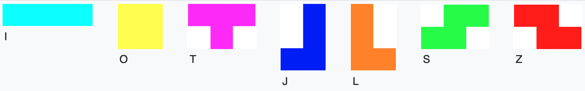
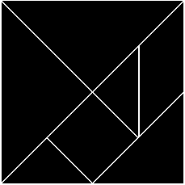
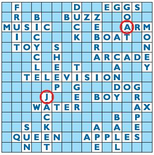
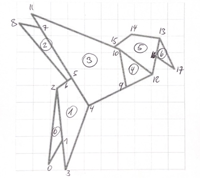
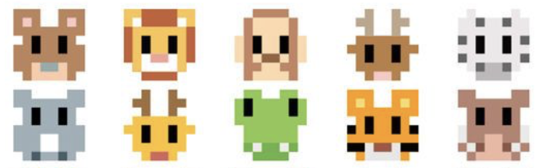
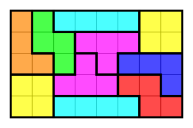

# Ordonner - `tuple 2D`

Comment représenter des formes complexes, mais réguliers, tels que :

- les pixels d'une image PixelArt
- les couleurs d'un cube de Rubik
- l'état des pièces d'un échéqier
- une image composé de polygones
- la grille d'un sudoku
- les lettres d'un scrabble ?

La réponse est un tuple multi-dimensionnel, donc un tuple de tuple.

## Tuple 2D

Voici une image minimaliste de Sonic créée avec seulement 4x4 pixels.

```{image} media/sonic.png
:width: 200
```

Nous pouvons représenter cette information avec un tuple 2D de 4 lignes, chaque ligne ayant 4 couleurs.

Avec un

- indexage simple `sonic[0]` nous pouvons accéder à une ligne.
- indexage double `sonic[2][2]` nous pouvons accéder à la couleur d'un pixel

```{codeplay}
sonic = (('blue', 'blue', 'blue', 'white'),
        ('white', 'blue', 'blue', 'blue'),
        ('white', 'blue', 'beige', 'blue'),
        ('red', 'white', 'red', 'white'))

print(sonic[0])
print(sonic[2][2])
```

## Parcourir en 2D

Nous pouvons parcourir de 2D en deux niveaux.

- avec `for line in sonic:` ligne par ligne
- avec `for c in c:` les couleurs de chaque ligne

```{codeplay}
sonic = (('blue', 'blue', 'blue', 'white'),
        ('white', 'blue', 'blue', 'blue'),
        ('white', 'blue', 'beige', 'blue'),
        ('red', 'white', 'red', 'white'))

for line in sonic:
    print()
    print(line)
    for c in line:
        print(c)
```

## Palette de couleurs

Au lieu d'écrire les couleurs à chaque fois, nous pouvons les coder avec une palette. Ceci a deux aventages.

- la table 2D des pixels est plus compacte
- on peux facilement échanger les couleurs

```{codeplay}
palette = ('blue', 'white', 'beige', 'red')

sonic = ((0, 0, 0, 1),
        (1, 0, 0, 0),
        (1, 0, 2, 0),
        (3, 1, 3, 1))

for line in sonic:
    print()
    print(line)
    for i in line:
        print(i, '=', palette[i])
```

## Dessiner des pixels

Nous utilisons le parcours ligne par ligne, pixel par pixel pour dessiner les pixels

```{codeplay}
from turtle import *

palette = ('blue', 'white', 'beige', 'red')
sonic = ((0, 0, 0, 1),
        (1, 0, 0, 0),
        (1, 0, 2, 0),
        (3, 1, 3, 1))
d = 40

def pixel(d, c):
    down()
    fillcolor(c)
    begin_fill()
    for i in range(4):
        forward(d)
        right(90)
    end_fill()
    forward(d)
    up()

speed(0)
for line in sonic:   
    for i in line:
        c = palette[i]
        pixel(d, c)
    backward(4*d)
    sety(ycor() - d)
```

## Pixelart

Nous pouvons utiliser la fonction `rectangle()` pour dessiner du Pixelart.
Pour ceci nous utilisons deux tuples:

- `palette` -- un tuple 1D contenant les couleurs (la palette des couleurs)
- `table` -- un tuple 2D avec les indices des couleurs, ligne par ligne

Les paramètres suivants sont passés à la fonction `rectangle()`:

- `d` -- la taille du pixel (`20`)
- `w` -- épaisseur de ligne (`1`)
- `pen` -- couleur de ligne (`'black'`)

Les points de départ sont marqués avec un point (dot) et les coordonnées y sont affichées.

```{codeplay}
from turtle import *
speed(0)

def rectangle(d, e, w=1, pen='black', fill=None):
    """Dessine un rectangle de taille d x e."""
    if pen:
        down()
        width(w)
        pencolor(pen)
    if fill:
        fillcolor(fill)
        begin_fill()
    for x in (d, e, d, e):
        forward(x)
        right(90)
    if fill:
        end_fill()
    up()
    forward(d)
===
def pixelart(table, palette, d=20, w=1, pen='black'):
    dot()
    color('black')
    write(pos())
    for line in table:
        for i in line:
            rectangle(d, d, w=w, pen=pen, fill=palette[i])
        backward(len(line)*d)
        sety(ycor()-d)

palette = (None, 'black', 'yellow', 'white', 'red', )
pikachu =  ((1, 2, 2, 1),
            (3, 4, 2, 3),
            (2, 2, 2, 2),
            (2, 2, 2, 3))

dot(1000, 'whitesmoke')
up()
pixelart(pikachu, palette)
goto(-180, 100)
pixelart(pikachu, palette, d=30, w=0, pen=None)
goto(150, 50)
pixelart(pikachu, (None, 'green', 'lime', 'cyan', 'pink'), 25, 3, 'red')
```

## Rubik

Pour dessiner les 3 faces d'un cube de Rubik, nous pouvons utiliser la même méthode:

- une palette pour les 6 couleurs
- un tuple 3D pour les 3x3x3 couleurs visibles


```{exercise}
Ajoutez la 3e surface qui manque encore en indiquant les indices des couleurs.  
Dans la palette, changez les couleurs rouge en `'pink'`,  bleu en `'lightblue'` et vert en `'lightgreen'`.
```

```{codeplay}
from turtle import *

d = 40
palette = ('red', 'blue', 'orange', 'white', 'yellow', 'green')
cube = (((0, 1, 2), (3, 4, 0), (1, 3, 5)),
        ((1, 5, 4), (5, 0, 2), (2, 4, 5)))

def losange(d, c):
    fillcolor(c)
    begin_fill()
    for a in (120, 60, 120, 60):
        forward(d)
        left(a)
    end_fill()
    forward(d)

def next_line():
    backward(3*d)
    left(120)
    forward(d)
    right(120)
    
def next_surface():
    left(120)
    backward(3*d)
    
speed(0)
left(30)
for surface in cube:
    for line in surface: 
        for i in line:
            c = palette[i]
            losange(d, c)
        next_line()
    next_surface()
```

## Tetris

Nous représentons chaque tétronimo comme un tuple d'angles.



Cet angle est l'angle à tourner après chaque segment de longeur `d`.

- `90` tourner à gauche,
- `0` continue tout droit,
- `-90` tourner à droite.

```{exercise}
Ajoutez les deux derniers angles dans le tuple `T` pour fermer la forme du T.
```

```{codeplay}
from turtle import *
d = 80
T = (90, -90, 90, 90, 0, 0, 90, 90)

for a in T:
    dot()
    forward(d)
    left(a)
    write(a)
```

### Forme

Nous marquons le point d'origine avec un point (dot).

```{exercise}
Trouvez les tuples d'angles pour représenter les tétronimos O, J et S.
```

```{codeplay}
from turtle import *
speed(0)
d = 20
I = (0, 0, 0, 90, 90, 0, 0, 0, 90, 90)
O = ()
T = (90, -90, 90, 90, 0, 0, 90, 90, -90, 90)
J = ()
L = (0, 90, 90, -90, 0, 90, 90, 0, 0, 90)
S = ()
Z = (0, 90, 90, -90, 90, 0, 90, 90, -90, 90)

def tetronimo(angles):
    down()
    dot()
    for a in angles:
        forward(d)
        left(a)
    up()

up()
backward(280)
for t in (I, O, T, J, L, S, Z):
    tetronimo(t)
    forward(4*d)
```

### Couleur

En plus de la définition des angles, nous pouvons aussi ajouter la couleur.
Chaque type de tétronimo est donc défini par un tuple de la forme `(couleur, angles)`.

```{exercise}
Ajoutez les couleurs des tétronimos J, L, S et Z.
```

```{codeplay}
from turtle import *
speed(0)
d = 20
I = 'cyan', (0, 0, 0, 90, 90, 0, 0, 0, 90, 90)
O = 'yellow', (0, 90, 0, 90, 0, 90, 0, 90)
T = 'magenta', (90, -90, 90, 90, 0, 0, 90, 90, -90, 90)
J = '', (0, 90, 0, 0, 90, 90, 0, -90, 90, 90)
L = '', (0, 90, 90, -90, 0, 90, 90, 0, 0, 90)
S = '', (0, 90, -90, 90, 90, 0, 90, -90, 90, 90)
Z = '', (0, 90, 90, -90, 90, 0, 90, 90, -90, 90)

def tetronimo(c, angles):
    down()
    dot()
    fillcolor(c)
    begin_fill()
    for a in angles:
        forward(d)
        left(a)
    end_fill()
    up()

up()
backward(280)
for (c, angles) in (I, O, T, J, L, S, Z):
    tetronimo(c, angles)
    forward(4*d)
```

### Position et orientation

Pour positionner des tétronimos dans un arrangement spécifique, nous devons spécifier les coordonnées de sa position d'origine (marquée avec un point) et son orientation.
Nous allons reprendre l'arrangement du chapitre 3.


Chaque tétronimo peut être écrite sous forme de

- type `t` de tétronimo
- position `p`
- orientation `h` (heading)

```{exercise}
Ajoutez les tétronimos qui manquent.
```

```{codeplay}
from turtle import *
speed(0)
d = 20      # dimension de base

I = 'cyan', (0, 0, 0, 90, 90, 0, 0, 0, 90, 90)
O = 'yellow', (0, 90, 0, 90, 0, 90, 0, 90)
T = 'magenta', (90, -90, 90, 90, 0, 0, 90, 90, -90, 90)
J = 'blue', (0, 90, 0, 0, 90, 90, 0, -90, 90, 90)
L = 'orange', (0, 90, 90, -90, 0, 90, 90, 0, 0, 90)
S = 'lime', (0, 90, -90, 90, 90, 0, 90, -90, 90, 90)
Z = 'red', (0, 90, 90, -90, 90, 0, 90, 90, -90, 90)

tetris = (  (O, (0, 0), 0),     # tetronimo, position, orientation
            (S, (2, 0), 0),
            (T, (6, 2), 180),
            (J, (7, 0), 0),
            (I, (10, 0), 90),
            (L, (0, 4), -90))

def tetronimo(c, angles):
    down()
    dot()
    fillcolor(c)
    begin_fill()
    for a in angles:
        forward(d)
        left(a)
    end_fill()
    up()

for (t, p, h) in tetris:
    seth(h)
    goto(p[0]*d, p[1]*d)
    c, angles = t
    tetronimo(c, angles)
```

## Tangram

Le tangram, « sept planches de la ruse », ou jeu des sept pièces, est une sorte de puzzle chinois. C'est une dissection du carré en sept pièces élémentaires. Des dissections plus générales, de formes différentes, sont également appelées tangrams.



Nous traitons le carré de base comme ayant 4x4 unités. Ceci nous les 5 formes de base :

- 2 triangles avec hypoténuse 4
- 1 triangle avec hypoténuse 2.82
- 1 triangles avec hypoténuse 2
- 1 carré avec côté 1.41
- 1 paraléllipiède de coté 2 et 1.41

### Formes

Cette fois nous allons représenter les formes avec des tuples`(d, a)`, distance-angle. Le grand triangle est décrit avec ce tuple.

```{codeplay}
from turtle import *
D = 80
triangle = ((4, 135), (2.82, 90), (2.82, 135))

backward(2*D)
for (d, a) in triangle:
    forward(d/2*D)
    write(d)
    forward(d/2*D)
    left(a)
    write(a)
```

De la même façons nous procédons a décrire toutes les formes.

```{codeplay}
from turtle import *

D = 40

T = ((4, 135), (2.82, 90), (2.82, 135))
T2 = ((2.82, 135), (2, 90), (2, 135))
T3 = ((2, 135), (1.41, 90), (1.41, 135))
S = ((1.41, 90),(1.41, 90),(1.41, 90),(1.41, 90)) 
L = ((2, 45), (1.41, 135), (2, 45), (1.41, 135)) 

def polygon(poly):
    down()
    dot()
    for (d, a) in poly:
        forward(d*D)
        left(a)
    up()

backward(250)
for s in T, T2, T3, S, L:
    polygon(s)
    forward(100)
```

### Positions et orientation

Pour désigner une forme spécifique, nous utilisons un tuple avec 7 éléments qui contient un deuxième tuple `(piece, p, h)`

- piece
- position
- orientation

Voici le puzzle de base:

```{codeplay}
from turtle import *

D = 40  # distance de base

T = ((4, 135), (2.82, 90), (2.82, 135))             # grand triangle
T2 = ((2.82, 135), (2, 90), (2, 135))               # moyen triangle
T3 = ((2, 135), (1.41, 90), (1.41, 135))            # petit triangle
C = ((1.41, 90),(1.41, 90),(1.41, 90),(1.41, 90))   # carré
L = ((2, 45), (1.41, 135), (2, 45), (1.41, 135))    # losange

square =  ((T, (0, 0), 0),      # piece, position, orientation
           (T, (0, 4), -90),
           (T2, (2, 4), -45),
           (T3, (2, 4), -180),
           (T3, (3, 1), 90),
           (C, (2, 2), 45),
           (L, (4, 0), 90))

def polygon(poly):
    down()
    dot()
    for (d, a) in poly:
        forward(d*D)
        left(a)
    up()

def tangram(pieces):
    for (poly, p, h) in pieces:
        goto(p[0]*D, p[1]*D)
        seth(h)
        polygon(poly)

tangram(square)
```

## Sudoku

```{codeplay}
from turtle import *
speed(0)
up()

def ligne(p, q):
    goto(p)
    down()
    goto(q)
    up()
    
def grid(p, d):
    x0, y0 = p
    x1 = x0 + 9*d
    y1 = y0 + 9*d

    for i in range(10):
        y = y0 + i*d
        width(3 if i%3 == 0 else 1)
        ligne((x0, y), (x1, y))

    for i in range(10):
        x = x0 + i*d
        width(3 if i%3 == 0 else 1)
        ligne((x, y0), (x, y1))
    
grid((50, 0), 20)
grid((-280, -180), 30)
```

```{codeplay}
from turtle import *

sudoku = ((5, 3, 0, 0, 7, 0, 0, 0, 0),
          (6, 0, 0, 1, 9, 5, 0, 0, 0),
          (0, 9, 8, 0, 0, 0, 0, 6, 0),
          (8, 0, 0, 0, 6, 0, 0, 0, 3),
          (4, 0, 0, 8, 0, 3, 0, 0, 1),
          (7, 0, 0, 0, 2, 0, 0, 0, 6),
          (0, 6, 0, 0, 0, 0, 2, 8, 0),
          (0, 0, 0, 4, 1, 9, 0, 0, 5),
          (0, 0, 0, 0, 8, 0, 0, 7, 9))

up()
speed(0)
p = (-100, 100)
d = 20

x, y = p
for line in sudoku:
    for i in line:
        goto(x, y)
        if i:
            write(i)
        x += d
    x = p[0]
    y -= d
```

## Scrabble

Le [Scrabble](https://fr.wikipedia.org/wiki/Scrabble) est un jeu de société et un jeu de lettres où l'objectif est de cumuler des points, sur la base de tirages aléatoires de lettres, en créant des mots sur une grille carrée.
Le jeu a été conçu par l'architecte new-yorkais Alfred Mosher Butts pendant la crise de 1929, et publié en 1931.

### Dessiner une case

Chaque lettre doit être placée au centre d'une case.
Avec `x, y = pos()` nous mémorisons d'abord la position de départ dans deux variables locales. Ceci nous permet de placer la tortue au centre pour écrire la lettre, et à la fin, d'avancer à la prochaine case.

```{exercise}
Positionnez la lettre pour qu'elle apparaisse au milieu de la case.  
Il faudra modifier la commande `goto(x+d/2, y)`.
```

```{codeplay}
from turtle import *

def box(d, c):
    x, y = pos()        # mémoriser la position de départ
    down()
    for i in range(4):  # dessiner un carré
        forward(d)
        left(90)
    up()
    goto(x+d/2, y)      # position pour écrire la lettre
    dot()               # marquer
    write(c, font=(None, d//2), align='center')
    goto(x+d, y)        # avancer à la prochaine case

speed(0)
backward(200)
for c in 'SCRABBLE':
    box(50, c)
```

### Dessiner le plateau

Pour représenter le plateau des 15x15 cases, nous utilisons un tuple `scrabble` avec 15 chaines de caractères de longueur 15.

Nous parcourons les lettre de chaque ligne pour afficher les cases vides et remplies.

Essayons de reproduire cet état à l'aide du tuple `scrabble`.



```{exercise}
Ajoutez les 3 dernière lignes qui manquent dans la définition de `scrabble`.
```

```{codeplay}
from turtle import *

scrabble = (' F     D  EGGS ',
            ' R B  BUZZ  O  ',
            'MUSIC  C E  ARM', 
            ' I C   K BOAT O',
            ' TOY S   R    N',
            '   C H   ARCADE',
            '   L E T   A  Y',
            '  TELEVISION   ',
            '     P G   DOG ',
            '    J  E BOY R ',
            '   WATER     AX',
            '    C      B P ')

def box(d, c):
    x, y = pos()        # mémoriser la position de départ
    down()
    for i in range(4):  # dessiner un carré
        forward(d)
        left(90)
    up()
    goto(x+d/2, y+d/4)  # position pour écrire la lettre
    write(c, font=(None, d//2), align='center')
    goto(x+d, y)        # avancer à la prochaine case

up()
speed(0)
x, y = p = (-100, 100)
d = 20

for line in scrabble:
    for c in line:
        goto(x, y)
        box(d, c)
        x += d
    x = p[0]
    y -= d
```

## Multiples polygones

Pour transformer une image en multiples polygones, nous pouvons placer une grille sur l'image ou imprimer l'image sur du papier carré.



L'image origami de l'oiseau est composé de:

- 18 points (de 0 à 17)
- 7 polygones (de 0 à 6)

Nous repérons d'abord toutes les coordonnées des points dans une liste `points`.  Avec un indexage du tuple tel que `point[0]` on peut accéder ou point 0.

Les 7 polygones sont tout simplement des tuples avec les indices des points.

```{codeplay}
from turtle import *

points = ((19, 3), (27, 17), (22, 48), (30, 0), (42, 38), 
          (32, 54), (30, 53),  (12, 85), (2, 87), (64, 50),
          (61, 72), (8, 92), (80, 57), (85, 78),(68, 80), 
          (58, 73), (83, 68), (94, 60))
          
polygons = ((0, 1, 2),
            (3, 4, 5, 2),
            (6, 5, 7, 8),
            (4, 9, 10, 11),
            (9, 12, 10),
            (12, 13, 14, 15, 10),
            (16, 17, 13))

up()
i = 0
for p in points:
    goto(-150 + 3 *p[0], -150 + 3*p[1])
    dot(p)
    write(i)
    i = i + 1
```

Pour dessiner multiples polygones, nous devons parcourir la liste des polygones.
Pour chaque polygone nous parcourons ses points.

Avec les deux tuples `pos` et `size` nous pouvons choisir la position et la taille des polygones.

```python
goto(pos[0] + size[0] * p[0], pos[1] + size[1] * p[1])
```

Pour fermer le polygone, nous revenons sur le premier point de la liste.

```python
p = points[poly[0]]
goto(pos[0] + size[0] * p[0], pos[1] + size[1] * p[1])
````

```{codeplay}
from turtle import *

points = ((19, 3), (27, 17), (22, 48), (30, 0), (42, 38), 
          (32, 54), (30, 53),  (12, 85), (2, 87), (64, 50),
          (61, 72), (8, 92), (80, 57), (85, 78),(68, 80), 
          (58, 73), (83, 68), (94, 60))
          
polygons = ((0, 1, 2),
            (3, 4, 5, 2),
            (6, 5, 7, 8),
            (4, 9, 10, 11),
            (9, 12, 10),
            (12, 13, 14, 15, 10),
            (16, 17, 13))

up()
i = 0
pos = (-150, -150)
size = (3, 3)
for poly in polygons:
    for i in poly:
        p = points[i]
        goto(pos[0] + size[0] * p[0], pos[1] + size[1] * p[1])
        down()
        dot(p)
        write(i)
    p = points[poly[0]]
    goto(pos[0] + size[0] * p[0], pos[1] + size[1] * p[1])
    up()
```

## Exercices

### Pixelart

Choisissez un animal et produisez une image avec 8x8 pixels.



```{codeplay}
:file: pix_8x8.py
from turtle import *

d = 20
palette = ('red',)
image = ((0,),)

def pixel(d, c):
    fillcolor(c)
    begin_fill()
    for i in range(4):
        forward(d)
        right(90)
    end_fill()

def pixelart(image, palette, d=20, w=1, pen='black'):
    for line in image:
        for i in line:
            c = palette[i]
            pixel(d, c)
        backward(len(line)*d)
        sety(ycor()-d)

pixelart(image, palette)
```

### Tetris

Utilisez un tuple pour décrire type, position et orientation de chaque tétronimo.



```{codeplay}
from turtle import *
speed(0)
d = 20      # dimension de base

I = 'cyan', (0, 0, 0, 90, 90, 0, 0, 0, 90, 90)
O = 'yellow', (0, 90, 0, 90, 0, 90, 0, 90)
T = 'magenta', (90, -90, 90, 90, 0, 0, 90, 90, -90, 90)
J = 'blue', (0, 90, 0, 0, 90, 90, 0, -90, 90, 90)
L = 'orange', (0, 90, 90, -90, 0, 90, 90, 0, 0, 90)
S = 'lime', (0, 90, -90, 90, 90, 0, 90, -90, 90, 90)
Z = 'red', (0, 90, 90, -90, 90, 0, 90, 90, -90, 90)

tetris = (  (O, (0, 0), 0),     # tetronimo, position, orientation
        )

def tetronimo(c, angles):
    down()
    dot()
    fillcolor(c)
    begin_fill()
    for a in angles:
        forward(d)
        left(a)
    end_fill()
    up()

for (t, p, h) in tetris:
    seth(h)
    goto(p[0]*d, p[1]*d)
    c, angles = t
    tetronimo(c, angles)
```
