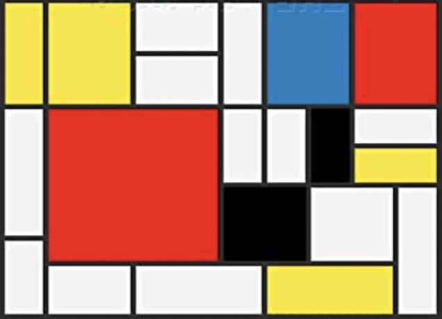

(prog1.parametrer)=

# Paramétrer - `rect(d, e)`

Dans ce chapitre, nous revenons sur le concept de la fonction. Dans le chapitre 2 nous avons vu la fonction comme une façon de donner un nom à une séquence d'instructions. Ici nous allons voir comment nous pouvons ajouter un ou plusieurs paramètres à une fonction. Nous allons voir que :

- l'expression `def rect(d, e):` permet de définir une fonction avec deux paramètres,
- les paramètres `d, e` sont des variables locales valides uniquement à l'intérieur de la définition de fonction,
- ces paramètres prennent une valeur au moment de l'appel  de la fonction avec `rect(50, 30)`.

```{question}
En Python, `def` est un raccourci pour

{f}`défoncé`  
{f}`défilé`  
{v}`définition`  
{f}`défavorisé`
```

## Paramétrer une fonction

Jusqu'à maintenant, notre rectangle était d'une taille fixe. La fonction `rectangle()` du chapitre 2 dessine toujours un rectangle de 160 x 100 pixels. Il faudrait faire une nouvelle fonction `rectangle2()` si on voulait dessiner une taille différente.

Il serait très utile de disposer d'une fonction de la forme `rectangle(d, e)` qui puisse dessiner des rectangles de largeur et hauteur variable.
C'est possible en spécifiant des **paramètres** pour la fonction.
Un paramètre de fonction est une variable locale qui peut être utilisée dans sa définition.

Lors de l'appel de la fonction, nous donnons des valeurs à la fonction.
Ces valeurs sont les **arguments** de la fonction.

```{exercise}
Aujoutez un deuxième rectangle avec d'autres dimensions.
```

```{codeplay}
from turtle import *

def rectangle(d, e):    # paramètres (d, e)
    for i in range(2):
        forward(d/2)
        write(d)
        forward(d/2)
        left(90)

        forward(e/2)
        write(e)
        forward(e/2)
        left(90)
        
rectangle(160, 100)      # largeur=160, hauteur=100 
```

La fonction `losange(a, angle)` a comme paramètre la longueur et le premier angle. Le deuxième angle du losange est calculé.

```{codeplay}
from turtle import *

def losange(d, a):      # paramètres (d=distance, a=angle)
    for i in range(2):
        forward(d)
        left(a)
        write(a)
        
        forward(d)
        left(180-a)
        write(180-a)

losange(100, 60)            # distance=100, angle=60
losange(140, 100)           # distance=140, angle=100
```

La fonction `polygone(d, n)` a comme paramètre la distance du côté et le nombre de sommets.

```{codeplay}
from turtle import *

def polygone(d, n):     # paramètres (d, n)
    for i in range(n):
        forward(d)
        left(360/n)
        write(360/n)

polygone(100, 3)    # triangle
polygone(100, 4)    # carré    
polygone(100, 5)    # pentagon
```

## Dessiner une maison

Nous revenons à notre fonction pour dessiner une maison.

```{exercise}
Ajoutez une maison de taille 100.
```

```{codeplay}
from turtle import *

def maison(d):
    dot()
    forward (1.41*d)  # sol
    left(90)
    forward(d)  # mur droit
    left(45)
    forward(d)  # toit droit
    left(90)
    forward(d)  # toit gauche
    left(45)
    forward(d)  # mur gauche
    left(90)

backward(200)        
maison(50)      # maison de taille 50
forward(100)
maison(70)      # maison de taille 70
```

## Positionner la maison

La fonction `goto(x, y)` place la tortue à la position `(x, y)`. Cette fonction  permet de positionner notre maison à un endroit précis.
Pour désigner cette position, nous utilisons la variable `p` (point, position) qui consiste d'un tuple `(x, y)` de coordonnées.

La fonction `write(p)` écrit la position `p` sur le canevas, à la position actuelle de la tortue. Pour marquer ce point de positionnement, nous ajoutons un point (dot) comme marqueur.

```{exercise}
Aujoutez deux autres maisons de taille différente.
```

```{codeplay}
from turtle import *

def maison(p, d):
    goto(p)     # aller à la position p
    write(p)    # afficher cette position p
    dot()       # ajouter un marquer (dot)
    down()
    forward (1.41*d)  # sol
    left(90)
    forward(d)  # mur droit
    left(45)
    forward(d)  # toit droit
    left(90)
    forward(d)  # toit gauche
    left(45)
    forward(d)  # mur gauche
    left(90)
    up()
    
maison((0, 0), 50)          # maison à la position (0, 0)
maison((-150, 50), 70)      # maison à la position (-150, 50)
```

## Colorier la maison

Maintenant nous modifions la fonction pour inclure non seulement la position, la taille, mais également la couleur de la maison comme paramètres. Les arguments de la fonction sont :

- `p` -- position de la maison
- `d` -- dimension de la maison
- `c` -- couleur de la maison

```{exercise}
Aujoutez deux autres maisons de taille et couleur différente.
```

```{codeplay}
from turtle import *
up()

def maison(p, d, c):
    goto(p)
    dot()
    down()
    fillcolor(c)
    begin_fill()
    forward (1.41*d)  # sol
    left(90)
    forward(d)  # mur droit
    left(45)
    forward(d)  # toit droit
    left(90)
    forward(d)  # toit gauche
    left(45)
    forward(d)  # mur gauche
    left(90)
    end_fill()
    up()

maison((0, 0), 70, 'lightblue')
maison((150, 30), 50, 'yellow')
```

## Drapeau tricolore

```{exercise}
Modifiez les couleurs pour obtenir le drapeau d'un autre pay.  
Créez une deuxième fonction `drapeau2(d, c, c2, c3)` qui crée un drapeau avec des barres horizontales.
```

```{codeplay}
from turtle import *

def rectangle(d, e, c):
    fillcolor(c)
    begin_fill()
    for i in range(2):
        forward(d)
        left(90)
        forward(e)
        left(90)
    end_fill()

def drapeau(d, c, c2, c3):
    rectangle(d, 2*d, c)
    forward(d)
    rectangle(d, 2*d, c2)
    forward(d)
    rectangle(d, 2*d, c3)
    
drapeau(50, 'blue', 'white', 'red')
```

## Arbre

Pour dessiner un arbre simple, nous utilisons un segment droit pour le tronc et un disque (dot) pour le feuillage.
C'est une fonction qui a 3 paramètres

- `d` -- longueur du tronc
- `c` -- couleur du tronc
- `c2` -- couleur du feuillage

```{exercise}
Définissez une fonction `foret(n)` qui dessine `n` arbres.
```

```{codeplay}
from turtle import *

def arbre(d, c, c2):
    down()
    left(90)
    width(d/6)      # tronc
    pencolor(c)
    forward(d)
    dot(d, c2)      # feuillage
    up()
    backward(d)     # retourner à la position de départ
    right(90)
    
    
arbre(100, 'brown', 'lime')
forward(70)
arbre(90, 'brown', 'green')
```

## Bus

Pour dessiner un bus, une voiture ou un camion simple, nous pouvons utiliser des rectangles pour le châssis, et un disque (dot) pour les roues.
C'est une fonction qui a a paramètres

- `p` -- position du bus
- `d` -- dimension (longeur) du bus
- `c` -- couleur du bus

```{codeplay}
from turtle import *
up()

def rectangle(d, e, c):
    fillcolor(c)
    begin_fill()
    for i in range(2):
        forward(d)
        left(90)
        forward(e)
        left(90)
    end_fill()
        
def bus(p, d, c):
    goto(p)
    down()
    rectangle(d, d/3, c) # chassis
    forward(d/4)
    dot(d/5)            # roue arrière
    dot(d/10, 'white')
    forward(d/2)
    dot(d/5)            # roue avant
    dot(d/10, 'white')
    up()
    
bus((-200, 50), 200, 'red')
bus((50, 20), 150, 'lightblue')
```

## Coeur

```{exercise}
Ajoutez deux paramètres: `w` pour l'épaisseur de la ligne (width), et `c2` pour la couleur de ligne.  
La fonction aura la forme `coeur(r, w, c, c2)`.
```

```{codeplay}
from turtle import *

def coeur(r, c):
    down()
    fillcolor(c)
    begin_fill()
    left(90)
    circle(r, 225)
    forward(2.4*r)
    left(90)
    forward(2.4*r)
    circle(r, 225)
    left(90)
    end_fill()
    up()

coeur(50, 'darkviolet')
forward(130)
coeur(40, 'tomato')
```

## Escalier

- `d` -- longueur de marche
- `e` -- hauteur de marche
- `n` -- nombre de marches

```{codeplay}
from turtle import *

def escalier(d, e, n):
    dot()   # marqueur de début
    for i in range(n):
        forward(d)
        left(90)
        forward(e)
        right(90)

escalier(20, 10, 5)
escalier(10, -20, 5)
escalier(30, 10, 4)
```

## Valeurs par défaut

Quand une fonction possède beaucoup d'arguments, nous pouvons spécifier des valeurs par défaut. Pour ceci nous ajoutons la valeur par défaut dans la liste de paramètres avec le symbole `=`.

La fonction `rectangle(p, d, e, w=1, pen='black', fill='white')` dessine un rectangle aux dimensions `d` x `e` à la position `p`.
Cette fonction possède 3 paramètres optionnels (valeur par défaut en parenthèse):

- `w` -- épaisseur de ligne (`1`)
- `pen` -- couleur de ligne (`'black'`)
- `fill` -- couleur de remplissage (`'white'`)

Il a maintenant différentes façons à appeler la fonction. Tous les paramètres qui ont une valeur par défaut sont optionnels. Au minimum nous devons spécifier les paramètres sans valeur par défaut.

```
rectangle((40, 0), 80, 40)
```

Le rectangle est dessiné dans la direction actuelle de la tortue. Cette orientation peut être changée avec `seth()`. La tortue se positionne de l'autre côté du point de départ. Ceci permet d'enchainer à dessiner des rectangles.

```{codeplay}
from turtle import *
up()

def rectangle(p, d, e, w=1, pen='black', fill='white'):
    goto(p)
    down()
    width(w)
    pencolor(pen)
    fillcolor(fill)
    begin_fill()
    for i in range(2):
        forward(d)
        left(90)
        forward(e)
        left(90)
    end_fill()
    up()

rectangle((-200, 30), 40, 30)
rectangle((-100, -20), 40, 30, 1, 'orange', 'orange')
rectangle((100, -40), 30, 80, fill='yellow')
rectangle((200, 100), 80, 40, 1, 'red', 'pink')
```

## Polygone régulier

La fonction `polygone()` dessine un polygone régulier avec n sommets. Les arguments de la fonction sont :

- `d` -- distance du segment
- `n` -- nombre de segments

```{codeplay}
from turtle import *

def polygon(d, n, w=1, pen='black', fill='white'):
    down()
    pencolor(pen)
    width(w)
    fillcolor(fill)
    begin_fill()
    for i in range(n):
        forward(d)
        left(360/n)
    end_fill()
    up()  

up()
backward(280)
for n in range(3, 9):
    polygon(40, n, fill='lime')
    color('black')
    write(n)
    forward(100)
```

## Polygone étoilé

En ajoutant un paramètre supplémentaire `m`, la fonction `polygone()` permet également de dessiner un polygone étoilé.  Ce paramètre signifie le nombre de pics sauté pour aller au prochain des `n` points répartis dans un cercle. Pour `m=1` un polygone régulier est dessiné.

es arguments de la fonction sont :

- `d` -- distance du segment
- `n` -- nombre de segments
- `m` -- paramètre pour polygone étoilé (nombre de pics sautés)

```{codeplay}
from turtle import *

def polygon(d, n, m=1, w=1, pen='black', fill='white'):
    down()
    pencolor(pen)
    width(w)
    fillcolor(fill)
    begin_fill()
    for i in range(n):
        forward(d)
        left(m*360/n)
    end_fill()
    up()  
    
up()
speed(0)
backward(250)
for m in range(2, 6):
    polygon(80, 11, m, fill='yellow')
    color('black')
    write(m)
    forward(140)
```

## Nommer une variable

Pour nommer une variable, vous pouvez utiliser :

- lettres (`a...z` et `A...Z`),
- chiffres (`0...9`),
- le tiret bas (`_`).

Le nom de variable :

- est sensible aux majuscules/minuscules,
- ne peut pas commencer avec un chiffre,
- ne doit pas consister d'un mot-clé (`if`, `else`, `for`),

Ces noms de variables sont donc valides : `a2`, `_a`, `speed`, `pos_x`, `POS_X`

```{question}
Lesquels des noms de variable sont valides ?

{f}`var 2`  
{v}`var2`  
{f}`2var`  
{v}`IF`
===
`var 2` contient une espace  
`2var` commence par un chiffre  
`IF` n'est pas un mot-clé  
```

## Exercices

### Pingpong

La fonction `pingpong()` reprend le dessin du chapitre 1 et ajoute trois paramètres

```{codeplay}
:file: pingpong.py
from turtle import *

def pingpong(d, c, c2):
    down()
    left(90)
    color(c)        # poignée
    width(d/8)
    forward(d/2)
    color(c2)       # plaque
    width(d/2)
    forward(d/10)
    up()            # retourner au point de départ
    backward(6/10*d)
    right(90)

pingpong(200, 'brown', 'red')
forward(100)
pingpong(150, 'brown', 'blue')
```

### Mondrian

Avec la fonction `rectangle(p, d, e, w, pen, fill)` dessinez une copie de ce tableau de Mondrian.



### Stickman

```{codeplay}
from turtle import *
up()


def leg(angle, d):
    left(angle)
    forward(d)
    backward(d)
    right(angle)

def stickman(d, bras=(30, -45), jambes=(10, -30)):
    seth(0)
    down()
    circle(d/2)       # tête
    right(90)
    forward(d/2)    # cou
    
    leg(bras[0], d)
    leg(bras[1], d)
    forward(d)
    
    leg(jambes[0], d)
    leg(jambes[1], d)
    up()

goto(-200, 0)      
stickman(20)

goto(-100, 0)      
stickman(20, (90, -110))

goto(0, 0)      
stickman(30, (90, -110), (110, -24))
hideturtle()
```
