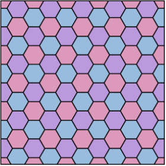

(prog1.parcourir)=

# Parcourir - `tuple`

Dans ce chapitre, nous allons découvrir le concept très important de la séquence. Ce concept s'appelle `tuple` en langage Python ou **n-uplet** en français. Un tuple est une séquence d'objets, par exemple de couleurs, de distances ou d'angles. Nous pouvons parcourir les valeurs d'un tuple une après l'autre avec une boucle `for`. Nous allons voir que :

- le tuple `(10, 20, 30)` représente une séquence de valeurs,
- dans la boucle `for d in (10, 20, 30):` la variable `d` parcourt des nombres,
- dans la boucle `for c in ('red', 'blue', 'green'):` la variable `c` parcourt des couleurs.

```{question}
En informatique, un `tuple` est 

{v}`une séquence d'objets`  
{f}`une liste numérique`  
{f}`un ensemble mathématique`  
{f}`une chaîne de caractères`
```

Auparavant nous avons vu la boucle `for` comme une simple répétition. Dans ce chapitre la boucle `for` est différente dans le sens que nous parcourons une séquence et nous utilisons une valeur différente pour chaque tour. En Python, cette idée de *parcourir une séquence* et d'utiliser une *valeur successive* à chaque tour, est un concept fondamental.

## Variable d'itération

Dans des boucles d'itération, nous allons utiliser des variables d'une seule lettre.

- `a` pour un angle
- `c` pour une couleur
- `d` pour une distance
- `i` pour un indice (entier)
- `r` pour un rayon

```{question}
La variable `i` désigne normalement

{f}`une longueur`  
{f}`un caractère`  
{v}`un entier`  
{f}`une coordonnée`
```

## Parcourir

Dans les exemples suivants nous allons parcourir différents types de tuples.

### Des couleurs

Pour dessiner de multiples couleurs, nous pouvons définir un tuple (séquence) de couleurs et parcourir cette séquence.
En Python, un tuple est délimité par des parenthèses `()` et les éléments sont séparés par une virgule.

Dans l'expression `for c in (...)`, la variable `c` va prendre à tour de rôle les valeurs dans la séquence. Dans l'exemple ci-dessous, `c` prendra successivement les valeurs : `'yellow'`, `'cyan'`, `'orange'`, etc. Le bloc indenté qui suit la ligne `for` sera exécuté autant de fois que la séquence contient d'éléments.

La fonction `dot(80, c)` afficher un disque de diamètre 80 et de couleur `c`.  
La fonction `write(c)` affiche le nom de la couleur `c`.

```{exercise}
Modifiez la séquence des couleurs.
```

```{codeplay}
from turtle import *
up()

backward(200)
for c in ('yellow', 'cyan', 'orange', 'pink', 'lime'):
    dot(80, c)
    write(c)
    forward(80)
```

### Des diamètres

Nous pouvons également parcourir une séquence de nombres et ainsi, spécifier une série de diamètres de disques.

La fonction `dot(d, 'pink')` afficher un disque de diamètre `d` de couleur rose.  
La fonction `write(d)` affiche la distance `d`.

```{exercise}
Modifiez la séquence des diamètres.
```

```{codeplay}
from turtle import *
up()

backward(220)
for d in (40, 60, 80, 60, 40):
    dot(d, 'pink')
    write(d)
    forward(100)
```

### Des distances

Dans le chapitre [Définir](prog1.definir) nous avons vu les fonctions `batiment()` et `porte()` avec 8 lignes pour chaque définition de fonction qui dessine un rectangle.

À l'aide d'une séquence qui contient ces 4 distances, nous pouvons écrire ces fonctions de manière bien plus compacte. Pour illustrer les distances parcourues, nous l'affichons à chaque itération avec `write(a)`.

```{exercise}
Modifiez la taille du bâtiment et de la porte.
```

```{codeplay}
from turtle import *

def batiment():
    for d in (200, 100, 200, 100):
        forward(d/2)
        write(d)
        forward(d/2)
        left(90)

def porte():
    for d in (30, 50, 30, 50):
        forward(d/2)
        write(d)
        forward(d/2)
        left(90)

batiment()
forward(40)
porte()
```

### Des angles

Nous allons reprendre notre fonction `maison()` et, à l'aide d'une séquence, nous pouvons l'écrire de manière bien plus compacte. Cette fois-ci, la séquence représente des angles, donc nous nommons notre variable `angle` pour nous en rappeler.
Pour illustrer le parcours des angles, nous les affichons à chaque itération avec `write(angle)`.

```{exercise}
Ajoutez une porte et une fenêtre à la maison.
```

```{codeplay}
from turtle import *

def maison(d):
    dot()
    forward (1.41*d)
    for a in (90, 45, 90, 45):
        write(a)
        left(a)
        forward(d)
    left(90)

backward(200)        
maison(50)
forward(150)
maison(80)
```

## Maisons en couleurs

Dans l'exemple nous allons d'abord parcourir une séquence d'angles avec une variable d'itération `angle` pour dessiner une maison.

Ensuite, nous allons parcourir une séquence de couleurs avec une variable `c` pour dessiner des maisons de différentes couleurs.

```{exercise}
Changez les couleurs des maisons.
```

```{codeplay}
:file: tuple5.py
from turtle import *

def maison(d, c):
    fillcolor(c)
    begin_fill()     
    forward (1.41*d)
    for a in (90, 45, 90, 45):
        left(a)
        forward(d)
    left(90)
    end_fill()

backward(250)
for c in ('red', 'yellow', 'pink', 'lightblue', 'lightgreen'):
    maison(50, c)
    forward(100)
```

## Tetris

Utilisant un tuple, nous pouvons décrire une forme en une seule ligne.

```{codeplay}
from turtle import *

a = 20
I = (90, 0, 0, 0, 90, 90, 0, 0, 0, 90), 'cyan'
O = (0, 90, 0, 90, 0, 90, 0, 90), 'yellow'
T = (90, -90, 90, 90, 0, 0, 90 ,90, -90, 90), 'magenta'
J = (0, 90, 0, 0, 90, 90 ,0 ,-90, 90, 90), 'blue'
L = (0, 90, 90, -90, 0, 90, 90, 0, 0, 90), 'orange'
S = (0, 90, -90, 90, 90, 0, 90, -90, 90, 90), 'lime'
Z = (0, 90, 90, -90, 90, 0, 90, 90, -90, 90), 'red'

up()
backward(280)
for forme, c in (I, O, T, J, L, S, Z):
    fillcolor(c)
    down()
    begin_fill()
    for angle in forme:
        forward(a)
        left(angle)
    end_fill()
    up()
    forward(4*a)
```

## Drapeau LGBT

Le [drapeau arc-en-ciel](https://fr.wikipedia.org/wiki/Drapeau_arc-en-ciel), ou également appelé le drapeau de la paix, est un drapeau représentant plusieurs bandes ayant les couleurs d'un arc-en-ciel. L'usage du drapeau arc-en-ciel est une ancienne tradition commune à de nombreuses cultures. Il évoque généralement la paix, la diversité sexuelle et de genre, ainsi que l'harmonie entre les individus dans le monde entier.

Aujourd'hui, le drapeau arc-en-ciel est majoritairement connu comme celui de la communauté lesbienne, gay, bisexuelle, transgenre (abréviation : LGBT), depuis 1978.

```{codeplay}
:file: LGBT.py
from turtle import *

backward(300)
left(90)
forward(167)
right(90)
width(67)

for c in ('red', 'orange', 'yellow', 'green', 'blue', 'purple'):
    pencolor(c)
    forward(600)
    backward(600)
    right(90)
    forward(67)
    left(90)
```

## Fleur

Ci-dessous nous dessinons 6 fois un losange pour obtenir une fleur.
Avec une boucle `for` nous parcourons une séquence de 6 couleurs alternantes.

```{exercise}
Il manque un pétale, corrigez le programme.
```

```{codeplay}
:file: tuple6.py
from turtle import *
getscreen().bgcolor('lightgreen')

def losange(d, c):
    fillcolor(c)
    begin_fill()
    for a in (60, 120, 60, 120):
        forward(d)
        left(a)
    end_fill()

for c in ('pink', 'red', 'pink', 'red', 'pink'):
    losange(100, c)
    left(60)
```

## Smiley

Dans cet exemple nous allons parcourir différents diamètres de la bouche à l'aide d'une variable que nous appelons `d`. Voici quatre smileys avec différentes formes de bouche.

```{exercise}
Faites varier un autre paramètre, par exemple la distance des yeux, ou la taille d'un œil.
```

```{codeplay}
:file: tuple8.py
from turtle import *

getscreen().bgcolor('skyblue')
up()

backward(200)
for d in (10, 20, 30, 40):
    dot(100, 'yellow')

    left(45)
    forward(20)
    dot(15)

    right(45)
    backward(30)
    dot(15)

    right(60)
    forward(35)
    dot(d)
    left(60)
    
    forward(120)
    left(5)
```

## Cube 3D

Avec trois losanges, nous pouvons dessiner un cube en 3D.

```{codeplay}
from turtle import *

def losange(d):
    for a in (120, 60, 120, 60):
        forward(d)
        left(a)
        
for i in range(3):
    losange(100)
    left(120)
```

## Cube en couleur

Avec l'utilisation de trois couleurs, l'effet 3D est accentué.
Nous choisissons des couleurs claires pour les surfaces du haut, et des couleurs sombres pour les surfaces vers le bas.

```{exercise}
Tournez le cube de 30°.
```

```{codeplay}
from turtle import *

def losange(d, c):
    fillcolor(c)
    begin_fill()
    for a in (120, 60, 120, 60):
        forward(100)
        left(a)
    end_fill()

def cube():      
    for c in ('pink', 'violet', 'darkviolet'):
        losange(100, c)
        left(120)

cube()
```

## Pavage du plan

Un pavage du plan est un ensemble de portions du plan, par exemple des polygones, dont l'union est le plan tout entier, sans recouvrement.

```{codeplay}
from turtle import *

def losange(d, c):
    fillcolor(c)
    begin_fill()
    for a in (120, 60, 120, 60):
        forward(100)
        left(a)
    end_fill()
        
def cube():
    for c in ('pink', 'violet', 'darkviolet'):
        losange(100, c)
        left(120)

for i in range(3):
    backward(100)
    cube()
    forward(100)
    left(120)
```

## Cube de Rubik

Pour dessiner un cube de Rubik, nous dessinons

- 3 losanges pour former une ligne,
- 3 lignes pour former une surface,
- 3 surfaces pour former un cube.

Dans chaque fonction (losange, ligne, surface) nous retournons au point de départ.

```{codeplay}
from turtle import *
speed(8)

def losange():
    begin_fill()
    for a in (120, 60, 120, 60):
        forward(50)
        left(a)
    end_fill()

def ligne():
    for i in range(3):
        losange()
        forward(50)
    backward(150)

def surface():
    for i in range(3):
        ligne()
        left(120)
        forward(50)
        right(120)
    left(120)
    backward(150)
    
for c in ('red', 'green', 'blue'):
    fillcolor(c)
    surface()
```

## Minecraft

[Minecraft](https://fr.wikipedia.org/wiki/Minecraft) est un jeu vidéo de type aventure *bac à sable* développé par le Suédois Markus Persson, puis par la société Mojang Studios, sorti en 2011. Il s'agit d'un univers composé de voxels.

### Cube de base

Le voxel (mot créé en contractant *volume* et *element*) est à la 3D ce que le pixel est à la 2D.

```{codeplay}
from turtle import *

def losange():
    for a in (120, 60, 120, 60):
        forward(50)
        left(a)

def cube():      
    for c in ('lime', 'peru', 'sienna'):
        fillcolor(c)
        begin_fill()
        losange()
        end_fill()
        left(120)

left(30)
cube()
```

### Stratégie

Le dessin d'un cube commence au centre.
Pour aligner ou empiler des blocs, il faut trouver le déplacement vers le prochain bloc, en suivant les 3 axes principaux du cube. Ici nous nous déplaçons un cube en avant avec `forward(-50)`.

```{codeplay}
from turtle import *

def losange():
    for a in (120, 60, 120, 60):
        forward(50)
        left(a)

def cube():      
    for c in ('lime', 'peru', 'sienna'):
        fillcolor(c)
        begin_fill()
        losange()
        end_fill()
        left(120)
===
speed(5)
left(30)
cube()

color('red')
dot(20, 'red')
forward(-50)
dot(20)
```

### Aligner

Le programme suivant aligne 3 blocs pour former une rangée.

```{codeplay}
from turtle import *

def losange():
    for a in (120, 60, 120, 60):
        forward(50)
        left(a)

def cube():      
    for c in ('lime', 'peru', 'sienna'):
        fillcolor(c)
        begin_fill()
        losange()
        end_fill()
        left(120)
===
speed(5)
left(30)
for i in range(3):
    cube()
    forward(-50)
```

### Empiler

Ce programme empile 3 blocs pour former une colonne.

Ici nous utilisons un déplacement vers le haut.

```python
left(60)
forward(50)
right(60)
```

Avant de dessiner un bloc, l'orientation de la tortue doit être rétablie.

```{codeplay}
from turtle import *

def losange():
    for a in (120, 60, 120, 60):
        forward(50)
        left(a)

def cube():      
    for c in ('lime', 'peru', 'sienna'):
        fillcolor(c)
        begin_fill()
        losange()
        end_fill()
        left(120)
===
speed(5)
left(30)
for i in range(3):
    cube()
    left(60)
    forward(50)
    right(60)
```

## Exercices

- Téléchargez un exercice.
- Éditez-le dans un éditeur.
- Déposez-le sur Moodle.

### Minecraft - escalier

Avec les cubes de Minecraft, créez un escalier avec 4 marches.

```{codeplay}
:file: minecraft_ex1.py
from turtle import *

def losange():
    for a in (120, 60, 120, 60):
        forward(50)
        left(a)

def cube():      
    for c in ('lime', 'peru', 'sienna'):
        fillcolor(c)
        begin_fill()
        losange()
        end_fill()
        left(120)

speed(0)
left(30)
cube()
```

### Minecraft - portail

Avec les cubes de Minecraft, créez un portail 4x4 en forme de π.

```{codeplay}
:file: minecraft_ex2.py
from turtle import *

def losange():
    for a in (120, 60, 120, 60):
        forward(50)
        left(a)

def cube():      
    for c in ('lime', 'peru', 'sienna'):
        fillcolor(c)
        begin_fill()
        losange()
        end_fill()
        left(120)

speed(0)
left(30)
cube()
```

### Pavage hexagonal

Le pavage hexagonal est, en géométrie, un pavage du plan euclidien constitué d'hexagones réguliers.



Parcourez les 3 couleurs pour dessiner une surface tricolore, soit alignée linéairement, soit autour d'un point commun. Répétez ensuite cette surface élémentaire pour créer un pavage.

```{codeplay}
:file: pavage.py
from turtle import *

def hexagone():
    for i in range(6):
        forward(40)
        left(60)

hexagone()
```

### Cube de Rubik

À l'aide de tuples de couleurs, dessinez le cube de Rubik suivant.


```{codeplay}
:file: rubik.py
from turtle import *
d = 50

def losange(c):
    fillcolor(c)
    begin_fill()
    for a in (120, 60, 120, 60):
        forward(d)
        left(a)
    end_fill()
    forward(d)
    
def next():
    backward(3*d)
    left(120)
    forward(d)
    right(120)

surface = (('red', 'blue', 'orange'),
           ('white', 'yellow', 'red'),
           ('blue', 'white', 'green'))

left(30)
for ligne in surface:
    for c in ligne:
        losange(c)
    next()
```

### Tetris

Le jeu vidéo [Tetris](https://fr.wikipedia.org/wiki/Tetris) est un puzzle conçu par l'informaticien russe Alekseï Pajitnov en 1984.
Tetris met le joueur au défi de réaliser des lignes complètes en déplaçant des pièces de formes différentes, les [tétrominos](https://fr.wikipedia.org/wiki/Tétromino), qui défilent du haut jusqu'au bas de l'écran.

```{image} media/tetris.png
```

Les éléments de base d'un tétromino mesurent 20 × 20 pixels. Il existe 7 formes de tétrominos, qui sont nommés d'après les lettres auxquels ils ressemblent :

- S
- L
- O (carré)
- Z
- I (bâton)
- J
- T

Cette fois, utilisez :

- une séquence d'angles pour définir un tétromino,
- un point (dot) pour marquer l'origine du tétromino,
- une séquence de fonctions pour parcourir les tétrominos.

```{codeplay}
:file: tetris.py
from turtle import *
# Votre prénom, nom, classe

def S():
    for a in (-90, 90, 0, 90, 90, -90, 90, 0, 90, 90):
        forward(20)
        left(a)
    
def L():
    ...
def O():
    ...

up()
backward(250)

for f in (S, L, O):
    down()
    dot()
    f()
    up()
    forward(80)

done()
```
