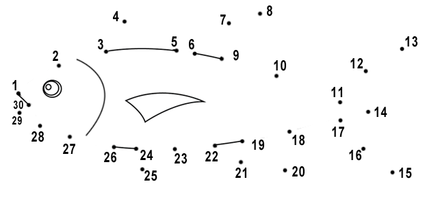
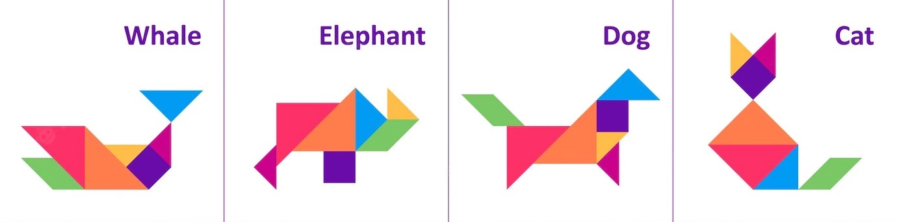
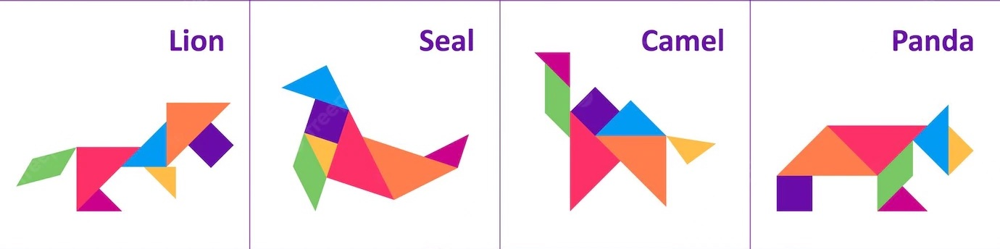

# Positionner - `goto(x, y)`

La fonction `goto(x, y)` permet de positionner la tortue à une position `(x, y)`.

Nous allons voir que :

- la fonction `pos()` retourne la position actuelle de la tortue,
- la fonction `goto(x, y)` positionne la tortue à la position `(x, y)`,
- les fonctions `xcor()` et `ycor()` retournent la coordonnée x ou y,
- les fonctions `setx(x)` et `sety(y)` affectent la coordonnée x ou y.

```{question}
La fonction `pos()` du module `turtle`

{f}`positionne la tortue`  
{f}`retourne la coordonnée x`  
{v}`retourne un tuple de coordonnées`  
{f}`vérifie si une valeur est positive`
```

## La position `pos()`

La fonction `pos()` retourne la position actuelle de la tortue, sous forme d'un tuple `(x, y)`. Dans le dessin de l'escalier, la fonction `write(pos())` affiche les coordonnées de chaque marche, marquée par un point noir.

```{exercise}
Affichez un point (dot) et les coordonnées de chaque point d'inflexion de l'escalier.
```

```{codeplay}
from turtle import *

for i in range(4):
    dot()
    write(pos())    # affiche la position (x, y)
    forward(50)
    left(90)
    forward(30)
    right(90)
    
forward(80)
```

## Valeur `xcor()` et `ycor()`

Les deux fonctions `xcor()` et `ycor()` retournent que la partie x ou y des coordonnées. Dans le dessin de l'escalier, la fonction `write(xcor())` affiche la coordonnée x, et la fonction `write(ycor())` affiche la coordonnée y de chaque marche.

```{exercise}
Transformez l'escalier en un escalier qui descend.
```

```{codeplay}
from turtle import *

for i in range(4):
    forward(50)
    left(90)
    dot()
    write(xcor())   # affiche la coordonnée x
    forward(30)
    right(90)
    dot()
    write(ycor())   # affiche la coordonnée y
    
forward(80)
```

## Positionner avec `goto()`

La fonction `goto(x, y)` positionne la tortue à la position `(x, y)`. Les coordonnées de la position de l’origine de chaque triangle sont affichées.

```{codeplay}
from turtle import *

def triangle():
    down()
    write(pos())
    for i in range(3):
        forward(100)
        left(120)
    up()
        
triangle()      # position à (0, 0)
goto(150, 50)
triangle()      # position à (150, 50)
goto(-200, 80)
triangle()      # position à (-200, 80)
```

## Dessiner un polygone

Avec la fonction `goto(x, y)` nous pouvons facilement dessiner une ligne polygonale.

```{codeplay}
from turtle import *

goto(0, 0)
goto(200, 0)
goto(200, 100)
goto(100, 150)
goto(0, 100)
goto(0, 0)
```

La fonction `goto()` accepte deux coordonnées x, y séparés sous la forme `goto(x, y)` ou alternativement un seul argument sous forme de tuple `goto(p)`.

```{codeplay}
from turtle import *

goto(0, 0)
goto(200, 0)
goto(200, 100)

p = (100, 150)
q = (0, 100)
r = (0, 0)

goto(p)
goto(q)
goto(r)
```

Mais une façon beaucoup plus compacte et flexible, c'est de représenter un polygone avec un tuple de points. Ensuite nous dessinons cette forme géométrique avec une boucle à l'aide de la fonction `goto(p)`.

```{exercise}
Ajoutez 4 points supplémentaires dans le tuple du polygone pour insérer une porte de taille 50x30.
```

```{codeplay}
from turtle import *

points = ((0, 0), (200, 0), (200, 100), (100, 150), (0, 100), (0, 0))

for p in points:
    goto(p)
    write(p)    # affiche la position (x, y)
```

## Relier les points

Relier les points est un casse-tête en deux dimensions qui comprend une suite de points numérotés à relier.



Le programme suivant numérote les points du polygone.

```{exercise}
Ajoutez encore la porte à la maison, mais dessinez que les points avec un numéro, sans dessiner les lignes, comme dans le jeu relier les points.
```

```{codeplay}
from turtle import *

points = ((0, 0), (200, 0), (200, 100), (100, 150), (0, 100), (0, 0))

i = 0
for p in points:
    goto(p)
    write(i)
    i = i + 1
```

## Déplacer un polygone

Avec le polygone représenté par un tuple de ses coordonnées, il est facile de le déplacer et redessiner le polygone ailleurs.

```{exercise}
Déplacez la maison vers une position où elle n'est plus superposée à la première maison.
```

```{codeplay}
from turtle import *

points = ((0, 0), (200, 0), (200, 100), (100, 150), (0, 100), (0, 0))

for p in points:
    goto(p)
    write(p)
    
color('red')
for p in points:
    q = p[0] - 150, p[1] - 50
    goto(q)
    write(q)
```

## Changer l'échelle

Avec le polygone représenté par un tuple de ses coordonnées, il est facile de le déplacer et redessiner le polygone ailleurs avec un changement d'échelle.

```{exercise}
Ajoutez une troisième maison encore plus petite.
```

```{codeplay}
from turtle import *

points = ((0, 0), (200, 0), (200, 100), (100, 150), (0, 100), (0, 0))

for p in points:
    goto(p)
    write(p)
    
color('red')
for p in points:
    q = 0.7 * p[0] - 200, 0.7 * p[1] - 100
    goto(q)
    write(q)
```

## Images miroirs

Dans le jeu de Tetris, nous pouvons définir les formes sous forme d'un tuple qui dessine un petit polygone. Multiplier les coordonnées par une variable `a` permet de changer de taille. Changer le signe d'une ou des deux coordonnées permet de trouver l'image miroir.

```{exercise}
Ajoutez l'image miroir manquante.
```

```{codeplay}
from turtle import *

a = 40
L = ((0, 0), (2, 0), (2, 1), (1, 1), (1, 3), (0, 3), (0, 0))

for p in L:
    q = a * p[0], a * p[1]
    goto(q)
    write(p)
    
for p in L:
    q = a * p[0], -a * p[1]
    goto(q)
    
for p in L:
    q = -a * p[0], -a * p[1]
    goto(q)
```

## Direction `heading()`

La fonction `heading()` renvoie la direction actuelle de la tortue.
La fonction `write(heading())` affiche la direction actuelle de la tortue à chaque extrémité.

```{codeplay}
from turtle import *

a = 100
n = 18

for i in range(n):
    forward(100)
    write(heading())
    backward(100)
    left(360/n)
```

La direction (heading) des 8 segments d'un octogone.

```{codeplay}
from turtle import *

n = 8
for i in range(n):
    write(heading())
    forward(70)
    left(360/n)
```

## Orienter avec `seth(a)`

La fonction opposée à `heading()` est `setheading(a)` ou sa version courte `seth(a)` qui permet d'orienter la tortue dans une direction particulière.

Ceci est pratique pour dessiner les pièces dans une direction spécifique.
Par exemple dans le Tetris, les figures peuvent avoir 4 orientations différentes.

```{exercise}
Ajoutez deux autres L avec une position et orientation appropriée pour créer un remplissage compact.
```

```{codeplay}
from turtle import *
a = 20

def L():
    down()
    for angle in (0, 90, 90, -90, 0, 90, 90, 0, 0, 90):
        forward(a)
        left(angle)
    up()

L()
goto(3*a, -a)
seth(90)
L()
```

## Tangram

Le tangram, « sept planches de la ruse », ou jeu des sept pièces, est une sorte de puzzle chinois. C'est une dissection du carré en sept pièces élémentaires. Des dissections plus générales, de formes différentes, sont également appelées tangrams.


```{exercise}
Utilisez les fonctions `goto(x, y)` et `setheading(a)` pour ajouter encore deux triangles et former un carré.
```

```{codeplay}
from turtle import *
a = 50

def triangle():
    p = pos()
    forward(2*a)
    left(90)
    forward(2*a)
    goto(p)
    
seth(45)
triangle()
goto(0, 2.82*a)
seth(-45)
triangle()
```

## Ligne polygonale

La fonction `polyline(points, p=(0, 0), size=(1, 1), w=1, pen='black', fill='white')` dessine une ligne polygonale définie par un tuple de points. Les arguments sont:

- `points` -- tuple de positions (x, y)
- `p` -- position de déplacement
- `size` -- facteur d'échelle

```{codeplay}
from turtle import *

def polyline(points, p0=(0, 0), size=(1, 1), w=1, pen='black', fill='white'):
    width(w)
    pencolor(pen)
    fillcolor(fill)
    goto(p0)
    begin_fill()
    for p in points:
        goto(p0[0]+p[0]*size[0], p0[1]+p[1]*size[1], )
        down()
    end_fill()
    up()

house = ((0, 0), (10, 0), (10, 15), (20, 15), (20, 0),
            (50, 0), (50, 25), (25, 50), (0, 25), (0, 0))

up()
polyline(house)
polyline(house, p=(-150, -50), fill='pink')
polyline(house, (90, -60), size=(2, 2), w=3)
polyline(house, (90, -80), size=(2, -1.5))
```

## Exercice

### Tangram

Choisissez un animal et recréez la figure.



```{codeplay}
from turtle import *
a = 50

def triangle():
    p = pos()
    begin_fill()
    forward(2*a)
    left(90)
    forward(2*a)
    goto(p)
    end_fill()

seth(90)
color('red')
triangle()
```

### Tangram 2

Choisissez un animal et recréez la figure.



```{codeplay}
from turtle import *
a = 50

from turtle import *
a = 50

def triangle():
    p = pos()
    begin_fill()
    forward(2*a)
    left(90)
    forward(2*a)
    goto(p)
    end_fill()

seth(180)
color('orange')
triangle()
```

### Musée d'art et d'histoire

Le [Musée d'art et d'histoire de Genève](http://institutions.ville-geneve.ch/fr/mah/) a mandaté le studio de graphisme zurichois [Hubertus Design](https://hubertus-design.ch) pour renouveler son identité visuelle. Ce logo à la ligne graphique dynamique, sobre et contemporaine symbolise dorénavant la marque MAH.

```{codeplay}
:file: MAH.py
from turtle import *
dot(1000, 'yellow')

M = (0, 0), (2, 3), (4, 0), (6, 3), (8, 0), (8, 8), (2, 5), (6, 5), (0, 8), (0, 0)
A = (0, 0), (6, 3), (2, 3), (8, 0), (4, 8), (0, 0)
H = (0, 0), (6, 3), (2, 3), (8, 0), (8, 8), (2, 5), (6, 5), (0, 8), (0, 0)

d = 20
def lettre(L):
    x0, y0 = pos()
    for x, y in L:
        goto(x0 + x * d, y0 + y * d)
        down()
    up()
    
up()
goto(-12*d, -4*d)
for c in (M, A, H):
    lettre(c)
    forward(8*d)

goto(-8*d, -10)
for s in ('MUSÉE', "D'ART", "D'HISTOIRE"):
    write(s, align='center', font=('Arial', 16))
    forward(8*d)
```

Créez 3 autres lettres dans le même style pour un autre musée dans une autre ville. Changez texte et couleur.
