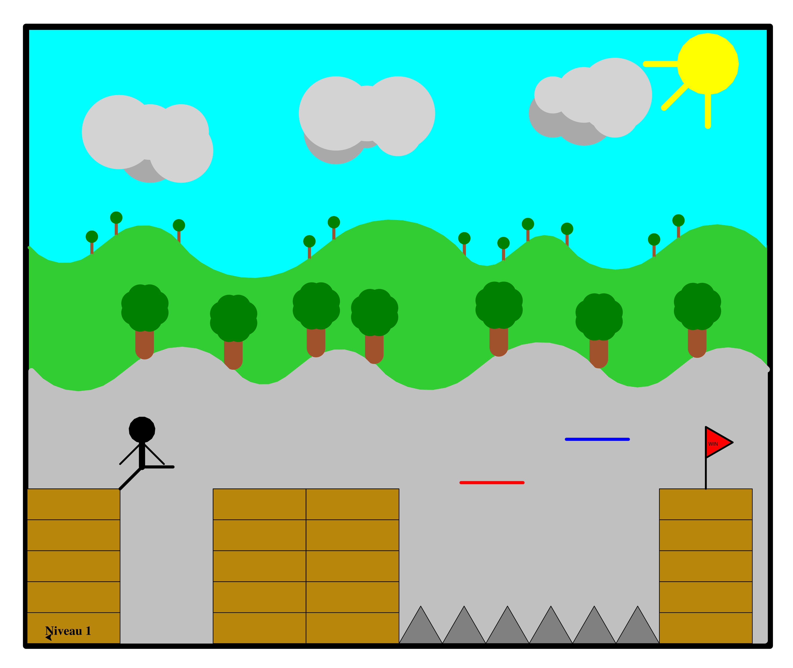
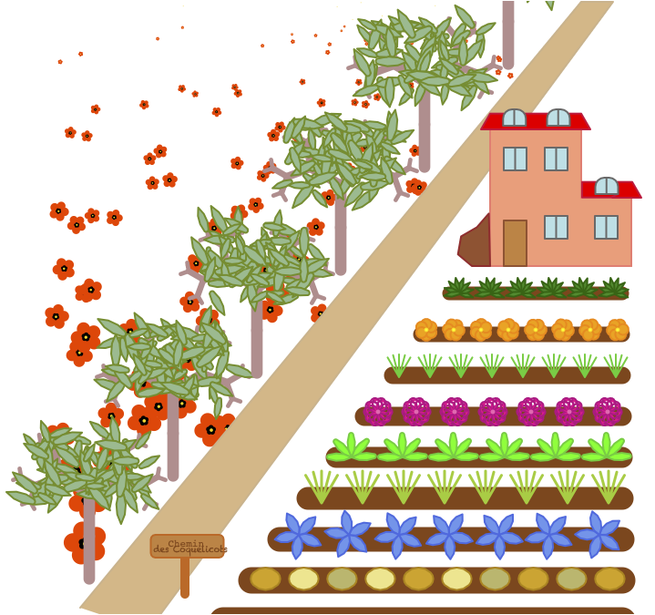
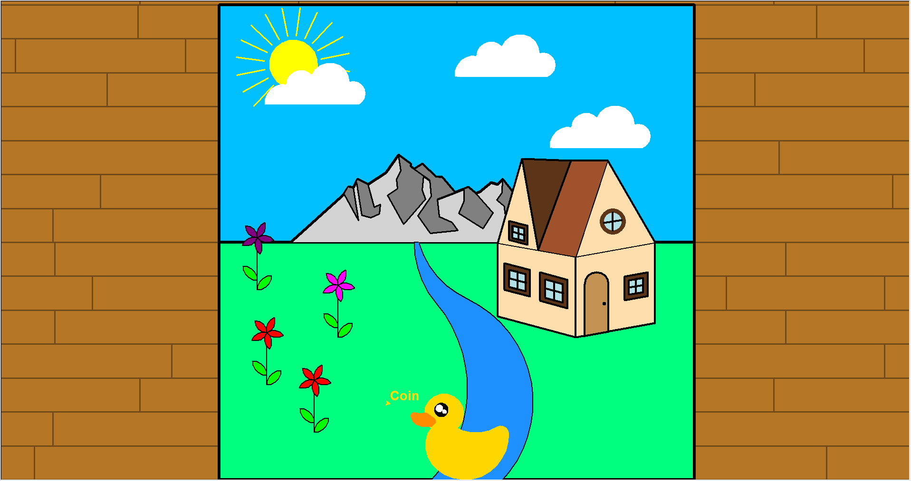
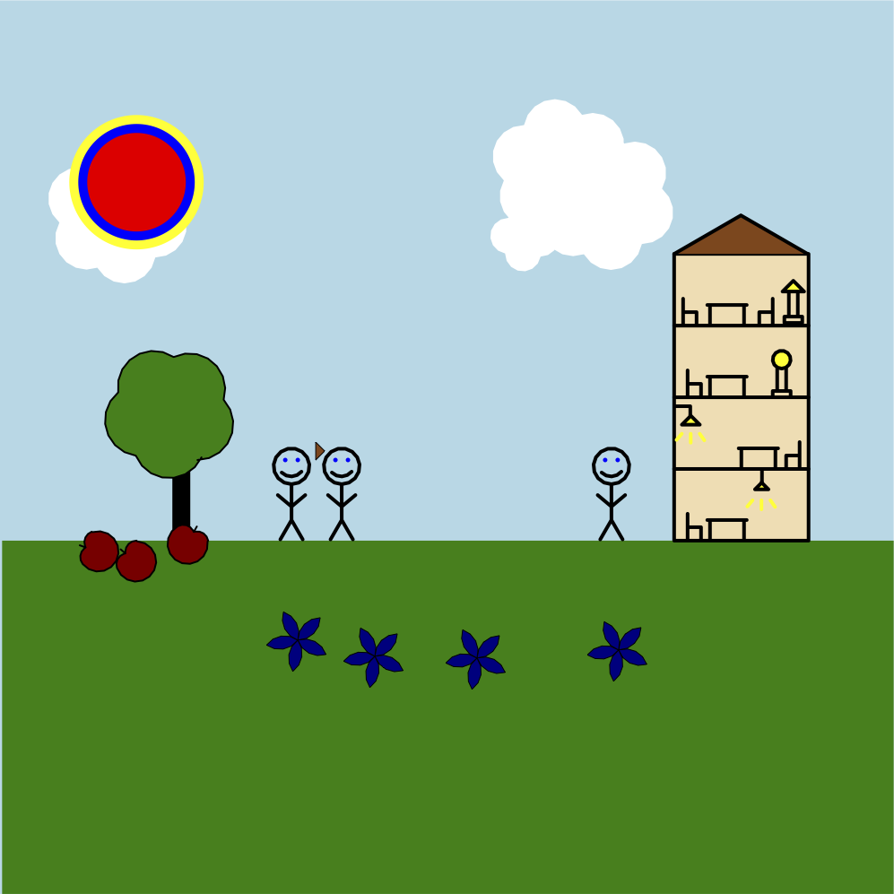
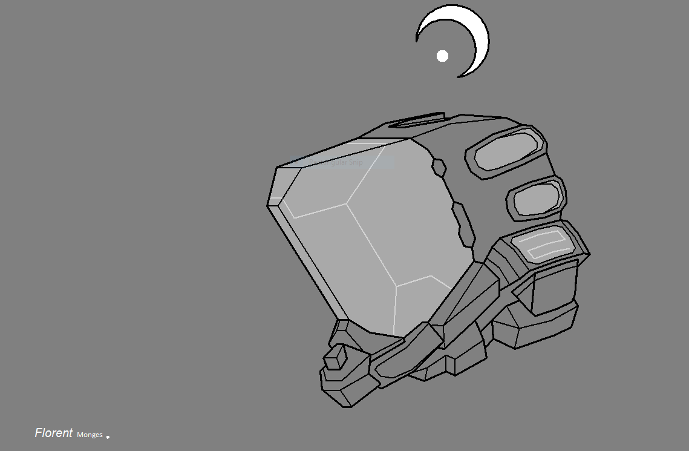
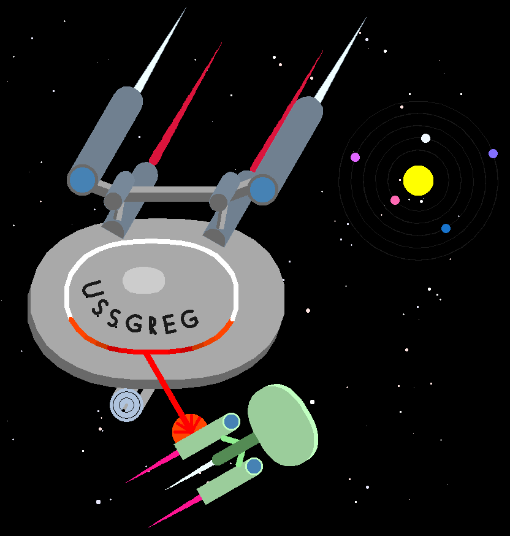
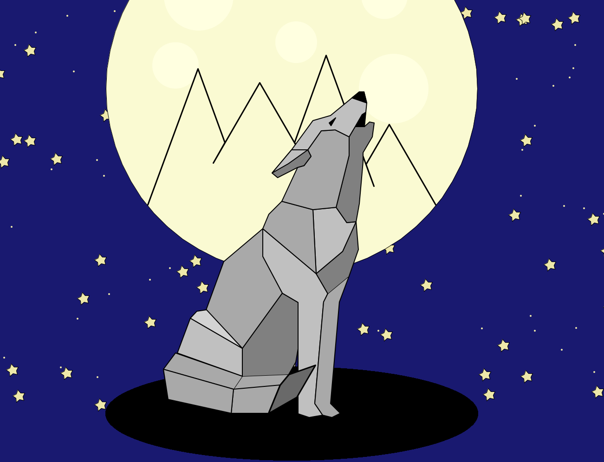
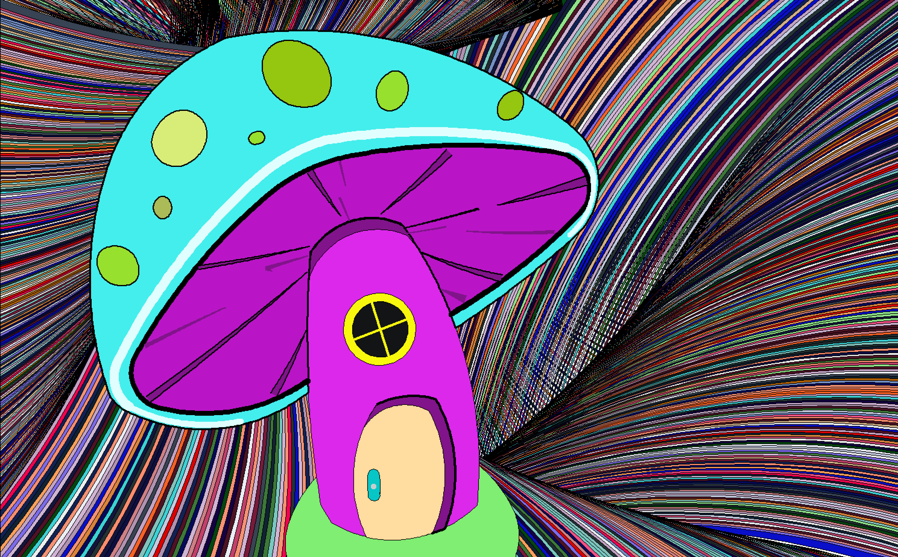
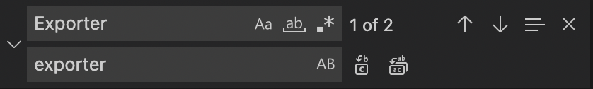
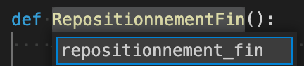

(prog1.projet)=
# Projet

Dans ce chapitre, nous allons faire un projet de dessin. Nous allons mettre en pratique un certain nombre de concepts de ce cours :

- dessiner
- définir
- colorier
- répéter
- cercler
- parcourir
- calculer
- typographier
- itérer
- paramétrer
- randomiser

## Consignes

Vous devez créer un dessin avec un programme Python.

En concret, vous devez :

- créer un dessin concret (pas abstrait)
- choisir un sujet libre : nature, ville, intérieur, jeux vidéo, science-fiction, etc.
- utiliser le module turtle pour dessiner
- écrire 500 à 1000 lignes de code
- commencer le programme avec un commentaire (auteur, date, description)
- utiliser des dots, lignes et le remplissage
- varier l'épaisseur du trait
- lever et baisser le stylo
- utiliser des cercles et des arcs de cercle
- utiliser des couleurs de ligne, point, remplissage et arrière-fond
- décomposer en fonctions appropriées, avec une taille de 2-15 lignes
- décrire chaque fonction avec un commentaire de 1-2 ligne
- utiliser des variables pour nommer vos entités (largeur, hauteur, rayon, couleur)
- utiliser des expressions mathématiques (largeur/n, 2*rayon, etc.)
- avoir une hiérarchie de fonctions (des plus complexes qui appellent des plus simples)
- définir d'abord toutes les fonctions pour dessiner
- définir une dernière fonction main() qui utilise ces fonctions pour créer un dessin
- appeler main() vers la fin du programme pour créer le dessin
- suivre la typographie standard PEP8 (espacement, noms des variables)
- vérifier votre code en ligne [pep8online.com](http://pep8online.com)
- parcourir avec for des séquences de couleurs, angles, distances, et tailles
- répéter avec for en 1D (par exemple: hublots, traverses, fenêtres, roues, clôtures)
- répéter avec for en 2D (par exemple: fenêtres, grilles, pixels, etc.)
- utiliser des fonctions aléatoires (module random) pour introduire de la variété
- utiliser la perspective : des objets plus près sont plus grands
- utiliser `random.seed(n)` pour rendre votre dessin reproductible
- exporter en format image : EPS, PNG, JPG
- déposer sur Moodle les 4 fichiers avec un nom de forme `prénom_projet1` (par exemple `alice_projet1.py`, `alice_projet1.eps`, etc.)

## Exemples

Ces exemples ont été créés par des élèves en 3M, en option complémentaire informatique, après 2 mois de cours sur la programmation en Python (environ 24 périodes au total).

### Jeu vidéo



### Maison de campagne



### Cadre des Pyrénées



### Japon


### Swiss space


### Maison meublée



### Casque d'astronaute



### Urbain et rural


### Star Trek



### Loup sous la lune



### Fantaisie psychédélique



### Bateaux de pêche


## Refactoring

Le Refactoring (réusinage) de code est l'opération consistant à retravailler le code source d'un programme informatique, de façon à en améliorer la lisibilité et, la maintenance, ou à le rendre plus générique.

Le refactoring est une réécriture de code pour le rendre

- plus lisible
- plus standard
- plus réutilisable
- plus général

Téléchargez le code source {download}`project1.py <code/projet1.py>`

## Style PEP 8

PEP est un acronyme anglais signifiant Python Enhancement Proposal que l'on pourrait traduire en français par « Proposition d'Amélioration de Python » (PAP donc 😄).

Le document [PEP 8](https://peps.python.org/pep-0008/) présente les bonnes conventions pour écrire du code lisible.

- Utilisez 4 espaces pour l'indentation
- Limitez les lignes à 79 caractères au maximum
- Séparez des fonctions par 2 lignes vides
- Écrivez les importations sur des lignes séparées

Espaces

- Ne mettez pas d'espace entre nom de fonction et parenthèse (faux: `f (x)`)
- Ne mettez pas d'espace à l'intérieur des parenthèses (faux: `f( x, y )`)
- Ne mettez pas d'espace avant `,`, `;`, `:` (faux: `def f(x , y) :`)
- Mettez un espace avant et après un opérateur (`+`, `-`, `*`, `/`, etc.)
- Mettez un espace avant et après le symbole d'affectation `=`

Allez sur le site [pep8online.com](http://pep8online.com)
et copiez-y votre code.

Corrigez les 77 erreurs de styles.

- Mettez un espace après `#`
- Mettez deux lignes vides entre fonctions
- Mettre un espace après `,`

## Nom de fonction

En Python les variables sont écrites avec des minuscules. Si une variable consiste en plusieurs mots, utilisez un tiret bas (`_`) pour séparer les mots.
En Python, les noms commençant avec des majuscules sont réservés pour les classes. Par exemple

`player = Player()`

Donc, changez les noms suivants :

- Exporter → exporter
- Niveau → niveau
- RepositionnementFin → repositionnement_fin
- PlateformePiques → plateforme_piques
- TriangleDrapeau → triangle_drapeau
- BatonDrapeau → baton_drapeau
- ReplacementPiques → replacement_piques
- Player → player
- Brique → brique
- Mur → mur
- ReplacementMur → replacement_mur
- Plateforme → plateforme

Comme un nom de fonction peut être utilisé à différents endroits nous avons avantage d'utiliser la fonction **rechercher et remplacer**


Dans VS Code nous avons aussi une fonction **Remplacer Symbol F2**



## Conseils

Ce programme est récursif - La fonction `main()` appelle `begin()` qui appelle `nuages()` qui appelle `soleil()` etc.
Pour avoir des fonctions réutilisables au maximum, vous devez écrire des fonctions indépendantes les unes des autres, avec beaucoup de paramètres.

Donc voici les conseils essentiels :

- utilisez la fonction `goto()` pour positionner la tortue (il ne faut pas inclure la position dans la fonction)
- créez des fonctions indépendants (il ne faut pas les enchaîner)
- créez des fonctions avec plein de paramètres (taille, couleur, épaisseur, etc.)
- utilisez des valeurs par défaut pour préconfigurer les paramètres de la fonction

## Jeu vidéo

Cette image utilise beaucoup d'éléments réutilisables:

- nuages
- arbres
- briques
- murs
- piques
- drapeau


### Soleil

La fonction `soleil()` n'a pas d'argument et utilise un cercle pour dessiner un disque. La position de départ est le bord inférieur du disque.

```{codeplay}
from turtle import *
getscreen().bgcolor('cyan')
up()

def soleil():
    # Dessine un soleil à 3 rayons
    seth(0)
    color("yellow")
    begin_fill()
    circle(50)
    end_fill()
    left(90)
    forward(50)
    left(90)
    down()
    width(10)
    for i in range(3):
        forward(100)
        backward(100)
        left(45)
    up()

goto(100, 80)
soleil()
```

Une meilleure façon est de créer une fonction `soleil(d, col, a, angle, n)` avec :

- un diamètre `d`
- une longueur de rayons `a`
- un angle entre les rayons `angle`
- un nombre de rayons `n`
- une couleur `col`
- une position initiale au centre du cercle

```{codeplay}
from turtle import *
getscreen().bgcolor('cyan')
speed(0)
up()

def soleil(d=100, a=100, angle=45, n=3, col='yellow'):
    color(col)
    dot(d)
    seth(180)
    down()
    width(10)
    for i in range(n):
        forward(a)
        backward(a)
        left(angle)
    up()

goto(100, 100)
soleil(80, a=400, n=10)
```

### Nuage

Dans ce projet, les nuages sont créés par 6 disques de taille aléatoire avec 2 niveaux de gris.

```{codeplay}
from turtle import *
from random import *
getscreen().bgcolor('cyan')
hideturtle()
up()

def nuage(taille):
    #Dessine un nuage avec une taille aléatoire
    for x in ("darkgray", "darkgray","lightgray") :
        taille = randint(2,4)
        dot(26*taille, x)
        forward(50)
    left(90)
    forward(30)
    left(90)
    forward(50)
    for i in range(3):
        taille = randint(2,4)
        dot(30*taille, "lightgray")
        forward(50)

nuage(100)
goto(-200, 0)
nuage(50)
```

La fonction `nuage()` possède un argument taille, mais cet argument n'a pas d'effet. La variable `taille` est remplacée par une valeur aléatoire dans l'intervalle [2, 4]. Voici ci-dessous cette fonction corrigée, pour créer des nuages de taille variable.

```{codeplay}
from turtle import *
from random import *
getscreen().bgcolor('cyan')
hideturtle()
up()

def nuage(taille):
    # Dessine un nuage avec une taille aléatoire
    seth(0)
    for x in ("darkgray", "darkgray","lightgray") :
        dot(taille * randint(2, 4), x)
        forward(1.7 * taille)
    left(90)
    forward(taille)
    left(90)
    forward(taille)
    for i in range(3):
        dot(taille * randint(2, 4), "lightgray")
        forward(1.8 * taille)

goto(-200, 0)
nuage(10)

goto(0, 0)
nuage(30)
```

### Arbre

La fonction `arbre_AP(angle)` (AP = arrière-plan):

- spécifie comme argument l'angle
- ne spécifie pas l'épaisseur du tronc
- ne permet pas de varier la taille
- laisse le stylo en position basse

```{codeplay}
from turtle import *

def arbre_AP(angle):
    # Dessine les arbres d'arrière-plan(=AP)
    color("sienna")
    right(angle)
    forward(30)
    dot(20, "green")
    up()
    backward(30)
    left(angle)
    color("limegreen")
    down()

arbre_AP(-90)
forward(100)
arbre_AP(-70)
forward(100)
arbre_AP(-50)
```

Une meilleure façon est de créer une fonction `arbre(h)` dont

- la direction est toujours verticale
- la taille (hauteur `h`) est un argument
- l'épaisseur du tronc et 0.2 fois la hauteur
- le diamètre du feuillage est 1.0 fois la hauteur
- qui laisse le stylo en position haute
- retourne au point de départ

```{codeplay}
from turtle import *
up()

def arbre(h):
    # Dessiner un abre de hauteur h
    color("sienna")
    down()
    width(0.2 * h)
    sety(ycor() + h)
    dot(1.0 * h, "green")
    up()
    sety(ycor() - h)

arbre(30)
forward(80)
arbre(60)
forward(120)
arbre(90)
```

### Montagne

La fonction `montagne_AP()`:

- n'a aucun argument
- dessine en arrière (de droite à gauche)
- nécessite deux fonctions supplémentaires (`colorier` et `replacement`)
- n'est pas réutilisable pour le premier plan (PP)

```{codeplay}
from turtle import *
speed(0)

def arbre_AP(angle):
    # Dessine les arbres d'arrière-plan(=AP)
    color("sienna")
    right(angle)
    forward(30)
    dot(20, "green")
    up()
    backward(30)
    left(angle)
    color("limegreen")
    down()

===
def montagne_AP():
    # Dessine les montagnes d'arrière-plan
    color("limegreen")
    begin_fill()
    down()
    width(5)
    left(38)
    for x in (100, 45, 150, 72):
        circle(x, 90)
        arbre_AP(128)
        forward(50)
        arbre_AP(128)
        circle(-x, 90)
        if x == 72:
            left(145)
        else:
            arbre_AP(38)

goto(300, 0)
left(90)
montagne_AP()
```

Une meilleure façon est de créer une fonction `montagne(h, rayons, couleur)` qui :

- accepte la taille des arbres `h`
- accepte une liste de rayons `rayons`
- accepte une couleur `couleur`
- mémorise le point de départ `p`
- descend vers -180
- mémorise une liste des positions des arbres
- dessine les arbres à ces positions
- peut être réutilisée pour le premier plan
- dessine de gauche à droite

```{codeplay}
from turtle import *
speed(0)
up()

def arbre(h):
    # Dessiner un abre de hauteur h
    color("sienna")
    down()
    width(0.2 * h)
    sety(ycor() + h)
    dot(1.0 * h, "green")
    up()
    sety(ycor() - h)
===
def montagne(h, rayons, couleur='lime'):
    arbre_pos = []
    p = pos() # memorize starting position
    fillcolor(couleur)
    begin_fill()
    seth(50)
    for r in rayons:
        circle(-r, 90)
        arbre_pos.append(pos())
        forward(50)
        arbre_pos.append(pos())
        circle(r, 90)
        arbre_pos.append(pos())
    sety(-180)
    setx(p[0])
    goto(p)
    end_fill()

    for p in arbre_pos[:-1]:
        goto(p)
        arbre(h)
        
goto(-280, 100)
montagne(30, (80, 50))
goto(-280, -50)
montagne(40, (80, 155, 150, 72), 'silver')
```

### Joueur

La fonction `joueur()` n'a aucun argument.

```{codeplay}
from turtle import *

def jambes():
    # Dessine les jambes du joueur
    left(45)
    width(5)
    forward(50)
    right(45)
    forward(50)
    backward(50)

def torse():
    # Dessine le torse du joueur
    left(90)
    width(10)
    forward(40)

def bras():
    # Dessine les bras du joueur
    width(3)
    right(135)
    forward(50)
    backward(50)
    left(270)
    forward(50)
    backward(50)
    right(45)

def tete():
    # Dessine la tête du joueur
    fillcolor("black")
    begin_fill()
    left(180)
    circle(20)
    end_fill()
    up()
    left(90)
    backward(40)
    left(135)
    forward(50)
    left(135)

def player():
    # Dessine le joueur
    jambes()
    torse()
    bras()
    tete()
    color("black")

player()
```

Une meilleure façon est de créer une fonction `joueur(a, bras, jambes, col)` qui :

- accepte la taille des membres `a`
- accepte une liste d'angles pour les `bras`
- accepte une liste d'angles pour les `jambes`
- accepte une couleur `col`

```{codeplay}
from turtle import *
up()

def member(angle, a):
    seth(270 - angle)
    width(a/10)
    forward(a)
    backward(a)

def player(a=50, bras=(45, 45), jambes=(45, 90), col='black'):
    color(col)
    down()
    seth(-90)
    width(a/5)
    dot(0.8 * a)
    forward(a/2)
    member(+bras[0], a)
    member(-bras[1], a)
    width(a/5)
    sety(ycor() - 0.8 * a)
    member(+jambes[0], a)
    member(-jambes[1], a)
    up()

player()
goto(180, 0)
player(70, bras=(80, 100), col='red')
```

### Mur

Nous utilisons la fonction `rectangle` pour dessiner un mur.
La fonction `mur(h, w, a, b)` dessine un mur avec h x w briques de taille a x b.

```{codeplay}
from turtle import *
speed(0)
up()

def rectangle(a, b, couleur='darkgoldenrod'):
    fillcolor(couleur)
    begin_fill()
    for x in (a, b, a, b):
        forward(x)
        left(90)
    end_fill()

def mur(h=5, w=1, a=150, b=50):
    # Mur de Brique qui forme la plateforme où le joueur peut se déplacer
    width(1)
    down()
    for j in range(w):
        for i in range(h):
            rectangle(a, b)
            sety(ycor()+b)
        sety(ycor() - h*b)
        forward(a)
    up()

goto(-280, -180)
mur()

goto(0, -180)
mur(5, 2, 80, 40)
```

### Piques

La fonction `piques()` dessine une série de 6 triangles de taille fixe.

```{codeplay}
from turtle import *
speed(0)
up()

def piques():
    # Dessine les piques
    fillcolor("gray")
    for i in range(6):
        begin_fill()
        for x in (60, 240, 240):
            left(x)
            forward(70)
        end_fill()
        backward(70)
        right(180)

goto(-200, -100)
down()
piques()
```

Une meilleure façon est de créer deux fonctions. Une fonction `triangle(a)` qui :

- peut être utilisé seul
- avec un côté `a`

et une fonction `piques(n, a)` qui répète le triangle `n` fois.

```{codeplay}
from turtle import *
speed(0)
up()

def triangle(a):
    begin_fill()
    for i in range(3):
        forward(a)
        left(120)
    end_fill()

def piques(n=6, a=70):
    down()
    fillcolor('gray')
    for i in range(n):
        triangle(a)
        forward(a)
    up()

goto(-200, -100)
piques()
goto(-200, -180)
piques(10, 40)
```

### Drapeau

La fonction `drapeau()` dessine un seul type de drapeau.

```{codeplay}
from turtle import *

def triangle_drapeau():
    # drap du drapeau
    fillcolor("red")
    begin_fill()
    right(120)
    forward(50)
    right(120)
    forward(50)
    right(120)
    forward(50)
    end_fill()
    backward(32)
    up()
    right(90)
    forward(5)
    color('black')
    write("WIN")

def baton_drapeau():
    # Baton du drapeau
    left(90)
    width(3)
    forward(100)

def drapeau():
    # Création du drapeau à atteindre
    baton_drapeau()
    triangle_drapeau()

drapeau()
```

Une meilleure façon est de créer une fonction `drapeau(h, a, col, text)` qui dessine un drapeau avec :

- une hauteur `h`
- un triangle de côté `a`
- de couleur `col`
- qui affiche `text`

```{codeplay}
from turtle import *

def triangle(a):
    begin_fill()
    for i in range(3):
        forward(a)
        left(120)
    end_fill()

def drapeau(h=100, a=50, col='red', text='WIN'):
    seth(90)
    down()
    forward(h)
    fillcolor(col)
    triangle(-a)
    backward(a/2)
    color('black')
    write(' '+ text)
    up()

drapeau()
goto(100, 0)
drapeau(150, 70, 'yellow', 'You loose')
```

### Plateforme

La fonction `plateforme_piques()` dessine deux plateformes fixes.

```{codeplay}
from turtle import *
hideturtle()

def plateformes_piques():
    # Plateformes qui se trouvent au-dessus des piques
    down()
    width(5)
    color("blue")
    forward(100)
    left(90)
    up()
    forward(70)
    right(90)
    forward(70)
    down()
    color("red")
    forward(100)
    up()

plateforme_piques()
```

Une meilleure façon est de créer une fonction `plateforme(col, a, w)` qui dessine une plateforme :

- de couleur `col`
- de longueur `a` et
- d'une épaisseur `w`

```{codeplay}
from turtle import *
hideturtle()
up()

def plateforme(col='red', a=100, w=5):
    down()
    width(w)
    color(col)
    forward(a)
    up()

plateforme()
goto(100, 50)
plateforme('blue')
goto(200, 100)
plateforme'lime')
```

Téléchargez le code source du projet réusiné {download}`project1b.py <code/projet1b.py>`

## Champignon

Ce projet utilise principalement la fonction `circle(r, angle)` qui permet de dessiner un arc de cercle de rayon `r` et d'une longueur défini par `angle`.

Par défaut, un cercle entier est dessiné avec 36 segments.
Si une meilleure précision est nécessaire, on peut augmenter le nombre de segments, en spécifiant le paramètre optionnel `step` de la façon suivante:
`circle(r, angle, steps=200)`.


Ci-dessous nous donnons quelques explications comment créer les éléments de ce type d'image.

### Sol et Base

Beaucoup d'éléments sont créés par des ovales. Par exemple le sol, la serrure et les ronds sur le chapeau.

```{codeplay}
from turtle import *
hideturtle()
up()

def ovale(r1, r2, angle=90, col='lime'):
    down()
    fillcolor(col)
    begin_fill()
    for i in range(2):
        circle(r1, angle/2)
        circle(r2, 180-angle)
        circle(r1, angle/2)
    end_fill()
    up()

def base(col='violet'):
    down()
    fillcolor(col)
    begin_fill()
    right(30)
    circle(50, 75)
    left(40)
    circle(180, 40)
    left(30)
    circle(30, 85)
    left(25)
    circle(400, 15)
    end_fill()
    up()

goto(0, -150)
ovale(100, 50, 40)
goto(-30, -100)
base()

goto(-150, 100)
ovale(20, 30, col='lightgreen')

goto(50, 100)
ovale(40, 30, col='lightgreen')
```

### Porte

La porte est composée de 4 segments courbés. Nous tournons à gauche (rayon `r` positif). La fonction `porte` possède un paramètre `r` pour la taille.
Ceci nous permet de dessiner un ombre de la porte plus grand (à 110%) et plus foncé, pour donner un effet 3D.

Pour bien fermer la forme, nous mémorisons la position de départ dans la variable locale `p`.
En fin du dessin nous fermons la courbe avec l'instruction `goto(p)`.

```{codeplay}
from turtle import *
hideturtle()
up()

def porte(r=100, col='bisque'):
    p = position()
    down()
    fillcolor(col)
    begin_fill()
    circle(r, 38)           # segement bas
    left(45)
    circle(1.1 * r, 60)     # segement gauche
    left(30)
    circle(0.7 * r, 40)     # segment haut
    left(45)
    circle(1.25 * r, 50)    # segment droite
    goto(p)                 # fermer la forme
    end_fill()
    up()

seth(-10)
porte(110, 'darkviolet')
seth(-10)
porte()
```

### Fenêtre

L'origine de la fenêtre est au centre. Elle peut être dessinée avec deux disques. La vitre est en noir et elle a une taille de 80% par rapport au diamètre extérieur.
Le cadre est fait avec 4 lignes qui partent du centre.

```{codeplay}
from turtle import *
from random import *
getscreen().bgcolor('violet')
hideturtle()
up()

def fenetre(p=(0, 0), d=60, col='yellow'):
    goto(p)
    color(col)
    dot(d)
    color('black')
    dot(0.8 * d)

    color(col)
    width(d/30)
    down()
    for i in range(4):
        forward(0.4 * d)
        backward(0.4 * d) 
        left(90)
    up()

left(10)
fenetre()
fenetre((100, 60), 100, 'aqua')
```

### Chapeau

Le chapeau est composé d'arcs de différents rayons.

```{codeplay}
from turtle import *
hideturtle()
up()

def chapeau_dessus(col='aqua') :
    p = position()
    fillcolor(col)
    begin_fill()
    down()
    width(3)
    circle(800, 9)    
    circle(60, 98)
    circle(350, 50)
    left(13)
    circle(180, 50)
    circle(300, 35)
    circle(30, 45)
    circle(140, 65)
    goto(p)
    end_fill()
    up()

def chapeau_dessous(col='violet'):
    fillcolor(col)
    p = position()
    down()
    begin_fill()
    width(8)
    circle(500, 15)
    circle(30, 125)
    circle(500, 20)
    circle(150, 30)
    circle(500, 20)
    circle(30, 105)
    circle(150, 50)
    goto(p)
    end_fill()
    up()

goto(50, -150)
chapeau_dessus()
goto(60, -130)
chapeau_dessous()
```

### Fentes

Pour dessiner les fentes du champignon, nous utilisons deux arcs de cercle.

L'arc commence en position `p` et pointe vers `center`. L'arc a une courbure donnée par `rayon`.
La longueur de l'arc est exprimée par une valeur décimale entre 0 et 1 (0.5 par défaut).
Au bout de l'arc nous tournons d'une valeur `angle` et nous revenons en arrière le même arc.

```{codeplay}
from turtle import *
hideturtle()
up()

def fente(p, rayon, angle, longueur=0.5, center=(0, 0), col='violet'):
    up()
    goto(p)
    down()
    
    d = distance(q)
    setheading(towards(q))
    # conversion de radiant en degrés (360/2/pi = 57)
    arc = longueur * d / rayon * 57
    
    fillcolor(col)
    begin_fill()
    circle(rayon, arc)   
    left(angle)
    circle(rayon, -arc)
    end_fill()

speed(10)
q = -55, 65
goto(q)
dot()

positions = (-200, 0), (-150, 130), (-10, 140), (150, 70), (200, -30), (50, -130), (-70, -100)

for p in positions:
    fente(p, 600, 10, center=q)
```

### Arrière-fond

Pour dessiner les lignes psychédéliques de l'arrière-fond, nous réutilisons les fentes de tout à l'heure.

Les fentes commencent le long des 4 bordes avec des coordonnées `(x, y)` et pointent vers `center`.

```{codeplay}
from turtle import *
from random import *
tracer(0)
up()

couleurs = ('coral', 'bisque', 'orange', 'pink', 'turquoise', 'lightblue', 
            'violet', 'gold', 'olive', 'tan')

def ombre(p, rayon, angle, longueur=0.5, center=(0, 0), col='violet'):
    up()
    goto(p)
    down()
    
    d = distance(q)
    setheading(towards(q))
    # conversion de radiant en degrés (360/2/pi = 57)
    arc = longueur * d / rayon * 57
    
    fillcolor(col)
    begin_fill()
    circle(rayon, arc, steps=100)   
    left(angle)
    circle(rayon, -arc, steps=100)
    end_fill()
    
q = -55, 25
goto(q)
dot()

for x in range(-300, 320, 10):
    ombre((x, 220), 600, 2, 0.8, center=q, col=choice(couleurs))

for y in range(200, -220, -10):
    ombre((320, y), 600, 2, 0.8, center=q, col=choice(couleurs))

for x in range(300, -320, -10):
    ombre((x, -220), 600, 2, 0.8, center=q, col=choice(couleurs))

for y in range(-200, 220, 10):
    ombre((-320, y), 600, 2, 0.8, center=q, col=choice(couleurs))
update()
```

## Loup

Ce projet utilise des polygones.


### Dessiner un polygone

Un polygone est défini comme un tuple de coordonnées `(x, y)` des points du polygone.

```{codeplay}
from turtle import *
up()

poly = ((189, 112), (146, 143), (96, 139), (102, 1), (159, 49), (189, 112))

goto(poly[0])
down()
for p in poly[1:]:
    goto(p)
    write(p)
up()
```

Nous devons d'abord aller vers le premier point du polygone `poly[0]`, baisser le stylo, et ensuite parcourir le reste de la séquence `poly[1:]`.

###  Dessiner le loup

La façon la plus efficace est de mettre les coordonnées de chaque polygone dans un tuple.
Ici nous commençons le tuple du polygone avec la couleur et nous ajoutons ensuite les points.
Le loup est constitué de 22 polygones.

```{codeplay}
from turtle import *
up()

polygons = (
('darkgrey', (0, -300), (-80, -300), (-74, -247), (24, -239), (0, -300)),
('darkgrey', (24, -239), (44, -216), (-55, -219), (-74, -247), (24, -239)),
('darkgrey', (-226, -205), (-200, -170), (-55, -219), (-74, -247), (-226, -205)),
('darkgrey', (-216, -270), (-226, -205), (-74, -247), (-80, -300), (-216, -270)),
('silver', (-55, -219), (-54, -159), (-167, -93), (-200, -170), (-55, -219)),

('grey', (44, -216), (59, -190), (64, -160), (64, -60), (29, -40), (-55, -159), (-55, -219), (44, -216)),
('silver', (64, -60), (64, -60), (63, -300), (87, -308), (117, -303), (99, -278), (119, -59), (127, -41), (102, 1), (-12, 98), (-12, 37), (29, -40), (64, -60)),
('dimgray', (0, -300), (60, -265), (100, -195), (44, -216), (24, -239), (0, -300)),
('darkgrey', (-12, 97), (-96, 26), (-133, -76), (-55, -159), (29, -40), (-12, 37), (-12, 97)),
('lightgrey', (-133, -76), (-168, -94), (-55, -159), (-133, -76)),

('darkgrey', (127, -42), (172, -3), (152, -59), (133, -278), (154, -300), (117, -304), (100, -279), (119, -60), (127, -42)),
('grey', (173, -3), (193, 53), (188, 113), (102, 1), (127, -42)),
('silver', (189, 112), (169, 110), (146, 143), (96, 139), (102, 1), (159, 49), (189, 112)),
('darkgrey', (96, 139), (28, 157), (-12, 97), (102, 1), (96, 139)),
('grey', (189, 112), (195, 151), (203, 241), (203, 261), (223, 295), (227, 325), (218, 327), (206, 317), (186, 317), (174, 295), (146, 143), (169, 110), (189, 112)),

('darkgrey', (96, 139), (28, 157), (61, 229), (76, 233), (90, 253), (84, 267), (112, 308), (143, 311), (174, 296), (174, 256), (146, 143), (96, 139)),
('grey', (62, 229), (77, 233), (91, 254), (85, 267), (8, 217), (62, 229)),
('silver', (8, 217), (85, 267), (50, 267), (8, 217)),
('black', (186, 318), (201, 343), (206, 318), (186, 318)),
('silver', (210, 348), (211, 367), (205, 392), (195, 392), (133, 340), (50, 267), (85, 267), (113, 308), (143, 311), (174, 296), (186, 318), (201, 343), (210, 348)),

('black', (135, 320), (130, 325),(145, 337), (135, 320)),
('black', (195, 393), (212, 368), (205, 393), (195, 393)),
)

for polygon in polygons:
    fillcolor(polygon[0])
    p = polygon[1]
    goto(p[0]/2, p[1]/2-20)
    down()
    begin_fill()
    for p in polygon[1:]:
        goto(p[0]/2, p[1]/2-20)
    end_fill()
    up()
    
hideturtle()
done()
```

### Changement d'échelle

L'utilisation de polygones permet de réutiliser la forme. Nous pouvons facilement changer :

- la position,
- la taille,
- l'orientation.

```{codeplay}
from turtle import *
up()

polygons = (
('darkgrey', (0, -300), (-80, -300), (-74, -247), (24, -239), (0, -300)),
('darkgrey', (24, -239), (44, -216), (-55, -219), (-74, -247), (24, -239)),
('darkgrey', (-226, -205), (-200, -170), (-55, -219), (-74, -247), (-226, -205)),
('darkgrey', (-216, -270), (-226, -205), (-74, -247), (-80, -300), (-216, -270)),
('silver', (-55, -219), (-54, -159), (-167, -93), (-200, -170), (-55, -219)),

('grey', (44, -216), (59, -190), (64, -160), (64, -60), (29, -40), (-55, -159), (-55, -219), (44, -216)),
('silver', (64, -60), (64, -60), (63, -300), (87, -308), (117, -303), (99, -278), (119, -59), (127, -41), (102, 1), (-12, 98), (-12, 37), (29, -40), (64, -60)),
('dimgray', (0, -300), (60, -265), (100, -195), (44, -216), (24, -239), (0, -300)),
('darkgrey', (-12, 97), (-96, 26), (-133, -76), (-55, -159), (29, -40), (-12, 37), (-12, 97)),
('lightgrey', (-133, -76), (-168, -94), (-55, -159), (-133, -76)),

('darkgrey', (127, -42), (172, -3), (152, -59), (133, -278), (154, -300), (117, -304), (100, -279), (119, -60), (127, -42)),
('grey', (173, -3), (193, 53), (188, 113), (102, 1), (127, -42)),
('silver', (189, 112), (169, 110), (146, 143), (96, 139), (102, 1), (159, 49), (189, 112)),
('darkgrey', (96, 139), (28, 157), (-12, 97), (102, 1), (96, 139)),
('grey', (189, 112), (195, 151), (203, 241), (203, 261), (223, 295), (227, 325), (218, 327), (206, 317), (186, 317), (174, 295), (146, 143), (169, 110), (189, 112)),

('darkgrey', (96, 139), (28, 157), (61, 229), (76, 233), (90, 253), (84, 267), (112, 308), (143, 311), (174, 296), (174, 256), (146, 143), (96, 139)),
('grey', (62, 229), (77, 233), (91, 254), (85, 267), (8, 217), (62, 229)),
('silver', (8, 217), (85, 267), (50, 267), (8, 217)),
('black', (186, 318), (201, 343), (206, 318), (186, 318)),
('silver', (210, 348), (211, 367), (205, 392), (195, 392), (133, 340), (50, 267), (85, 267), (113, 308), (143, 311), (174, 296), (186, 318), (201, 343), (210, 348)),

('black', (135, 320), (130, 325),(145, 337), (135, 320)),
('black', (195, 393), (212, 368), (205, 393), (195, 393)),
)
===
for polygon in polygons:
    fillcolor(polygon[0])
    p = polygon[1]
    goto(-100+p[0]/2, p[1]/2-20)
    down()
    begin_fill()
    for p in polygon[1:]:
        goto(-100+p[0]/2, p[1]/2-20)
    end_fill()
    up()

for polygon in polygons:
    fillcolor(polygon[0])
    p = polygon[1]
    goto(200-p[0]/3, p[1]/3)
    down()
    begin_fill()
    for p in polygon[1:]:
        goto(200-p[0]/3, p[1]/3)
    end_fill()
    up()
    
hideturtle()
done()
```

### Points numérotés

Il est possible de numéroter les 22 polygones et les points.
Les grands nombres désignent les polygones, les petits numéros désignent les sommets.

```{codeplay}
from turtle import *
up()

polygons = (
('darkgrey', (0, -300), (-80, -300), (-74, -247), (24, -239), (0, -300)),
('darkgrey', (24, -239), (44, -216), (-55, -219), (-74, -247), (24, -239)),
('darkgrey', (-226, -205), (-200, -170), (-55, -219), (-74, -247), (-226, -205)),
('darkgrey', (-216, -270), (-226, -205), (-74, -247), (-80, -300), (-216, -270)),
('silver', (-55, -219), (-54, -159), (-167, -93), (-200, -170), (-55, -219)),

('grey', (44, -216), (59, -190), (64, -160), (64, -60), (29, -40), (-55, -159), (-55, -219), (44, -216)),
('silver', (64, -60), (64, -60), (63, -300), (87, -308), (117, -303), (99, -278), (119, -59), (127, -41), (102, 1), (-12, 98), (-12, 37), (29, -40), (64, -60)),
('dimgray', (0, -300), (60, -265), (100, -195), (44, -216), (24, -239), (0, -300)),
('darkgrey', (-12, 97), (-96, 26), (-133, -76), (-55, -159), (29, -40), (-12, 37), (-12, 97)),
('lightgrey', (-133, -76), (-168, -94), (-55, -159), (-133, -76)),

('darkgrey', (127, -42), (172, -3), (152, -59), (133, -278), (154, -300), (117, -304), (100, -279), (119, -60), (127, -42)),
('grey', (173, -3), (193, 53), (188, 113), (102, 1), (127, -42)),
('silver', (189, 112), (169, 110), (146, 143), (96, 139), (102, 1), (159, 49), (189, 112)),
('darkgrey', (96, 139), (28, 157), (-12, 97), (102, 1), (96, 139)),
('grey', (189, 112), (195, 151), (203, 241), (203, 261), (223, 295), (227, 325), (218, 327), (206, 317), (186, 317), (174, 295), (146, 143), (169, 110), (189, 112)),

('darkgrey', (96, 139), (28, 157), (61, 229), (76, 233), (90, 253), (84, 267), (112, 308), (143, 311), (174, 296), (174, 256), (146, 143), (96, 139)),
('grey', (62, 229), (77, 233), (91, 254), (85, 267), (8, 217), (62, 229)),
('silver', (8, 217), (85, 267), (50, 267), (8, 217)),
('black', (186, 318), (201, 343), (206, 318), (186, 318)),
('silver', (210, 348), (211, 367), (205, 392), (195, 392), (133, 340), (50, 267), (85, 267), (113, 308), (143, 311), (174, 296), (186, 318), (201, 343), (210, 348)),

('black', (135, 320), (130, 325),(145, 337), (135, 320)),
('black', (195, 393), (212, 368), (205, 393), (195, 393)),
)
===
i = 0
for polygon in polygons:
    j = 0
    p = polygon[1]
    goto(p[0]/2, p[1]/2-20)
    down()
    for p in polygon[1:]:
        goto(p[0]/2, p[1]/2-20)
        if j == 0:
            write(i, font=(None, 14))
        else:
            write(j)
        j += 1
    up()
    i += 1

hideturtle()
```
