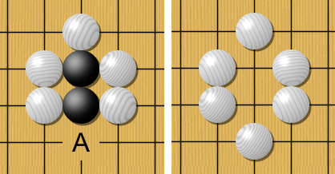

# Cliquer - `onclick()`

Dans ce chapitre nous explorons comment un programme peut détecter un clic de souris et y réagir.
Cliquer (toucher) est la méthode principale pour interagir avec un smartphone : quand le doigt touche une certaine position de l'écran, le programme y réagit. Nous allons voir que :

- la méthode `onclick(f)` permet de définir une fonction de rappel,
- la fonction de rappel `f(x, y)` est appelée lors d'un clic de souris,
- la méthode `listen()` met en marche l'écoute des événements interactifs.

```{question}
La méthode `onclick()` installe une fonction de rappel

{f}`sans paramètres`  
{f}`avec un paramètre`  
{v}`avec deux paramètres`  
{f}`qui doit être anonyme`
```

## Fonction de rappel

En informatique, une fonction de rappel (**callback** en anglais) ou fonction de post-traitement est une fonction qui est passée en argument à une autre fonction. Cette dernière peut alors faire usage de cette fonction de rappel comme de n'importe quelle autre fonction, alors qu'elle ne la connaît pas par avance.

## Fonction `onclick`

La méthode `onclick(f)` permet de définir une fonction `f` qui est alors appelée à chaque fois quand on clique avec la souris dans le canevas. À ce moment la fonction `f` est appelée avec les coordonnés `(x, y)` de la souris au moment du clic.

La variable `s` fait référence à l’objet `Screen` qui possède les deux méthodes :

- `onclick(f)` pour installer une fonction de rappel f() pour un clic de souris,
- `listen()` pour commencer à *écouter* les événements de la souris.

Le programme suivant dessine un point à la position du clic et affiche les coordonnées du point.

```{exercise}
Cliquez dans les 4 coins et au centre.
```

```{codeplay}
:file: onclick2.py
from turtle import *
s = getscreen()

hideturtle()
speed(0)
up()

def f(x, y):
    goto(x, y)
    dot()
    write((x, y))

s.onclick(f)
s.listen()
```

## Clics numérotés

Nous pouvons numéroter les clics.

```{codeplay}
:file: onclick3.py
from turtle import *
s = getscreen()

hideturtle()
speed(0)
up()
n = 0

def f(x, y):
    global n
    goto(x, y)
    dot()
    write('  ' + str(n))
    n += 1

s.onclick(f)
s.listen()
```

## Un mot par clic

Ce programme pose un mot d'une phrase à chaque clic de la souris.

```{codeplay}
from turtle import *
s = getscreen()
speed(0)
up()

phrase = 'un mot par clic de la souris'.split()
i = 0

def f(x, y):
    global i, phrase
    goto(x, y)
    write(phrase[i], font=(None, 24))
    i = (i + 1) % len(phrase)

s.onclick(f)
s.listen()
```

## Dessiner une forme

Dans ce programme nous dessinons une ligne entre les clics successifs.
C'est pour cette raison nous appelons la fonction `ligne(x, y)` au lieu de `f(x, y)`.

Nous réagissons également à deux touches du clavier :

- `u` (up) pour lever le stylo
- `c` (clear) pour effacer le canevas

```{exercise}
Dessinez une maison. Utilisez la touche `u` (up) pour dessiner une forme disjointe, par exemple la fenêtre.
```

```{codeplay}
:file: onclick5.py
from turtle import *
s = getscreen()
hideturtle()
speed(0)
up()

def ligne(x, y):
    goto(x, y)
    down()
    dot(20, 'pink')
    
s.onkey(up, 'u')
s.onkey(clear, 'c')
s.onclick(ligne)
s.listen()
```

## Remplir une forme

Dans ce programme nous dessinons une ligne entre les clics successifs.
C'est pour cette raison nous appelons la fonction `ligne(x, y)` au lieu de `f(x, y)`.

Nous réagissons également à deux touches du clavier :

- `u` (up) pour lever le stylo
- `c` (clear) pour effacer le canevas
- `b` (begin fill)
- `e` (end fill)

```{exercise}
Dessinez une maison. Utilisez la touche `b` (begin) pour commencer le remplissage et la touche `e` (end) pour terminer le remplissage.
```

```{codeplay}
:file: onclick6.py
from turtle import *
s = getscreen()
hideturtle()
fillcolor('pink')
speed(0)
up()

def ligne(x, y):
    goto(x, y)
    down()
    dot()
    
s.onkey(up, 'u')
s.onkey(clear, 'c')
s.onkey(begin_fill, 'b')
s.onkey(end_fill, 'e')
    
s.onclick(ligne)
s.listen()
```

## Lignes aimantées

Dans un éditeur il peut être pratique de déplacer les cliques vers une ligne de grille la plus proche.

L'expression `x // d * d` divise la coordonnée x par d et perds ainsi la partie décimale.
En mulitpliant par d nous obtenons des valeurs qui sont des multiples de d.

L'expression `(x + d/2) // d * d` déplace le coordonnée x de la moitié de d.
Le resultat est un déplacement horizontalement des points vers la ligne la plus proche, comme si les points serait attirés par une ligne aimanté. 

```{exercise}
Cliquez dans le canevas et observez comment les clics sont attiré horizontalement vers la ligne la plus proche.  
Modifiez d à 200.
```

```{codeplay}
from turtle import *
s = getscreen()
speed(0)
up()
d = 100

for x in range(-300, 301, d):
    goto(x, -200)
    down()
    goto(x, 200)
    up()

def f(x, y):
    goto(x, y)
    down()
    dot()
    q = (x + d/2) // d * d, y
    seth(towards(q))
    goto(q)
    stamp()
    up()

s.onclick(f)
```

## Points aimantés

Dans un éditeur il peut être pratique d'aligner les clics de la souris avec des positions d'une grille de points.

L'expression `(x + d/2) // d * d` aligne le point en horizontale.  
L'expression `(y + d/2) // d * d` aligne le point en verticale.  

```{exercise}
Cliquez dans le canevas et observez comment les clics sont attiré vers le point le plus proche.  
Modifiez d à 75.
```

```{codeplay}
from turtle import *
s = getscreen()
hideturtle()
speed(0)
up()
d = 150

for y in range(-150, 151, d):
    for x in range(-300, 301, d):
        goto(x, y)
        dot(d/5, 'red')

def f(x, y):
    goto(x, y)
    down()
    x = (x + d/2) // d * d
    y = (y + d/2) // d * d
    seth(towards(x, y))
    goto(x, y)
    stamp()
    up()

s.onclick(f)
```

## Aligner sur une grille

Nous pouvons faire en sorte que les points tombent sur les intersections d'une grille.

```{codeplay}
from turtle import *
s = getscreen()
hideturtle()
speed(0)
up()
d = 80

for y in range(-160, 200, d):
    for x in range(-240, 300, d):
        goto(x, y)
        dot()

def f(x, y):
    x = (x + d/2) // d * d
    y = (y + d/2) // d * d
    goto(x, y)
    down()
    dot(d/4, 'red') 

s.onclick(f)
s.listen
```

Nous pouvons arranger les disques noirs en grille.

```{codeplay}
:file: onclick8.py
from turtle import *
s = getscreen()
hideturtle()
speed(0)
up()
d = 80

for y in range(-160, 200, d):
    for x in range(-240, 300, d):
        goto(x, y)
        dot()

def f(x, y):
    x = (x + d/2) // d * d
    y = (y + d/2) // d * d
    goto(x, y)
    dot(d) 

s.onclick(f)
s.listen
```

## Placer dans des cases

Ici nous dessinons d'abord un tableau de jeu. Ensuite nous détectons la case dans laquelle le clic a eu lieu et y ajoutons un disque.
Observez que les disques peuvent se placer en dehors du tableau de jeu.

```{codeplay}
from turtle import *
s = getscreen()
hideturtle()
speed(0)
up()

x0, y0, d = 240, 160, 40

def ligne(p, q):
    goto(p)
    down()
    goto(q)
    up()

for x in range(-x0, x0+1, d):
    ligne((x, -y0), (x, y0))

for y in range(-y0, y0+1, d):
    ligne((-x0, y), (x0, y))

def f(x, y):
    x = x//d * d + d//2
    y = y//d * d + d//2
    goto(x, y)
    dot(d, 'red') 
    
s.onclick(f)
s.listen()
```

## Échiquier

Ici nous dessinons d'abord un tableau de jeu. Ensuite nous détectons la case dans laquelle le clic a eu lieu et y ajoutons un disque noir.
Cette fois nous faisons on test pour voir si le clic est dans l'intérieur du tableau de jeu.

```{codeplay}
:file: onclick11.py
from turtle import *
s = getscreen()
hideturtle()
speed(0)
up()

x0, y0, d = 160, 160, 40

def ligne(p, q):
    goto(p)
    down()
    goto(q)
    up()

for x in range(-x0, x0+1, d):
    ligne((x, -y0), (x, y0))

for y in range(-y0, y0+1, d):
    ligne((-x0, y), (x0, y))

def f(x, y):
    if -x0 < x < x0 and -y0 < y < y0:
        x = x//d * d + d//2
        y = y//d * d + d//2
        goto(x, y)
        dot(d) 
    
s.onclick(f)
s.listen()
```

## Tirer la tortue

Le programme suivant permet de déplacer la tortue avec la souris.

- `onclick` la tortue devient rouge,
- `ondrag` la tortue devient orange et suit la souris,
- `onrelease` la tortue devient verte et s'arrête.

```{caution}
La fonction on `onrelease` ne fonction pas dans ce site; la tortue ne devient jamais verte. Par contre ce programme fonctionne dans l'éditeur externe Thonny.
```

```{exercise}
Essayez de tirez la tortue lentement avec la souris.
```

```{codeplay}
:file: onclick12.py
from turtle import *
shape('turtle')
speed(0)

def f(x, y):
    fillcolor('red')
    
def g(x, y):
    fillcolor('orange')
    goto(x, y)
      
def h(x, y):
    fillcolor('green')
    print('release at', x, y)

onclick(f)
ondrag(g)
onrelease(h)
```

## Exercices

### Jeu de Go

Le jeu de go est un jeu de société originaire de Chine qui oppose deux adversaires qui placent à tour de rôle des pierres, respectivement noires et blanches, sur les intersections d'un tablier quadrillé. Le but est de contrôler le plan de jeu en y construisant des « territoires ». Les pierres encerclées deviennent des « prisonniers », le gagnant étant le joueur ayant totalisé le plus de territoires et de prisonniers.


Deux pierres noires en atari (à gauche), capturées au coup suivant (à droite).



Modifiez le jeu pour

- avoir une grille de 19 x 19 lignes
- colorier le tableau en beige
- avoir 3 x 3 points de repère sur les lignes 4, 10 et 16
- placer les pions sur les intersections
- alterner les pions noir et blancs

```{codeplay}
:file: go.py
from turtle import *
s = getscreen()
hideturtle()
speed(0)
up()

x0, y0, d = 160, 160, 40

def ligne(p, q):
    goto(p)
    down()
    goto(q)
    up()

for x in range(-x0, x0+1, d):
    ligne((x, -y0), (x, y0))

for y in range(-y0, y0+1, d):
    ligne((-x0, y), (x0, y))

def f(x, y):
    if -x0 < x < x0 and -y0 < y < y0:
        x = x//d * d + d//2
        y = y//d * d + d//2
        goto(x, y)
        dot(d) 
    
s.onclick(f)
s.listen()
```

Voici une partie d'un jeu de go sur un tableau de jeux annoté avec les lettres et nombres pour identifier les pions.


