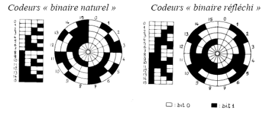
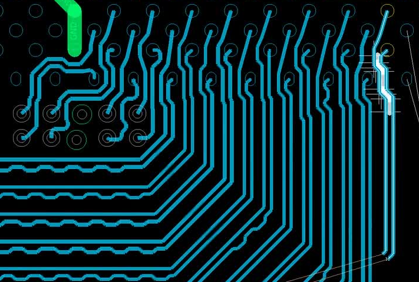
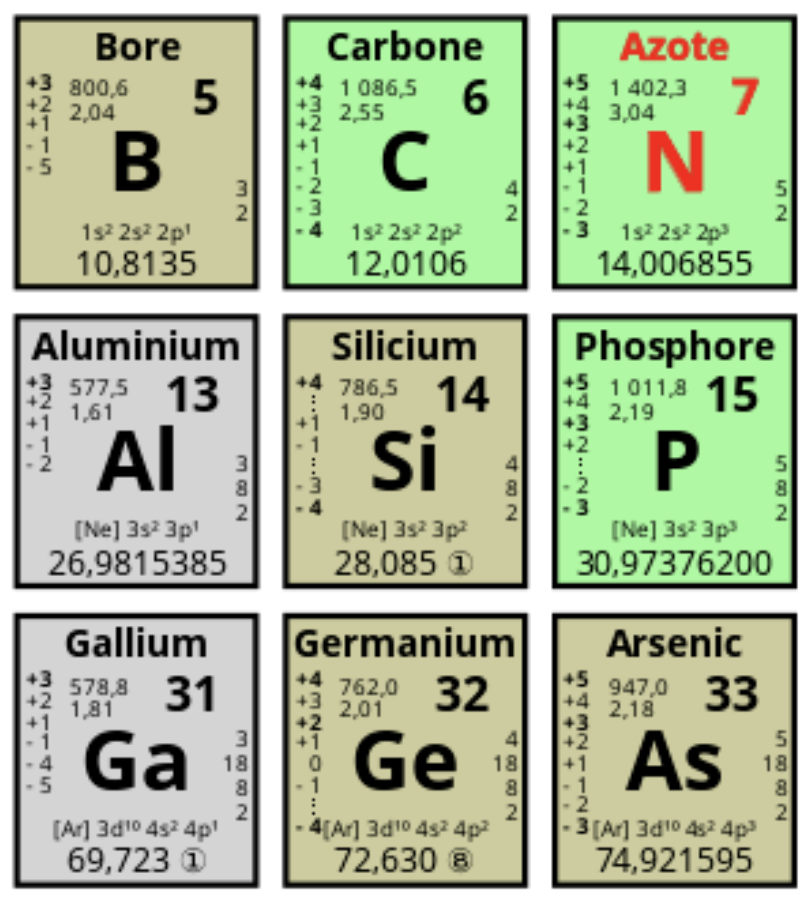
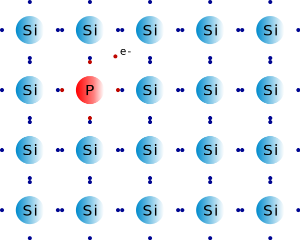
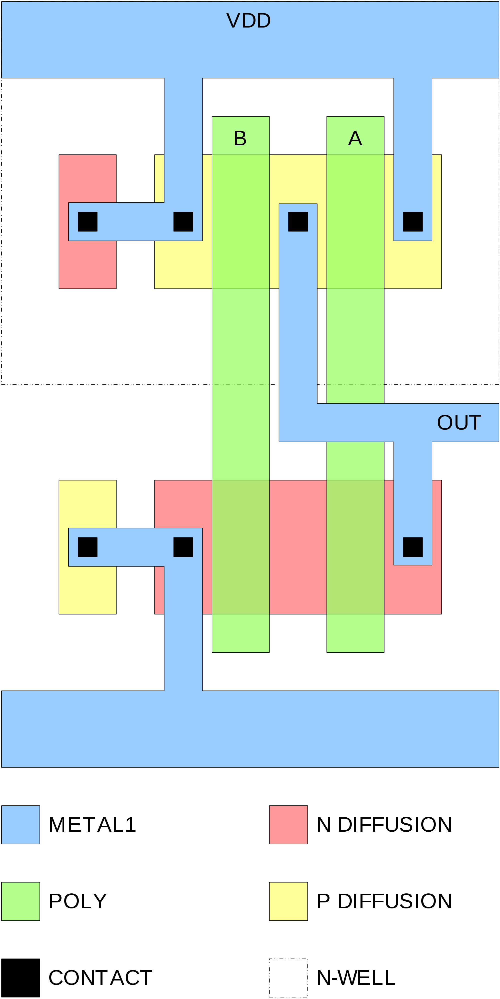
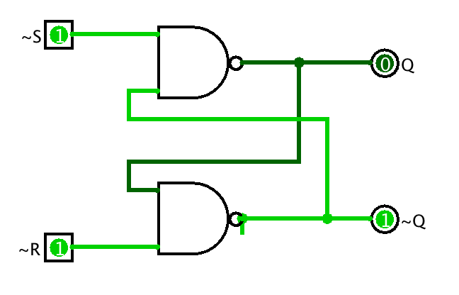

---
author:
- 'philippe.rochat\@eduvaud.ch'
bibliography:
- biblio.bib
nocite: '[@fonctionlogique]'
title:
- |
  Systèmes logiques\
  Option Complémentaire d'Informatique
- Corrigés
---

Introduction {#introduction .unnumbered}
============

Introduction
============

L'idée de construire un ordinateur revient à construire une machine qui traite automatiquement de l'information. Ce modèle coïncide avec le modèle de Turing et sa machine universelle.

Pour un tel dispositif, il nous faut d'abord une représentation de l'information. Cet objectif a déjà été atteint dans l'histoire des sciences avec la machine d'anticythere plus de 100 ans av. J.-C. proposant une représentation mécanique de mouvements astronomiques. En 1642, Blaise Pascal conçoit la Pascaline, une machine à calculer mécanique proposant cette fois une représentation arithmétique traduite dans des rouages mécaniques.

De leur côté, Lady Ada Lovelace et Charles Babbage font progresser cette technologie dans leurs travaux sur la machine analytique au milieu du [xix]{.smallcaps} siècle. À partir d'un système mécanique effectuant des opérations séquentielles sur des nombres, la machine analytique de Charles Babbage, Lady Ada Lovelace conçoit la première traduction en programme d'un algorithme, et c'est à ce titre qu'elle est considérée comme la première informaticienne de l'histoire.

Plus tard, dans le berceau de la deuxième guerre mondiale, l'électronique se développe et va proposer un formidable terrain pour la mise en place des premiers *gros*
ordinateurs (ENIAC, Colossus, \...) conçus à des fins militaires. Ces derniers vont constituer la première génération et servir de fondation à l'essor de la science informatique.

L'assemblage de ces premières *machines* se fait sur la base d'un ensemble de briques de bases qui se constitue et se normalise sur la base de théories mathématiques comme la logique booléenne et l'arithmétique binaire ainsi que sur l'assemblage circuits logiques, eux-mêmes constitués de portes logiques. Ces assemblages, appelés systèmes logiques, permettent la construction des premiers calculateurs, des processeurs qui constituent le noyau central des ordinateurs.

L'apparition de la technologie des semi-conducteurs apporte un deuxième élan à la constitution de composants dédiés au traitement de l'information de plus en plus performants.

Dans ce cours, nous allons aborder les éléments théoriques et l'architecture des systèmes logiques de base qui constituent les ordinateurs. Ceci devrait nous permettre de mieux comprendre le fonctionnement général des dispositifs utilisés dans l'informatique moderne.

Lire l'article \"L'ordinateur Antique\" [@ordiantique] attentivement (en annexe). On relèvera les éléments suivants :

\(1\)
Quelle représentation de l'information est proposée ?
Quel type d'opération est proposé ?
Quelles sont les opérations proposées ?
Au final, on complète le catalogue de dispositifs par un élément particulier pour atteindre le fonctionnement d'un ordinateur. Quel est ce dispositif ?

------------------------------------------------------------------------

Contenus du cours
-----------------

Le but de chapitre d'introduction est de mettre en place les premiers éléments qui conduisent à l'élaboration de systèmes logiques dans le cadre de la compréhension du fonctionnement des ordinateurs.

**Représentations binaires.**
Dans le chapitre suivant, nous examinerons plus en détail les principes de la représentation des nombres en binaire.

**Portes logiques.**
Par la suite, nous détaillerons les composants que sont les portes logiques qui proposent des opérations de base et qui permettent la conception de systèmes logiques complets.

**Semi-conducteurs.** Sans entrer dans les détails, nous expliquerons les principes et le fonctionnement des semi-conducteurs.

**Implémentation[^1] des portes logiques.** Nous montrerons dans cette partie comment il est possible de réaliser les différentes portes logiques vues précédemment avec des transistors et donc de réaliser des circuits intégrés proposant des systèmes logiques.

**Logique analytique.** Dans ce chapitre, nous proposons une construction rigoureuse de l'arithmétique logique en détaillant les bases et les propriétés qui nous seront utiles pour concevoir des systèmes logiques.

**Optimisation.** Nous mettrons en œuvre dans cette partie les concepts vus précédemment pour réaliser des circuits efficaces, donc optimisés. Pour cela, nous présenterons un outil *visuel* que sont les tables de Karnaugh.

**Systèmes logiques.** Nous exposons enfin dans ce chapitre quelques un des systèmes logiques les plus courants que nous avons sélectionner pour illustrer l'ensemble des concepts du cours.

Outils
------

### La calculatrice du système

Que ce soit avec OSX ou Windows, les deux systèmes proposent une calculatrice qui propose un mode *informatique* avec la possibilité de manipuler et convertir des nombres binaires.

### logic.ly

Le site logic.ly propose un éditeur et simulateur de circuits logiques. Sa mise en œuvre et son utilisation sont extrêmement simples, mais la version gratuite ne propose pas de sauvegarde des circuits. Nous limiterons donc son utilisation aux premiers exemples à tester.

### logisim

Logisim est un système complet de conception et de simulation de circuits logiques. Plus compliqué à prendre en main, il permet cependant d'explorer beaucoup plus loin le domaine. Il propose notamment la conception automatique d'un circuit logique à partir de sa table de vérité et affichant la forme canonique de l'expression induite et la visualisation des tables de Karnaugh permettant l'optimisation des circuits.

Objectifs
---------

L'objectif de ce cours est de comprendre les bases qui ont permis la conception et la réalisation des *micro*processeurs au cœur des ordinateurs. Après avoir suivi ce cours, on devrait pouvoir appréhender l'ensemble de ce qui se passe dans un microprocesseur comme celui présenté en simulation sur le site [visual6502.org](visual6502.org).

Représentation binaire
======================

Introduction
------------

La représentation binaire de l'information va nous permettre une représentation physique de l'information traduite dans deux états distincts. Dans les systèmes informatiques, il s'agit presque toujours d'une représentation avec deux tensions distinctes, mais on pourrait imaginer l'utilisation d'autres états physiques. C'est par exemple le cas dans le stockage sur des supports magnétiques où l'on utilise des orientations distinctes du champ. Des réalisations mécaniques, peu commodes ou irréalistes ont aussi été proposées comme un système avec des cordes et des poulies dans [@ordiantique].

Le choix binaire est également une commodité choisie arbitrairement. Ainsi les Russes avaient conçu en 1958 un ordinateur : l'ordinateur Setun qui travaillait en base trois. Depuis le début du 21e siècle, on développe également des ordinateurs quantiques basés sur des états quantiques superposés.

Il existe différentes façon de représenter de l'information. On parle de représentation pour des nombres, des images. On parle de format pour définir la structuration de l'information et d'encodage pour la représentation \"atomique\" des éléments de l'information. Dans ce chapitre, nous allons surtout nous intéresser aux différents encodages possibles.

### Bases : notions générales

Quelle que soit la base, un nombre est représenté par une suite de chiffres. Ainsi en base dix, 10 vaut 10, alors qu'en base deux, 10 (que l'on prononcera un-zéro) vaut 2, en base quatre, 10 (un-zéro) vaut 4, etc. Plus loin, en base dix, 100 vaut 100, alors qu'en base deux 100 (un-zéro-zéro) vaut 4.

À partir de là, nous pouvons poser une expression généralisée d'un nombre dans une base $B$ quelconque, nous avons tout d'abord les chiffres utilisés qui vont de

$$0 \rightarrow B-1$$.\
*Exemple :* 0, 1, 2, 3 en base 4.\
L'expression d'un nombre par une suite de chiffres :

$$C_n C_{n-1} ... C_1 C_0$$

nous donne un nombre :

$$C_n \times B^n + C_{n-1} \times B^{n-1} + ... + C_1 \times B^1 + C_0 \times C^0$$

#### Exemple

Prenons le nombre composé de quatre chiffres : 1101. Exprimé en base B, ce nombre s'analyse :

$$1\times B^{3}+1\times B^{2}+0\times B^{1}+1\times B^{0}$$

Ce qui donne :

-   1101 en base $B = 10$ : $1\times 10^{3}+1\times 10^{2}+0\times 10^{1}+1\times 10^{0} = 1101$

-   1101 en base $B = 8$ : $1\times 8^{3}+1\times 8^{2}+0\times 8^{1}+1\times 8^{0} = 577$

-   1101 en base $B = 2$ : $1\times 2^{3}+1\times 2^{2}+0\times 2^{1}+1\times 2^{0} = 13$

#### Bases supérieures à dix

Das le cas des Bases supérieures à dix, nous rencontrons le problème du nombre de chiffres disponibles. C'est notamment le cas de l'hexadécimal (base seize) très utilisé en informatique. Dans ce cas nous ajoutons des chiffres représentés par les premières lettres de l'alphabet.
Ainsi en hexadécimal, nous avons l'ensemble des chiffres C:

$$C = \{0,1,2,3,4,5,6,7,8,9,A,B,C,D,E,F\}$$

#### Exemples

-   $$A0 \rightarrow 160$$

-   $$FF \rightarrow 255$$

Le système hexadécimal est largement utilisé en informatique car il permet une notation compacte et une conversion sans calcul. En effet, 16 est une puissance de 2 ($2^4$), un chiffre en base 16 correspond donc à un nombre de 4 chiffres en base 2. Un octet (séquence de huit chiffres[^2]) en base 2 peut donc toujours s'exprimer avec 2 chiffres en hexadécimal.

#### Notations hexadécimales

Il existe plusieurs façons d'indiquer qu'un nombre est exprimé en hexadécimal

-   Notations préfixées

    -   0xA0 (language C)

    -   &h123 (BASIC)

    -   \$123 (en Pascal)

    -   0h123 (Texas Instrument)

    -   X'123' (COBOL)

-   Notations suffixées (utilisées en arithmétique)

    -   123h

    -   $123_{(16)}$

Convertir en base dix les nombres suivants.

\(3\)
$10_{(8)}$
$10_{(16)}$
$FF_{(16)}$

### Code Décimal, Codé Binaire (BCD)

Le code décimal, codé binaire (BCD)[^3] est l'encodage le plus répandu avec le complément à deux que nous verrons plus loin. C'est une traduction directe d'un nombre de la base dix à la base deux. On décompose ainsi le nombre décimal en puissance de deux. On parle de code 8421 car les 4 bits pondèrent les nombres 8, 4, 2 et 1 respectivement. Il existe d'autres façons d'organiser les bits[^4], mais de manière générale, sur un octet, on garde un ordre du plus grand au plus petit de gauche à droite, les autres organisations restant des cas très spécifiques. Par contre, une fois les bits regroupés par octets, il existe de nombreuses façon de représenter les plus grands nombres, on parlera par exemple d'architecture LITTLE ENDIAN ou BIG ENDIAN, nous verrons cela plus loin.
On obtient ainsi la table [2.1](#table:codeBCD){reference-type="ref" reference="table:codeBCD"}.

::: {#table:codeBCD}
   Chiffre   Bits
  --------- ------
      0      0000
      1      0001
      2      0010
      3      0011
      4      0100
      5      0101
      6      0110
      7      0111
      8      1000
      9      1001
     10      1010
     11      1011
     12      1100
     13      1101
     14      1110
     15      1111

  : Encodage BCD 8421
:::

Cela permet d'écrire la séquence 123 : 0001 0010 0011. Attention, le nombre 123 lui s'écrira : $$0111 1011$$ ce qui se vérifie facilement : $$2^6 + 2^5 + 2^4 + 2^3 + 2^1 + 2^0 = 64 + 32 + 16 + 8 + 2 + 1 = 123$$

**Multiplication par deux :** Pour multiplier par deux en binaire, il faut simplement décaler le nombre à gauche. C'est exactement similaire à la multiplication par dix en base dix. Par exemple: $0110_{binaire} (4 + 2 = 6_{decimal})$ devient $1100_{binaire} (8 + 4 = 12_{decimal})$.

**Division (entière) par deux (sans reste):** Pour diviser par deux en binaire, il faut simplement décaler le nombre à droite (inverse de la multiplication) en laissant disparaître les bits qui \"sortent\". Comme exemple, on peut simplement diviser douze par deux et vérifier que l'exemple ci-dessus fonctionne. Pour un nombre impair : $0101_{binaire} (4 + 1 = 5_{decimal})$ devient $0010_{binaire} (2_{decimal})$.\
\
Le grand intérêt du système BCD pour l'électronicien est la possibilité de
manipuler les chiffres en base dix pour différentes fins, notamment l'affichage, comme ce sera illustré dans les chapitres suivants.

Convertir les nombres décimaux suivants en binaire.

\(3\)

Convertir les nombres binaires suivants en décimal.

\(3\)
0011
0000
0010

### Codage de Gray

Comme nous aurons le temps de l'apprécier plus tard, un des problèmes importants des systèmes numériques tient dans la synchronisation des différents signaux numériques. Lorsque l'on conçoit un compteur, ce problème devient important car dans la représentation binaire des nombres entiers, il arrive souvent que plusieurs bits changent en même temps. Or pour différentes raisons, plus communément des questions de *temps de propagation*, les transitions peuvent se \"décaler\". Dans ce cas, il est possible que des nombres non désirés apparaissent dans le compte (l'exercice [\[propagation\]](#propagation){reference-type="ref" reference="propagation"} illustre parfaitement ce problème).
Considérons l'exemple suivant. Nous voulons concevoir un compteur trois bits, en faisant varier trois signaux, v0, v1, v2 :

{width="50%"}

Notons au passage qu'un système synchrone ne souffrira pas de ce genre de problème. C'est pour cela que dans un microprocesseur on utilise facilement le codage BCD puisque la synchronicité est assurée par un signal d'horloge (CLK).

Ce problème survient également dans les systèmes de comptage opto-mécanique utilisés pour déterminer des angles rotation dans une machine. Si le dispositif se salit (poussière, éclaboussure), on ne peut pas facilement détecter l'erreur.

Le codage de Gray propose une solution ou un seul bit change à chaque incrément. De cette façon, on adresse les deux problèmes évoqués : pas besoin de synchroniser les changements de bits, un changement de deux bits révèle immédiatement une erreur de lecture.

Ce code a été inventé par Frank Gray au *Bell Lavs* et breveté en 1953.

::: {#table:1}
   Décimal   Binaire   Gray
  --------- --------- ------
      0       0000     0000
      1       0001     0001
      2       0010     0011
      3       0011     0010
      4       0100     0110
      5       0101     0111
      6       0110     0101
      7       0111     0100
      8       1000     1100
      9       1001     1101
     10       1010     1111
     11       1011     1110
     12       1100     1010
     13       1101     1011
     14       1110     1001
     15       1111     1000

  : Codage de Gray
:::

On remarquera de plus que l'on peut recommencer le comptage de manière circulaire en respectant la règle du un seul bit qui change:

$$15 \rightarrow 0 \Leftrightarrow 0100 \rightarrow 0000$$

Ce qui nous permet d'encoder des disques pour la mesure de rotation angulaire dans une machine. On notera également les symétries qui apparaissent dans le codage de Gray sur la figure [2.2](#codeGray){reference-type="ref" reference="codeGray"}. Ce détail peut servir d'aide pour retrouver la table d'encodage, et on appelle également le codage de Gray *code binaire réfléchi*. Ainsi, pour \"construire\" un codage de Gray, on commence simplement avec 0 et 1, puis chaque fois que c'est nécessaire, on ajoute un bit à gauche en reprenant l'énumération des nombres précédents dans le sens inverse, on construit ainsi une table symétrique avec un 1 comme bit situé le plus à gauche.

{#codeGray width="50%"}

Nous utiliserons cette propriété de ne changer qu'un seul bit dans un espace circulaire plus loin, en particulier dans les tables de Karnaugh.

Temps de propagation

\(1\)
Soit un signal d'horloge à 3GHz, quelle est la durée d'une période du signal ?
Soit deux lignes différentes d'un même bus (servant par exemple à interconnecter le processeur et la RAM), une des lignes mesures 4cm et l'autre 2cm. Pour simplifier, prenons un temps de propagation égal à $c$ (vitesse de la lumière). Calculez le temps de propagation du signal sur ces deux lignes et mettez en évidence la différence en rapport avec la période du signal calculée précédemment.

[\[propagation\]]{#propagation label="propagation"}

{#codeGray width="50%"}

#### Transcodage binaire $\rightarrow$ Gray

La formule pour obtenir le code de Gray à partir du binaire pur est la suivante (méthode de l'addition décalée sans retenue):

$$N_{Gray} = \frac{N_{binaire}\oplus2N_{binaire}}{2}$$\
**Exemple complet :** soit $N_{binaire} = 0111$, on a $2N = 1110$, $N\oplus2N = 0111 \oplus 1110 = 1001$, que l'on divise par deux : $\frac{1001}{2}= 0100$ le code de Gray de sept en décimal.

Trouver le codage de Gray pour les nombres décimaux suivants :

\(3\)

#### Transcodage Gray $\rightarrow$ binaire

Pour la conversion de Gray vers binaire, on va cette fois lire le nombre de droite à gauche (du bit le plus significatif *Most Significant Bit, MSB* vers le bit le moins significatif *Less Significant Bit, LSB*).
Le premier bit (le plus à gauche) est strictement identique. Ensuite, si le bit suivant dans le code de Gray est à zéro, on recopie le bit précédent, s'il est à un, on l'inverse.

**Exemple 1 :** Nous avons $0100_{Gray}$.

$0 \rightarrow 0$

$1 \rightarrow 1$ (on change le bit précédent puisque nous avons un 1).

$0 \rightarrow 1$ (on recopie le bit précédent)

$0 \rightarrow 1$

Soit : $0111_{BCD}$ ce qui fait 7 en décimal.

**Exemple 2 :** Nous avons $01101_{Gray}$.

$0 \rightarrow 0$

$1 \rightarrow 1$ (on change le bit précédent puisque nous avons un 1).

$1 \rightarrow 0$ (on change le bit précédent puisque nous avons un 1).

$0 \rightarrow 0$ (on recopie le bit précédent).

$1 \rightarrow 1$ (on change le bit précédent puisque nous avons un 1).

Soit : $01001_{BCD}$ ce qui fait 9 en décimal.

À partir des nombres en codage de Gray suivants, trouver la représentation BCD et le nombre décimal correspondants :

\(3\)

### Code avec complément à deux

De manière générale, on définit la soustraction comme une addition du négatif du deuxième opérante:
$$A -B \Leftrightarrow A + (-B)$$
Pour pouvoir introduire la soustraction, il nous faut donc commencer par proposer une représentation des nombres négatifs.

#### Le bit de signe

Une première solution, simpliste, serait d'utiliser le bit de poids le plus fort (çàd. le bit le plus à gauche) comme bit de signe.\
Ainsi, pour -3 nous aurions: 1000 0011.\
Cette solution pose cependant problème:\
\

  ---- -----------
   3    0000 0011
   -3   1000 0011
   ??      ??
  ---- -----------

\
\
La soustraction ne se transforme pas en une addition simple.

#### Le complément à 1

Le complément à 1 s'obtient simplement en inversant tous les bits. Nous verrons plus loin qu'il est de plus facile de mettre en place un circuit logique pour effectuer cette opération. Nous obtenons alors:\
\

  ---- -----------
   3    0000 0011
   -3   1111 1100
   -0   1111 1111
  ---- -----------

\
\
Cette solution fonctionne, mais elle présente un désavantage, nous avons en effet deux représentations pour o (littéralement 0 et -0) : 0000 0000 et 1111 1111.
On voit cependant qu'il suffirait d'ajouter 1 à -0 pour retomber sur +0 en ignorant le retenue en dépassement.

#### Le complément à 2

Le complément à deux s'obtient donc en inversant tous les bits et en ajoutant 1 pour obtenir un nombre négatif. Nous obtenons ainsi :\
\

  ---- -----------
   3    0000 0011
   -3   1111 1101
   -0   0000 0000
  ---- -----------

\
\
Ce qui est la meilleure solution que nous allons donc retenir pour la représentation des nombres négatifs.

Cette opération correspond au calcul de $$2^n - |x|$$ où n est la longueur de la représentation et $$|x|$$ la valeur absolue du nombre à coder.
Ainsi, -1 s'écrit comme 256 - 1 = 255 = $1111 1111_{2}$, pour les nombres sur 8 bits. Ceci est à l'origine du nom de cette opération : \"complément à 2 puissance n\", quasi-systématiquement tronqué en \"complément à 2\".

On notera encore que l'opération est réversible.

Ainsi :
$-3 \rightarrow 1101; -(-3) \rightarrow 0011 \rightarrow 3$

Avec un mot de n bits, il est possible de représenter les valeurs de $-2n-1$ à $2n-1-1$ et il n'existe qu'une représentations possible pour la valeur 0.

Calculer la valeur min et la valeur max que l'on peut coder avec des mots de 8 bits (un octet).

Convertir les nombres décimaux suivants en binaire, complément à deux.

\(3\)

Effectuer en binaire les opérations suivantes.

\(3\)
- 3
- 5
- 8
- 19
- 4
- 126

### Code ASCII

Le Code ASCII (acronyme de Américan Standard Code for Information Interchange) est l'un des plus anciens et certainement le plus largement utilisé des codes représentatifs. Le tableau suivant énumère quelques caractères du code ASCII

  -------- ------- --- -------
   000*d*   00*h*       (nul)
   001*d*   01*h*       (soh)
   002*d*   02*h*       (stx)
   003*d*   03*h*       (etx)
   004*d*   04*h*       (eot)
   005*d*   05*h*       (enq)
   006*d*   06*h*       (ack)
   007*d*   07*h*       (bel)
   008*d*   08*h*       (bs)
   009*d*   09*h*       (tab)
   010*d*   0A*h*       (lf)
   011*d*   0B*h*       (vt)
   012*d*   0C*h*       (np)
   013*d*   0D*h*       (cr)
   014*d*   0E*h*       (so)
   015*d*   0F*h*       (si)
  -------- ------- --- -------

  -------- ------- --- -------
   016*d*   10*h*       (dle)
   017*d*   11*h*       (dc1)
   018*d*   12*h*       (dc2)
   019*d*   13*h*       (dc3)
   020*d*   14*h*       (dc4)
   021*d*   15*h*       (nak)
   022*d*   16*h*       (syn)
   023*d*   17*h*       (etb)
   024*d*   18*h*       (can)
   025*d*   19*h*       (em)
   026*d*   1A*h*       (eof)
   027*d*   1B*h*       (esc)
   028*d*   1C*h*       (fs)
   029*d*   1D*h*       (gs)
   030*d*   1E*h*       (rs)
   031*d*   1F*h*       (us)
  -------- ------- --- -------

  -------- ------- ----
   032*d*   20*h*  
   033*d*   21*h*   !
   034*d*   22*h*   \"
   035*d*   23*h*   \#
   036*d*   24*h*   \$
   037*d*   25*h*   \%
   038*d*   26*h*   &
   039*d*   27*h*  
   040*d*   28*h*   (
   041*d*   29*h*   )
   042*d*   2A*h*   \*
   043*d*   2B*h*   \+
   044*d*   2C*h*   '
   045*d*   2D*h*   \-
   046*d*   2E*h*   .
   047*d*   2F*h*   /
  -------- ------- ----

  -------- ------- ----
   048*d*   30*h*   0
   049*d*   31*h*   1
   050*d*   32*h*   2
   051*d*   33*h*   3
   052*d*   34*h*   4
   053*d*   35*h*   5
   054*d*   36*h*   6
   055*d*   37*h*   7
   056*d*   38*h*   8
   057*d*   39*h*   9
   058*d*   3A*h*   :
   059*d*   3B*h*   ;
   060*d*   3C*h*   \<
   061*d*   3D*h*   =
   062*d*   3E*h*   \>
   063*d*   3F*h*   ?
  -------- ------- ----

\
\

  -------- ------- ---
   064*d*   40*h*   @
   065*d*   41*h*   A
   066*d*   42*h*   B
   067*d*   43*h*   C
   068*d*   44*h*   D
   069*d*   45*h*   E
   070*d*   46*h*   F
   071*d*   47*h*   G
   072*d*   48*h*   H
   073*d*   49*h*   I
   074*d*   4A*h*   J
   075*d*   4B*h*   K
   076*d*   4C*h*   L
   077*d*   4D*h*   M
   078*d*   4E*h*   N
   079*d*   4F*h*   O
  -------- ------- ---

  -------- ------- -----
   080*d*   50*h*    P
   081*d*   51*h*    Q
   082*d*   52*h*    R
   083*d*   53*h*    S
   084*d*   54*h*    T
   085*d*   55*h*    U
   086*d*   56*h*    V
   087*d*   57*h*    W
   088*d*   58*h*    X
   089*d*   59*h*    Y
   090*d*   5A*h*    Z
   091*d*   5B*h*   \[
   092*d*   5C*h*    '
                   
   093*d*   5D*h*   \]
   094*d*   5E*h*   \^
   095*d*   5F*h*   '\_
  -------- ------- -----

  -------- ------- ---
   096*d*   60*h*   '
   097*d*   61*h*   a
   098*d*   62*h*   b
   099*d*   63*h*   c
   100*d*   64*h*   d
   101*d*   65*h*   e
   102*d*   66*h*   f
   103*d*   67*h*   g
   104*d*   68*h*   h
   105*d*   69*h*   i
   106*d*   6A*h*   j
   107*d*   6B*h*   k
   108*d*   6C*h*   l
   109*d*   6D*h*   m
   110*d*   6E*h*   n
   111*d*   6F*h*   o
  -------- ------- ---

  -------- ------- ----
   112*d*   70*h*   p
   113*d*   71*h*   q
   114*d*   72*h*   r
   115*d*   73*h*   s
   116*d*   74*h*   t
   117*d*   75*h*   u
   118*d*   76*h*   v
   119*d*   77*h*   w
   120*d*   78*h*   x
   121*d*   79*h*   y
   122*d*   7A*h*   z
   123*d*   7B*h*   '{
   124*d*   7C*h*   \|
   125*d*   7D*h*   '}
   126*d*   7E*h*   \~
   127*d*   7F*h*  
  -------- ------- ----

Il existe évidemment d'autrs encodages comme l'UTF-8 ou l'UTF-16 largement utilisés, mais que nous ne détaillerons pas ici.

Les portes logiques
===================

Dans ce chapitre, nous allons détailler les différentes portes logiques, leur fonctionnement et leurs particularités.

Dans la suite de ce chapitre, nous proposons des tables de vérité avec des 0 et des 1, ce qui est un raccourci pour table de vérité représentée en binaire avec 0 pour F (Faux) et 1 pour V (Vrai). Ces raccourcis qui peuvent sembler peu rigoureux dans un autre contexte sont courants en informatique.

La porte NON (Inverseur)
------------------------

La porte logique NON (NOT en anglais) propose la fonction logique suivante:

$$A \rightarrow \bar{A}$$

### Symbole

(0,0) node (myNOT) \[not port\];

### Table de vérité

  ----- -----------
        
   $A$   $\bar{A}$
    0        1
    1        0
  ----- -----------

La porte OU
-----------

La porte logique OU (OR en anglais) propose la fonction logique suivante:
$$A, B \rightarrow A+B$$

### Symbole

(0,0) node (myOR) \[or port\];

### Table de vérité

  ----- ----- -------
              
   $A$   $B$   $A+B$
    0     0      0
    0     1      1
    1     0      1
    1     1      1
  ----- ----- -------

La porte ET
-----------

La porte logique ET (AND en anglais) propose la fonction logique suivante:
$$A, B \rightarrow A\cdot B$$

### Symbole

(0,0) node (myAND) \[and port\];

### Table de vérité

  ----- ----- ------------
              
   $A$   $B$   $A\cdot B$
    0     0        0
    0     1        0
    1     0        0
    1     1        1
  ----- ----- ------------

La porte OU Exclusif
--------------------

La porte logique OU Exclusif (XOR en anglais) propose la fonction logique suivante:
$$A, B \rightarrow A\oplus B$$

### Symbole

(0,0) node (myXOR) \[xor port\];

### Table de vérité

  ----- ----- -------------
              
   $A$   $B$   $A\oplus B$
    0     0         0
    0     1         1
    1     0         1
    1     1         0
  ----- ----- -------------

La porte NON-OU
---------------

La porte logique NON-OU (NOR en anglais) propose la fonction logique suivante:
$$A, B \rightarrow \overline{A+B}$$

Soit l'inverse de la fonction OU.

### Symbole

(0,0) node (myNOR) \[nor port\];

### Table de vérité

  ----- ----- -------
              
   $A$   $B$   $A+B$
    0     0      1
    0     1      0
    1     0      0
    1     1      0
  ----- ----- -------

La porte NON-ET
---------------

La porte logique NON-ET (NAND en anglais) propose la fonction logique suivante:
$$A, B \rightarrow \overline{A\cdot B}$$

Soit l'inverse de la fonction ET.

### Symbole

(0,0) node (myNAND) \[nand port\];

### Table de vérité

  ----- ----- -----------------------
              
   $A$   $B$   $\overline{A\cdot B}$
    0     0              1
    0     1              1
    1     0              1
    1     1              0
  ----- ----- -----------------------

La porte NON-OU exclusif
------------------------

La porte logique NON-OU exclusif (XNOR en anglais) propose la fonction logique suivante:
$$A, B \rightarrow \overline{A\oplus B}$$

Soit l'inverse de la fonction XOR. De plus cette fonction propose un comparateur qui retourne VRAI (1) si les deux entrées sont identiques.

### Symbole

(0,0) node (myXNOR) \[xnor port\];

### Table de vérité

  ----- ----- ------------------------
              
   $A$   $B$   $\overline{A\oplus B}$
    0     0              1
    0     1              0
    1     0              0
    1     1              1
  ----- ----- ------------------------

Les Circuits Intégrés (CI) contiennent souvent plusieurs portes logiques et coûtent moins cher achetés en grande quantité. Il peut donc être intéressant de réaliser des portes logiques en combinant d'autres portes logiques.
Dans notre exemple nous allons supposer que nous n'avons que des portes NAND à disposition[^5] pour réaliser nos circuits et nous souhaitons donc, pour chaque porte de base, proposer un circuit équivalent constitué de portes NAND uniquement.

\(3\)
NOT
AND
OR
XOR
NOR
XNOR

Avec le logiciel *Logisim*, on peut concevoir automatiquement un circuit en donnant sa table de vérité. On peut de plus donner comme contrainte de n'utiliser que des portes NAND, ce qui nous permet d'obtenir facilement le corrigé de l'exercice précédent.

{#fig:SN74 width="50%"}

Semi-Conducteurs
================

Généralités
-----------

Dans un atome, les électrons sont organisés en bandes d'énergie autour du noyau. Un matériau conducteur possède pour les couches externes :

-   Une bande de valence qui est complète.

-   Une bande de conduction qui est partiellement remplie. Cette couche contient donc quelques électrons qui participent au courant électrique.

De plus, pour être conducteur, il faut que ces deux bandes se superposent, ce qui permet la circulation des électrons dans le solide.
Dans le cas des semi-conducteurs, l'espace \"interdit\" qui sépare ces deux bandes est relativement faible et permet donc aux électrons de circuler à certaines conditions de température et d'énergie transmise aux électrons sous forme de champs électrique.

Le silicium mono-cristallin
---------------------------

Le silicium mono-cristallin est un semi-conducteur obtenu à des températures d'environ $1'700^o$. Un atome de silicium possède quatre électrons sur huit dans la dernière bande. Dans le réseau mono-cristallin obtenu, les atomes de silicium ont chacun quatre voisins liés par des liaisons covalantes. Dans cette configuration, tous les électrons sont utilisés dans les liaisons, et le courant ne peut plus passer. On retrouve une situation similaire dans la bande suivante avec le germanium (voir figure [4.1](#fig:period){reference-type="ref" reference="fig:period"}).

{#fig:period width="50%"}

Silicium dopé
-------------

On peut introduire des atomes d'un autre élément dans le silicium mono-cristallin (sans détailler ici le processus). On peut ajouter des atomes de phosphore dans le cristal de silicium. Cela ajoute un des électrons libres en excédents qui peuvent voyager, et l'on obtient un courant. Le silicium ainsi dopé devient conducteur (figure [4.2](#fig:dopageN){reference-type="ref" reference="fig:dopageN"}).

{#fig:dopageN width="50%"}

On parle de dopage N. On peut aussi utiliser de l'arsenic pour le dopage.

De manière symétrique, on peut doper le silicium avec de l'aluminium (ou du Bore) pour obtenir un dopage P, avec un déficit d'électrons (figure [4.3](#fig:dopageP){reference-type="ref" reference="fig:dopageP"}).

{#fig:dopageP width="50%"}

Là aussi, le silicium devient conducteur.

Jonction P-N et diode
---------------------

On obtient une jonction P-N lorsque l'on met en contact une zone P avec une zone N. En principe, il s'agit du même substrat de silicium mono-cristallin dopé d'une part en mode P, d'autre part en mode N. Il se forme à la jonction une zone de *déplétion*. Cela se traduit par une migration des électrons de la zone où ils sont en excès vers la zone où ils sont en déficit. Cela crée une zone ou il n'y a plus de porteurs libres, c'est-à-dire plus d'électrons disponibles pour établir un courant. Cette zone a les mêmes propriétés que le silicium pur (non-conducteur).

Si on applique une tension en polarisation directe, comme sur la figure [4.4](#fig:forward){reference-type="ref" reference="fig:forward"}, les charges libres regagnent la partie N de la zone de déplétion et inversement, le déficit est repoussé du côté P. À partir d'une certaine tension, la zone de déplétion disparaît et le courant peut à nouveau circuler.

{#fig:forward width="50%"}

À l'inverse, si on applique une tension en polarisation inverse, la zone de déplétion s'agrandit et le milieu devient fortement isolant jusqu'à une tension dite d'effondrement. Ceci est illustré sur la figure [4.5](#fig:reverse){reference-type="ref" reference="fig:reverse"}.

{#fig:reverse width="50%"}

Ce dispositif est à la base la diode, un composant électronique qui laisse passer le courant dans un sens mais pas dans l'autre. Lorsque la tension est suffisante en polarisation directe, le courant passe avec, éventuellement, émission de photons dans le cas des DEL. Cette tension en polarisation directe dépend des matériaux utilisés et de différentes caractéristiques de la diode, mais elle est très fréquemment de 0.7V.

Les transistors bipolaires
--------------------------

On obtient un transistor bipolaire en assemblant trois couches selon le schéma N-P-N ou P-N-P, c'est-à-dire en composant deux jonctions inverses, comme illustré sur la figure [4.6](#fig:NPN_PNP){reference-type="ref" reference="fig:NPN_PNP"}.

Dans cette configuration, la jonction base - émetteur est appelée jonction de commande. Un faible courant base - émetteur, ou simplement courant de base, appelé aussi courant de commande, permet le passage d'un courant plus important entre le collecteur et l'émetteur avec la relation :
$$I_C = \beta I_B$$

Où l'on a $\beta$ le gain en courant du transistor.

Le composant fonctionne comme si la résistance entre l'émetteur et le collecteur variait en fonction du courant de commande $I_B$, d'où le nom **Transistor** contraction de *Transfert resistor*.

{#fig:NPN_PNP width="50%"}

On trouvera une introduction à l'électronique du transistor bipolaire dans la vidéo [@transistor].

Les transistors à effet de champ
--------------------------------

Les transistors FET[^6] sont constitués d'un canal Source-Drain relativement étroit qui est conducteur de base. Une Grille est posée sur le canal comme on peut le voir sur la figure [4.7](#fig:FET){reference-type="ref" reference="fig:FET"}. On parle aussi de transistor unipolaire puisque le canal source - drain est composé d'un seul type de porteurs de charges mobiles.
Nous n'allons pas détailler dans cette rapide introduction le fonctionnement des transistors FET. Le principe de base consiste dans le fait que l'application d'une tension inverse entre la Grille (Gate en anglais) et la source va créer une zone isolante (agrandissement de la zone de déplétion) dans le canal Source-Drain, comme on peut le voir sur la figure [4.8](#fig:FET_N){reference-type="ref" reference="fig:FET_N"}

{#fig:FET width="50%"}

{#fig:FET_N width="50%"}

Les transistors à effet de champ, comme décrits ici, sont surtout utilisés pour des applications analogiques. Notons pour l'anecdote que le premier brevet décrivant le transistor à effet de champ date de 1925 (Julius E. Lilienfeld), mais c'est en 1952 qu'il sera finalement redécouvert par Kahng et Atalla.

Transistors MOSFET
------------------

Les transistors MOSFET concurrencent éfficacement les transistors bipolaires, en particulier dans le cas des circuits intégrés numériques.

Dans un MOSFET, la Grille (Gate), en aluminium, est séparée du substrat par un isolant, du SiO2, comme on peut le voir sur la figure [4.9](#fig:MOSFET){reference-type="ref" reference="fig:MOSFET"}.

{#fig:MOSFET width="50%"}

Le fonctionnement est relativement similaire à celui décrit plus haut pour le FET. Il ne nécessite aucun courant pour le commander, uniquement une tension sur la Grille. Il est particulièrement adapté pour les circuits intégrés comme les microprocesseurs et la mémoire.

Il existe différents types de MOSFET, sans entrer dans les détails dans cette introduction rapide aux transistors, nous donnons juste les différents schémas possibles dans les figures [4.10](#fig:EMOS){reference-type="ref" reference="fig:EMOS"} et [4.11](#fig:DMOS){reference-type="ref" reference="fig:DMOS"}.

{#fig:EMOS width="50%"}

{#fig:DMOS width="50%"}

Pour trouver plus d'explications, on se rendra sur [@semiconducteurs] et pour d'autres types de transistors sur [@effetdechamp].

Implémentation des portes logiques
==================================

Dans ce chapitre, nous allons proposer quelques solutions pour créer des portes logiques avec différents types de transistors. Loin de donner un catalogue exhaustif, ni même complet, des implémentations possibles, l'objectif de ce chapitre est de décrire des éléments de base et de donner au lecteur des pistes qui lui permettront d'approfondir le sujet le cas échéant.

Nous supposons ici que le lecteur sait déjà ce qu'est une porte logique, une table de vérité et quelle table de vérité correspond aux portes logiques de base.

Transistors bipolaires
----------------------

Nous allons commencer par une série de portes réalisées avec des transistors bipolaires. Ce n'est pas ce qui est le plus fréquemment utilisé dans les circuits intégrés, mais les schémas relativement simples permettent une excellente introduction du sujet.

### Porte NON (NOT ou inverseur)

Pour obtenir une porte NON, nous utilisons un seul transistor qui agit comme interrupteur commandé : figure [5.1](#fig:NOT){reference-type="ref" reference="fig:NOT"}.

Dans ce circuit, lorsque la tension $V_A$ vaut 0, il n'y a pas de courant qui circule dans la base ($I_B$ vaut 0), le transistor est donc fermé ($R_T = \infty)$. La tension en sortie vaut alors $Vcc$ ($R_1$ agit en *pull up*).

À l'inverse, si A vaut $Vcc$, on a alors une chute de tension entre la base et l'émetteur du transistor de $0.7V$, donc sur $R2$ une chute de tension de $Vcc - 0.7V$ et un courant de base[^7] :
$$I_B = \frac{Vcc - 0.7}{R_2}$$

On peut calculer le courant entre le collecteur et l'émetteur $I_{CE} = \beta \times I_B$. La chute de tension sur la résistance $R_1$ se calcule aussi avec loi d'Ohm : $U_{R_1} = R_1 \times (\beta \times I_B)$, soit :

$$U_{R_1} = \beta \times R_1 \times \frac{Vcc - 0.7}{R_2}$$

En posant :

$$\frac{\beta R_1}{R_2} >> 1$$

On voit que $U_{R_1}$ tendra rapidement vers $Vcc$.

Donc nous aurons en sortie une tension de $Vcc - U_{R_1} \approx 0$.

On peut \"interpréter\" ces calculs de la manière suivante : avec une tension Vcc appliquée à la base, un courant passe entre la base et l'émetteur, ce qui \"ouvre\" le transistor. Le transistor ouvert, la chute de tension se fait uniquement sur la résistance $R_1$ et donc la sortie est à zéro.

{#fig:NOT width="50%"}

### Porte OU

La figure [5.2](#fig:OR){reference-type="ref" reference="fig:OR"} nous propose une porte OU. Si les deux entrées sont à 0, alors les deux transistors sont *fermés*, et la sortie est reliée à la terre. Si un ou les deux transistors sont ouverts, alors la chute de tension sur le ou les transistors est de 0.7V et la chute de tension sur la résistance *pull down* de $4.7k\Omega$ est de quasi $Vcc$, la sortie est donc à 1.

{#fig:OR width="50%"}

### Porte ET

En appliquant les mêmes raisonnements, on voit sur le schéma à la figure [5.3](#fig:AND){reference-type="ref" reference="fig:AND"} qu'il faut cette fois que les deux transistors soient ouverts pour que la tension en sortie passe de 0 à $Vcc$.

{#fig:AND width="50%"}

### Porte OU exclusif

Pour la porte XOR, le circuit est un peu plus compliqué. On y parviendra en combinant des portes logiques ET et OU selon la relation:

$$A \oplus B = \bar{A}B + A\bar{B}$$

Et donc une combinaison de portes.

Transistors MOSFET
------------------

Il est assez simple de concevoir des portes logiques avec des transistors FET au niveau des couches de Silicium et des dopages à mettre en place. On parle de circuit CMOS lorsque ce dernier intègre des transistors MOSFET de type canal P et/ou N.

### Porte NON (inverseur)

Une porte NON s'obtient très facilement avec deux transistors MOSFET de type N et P respectivement, comme nous le voyons sur la figure [5.4](#fig:NOT_MOS){reference-type="ref" reference="fig:NOT_MOS"}.

{#fig:NOT_MOS width="50%"}

### Porte ET

Dans la figure [5.5](#fig:ET_MOS){reference-type="ref" reference="fig:ET_MOS"}, nous trouvons une implémentation d'une porte ET et sa réalisation avec des masques correspondant aux différentes couches de silicium et de dépôts métalliques dans la figure [5.6](#fig:ET_CMOS_MASK){reference-type="ref" reference="fig:ET_CMOS_MASK"}.

{#fig:ET_MOS width="50%"}

{#fig:ET_CMOS_MASK width="50%"}

### Porte NON-ET

Dans la figure [5.7](#fig:NON-ET_MOS){reference-type="ref" reference="fig:NON-ET_MOS"}, nous trouvons une implémentation d'une porte NON-ET et sa réalisation avec des masques correspondant aux différentes couches de silicium et de dépôts métalliques dans la figure [5.8](#fig:NON-ET_CMOS_MASK){reference-type="ref" reference="fig:NON-ET_CMOS_MASK"}.

{#fig:NON-ET_MOS width="50%"}

{#fig:NON-ET_CMOS_MASK width="50%"}

### Portes OU et OU exclusif (XOR)

De la même manière, on peut proposer une implémentation pour la poste OU (figure [5.9](#fig:OU_MOS){reference-type="ref" reference="fig:OU_MOS"}) et la poste OU exclusif (figure [5.10](#fig:XOR_MOS){reference-type="ref" reference="fig:XOR_MOS"}).

{#fig:OU_MOS width="50%"}

{#fig:XOR_MOS width="50%"}

Logique analytique
==================

Dans ce chapitre, nous allons aborder quelques fondamentaux de la logique. Contrairement à la physique, la biologie ou la chimie, la logique ne cherche pas à modéliser des systèmes de la nature, mais elle couvre des techniques élaborées par l'humanité pour répondre à des fonctions réflexives.
La logique s'appuie sur un certain nombre de concepts fondamentaux que nous allons présenter dans ce chapitre.
Ce cours est largement inspiré de [@systemeslogiquesI], dont certains extraits sont repris tels quels, notamment les définitions.

Définitions
-----------

Quantité, représentée par un symbole, qui peut prendre une infinité de valeurs.

Variable susceptible de prendre un nombre limité de valeurs prédéfinies et discontinues.

Une variable binaire est une variable qui prend deux valeurs uniquement (en général 0 ou 1).

Variable binaire qui peut prendre deux états associés au caractère vrai ou faux d'un événement.

Valeur attribuée à une variable logique. L'état d'une variable peut être vrai ou faux. On représente l'état vrai par \"1\" et l'état faux par \"0\". Une variable dans son état vrai est dite
\"active\".

Les opérateurs logiques de base sont ET, OU et NON.

Ensemble de variables logiques reliées par des opérateurs logiques. Une fonction logique
ne peut prendre que deux valeurs: 0 ou 1.

Quantité physique qui représente une variable logique dans l'un ou l'autre de ses deux états possibles.

Ensemble de composants qui effectuent des fonctions sur des signaux logiques dans le but de stocker, communiquer ou de transformer de l'information.

Éléments de base
----------------

Pour les portes logiques qui sont les éléments de base, on se référera aux chapitre sur les portes logiques.

Schémas logiques
----------------

Il existe une concordance stricte et directe entre une fonction logique et son schéma logique équivalent. On peut donc traduire de manière univoque un schéma logique dans sa fonction logique et inversement. Il faut prendre garde à la priorité des opérations comme on le voit dans l'exemple de la figure [\[fig:schema1\]](#fig:schema1){reference-type="ref" reference="fig:schema1"}.

(0,2) node\[or port\] (myor)
(myor.in 1) node\[anchor=east\] A
(myor.in 2) node\[anchor=east\] B
(myor.out) node\[anchor=west\] $A+B$;

(0,0) node\[nand port\] (mynand)
(mynand.in 1) node\[anchor=east\] C
(mynand.in 2) node\[anchor=east\] D
(mynand.out) node\[anchor=west\] $A \cdot B$;

(4,1) node\[xor port\] (myxor)
(myxor.out) node\[anchor=west\] $S = (A + B) \oplus (\overline{C \cdot D} )$ ;

(myor.out) \|- (myxor.in 1);
(mynand.out) \|- (myxor.in 2);

Nous avons une lampe $L$ avec trois commutateurs: $C_A, C_B\:et\: C_C$. Les commutateurs sont activés par un levier à deux positions. La lampe doit être éteinte si tous les commutateurs sont en position basse. Aussitôt qu'un commutateur est changé, l'état de la lampe s'inversera.

Nous avons donc un système avec une sortie : $L$ et trois variables:

-   A = Le levier du commutateur $C_A$ est haut (actif).

-   B = Le levier du commutateur $C_B$ est haut (actif).

-   C = Le levier du commutateur $C_C$ est haut (actif).

\(1\)
Trouver la fonction logique de notre dispositif. *Indication : lorsque le commutateur $C_A$ est activé, nous avons par exemple : $A\overline{B}\overline{C}$*.
Proposer un schéma logique qui reproduise cette fonction.

Algèbre de Boole
----------------

Nous allons ici aborder les règles algébriques de l'algèbre de Boole. Celles-ci devraient nous permettre d'appliquer des transformations (élémentaires) aux fonctions logiques dans le but de les simplifier.
Le but de la simplification d'une expression logique est d'une part de permettre une lecture plus facile, d'autre part, de concevoir des circuits nécessitant moins de portes logiques.

### Propriétés de base de l'algèbre de Boole

#### L'addition (porte logique OU)

-   $A + 0 = A$ ; *0 est l'élément neutre*

-   $A + 1 = 1$

-   $A + A = A$

-   $A + \overline{A} = 1$

#### La multiplication (porte logique ET)

-   $A \cdot 0 = 0$ ; *0 est l'élément absorbant*

-   $A \cdot 1 = A$ ; *1 est l'élément neutre*

-   $A \cdot A = A$

-   $A \cdot \overline{A} = 0$

#### Le ou exclusif (porte logique OU-X)

*Appelée disjonction exclusive ou somme binaire.*

-   $A \oplus A = 0$ ; *se démontre par induction parfaite, voir ci-dessous*

-   $A \oplus 0 = A$ ; *0 est l'élément neutre*

-   $A \oplus 1 = \overline{A}$

-   $A \oplus \overline{A} = 1$\

-   $A \oplus B = 0 \Leftrightarrow A = B$ ; *démonstration évidente en utilisation l'associativité et $A \oplus 0 = A$.*

-   $A \oplus B = \overline{A}\cdot B + A\cdot \overline{B}$ ; *On déduit de cette propriété :*

    -   $\overline{A \oplus B} = A \cdot B + \overline{A} \cdot \overline{B}$

    -   $\overline{A \oplus B} = \overline{A} \oplus B = A \oplus \overline{B}$

    -   $A \oplus B = \overline{A} \oplus \overline{B}$

-   $A \oplus B = C \Leftrightarrow C + B = A \Leftrightarrow A \oplus C = B$

-   $(A \oplus B) \oplus B = A$ ; *Découle des deux premières propriétés ci-dessus. On utilise cette propriété en cryptographie.*

#### La négation (porte logique NON, NOT)

-   $\overline{\overline{A}} = A$ ; *double négation*

-   $\overline{A} + \overline{B} \neq \overline{A + B}$ ; *alors qu'en arithmétique, $-1 \cdot (A + B) = -1 \cdot A + -1 \cdot B$*

-   $\overline{A}\cdot\overline{B} \neq \overline{A\cdot B}$

#### Priorité des opérations

La fonction ET est prioritaire sur OU. Dans une expression sans parenthèses, on effectue d'abord les opérations \"ET\" et, par la
suite, les \"OU\".

#### Induction parfaite

Dans le domaine linéaire, il n'est pas possible de prouver une équation en la vérifiant pour toutes les valeurs des variables. En logique, puisque les variables sont limitées à deux états, on peut prouver une relation en la vérifiant pour toutes les combinaisons de valeurs pour les variables d'entrée.

#### Équivalence

Corollaire du précédent : Deux fonctions sont équivalentes si on peut leur faire correspondre la même table de vérité.
*On utilisera cette méthode pour démontrer la loi de De Morgan par exemple*.

#### Complémentarité

Deux fonctions sont dites complémentaires si l'une est l'inverse de l'autre pour toutes les combinaisons d'entrées possibles.

**Exemple :**
Soit deux fonctions :
$$F = \overline{A} \cdot \overline{B}$$
$$G = A + B$$
On constate (par induction parfaite par exemple) que :
$$F = \overline{G}$$
Et on dit que ces deux fonction sont complémentaires.
On peut aussi démontrer cette égalité avec le théorème de De Morgan (plus loin).

#### Dualité

Deux expressions se correspondent par dualité si l'on obtient l'une en changeant dans l'autre, les \"ET\" par des \"OU\", les \"OU\" par des \"ET\", les \"1\" par des \"0\" et les \"0\" par des \"1\".

**Exemple :**
$$\overline{A\cdot B} = \overline{A} + \overline{B}
\Leftrightarrow \overline{A + B} = \overline{A} \cdot \overline{B}$$ par dualité.

#### Associativité

Les trois opérations sont associatives.

**Exemples :**
$$A + B + C = (A + B) + C = A + (B + C)$$
$$A \cdot B \cdot C = (A \cdot B) \cdot C = A \cdot (B \cdot C)$$
$$A \oplus B \oplus C = (A \oplus B) \oplus C = A \oplus (B \oplus C)$$

#### Commutativité

Les trois opérations sont commutatives.

**Exemples :**
$$A + B = B + A$$
$$A \cdot B = B \cdot A$$
$$A \oplus B = B \oplus A$$

#### Distributivité

La multiplication est ditributive sur l'addition et sur le ou exclusif.

**Exemples :**
$$A\cdot (B + C) = A\cdot B + A\cdot C = AB + AC$$
$$A\cdot (B \oplus C) = A\cdot B \oplus A\cdot C = AB \oplus AC$$

#### Théorème de De Morgan

*Théorème puisqu'il peut se démontrer par induction parfaite*

Première forme : $\overline{A+B+C+...} = \overline{A} \cdot \overline{B} \cdot \overline{C} \cdot ...$

Deuxième forme : $\overline{A\cdot B\cdot C\cdot ...} = \overline{A} + \overline{B} + \overline{C} + ...$

#### Forme canonique

Une expression est sous sa forme canonique si tous les symboles qui représentent les variables apparaissent dans tous les termes qui la constituent.

Si une fonction est une somme de produits, on a une somme canonique.

**Exemples :** $F = \overline{A}BC + ABC + A\overline{B}\overline{C} + \overline{A}\overline{B}\overline{C}$

Si une fonction est un produit de sommes, on a un produit canonique.

**Exemples :** $G = (\overline{A} + B+ C)\cdot(A + B + C)\cdot(A + \overline{B}+ \overline{C})\cdot(\overline{A} + \overline{B} + \overline{C})$

Lorsque l'on traduit une table de vérité en fonction logique, on obtient généralement une somme canonique.

**Exemples :**

Soit la table de vérité suivante pour la fonction $L$:

  ----- ----- ----- -----
                    
   $A$   $B$   $C$   $L$
    0     0     0     0
    0     0     1     1
    0     1     0     1
    0     1     1     0
    1     0     0     1
    1     0     1     0
    1     1     0     0
    1     1     1     1
  ----- ----- ----- -----

Pour laquelle on trouve immédiatement la somme canonique suivante:

$$L = \overline{A}\overline{B}C + \overline{A}B\overline{C}+A\overline{B}\overline{C}+ABC$$

Nous avons un message chiffré, sous forme d'une suite de bits:\
$C = 10011111$\
Nous savons que le message chiffré a été obtenu en effectuant, bit à bit la somme sans reste (XOR) au moyen de la clé suivante:\
$K = 10101010$\
Selon la formule: $C = M \oplus K$\
Retrouver maintenant le message décrypté $M$

Reprendre l'exemple de la somme canonique, introduire la table de vérité dans logisim, vérifier que l'on obtient la même expression et produire le circuit logique équivalent.

Convertisseur BCD \[A COMPLETER\]

Optimisation
============

Dans ce chapitre nous allons aborder d'abord des démarches analytiques pour optimiser des fonctions logiques, puis nous verrons ensuite, à partir d'une table de vérité et de l'expression en somme canonique, comment trouver une expression optimisée au moyen des tables de Karnaugh.
L'optimisation efficace des expressions logiques est intéressante car elle permet une mise en œuvre avec un minimum de portes logiques, et donc l'élaboration de circuits plus efficaces, plus denses et moins onéreux.

Optimisation analytique
-----------------------

L'optimisation analytique s'opère en appliquant des opérations arithmétiques parmi celles présentées précédemment (chapitre : Logique analytique). Il faut de la pratique et de l'intuition pour trouver le \"chemin\" qui aboutisse à la meilleure solution.

**Exemple :**

Soit l'équation :
$$S = A\overline{C} + \overline{A}B + BC$$
Que l'on peut reformuler sous sa forme canonique:
$$S = A\overline{C}(B+\overline{B}) + \overline{A}B(C+\overline{C}) + BC(A+\overline{A})$$
$$S = AB\overline{C} + A\overline{B}\overline{C} + \overline{A}BC + \overline{A}B\overline{C}+ABC+\overline{A}BC$$
Le terme : $\overline{A}BC$ apparaît deux fois et peut donc être simplifié :
$$S = AB\overline{C} + A\overline{B}\overline{C} + \overline{A}BC + \overline{A}B\overline{C}+ABC$$
On regroupe (réorganise) en vue de mettre $AB$ et $\overline{A}B$ en facteur :
$$S = AB\overline{C} + ABC + \overline{A}BC + \overline{A}B\overline{C} + A\overline{B}\overline{C}$$
Ainsi :
$$S = AB(\overline{C} + C) +  \overline{A}B(C + \overline{C}) + A\overline{B}\overline{C}$$
Soit:
$$S = AB +  \overline{A}B + A\overline{B}\overline{C}$$
On peut maintenant mettre B en facteur :
$$S = B(A +  \overline{A}) + A\overline{B}\overline{C}$$
Soit:
$$S = B + A\overline{B}\overline{C}$$

Reproduire le schéma et la table de vérité en utilisant le logiciel logisim (trouver la méthode la plus efficace pour cette démarche !). Vérifier également dans le logiciel que l'expression optimale trouvée par logisim est la même.

Karnaugh
--------

### Thorème d'adjacence

**Définition :** deux mots binaires sont dits adjacents s'ils ne diffèrent que par la complémentarité d'une, et seulement une variable.

Par exemple $ABC$ et$AB\overline{C}$ sont adjacents.

**Théorème :** si deux termes adjacents sont sommés, ils peuvent être fusionnés et la variable qui diffère disparaît.

Par exemple $ABC + AB\overline{C} = AB$.

Preuve : $ABC + AB\overline{C} = AB(C + \overline{C}) = AB\cdot 1 = AB$

#### Adjacence et codage de Gray

On notera, et c'est important, que dans un codage de Gray, deux nombres consécutifs sont adjacents. Par conséquent, si dans le processus de création d'un circuit logique, on établit une table de vérité organisée selon le codage de Gray, alors les adjacences devraient pouvoir être mises en évidence.
Ainsi l'expression sous forme de somme canonique devient plus facile à simplifier.

### Tables de Karnaugh

La table de Karnaugh est justement organisée de façon à rendre *visuellement* les codes adjacents. Dans les figures [\[tab:karnaugh2\]](#tab:karnaugh2){reference-type="ref" reference="tab:karnaugh2"},[\[tab:karnaugh3\]](#tab:karnaugh3){reference-type="ref" reference="tab:karnaugh3"} et [\[tab:karnaugh4\]](#tab:karnaugh4){reference-type="ref" reference="tab:karnaugh4"} on voit des tables de Karnaugh à respectivement deux, trois et quatre variables. Au-delà de quatre variables, on décompose en tables à quatre. Par exemple avec cinq variables $ABCDE$, on aura deux tables, une pour $E=0$ et une pour $E=1$.

  ----- ---- ---- ----
                  
              00   01
         00       
   C\|   01       
  ----- ---- ---- ----

  ----- ---- ---- ---- ---- ----
                            
                            
              00   01   11   10
         00                 
   C\|   01                 
  ----- ---- ---- ---- ---- ----

  -- -- ---- ---- ---- ---- ----
                            
                            
              00   01   11   10
         00                 
         01                 
         11                 
         10                 
  -- -- ---- ---- ---- ---- ----

### Méthode de Karnaugh

La méthode de Karnaugh consiste à remplir dans la table les cases correspondant aux états de variables d'entrée produisant une sortie vraie. On transcrit ainsi toute la table de vérité dans la table.

Lorsque la table de Karnaugh est complétée, on procède alors à des regroupements de \"1\". Comme la table de Karnaugh utilise une organisation qui reproduit le code de Gray, on identifie ainsi des termes adjacents et on peut donc procéder à des simplifications.

Il est important de noter que les regroupements forment toujours des rectanbles (un carré est aussi un rectangle) contenant un nombre d'éléments qui est une puissance de deux (1, 2, 4, 8).

  -- -- ---- ---- ---- ---- ----
                            
                            
              00   01   11   10
         00   0    1    1    0
         01   0    1    1    0
         11   0    1    1    0
         10   0    1    1    0
  -- -- ---- ---- ---- ---- ----

  -- -- ---- ---- ---- ---- ----
                            
                            
              00   01   11   10
         00   1    1    1    1
         01   0    0    0    0
         11   0    0    0    0
         10   1    1    1    1
  -- -- ---- ---- ---- ---- ----

  -- -- ---- ---- ---- ---- ----
                            
                            
              00   01   11   10
         00   0    0    0    0
         01   0    0    0    0
         11   0    0    1    1
         10   0    0    1    1
  -- -- ---- ---- ---- ---- ----

  -- -- ---- ---- ---- ---- ----
                            
                            
              00   01   11   10
         00   0    0    0    0
         01   1    0    0    1
         11   1    0    0    1
         10   0    0    0    0
  -- -- ---- ---- ---- ---- ----

  -- -- ---- ---- ---- ---- ----
                            
                            
              00   01   11   10
         00   1    0    0    1
         01   0    0    0    0
         11   0    0    0    0
         10   1    0    0    1
  -- -- ---- ---- ---- ---- ----

  -- -- ---- ---- ---- ---- ----
                            
                            
              00   01   11   10
         00   0    0    0    0
         01   0    1    1    0
         11   0    1    1    0
         10   0    0    0    0
  -- -- ---- ---- ---- ---- ----

**Indications :**

-   La table est cyclique sur les deux axes (espace refermné).

-   Lorsqu'un impliquant couvre $2^n$ cellules, $2^n$ termes sont fusionnés et $n$ variables sont éliminées.

-   Des implicants peuvent se chevaucher.

-   Dans le cas d'un système avec plusieurs sorties, il faut appliquer la méthode de Karnaugh indépendemment pour chaque sortie.

### Exemple plus complet

On veut simplifier l'expression (vue précédemment):

$$S = A\overline{C} + \overline{A}B + BC$$

Qui possède donc trois variables. On remarque d'abord que la forme n'est pas canonique. Ce qui veut dire que dans un terme, lorsqu'une variable n'apparaît pas, ce terme produit un 1 quelle que soit la valeur de la variable qui n'apparaît pas, donc le terme couvre deux cellules (exemple: $A\overline{C}$ ne dépend pas de B, donc vaut 1 pour B = 0 **et** pour B = 1).

On obtient donc la table de la figure [\[tab:karnaughEx1.1\]](#tab:karnaughEx1.1){reference-type="ref" reference="tab:karnaughEx1.1"}.

  ----- ---- ---- ---- ---- ----
                            
                            
              00   01   11   10
         00        1    1    1
   C\|   01             1    1
  ----- ---- ---- ---- ---- ----

On va maintenant procéder aux regroupements comme sur la figure [\[tab:karnaughEx1.2\]](#tab:karnaughEx1.2){reference-type="ref" reference="tab:karnaughEx1.2"}, en veillant avec attention à ne pas laisser de 1 non regroupés.

  ----- ---- ---- ---- ---- ----
                            
                            
              00   01   11   10
         00        1    1    1
   C\|   01             1    1
  ----- ---- ---- ---- ---- ----

On peut cependant faire mieux, pour cela il faut créer les regroupements (impliquants) les plus grands possibles, quitte à introduire des recouvrements. On obtient ainsi la forme otimale de la figure [\[tab:karnaughEx1.3\]](#tab:karnaughEx1.3){reference-type="ref" reference="tab:karnaughEx1.3"}

  ----- ---- ---- ---- ---- ----
                            
                            
              00   01   11   10
         00        1    1    1
   C\|   01             1    1
  ----- ---- ---- ---- ---- ----

En utilisant le circuit établi dans logisim à l'exercice précédent, examiner les tables de Karnaugh et les impliquants proposés par le logiciel. Vérifier si cela correspond à nos résultats.

#### Impliquant redondants

Un impliquant est dit redondant si toutes les cellules qu'il couvre sont déjà couvertes par d'autres impliquants. On peut alors le supprimer, en prenant toujours la précaution de garder les impliquants les plus textitgrands possibles.

Systèmes logiques
=================

Dans ce chapitre, nous allons, à partir de tout ce qui a été vu précédemment, réaliser des circuits logiques qui proposent des fonctions logiques parmi les plus communément utilisées. Ces exemples sont issus de différents domaines : électronique industrielle, fonction de calcul, etc.

Additionneur
------------

Comme pour les additions en décimal, nous allons décomposer l'addition par colonnes.\

  ---- -----------
   19   0001 0011
   50   0011 0010
   69   0100 0101
  ---- -----------

\

### Demi-additionneur

Pour la première colonne, c'est-à-dire l'addition sur le premier bit avec retenue de $A_0$ et $B_0$, nous avons la table de vérité suivante[^8] avec la sortie S pour la somme et la sortie C pour la retenue (en anglais *carry*) :\

  ------- ------- --------------- --------------
                                  
   $A_0$   $B_0$   $S=A\oplus B$   $C=A\cdot B$
     0       0           0              0
     0       1           1              0
     1       0           1              0
     1       1           0              1
  ------- ------- --------------- --------------

\
La réalisation du circuit logique est immédiate comme on peut le voir sur la figure [8.1](#fig:demiadd){reference-type="ref" reference="fig:demiadd"}.

{#fig:demiadd width="50%"}

### Additionneur complet

Pour le bit de poids $n$, nous devons maintenant prendre en compte la retenue du bit de poids $n-1$ que nous appellerons ici $C_{in}$ et nous appellerons $C_{out}$ la retenue en sortie. La table de vérité devient ainsi, avec trois entrées :\

  ------- ------- ---------- ------- -----------
                                     
   $A_n$   $B_n$   $C_{in}$   $S_n$   $C_{out}$
     0       0        0         0         0
     0       0        1         1         0
     0       1        0         1         0
     0       1        1         0         1
     1       0        0         1         0
     1       0        1         0         1
     1       1        0         0         1
     1       1        1         1         1
  ------- ------- ---------- ------- -----------

Le circuit pour l'additionneur complet est donc composé de deux demi-additionneurs, auquel on adjoint la logique nécessaire au calcul de la retenue. On peut voir cet additionneur à la figure [8.2](#fig:add){reference-type="ref" reference="fig:add"}.

{#fig:add width="50%"}

On peut maintenant \"chaîner\" des \"boites\" d'additionneurs pour obtenir un additionneur sur le nombre de bits souhaité. On voit par exemple sur la figure [8.3](#fig:add4bit){reference-type="ref" reference="fig:add4bit"} un additionneur 4bits.

{#fig:add4bit width="50%"}

L'additionneur étant au cœur des unités arithmétiques et logiques des micro-processeur, il a fait l'objet d'études et d'optimisations particulières. Le lecteur qui souhaite en savoir plus se référera (pour commencer) à la page wikipedia sur l'additionneur.

Inverseur
---------

Nous parlons ici de l'inversion d'un nombre en complément à deux pour trouver sa représentation négative (et non d'une inversion bit à bit pour laquelle la solution est immédiate).
Le complément à deux s'obtient donc en inversant tous les bits et en ajoutant 1 pour obtenir un nombre négatif.
En utilisant l'additionneur vu précédement avec des entrées constantes, on obtient ainsi sur les figures [8.4](#fig:inv0){reference-type="ref" reference="fig:inv0"}, [8.5](#fig:inv1){reference-type="ref" reference="fig:inv1"} et [8.6](#fig:inv6){reference-type="ref" reference="fig:inv6"} la représentation en complément à deux de respectivement 0, 1 et 6.

{#fig:inv0 width="50%"}

{#fig:inv1 width="50%"}

{#fig:inv6 width="50%"}

Affichage sept segments
-----------------------

On appelle affichage sept segments un affichage numérique composé de sept diodes qui peuvent être commandées individuellement. Ces circuits coûtent en général quelques euros. Une huitième diode est parfois ajoutée pour représenter le point décimal, mais nous n'en tiendrons pas compte dans la suite de la discussion. On voit sur la figure [8.7](#fig:7seg){reference-type="ref" reference="fig:7seg"} comment sont désignés (habituellement) les huit segments de a à g.

{#fig:7seg width="50%"}

Un demi-octet représentant des nombres décimaux de 0 à 15, on utilise souvent de tels dispositifs pour afficher les nombres en hexadécimal. Il faut donc établir un circuit logique pour représenter un demi-octet en allumant les diodes correspondantes. Pour cela, nous établissons la table de vérité suivante :\

  -------- ------- ------- ------- ------- --- --- --- --- --- --- --- --
   Nombre                                                              
    $N$     $N_3$   $N_2$   $N_1$   $N_0$   a   b   c   d   e   f   g  
     0        0       0       0       0     1   1   1   1   1   1   0  
     1        0       0       0       1     0   1   1   0   0   0   0  
     2        0       0       1       0     1   1   0   1   1   0   1  
     3        0       0       1       1     1   1   1   1   0   0   1  
     4        0       1       0       0     0   1   1   0   0   1   1  
     5        0       1       0       1     1   0   1   1   0   1   1  
     6        0       1       1       0     0   0   1   1   1   1   1  
     7        0       1       1       1     1   1   1   0   0   0   0  
     8        1       0       0       0     1   1   1   1   1   1   1  
     9        1       0       0       1     1   1   1   0   0   1   1  
     A        1       0       1       0     1   1   1   0   1   1   1  
     b        1       0       1       1     0   0   1   1   1   1   1  
     C        1       1       0       0     1   0   0   1   1   1   0  
     d        1       1       0       1     0   1   1   1   1   0   1  
     E        1       1       1       0     1   0   0   1   1   1   1  
     F        1       1       1       1     1   0   0   0   1   1   1  
  -------- ------- ------- ------- ------- --- --- --- --- --- --- --- --

\
\
En effectuant une analyse automatique de cette table de vérité (par exemple avec logisim) on obtient huit équations canoniques pour lesquelles on peut effectuer un nombre réduit d'optimisations (par la méthode des tables de Karnaugh), ce qui nous donne le circuit (relativement complexe) que nous ne représentons pas ici (un peu moins de cent portes logiques).

Nous donnons ici l'équation pour la LED a :

$$\begin{aligned}
a &= \overline{N_3}\cdot\overline{N_2}\cdot\overline{N_1}\cdot\overline{N_0} + \overline{N_3}\cdot\overline{N_2}\cdot N_1\cdot\overline{N_0} + \overline{N_3}\cdot\overline{N_2}\cdot N_1\cdot N_0 + \overline{N_3}\cdot N_2\cdot\overline{N_1}\cdot N_0 \\
&\quad + \overline{N_3}\cdot N_2\cdot N_1\cdot N_0 + N_3\cdot\overline{N_2}\cdot\overline{N_1}\cdot\overline{N_0} + N_3\cdot\overline{N_2}\cdot\overline{N_1}\cdot N_0 + N_3\cdot\overline{N_2}\cdot N_1\cdot\overline{N_0}\\
&\quad+ N_3\cdot N_2\cdot\overline{N_1}\cdot\overline{N_0} + N_3\cdot N_2\cdot N_1\cdot\overline{N_0}
+ N_3\cdot N_2\cdot N_1\cdot N_0\end{aligned}$$

Dont la version simplifiée est:
$$\begin{aligned}
a = \overline{N_2}\cdot\overline{N_0} + \overline{N_3}\cdot\overline{N_2}\cdot N_1 + \overline{N_3}\cdot N_2 \cdot N_0 + N_3 \cdot\overline{N_2}\cdot\overline{N_1} + N-3 \cdot\overline{N_0} + N_3 \cdot N_2 \cdot N_1\end{aligned}$$

### Codage en décimal pure

Le codage en décimal implique de n'afficher que les digits de 0 à 9 et on peut plus utiliser un affichage par demi-octet. La représentation des nombres change, ainsi $127$ devient :
$$0001\quad|\quad0010\quad|\quad 0111$$

La conversion vers cette représentation est relativement complexe, et nous l'aborderons par ici. Notons cependant la notion de codage BCD 2421 évoquée dans le chapitre sur la représentation binaire.

Codage de Gray
--------------

Il peut être intéressant de disposer d'un circuit pour coder/décoder un codage de Gray depuis ou vers une représentation binaire. Un tel circuit pourrait par exemple être utilisé à la sortie d'un capteur optique codé en Gray pour ensuite traiter cette information dans un système qui utilise une représentation binaire.

### Codage binaire vers Gray

Nous allons ici élaborer le circuit inverse qui traduit un nombre codé en binaire vers un nombre codé en codage de Gray.

Nous commençons logiquement par établir la table de vérité pour les nonbres de zéro à quinze :\

  -------- ------- ------- ------- ------- ------- ------- ------- -------
   Nombre                                                          
    $N$     $B_3$   $B_2$   $B_1$   $B_0$   $G_3$   $G_2$   $G_1$   $G_0$
     0        0       0       0       0       0       0       0       0
     1        0       0       0       1       0       0       0       1
     2        0       0       1       0       0       0       1       1
     3        0       0       1       1       0       0       1       0
     4        0       1       0       0       0       1       1       0
     5        0       1       0       1       0       1       1       1
     6        0       1       1       0       0       1       0       1
     7        0       1       1       1       0       1       0       0
     8        1       0       0       0       1       1       0       0
     9        1       0       0       1       1       1       0       1
     A        1       0       1       0       1       1       1       1
     b        1       0       1       1       1       1       1       0
     C        1       1       0       0       1       0       1       0
     d        1       1       0       1       1       0       1       1
     E        1       1       1       0       1       0       0       1
     F        1       1       1       1       1       0       0       0
  -------- ------- ------- ------- ------- ------- ------- ------- -------

\
\
En respectant la loi de symétrie pour la table ou en effectuant les calculs proposés dans le chapitre sur la représentation des données en binaire, paragraphe sur le codage de Gray.
À partir de là, nous pouvons effectuer une optimisation qui s'opère facilement avec les tables de Karnaugh, comme on peut le voir sur les figures : [8.8](#fig:gray0){reference-type="ref" reference="fig:gray0"}, [8.9](#fig:gray1){reference-type="ref" reference="fig:gray1"}, [8.10](#fig:gray2){reference-type="ref" reference="fig:gray2"} et [8.11](#fig:gray3){reference-type="ref" reference="fig:gray3"}.

{#fig:gray0 width="50%"}

{#fig:gray1 width="50%"}

{#fig:gray2 width="50%"}

{#fig:gray3 width="50%"}

À partir de ces expression optimisées, nous pouvons établir :
$$G_0 = \overline{B_1}\cdot B_0 + B_1 \cdot \overline{B_0} = B_0 \oplus B_1$$
$$G_1 = \overline{B_2}\cdot B_1 + B_2 \cdot \overline{B_1} = B_1 \oplus B_2$$
$$G_2 = \overline{B_3}\cdot B_2 + B_3 \cdot \overline{B_2} = B_2 \oplus B_3$$
$$G_3 = B3$$

### Codage Gray vers binaire

Comme nous l'avons vu dans le chapitre sur la représentation binaire, paragraphe Codage de Gray, le codage inverse est très similaire puisqu'il suit l'équation :
$$B_n = G_0 \oplus G_1 \oplus G_2 \oplus ... \oplus G_n$$
Ce qui nous donne un enchaînement quasi évident de portes logiques XOR (ou exclusif).

Bascules
--------

Jusque-là nous n'avons que des systèmes qui produisent une sortie pour une entrée donnée. Pour réaliser une *machine* qui suive un **programme**, il nous faut un dispositif qui nous permette de stocker des résultats ou le programme lui-même.

### Verrou RS

Un verrou RS possède deux entrées : **set** et **reset** ainsi que deux sorties dont l'une est l'inverse de l'autre : $Q$ et $\overline{Q}$. Le dispositf fonctionne de la manière suivante :

-   mise à 1 de $S$ (Set) : la sortie $Q$ passe à 1 ;

-   mise à 1 de $R$ (Reset) : la sortie $Q$ passe à 0 ;

-   $R$ = $S$ = 0 : état mémoire : la sortie $Q$ maintient sa valeur précédente $q$.

Pour représenter un tel système, nous allons proposer une table de vérité un peu particulière.\
\

  ----- ----- ----------- ---------------- ---------------
               Remarques                   
   $S$   $R$      $Q$      $\overline{Q}$  
    0     0       $q$      $\overline{q}$      mémoire
    0     1        0             1            mise à 1
    1     0        1             0            mise à 0
    1     1        0             0          état interdit
  ----- ----- ----------- ---------------- ---------------

\
Un tel circuit est représenté sur la figure [8.12](#fig:basculeRS){reference-type="ref" reference="fig:basculeRS"}

{#fig:basculeRS width="50%"}

Il peut être implémenté de deux manières différentes avec des portes NON-ET ou NON-OR comme on peut le voir sur les figures [8.13](#fig:vRS_NOR){reference-type="ref" reference="fig:vRS_NOR"} et [8.14](#fig:vRS_NAND){reference-type="ref" reference="fig:vRS_NAND"}

{#fig:vRS_NOR width="50%"}

{#fig:vRS_NAND width="50%"}

Il existe d'autres bascules plus élaborées que nous n'aborderons pas ici\... (pour le moment).

Il faut cependant retenir que les bascules permettent de créer des registres. Avec huit bascules, on peut ainsi créer un registre de un octet qui nous permettra de stocker par exemple des résultats intermédiaires.

Corrigés
========

Lampe et commutateurs
---------------------

\(1\)
$L = ABC + A\overline{B}\overline{C} + \overline{A}B\overline{C} + \overline{A}\overline{B}C$
\...

Ordinateur antique
==================

[^1]: Implémentation est anglicisme souvent utilisé en informatique pour \"réalisation\"

[^2]: On parle de huit bit, bit étant l'abréviation en anglais de BInary digiT. Un octet est donc composée de huit bits

[^3]: Binary Coded Decimal

[^4]: En particulier la notation 2421 qui permet d'encoder des nombres de 0 à 9, codage utile pour la représentation sur des dispositifs 7 segments que nous verrons au dernier chapitre.

[^5]: Nous aurions par exemple un IC CMOS SN74HC00 de Texas Instrument avec quatre portes NAND à deux entrées chacune. Ce composant coûte moins de 1CHF pièce. On trouve facilement ses caractéristiques sur le site de Texas Instrument ou sur le site d'un marchant de composants électroniques comme DigiKey.

[^6]: FET : Field Effect Transistor

[^7]: Loi d'Ohm: $U=RI$ ou $I = \frac{U}{R}$

[^8]: Nous avons en fait combiné deux tables de vérités, pour deux sorties, par souci de simplicité.
