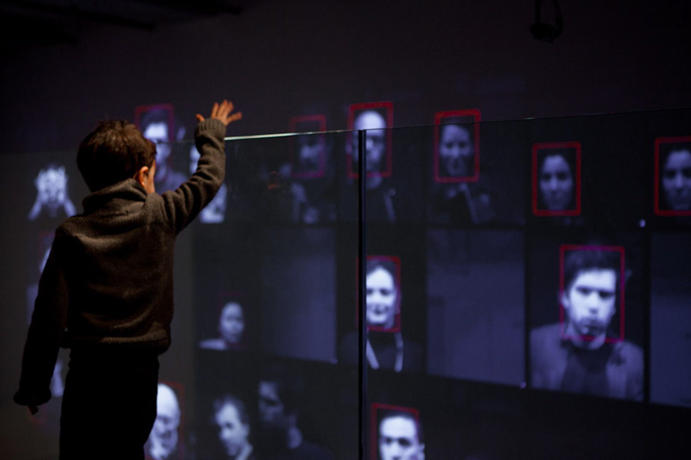

# AI

*AI, United Visual Artists, London, 2017*

## Sommaire

- [Description de l'œuvre](#description-de-loeuvre)
- [Artistes](#artistes)
- [Rapports avec la thématique programmation](#rapports-avec-la-thematique-programmation)

## Description de l'œuvre 

*AI* est une œuvre du collectif United Visual Artists consistant en une imprimante programmée pour générer des textes aléatoires sur des petits morceaux de papier de la forme d'une carte de visite. 

L'œuvre interroge le besoin humain d'attribuer du sens, y compris aux choses nées du hasard.

*AI, United Visual Artists, London, 2017*

## Artistes

Le collectif United Visual Artists a été créé en 2003 par l'artiste britannique [Matthew Clark](https://www.instagram.com/matt_clark_uva/?hl=en). Son matériau de prédilection est la lumière, utilisée sous toutes ses formes (LED, lasers, etc.), la plupart du temps en interaction avec les mouvements des spectateurs. C'était le cas pour l'œuvre *Monolith*, immense monolithe lumineux qui réagissait à la proximité des passants, posé devant le Victoria and Albert Museum à Londres. 

*Monolith, United Visual Artists, London, 2005*

À de nombreuses reprises, UVA (United Visual Artists) a exploré des thèmes se rapprochant des enjeux sociaux du numérique, comme avec l'œuvre *Rien à cacher / Rien à craindre* en 2011 à la Gaîeté Lyrique, à Paris. L'œuvre, dont le titre lui-même évoque le lieu commun des partisans de l'espionnage selon lequel si l'on n'a rien à cacher, alors pourquoi craindre qu'on nous observe, consistait en une série d'installations sons et lumières, à divers endroits du bâtiment de la Gaîeté Lyrique, dont le point commmun était toujours de scanner et d'interagir avec le visage des spectateurs. 

*Rien à cacher / Rien à craindre, United Visual Artists, Paris, 2011*

L'œuvre *Vanishing Point* explore quant à elle la frontière fine qui existe entre le continu et le discontinu. Des lasers rotatifs tournent de plus en plus vite sur un axe, jusqu'à donner l'impression d'un faisceau lumineux cylindrique continu. La même chose a lieu avec un son discontinu qui se répète si vite qu'il finit par donner l'impression d'être "linéaire". *Vanishing point* illustre par là une idée fondamentale de la représentation numérique du réel selon laquelle on recrée une impression de continuité à partir de morceaux élémentaires discrets (les bits). 

*Vanishing point, United Visual Artists, London, 2020*

## Rapports avec la thématique programmation

l'œuvre *AI* de UVA, même si l'on ne peut pas en être 100% sûr puisque l'on n'a pas accès au code source, utilise une fonction similaire à la fonction `random`en Python, telle qu'elle est présentée [ici](https://dev-apprendre.modulo-info.ch/prog1/randomiser.html).

Même si le programme peut-être construit d'une multitude de manières, il est probable qu'il consiste en un certain nombre de listes de mots qui, combinés de façon aléatoires, produisent les textes imprimés durant l'exposition. Vous pouvez trouver un programme du même genre [ici](https://dev-apprendre.modulo-info.ch/projets/art_absurde.html).

