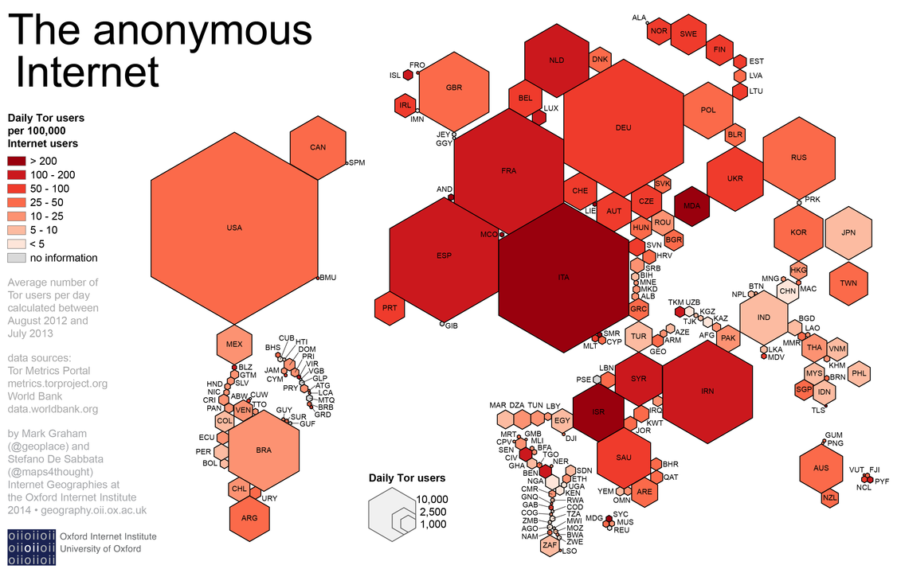

# Autonomy Cube


*Autonomy Cube, Trevor Paglen et Jacob Appelbaum ; by Rosa Menkman, Netherlands, Wikimedia Commons*

## Sommaire

- [Description de l'œuvre](#description-de-loeuvre)
- [Artistes](#artistes)
- [Rapports avec la thématique réseaux](#rapports-avec-la-thematique-reseaux)

## Description de l'œuvre

*Autonomy Cube* est un projet artistique créé par Trevor Paglen et Jacob Appelbaum, de 2014 à 2018, consistant à placer des relais pour le réseau Tor dans les musées d'art traditionnels. Le cube s'inscrit dans la lignée de la plupart des œuvres antérieures de Paglen et Appelbaum en ciblant le domaine de la surveillance et de l'espionnage gouvernementaux. Les sculptures consistent en des cubes d'acrylique contenant des routeurs Wifi basés sur deux cartes mères de matériel open source, qui produisent un point d'accès à Internet, via le protocole Tor. 

En plus d'être une œuvre à laquelle les visiteurs d'une exposition peuvent se connecter, pour obtenir un point d'accès anonyme à Internet, *Autonomy Cube* fonctionne aussi comme un nœud du réseau Tor, renforçant donc l'intégralité du réseau, et transformant l'espace d'art en instituion engagée pour la privacité des données. 


## Artistes

**Trevor Paglen** est un artiste américain, né en 1974, dont la pratique consiste à jouer avec les frontières du visible et de l'invisible, particulièrement au sujet de la surveillance généralisée des Etats modernes sur les individus[^1]. 


*Trevor Paglen, © www.pacegallery.com*

Dans son travail photographique intitulé "Limit Telephotography", il utilise des techniques photographiques de pointe, utilisées en astronomie, pour capturer des bases militaires secrètes normalement invisibles. 


*Detachment 3, Air Force Flight Test Center #2; Groom Lake, NV; Distance ~ 26 Miles, 2008*

Une autre œuvre photographique, intitulée *NSA taped fiber optic cable* (en français "câbles de fibre optique surveillés par la NSA"), montre les lieux, inconnus du public, où les câbles sous-marins d'Internet arrivent sur les côtes. À côté des photos de baigneurs illustrant l'insouciance des foules, ou de panorama côtiers typiques des photographies de vacances, des infographies expliquent différents aspects techniques de cette surveillance de masse furtive.


*NSA-Tapped Fiber Optic Cable Landing Site, Keawaula, Hawaii, United States, 2016*

[Ce lien](http://dismagazine.com/dystopia/73110/trevor-paglen-nsa-tapped-fiber-optic-cable-landing-site-%E2%80%A8mastic-beach-new-york-united-states/) permet d'explorer l'une de ces infographies de façon interactive. 

**Jacob Appelbaum** est un activiste, hackeur, ex-développeur du projet Tor, qui a pris la parole de nombreuses fois lors de conférences internationales sur la surveillance de masse et la nécessité de réseaux de communication cryptés pour les populations, dans la lignée de Julian Assange et Edward Snowden. Il se positionne comme défenseur d'un Internet exempt de censure, où l'information ne peut être contrôlée par les Etats. 

[Cet extrait vidéo Youtube](https://www.youtube.com/watch?v=0qa8SRN86V8) le montre, par exemple, au milieu du tumulte créé par les Printemps Arabe, en Egypte, en train d'accuser certains forunisseurs d'accès Internet égyptiens d'avoir bloqué l'accès à des sites, faisant selon lui le jeu du régime de Hosni Moubarrak. 

En 2016, il a été écarté du projet Tor, sur fond d'accusations de harcèlement sexuel. Depuis, il vit en Hollande où il prépare une thèse en cyptologie[^2]. 


*Jacob Appelbaum au Congress on Privacy & Surveillance à l'EPFL; Rama, Wikimedia Commons, CC BY-SA 2.0 fr*

## Rapports avec la thématique *réseaux*

L'*Autonomy Cube* lorsqu'il est placé dans une galerie ou un musée, transforme ces derniers en points d'accès anonymes à Internet, via le protocole Tor. 


*Autonomy Cube, Trevor Paglen et Jacob Appelbaum; © www.e-flux.com*

En résumé, le **protocole Tor** permet à un utilisateur de se connecter à internet sans laisser de traces. Ces traces, habituellement, sont de l'ordre de "quel appareil s'est connecté à quelle adresse". Le protocole Tor, aussi appelé "Onion routing", consiste à se connecter via des relais successifs dont chacun ne connait qu'une partie des informations de connexion. Imaginons, en simplifiant à l'extrême, que le premier relais connaisse votre adresse IP, mais pas votre destination, le deuxième connaitra votre destination, mais pas votre IP, et ainsi de suite à travers de multiples "couches" (d'où la métaphore de l'onion). 

Ce protocole a été intialement développé durant les années 1990 par les employés de l'United States Naval Research Laboratory, le mathématicien Paul Syverson et les informaticiens Michael G. Reed et David Goldschlag, dans le but de protéger les communications des écoutes et analyses de trafic[^3].

[La vidéo suivante](https://youtu.be/QRYzre4bf7I) explique, dans les grandes lignes le fonctionnement de Tor. 

```{youtube} QRYzre4bf7I
```


*Cartogramme des connexions à Tor; by Stefano, Wikimedia Commons, CC BY-SA 4.0.*


[^1]: https://curamagazine.com/digital/skies-clouds-seas-and-flowers-trevor-paglen/

[^2]: https://www.theguardian.com/technology/2016/oct/11/jacob-appelbaum-tor-project-sexual-assault-allegations

[^3]: https://fr.wikipedia.org/wiki/Tor_(r%C3%A9seau)