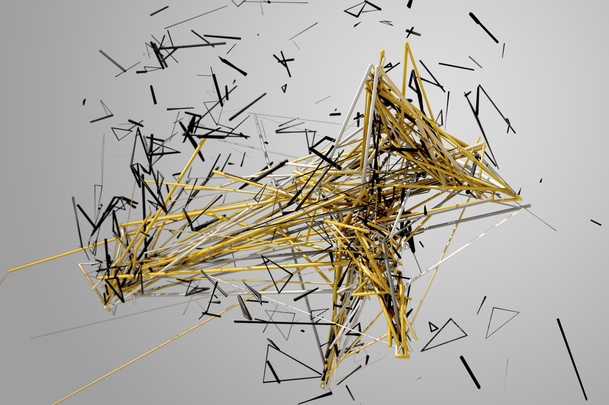

# Learning to See : Gloomy Sunday

## Sommaire

- [Description de l'œuvre](#description-de-loeuvre)
- [Artiste](#artiste)
- [Rapports avec la thématique algorithmique](#rapports-avec-la-thematique-algorithmique)

## Description de l'œuvre

*Learning to See : Gloomy Sunday* (voir \ref{fig1}) est une œuvre composée d'une série de vidéos et d'une installation interactive où les enregistrements pris par une caméra dirigée vers une table recouverte d'objets sont analysés par une série de modèles d'apprentissage automatique entraînés sur différents ensembles de données (images d'océan, de feu, de nuages, de fleurs, de galaxies)[^1].

Le réseau de neurones n'est capable de *comprendre* que ce qu'il connait au préalable. 

L'artiste **Memo Akten** interroge, à travers cette œuvre, notre rapport à la perception, et notre capacité à partager les représentations des autres alors que, tout comme les réseaux de neurones de l'euvre, notre vision du monde est façonnée par nos connaissances préalables. 

> "An artificial neural network looks out onto the world, and tries to make sense of what it is seeing. But it can only see through the filter of what it already knows. Just like us. Because we too, see things not as they are, but as we are." 

*Memo Akten, sur www.memo.tv/works/learning-to-see*

*Learning to See, Installation view at "AI: More than Human", The Barbican, London, UK, 2019*

Dans la photographie précédente de l'œuvre *Learning to See : Gloomy Sunday* on peut voir que le modèle a été entraîné sur des images de feu. 

[Lien](https://youtu.be/DE3402nH1wA) vers une version enregistrée de l'œuvre.

## Artiste

Memo Akten, né en 1975, est un artiste d'origine turque, travaillant actuellement à Londres. Sa pratique artistique consiste à développer des systèmes, incluant la plupart du temps des technologies informatiques, ayant des comportements qui poussent le spectateur à réfléchir sur ses propres perceptions sensorielles et sa compréhension du réel[^2]. 

*© https://nodeforum.org/*

Son œuvre *Forms*, réalisée en 2011 avec l'artiste italien Davide Quayola, explore les mouvements d'athlètes effectuant des figures, en les traduisant en lignes graphiques, via la librairie [Processing](https://processing.org/). 

*Forms, Memo Akten & Davide Quayola 2011, ©http://www.memo.tv/*

Vidéo disponible [ici](https://www.youtube.com/watch?v=Xe-C_rv3_p0)

## Rapports avec la thématique algorithmique

Les **modèles** d'apprentissage automatique[^3], développés depuis les années 1990 au moins, sont capables de *prédire* des résultats à partir d'inputs, après avoir été entraînés sur des données où résultats et inputs étaient connus. En simplifiant à l'extrême, on peut dire qu'à partir du moment où il a été suffisament entraîné, un modèle est une fonction qui prend une valeur en entrée, et *prédit* une valeur en sortie. 

**L'algorithme** d'apprentissage automatique est plus spécifiquement la suite d'étapes qui mène de l'observation des données d'entrées durant la phase d'entraînement à la définition des paramètres du modèle qui permettront d'arriver à une prédiction correcte du résultat. L'algorithme décrit en quelque sorte l'outillage mathématique utilisé pour *comprendre* quelle est la relation entre les données initiales qui permet une prédiction correcte du résultat. 

Imaginons, par exemple, l'algorithme chargé d'apprendre à faire des recommandations de films qui nous plaisent sur Netflix. Les *données initiales* sont toutes les critiques faites par des utilisateurs sur différents films + nos interactions (like, dislike) avec ces mêmes films + des critères de ressemblance ou de disparité des films entre eux (plutôt violent, plutôt romantique, plutôt long, plutôt court, etc.) + un certain nombre d'autres données sur les films eux-mêmes, nos interactions avec eux, ou les interactions d'autres spectateurs avec ces films. L'objectif de cet algorithme est d'apprendre à nous faire une suggestion qui nous plaise. Il *observe* donc les *données initiales* et leurs relations entre elles et tente de *comprendre* le dosage exact de tous ces ingrédients qui fait que nous allons apprécier un film[^4].

Dans le cas de l'œuvre **Gloomy Sunday**, le modèle a appris en s'entrainant sur une quantité énorme d'images de feu, ou fleurs, océans, galaxies, que telle ou telle répartition des valeurs des pixels à un endroit ou un autre de l'écran donnait telle ou telle image de flammes. Les zones où les pixels ont des valeurs très hautes, par exemple, vont être considérées comme les endroits où la flamme est très jaune. Les zones où les pixels ont des valeurs basses vont être considérées comme les parties presque obscures des flammes. Au moment où l'œuvre est activée, une caméra envoie en temps réel des nouvelles valeurs pour chaque pixel qui correspondent à ce que l'on montre, ou pas, à la caméra (déplacement des chiffons, mains, etc.). Le modèle va adapter le *résultat* de l'image, en fonction de ce qu'il a connu durant sa phase d'apprentissage. 

[^1]: https://ars.electronica.art/outofthebox/en/learningtosee/
[^2]: http://doc.gold.ac.uk/humaninteractive/portfolio_page/memo-akten/
[^3]: Nous parlons ici de la variante "supervisée" de l'apprentissage automatique. 
[^4]: Dans le cas des systèmes de recommandation, et en particulier de [Netflix](https://en.wikipedia.org/wiki/Netflix_Prize), il y a eu de nombreuses étapes d'améliorations des modèles utilisés qui rendent fastidieux un descriptif détaillé de leur fonctionnement actuel. 
