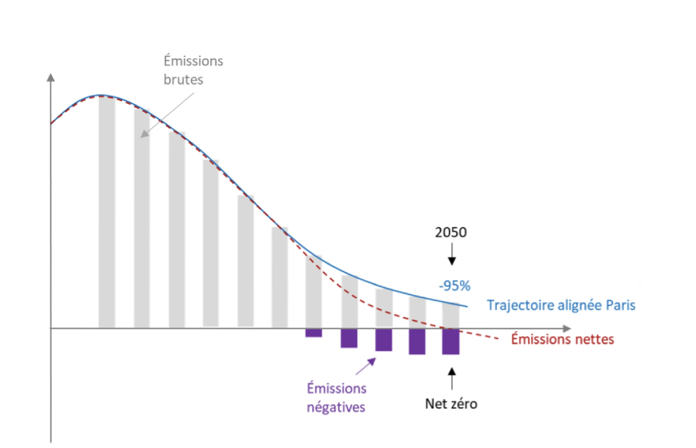
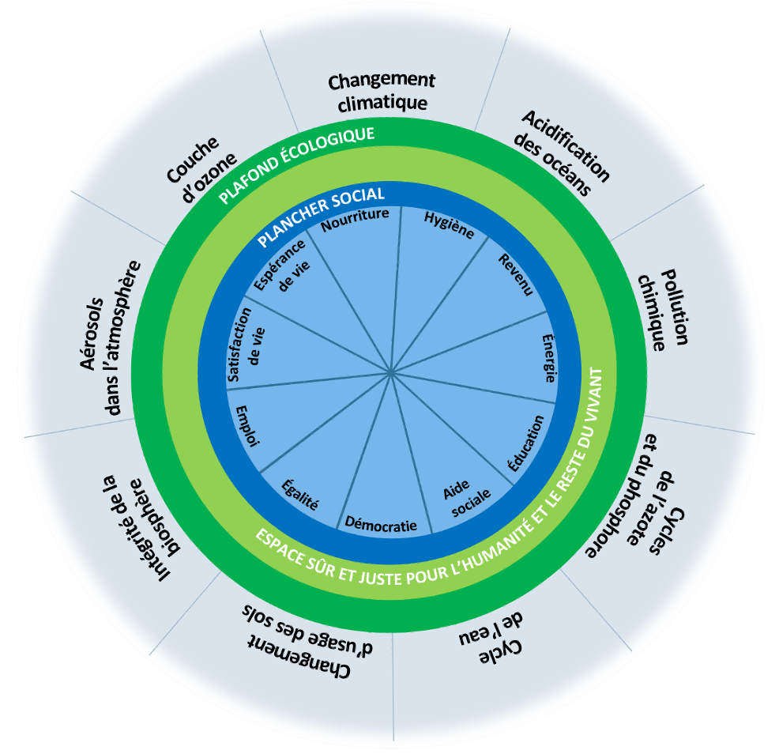
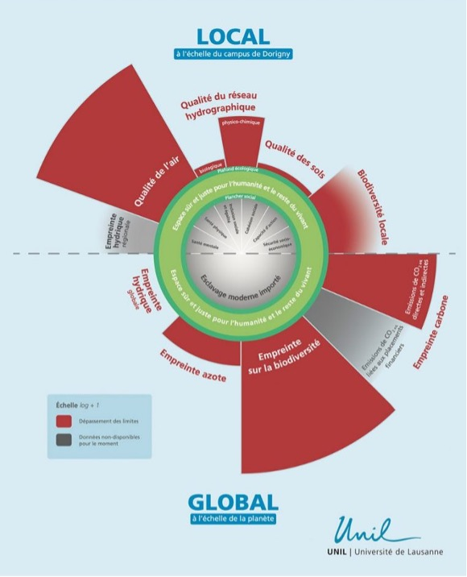
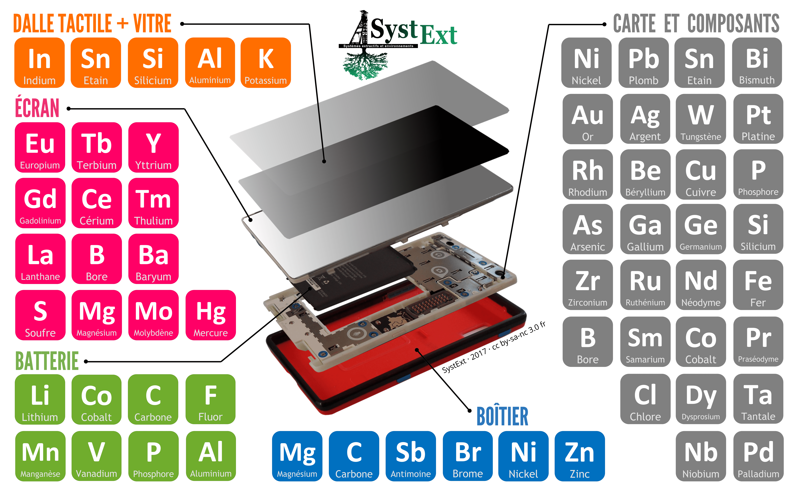

<style>
.button {
  background-color: white;
  border: 1px solid;
  border-color: black;
  font-family:"Lato",sans-serif;
  font-weight:350;
  color: black!important;
  padding: 10px 10px;
  text-align: center;
  text-decoration: none;
  display: inline-block;
  font-size: 16px;
  margin: 4px 2px;
  cursor: pointer;
}
.button:hover {
  text-decoration:none;
  background-color: black; 
  color: white!important;
}
.round-button {
    display:block;
    width:100px;
    height:100px;
    line-height:17px;
    border:0px ;
    border-radius: 50%;
    color:#1A8477;
    text-align:center;
    text-decoration:none;
    display: table-cell;
    vertical-align: middle;
    background: #1A8477;
    box-shadow: 0 0 0px gray;
    font-size:14px;
    font-weight:bold;
    }

</style>

<div align="right"> 
    <a href="https://files.modulo-info.ch/enjeux-sociaux/environnement/environnement.pdf" " class="round-button">
         <font color=white id="demo">Cliquer ici pour <br>dossier</font>
    </a>
</div>

# Numérique et environnement

<br>

Ce dossier vise à apporter un éclairage sur les enjeux écologiques du numérique. Après avoir introduit quelques concepts fondamentaux d’écologie et de durabilité, il présente l’impact écologique global du numérique. Il en détaille ensuite les spécificités, en tenant compte des infrastructures matérielles sous-jacentes aux pratiques numériques. Les pressions écologiques principales sont ainsi analysées de manière à dégager, pour chacune, les leviers d’action prioritaires dans la transition écologique du secteur numérique. Le dossier invite également à nuancer le potentiel des technologies numériques dans la transition écologique. 


## Objectifs

* Saisir l’impact écologique du numérique selon une perspective de durabilité forte.
* Identifier les enjeux fondamentaux du secteur et les leviers d’action prioritaires s’agissant de sa transition écologique.
* Développer un regard critique sur le potentiel des dispositifs numériques comme outils de la transition écologique.
* Comprendre en quoi les enjeux écologiques impliquent de repenser notre relation au numérique.

## Enjeux

La question de l’impact écologique du numérique occupe désormais une place importante tant dans les médias que dans la recherche. Il est souvent difficile de s’orienter parmi la multitude de chiffres, de comparaisons et de recommandations parfois contradictoires, d’autant plus que celles-ci impliquent des concepts et des phénomènes complexes. Ce dossier vise à fournir quelques clés de lecture pour mieux comprendre les enjeux écologiques du numérique, les inscrire dans une approche de durabilité plus large et déconstruire certaines idées reçues. Pour ce faire, il est important de définir le cadre dans lequel s’inscrivent tous les enjeux écologiques (numériques ou autres). 

### 🌎 &nbsp; Écologie et durabilité : quelques fondamentaux

````{panels}
:column: col-lg

**État des lieux planétaire**
^^^

Notre environnement naturel atteint aujourd’hui un stade de dégradation très avancé, avec des menaces extrêmement lourdes pesant (inégalement) sur l’humanité. Cette situation fait l’objet d’un solide consensus scientifique[^1] ; il ne fait par ailleurs aucun doute qu’elle est anthropique (due aux activités humaines). Cette dégradation relève de deux ordres. 

Premièrement, les spécialistes font état d’une importante déplétion des ressources naturelles (fossiles, minéraux, métaux, sable, eau douce, organismes vivants) sur lesquelles reposent une grande partie de nos activités économiques. Certaines d’entre elles sont proches de l’épuisement, que ce soit en termes absolus ou relativement à notre capacité à les exploiter. 

À cela s’ajoutent de fortes pressions exercées sur le système terrestre, qui le font progressivement basculer vers un état tout à fait nouveau et inexpérimenté par l’humanité, pour une très longue durée (des centaines de milliers d’années). Cette deuxième catégorie de dégradations est généralement étudiée par le biais de neuf limites planétaires : changement climatique (cycle du carbone), érosion de la biodiversité, modification des usages des sols, introduction d’entités nouvelles dans la biosphère (pollution chimique), perturbation des cycles de l’azote et du phosphore, acidification des océans, augmentation des aérosols dans l’atmosphère, appauvrissement de l’ozone stratosphérique (couche d’ozone), cycle de l’eau douce. Ces indicateurs révèlent la complexité du fonctionnement de la biosphère. La question environnementale ne concerne ainsi pas uniquement les émissions de CO2 ou la pollution, bien que celles-ci restent des problèmes majeurs et sur lesquels nous pouvons agir fortement. En 2023, nous avons dépassé six de ces limites planétaires (l’incertitude règne sur les autres, non quantifiables). Nos conditions de vie sur Terre se trouvent ainsi considérablement fragilisées. La situation est grave mais il existe d’innombrables pistes d’action pour ramener nos activités dans les limites écologiques.
````


````{panels}
:column: col-lg

**Vers la neutralité carbonne**
^^^

En raison de l’inaction politique des décennies passées, il reste à l’humanité une très courte fenêtre d’opportunité pour contenir le dérèglement climatique[^2]. L’un des objectifs principaux  en la matière est de limiter l’élévation de la température moyenne de la planète (sa surface terrestre) à 1.5°C par rapport à l’ère préindustrielle. Pour ce faire, les efforts se concentrent sur la réduction des émissions mondiales de gaz à effet de serre (GES), qui doivent baisser de 50% d’ici à 2030 et de 95% d’ici à 2050. C’est ce que l’on désigne par neutralité carbone mais la trajectoire de décarbonation des émetteurs ne doit pas s’arrêter là. En effet, le 5% restant, dit « incompressible » (considéré comme inévitable), doit être compensé par des « émissions négatives », à savoir des processus naturels ou techniques permettant de retirer durablement les GES de l’atmosphère. C’est le concept de zéro émissions nettes (ou zéro net). Celui-ci sert progressivement de référence pour évaluer scientifiquement les stratégies climatiques. Ainsi, tout émetteur de GES, pour être neutre en carbone, doit avoir réduit de 95% ses émissions et neutralisé les 5% restants (figure 1). Tout émetteur engagé dans cette trajectoire est « en transition vers la neutralité ». 

On l’aura compris au vu du caractère ambitieux de ces trajectoires : aucun émetteur de GES n’est aujourd’hui réellement neutre en carbone. Ces prétentions relèvent, au mieux, d’une incompréhension des enjeux, et au pire, d’une stratégie de greenwashing (écoblanchiment). Se concentrer uniquement sur les techniques d’émissions négatives (NET) est largement insuffisant et ne dédouane pas les émetteurs d’une réduction massive de leurs propres émissions. De plus, le marché de la compensation carbone, à savoir le financement (via l’achat de « crédits carbones ») de projets de réduction ou de recapture des GES, se révèle très problématique (non-respect de critères fondamentaux d’intégrité environnementale et sociale). Là aussi, les crédits carbones ne peuvent se substituer aux efforts de décarbonation que l’émetteur doit lui-même consentir. 

En somme, la réduction massive des émissions de GES de toutes les entités émettrices doit rester la priorité ; la compensation carbone et les émissions négatives sont des stratégies complémentaires qui, bien que nécessaires pour atteindre le zéro net, ne peuvent se substituer à la réduction des émissions directes.
````



*Figure 1. Trajectoire de décarbonation à adopter par les émetteurs de GES. 
Source : [Centre de Compétences en Durabilité](https://www.unil.ch/centre-durabilite/home/menuinst/publications/articles-rapports/commentaire-strategie-decarbonation-fondee-sur-science.html) (CCD ; Unil)*


````{panels}
:column: col-lg

**Écologie politique : penser la transition écologique**
^^^

L’écologie politique regroupe plusieurs courants d’idée qui se sont développés depuis la fin de la deuxième guerre mondiale. Tous ont en commun de préconiser une réforme profonde de la société et de nos modes de vie, afin d’éviter à l’humanité de subir un effondrement lié à la dégradation de ses conditions d’existence sur Terre. 

Cette pensée s’est développée à partir d’un double constat : l’accumulation des preuves scientifiques du changement climatique engendré par les activités humaines, ainsi que l’incapacité des techniques à compenser les effets néfastes qu’elles engendrent sur l’environnement. 

L’écologie politique constitue un cadre de réflexion important lorsqu’il s’agit d’appréhender les enjeux écologiques d’un point de vue politique et social. Souvent abrégée « écologie », elle doit toutefois être distinguée de l’écologie en tant que discipline scientifique, qui étudie les relations que les espèces entretiennent entre elles et avec leur milieu.
````

````{panels}
:column: col-lg

**Durabilité forte : la nécessité de la sobriété**
^^^

Au cœur des réflexions de l’écologie politique se trouve le concept de durabilité forte. Les spécialistes estiment que cette approche est aujourd’hui nécessaire pour faire face à l’ampleur des enjeux écologiques. 

La durabilité renvoie à « un fonctionnement des sociétés humaines, en particulier dans leur relation à l’environnement naturel, qui assure leur stabilité à long terme et rend possible l’épanouissement humain au travers des générations »[^3]. Elle a été initialement conceptualisée sous la forme du développement durable, une approche datant des années 1980 qui cherchait à concilier les besoins sociaux, environnementaux et économiques. Le développement durable repose sur l’hypothèse du découplage, à savoir la dissociation entre croissance économique et impact environnemental. Autrement dit, le développement durable considère comme possible de poursuivre la croissance en limitant, voire neutralisant, les dégâts environnementaux, grâce notamment aux innovations techniques. Il convoque ainsi une durabilité dite « faible », qui ne remet pas en question la croissance et suppose que les capitaux naturels et techniques sont interchangeables ; que les dégradations causées à l’environnement ne sont pas problématiques tant qu’elles peuvent être compensées par des artefacts techniques. Une telle vision est purement fonctionnelle et extractive, réduisant la nature à un stock de ressources à exploiter. 

L’approche du développement durable a été largement réfutée depuis. L’hypothèse du découplage ne s’est pas confirmée[^4]. S’il a permis l’émergence d’idées intéressantes (approche participative, écologie industrielle, économie circulaire, etc.), le développement durable n’est désormais plus considéré comme la voie à suivre[^5]. 

Face à cet échec, il convient d’adopter l’approche de la durabilité « forte », qui rejette la substituabilité de la nature par les techniques. Elle cherche ainsi à préserver les équilibres du système terrestre et à réduire l’exploitation des ressources non renouvelables. En partant du constat que nos modèles économiques de croissance sont un moteur fondamental de la dégradation de notre environnement (qu’il n’y a donc pas de découplage possible), la durabilité forte exige une forme de sobriété dans nos modes de production et de consommation, de manière à revenir à l’intérieur des limites planétaires. En outre, cela doit se faire d’une façon qui respecte les besoins fondamentaux de tout le monde. L’autre objectif – et le bénéfice – de la durabilité forte est en effet de réduire les inégalités et les autres problématiques sociales amplifiées par nos sociétés de croissance.

Cette approche est synthétisée dans le « modèle du Donut »[^6] qui définit une série d’indicateurs visant à la création d’un espace, délimité par un plancher social et un plafond écologique (qui reprend les limites planétaires), dans lequel l’humanité peut évoluer de manière sûre (figures 2 et 3). 

Ce modèle est aujourd’hui l’un des principaux outils de diagnostic et guides envisagés dans la mise en place de la transition écologique, à l’instar de l’usage qu’en font les municipalités de [Lausanne](https://climact.ch/fr/post/politique-de-durabilite-a-lausanne-pourquoi-adopter-l-approche-du-donut-urbain-1) et de [Genève](https://serval.unil.ch/resource/serval:BIB_6F729FD1A3FA.P001/REF.pdf), ou [l’Université de Lausanne](https://wp.unil.ch/assemblee-transition/lassemblee-face-au-constat-climatique/). 

Au final, l’idée est de préparer la transition écologique vers un monde durable (et ainsi désirable) pour ne pas avoir à subir un effondrement aux conséquences désastreuses.

````

 


<br>

*Figures 2-3. Le modèle du donut et [son application à l’Université de Lausanne](https://drive.switch.ch/index.php/s/hYmn8Omt3WV5dDf).*


````{panels}
:column: col-lg

**L'effet rebond**
^^^

Malgré les gains de productivité et l’efficacité énergétique grandissante des techniques (notamment numériques), celles-ci ne peuvent pas constituer la solution au changement climatique en raison notamment des effets rebond qu’elles engendrent. De manière générale, l’effet rebond (direct) survient lorsque la baisse du coût[^7] d’un bien ou d’un service provoque une hausse de son usage, en le rendant plus attractif. Cette consommation accrue génère alors une plus grande exploitation de ressources matérielles ou d’énergie. Un exemple simple concerne les ordinateurs : les gains acquis dans les processus de production ont diminué leur prix de vente, ce qui a fait exploser les achats et diffusé de manière très importante ces objets et leurs usages dans notre quotidien. 

L’effet rebond peut également être indirect : les bénéfices obtenus à l’acquisition du bien ou service (économie d’argent, de temps, d’énergie, etc.) sont investis dans la consommation d’autres produits ou activités générant à leur tour des dégâts environnementaux (émissions de GES, etc.). Le télétravail, par exemple, est souvent promu comme un moyen écologique de réduire les déplacements. Or, sans autre adaptation, le télétravail peut inciter à travailler plus loin de son lieu de domicile, à acheter une résidence secondaire, à réinvestir le temps et l’argent économisés dans des loisirs, ou à multiplier les trajets du week-end pour compenser les tâches qui n’auront pas été faites pendant le télétravail. Il augmente également les besoins énergétiques des bâtiments résidentiels, sans réduire ceux des locaux professionnels. Ces effets rebond génèrent finalement plus de mobilité et de consommation énergétique, compromettant ainsi les bénéfices théoriques du télétravail[^8]. 


L’effet rebond est partiel s’il est inférieur au bénéfice initial ; total s’il annule entièrement ce gain. Si le rebond est supérieur, on parle alors de « backfire » ou « paradoxe de Jevons » (le gain devient contre-productif du point de vue écologique). Les mécanismes générant ces effets sont multiples, complexes et parfois imprévisibles. Ils se déploient par ailleurs à un niveau individuel (choix de consommation) ou plus généralement au niveau de l’économie (effets sur la compétitivité et la productivité). 

Ainsi, il est important de toujours considérer les apports des techniques en regard de leurs effets généraux, structurels, économiques, et non uniquement en se basant sur des indicateurs de performance. 

````

````{panels}
:column: col-lg

**Da la validité des chiffres**
^^^

Que ce soit pour le numérique ou dans tout autre domaine, il peut s’avérer très difficile de quantifier précisément l’impact environnemental des activités humaines. Celui-ci n’est d’ailleurs parfois pas quantifiable du tout. Les difficultés entravant les scientifiques sont multiples, allant du manque d’accessibilité des données au conflit d’intérêt (le sujet est clivant, les lobby très actifs), en passant par la complexité des calculs (avec les effets rebonds par exemple). 

Les études objectives fournissent toutefois des estimations précieuses et certains impacts sont aujourd’hui bien documentés. Si la précision manque, les ordres de grandeur s’avèrent quant à eux essentiels pour guider la prise de décision en matière de transition écologique. Face aux délais très courts pour agir, il est en effet peu avisé d’attendre d’avoir des chiffres exacts, même si de telles analyses doivent être encouragées. 

````


### 🌏 &nbsp; Impact écologique du numérique

Au niveau mondial, le secteur du numérique constituait 2 à 4% des émissions de gaz à effet de serre (GES) pour l’année 2021. Cette part peut paraître faible au premier abord, notamment en comparaison avec celle de l’industrie automobile (8%), mais c’est surtout sa rapide augmentation qui inquiète les spécialistes. Le numérique accuse en effet un taux annuel de croissance des émissions de GES de 6% pour la période de 2013 à 2019. Il est également très probable que ce taux monte à 9% dans un futur proche, ce qui signifie que l’impact du numérique est susceptible de doubler d’ici à 2030[^9] 
Quelle que soit cette évolution, l’impact actuel du numérique est d’ores et déjà trop important pour être négligé, puisque l’objectif de la neutralité carbone exige de réduire de 95% les émissions de GES. On imagine mal consacrer le 5% restant au seul numérique. Ainsi, ce secteur va lui aussi devoir faire sa transition écologique et baisser drastiquement ses émissions de GES. 

En outre, l’impact du numérique ne se limite pas aux émissions de GES. Le secteur présente des spécificités particulièrement problématiques du point de vue de l’exploitation des métaux nécessaires au fonctionnement de ses terminaux (voir section 3 ci-dessous). Cet enjeu est fondamental puisque l’extraction et le raffinage des métaux stratégiques contribuent massivement, à eux seuls, au dépassement de plusieurs limites planétaires. 

Finalement, le secteur numérique est particulièrement enclin à générer des effets rebonds du fait de sa propension à augmenter l’efficacité de notre organisation sociale[^10]. En nous faisant gagner du temps, de l’énergie ou de l’argent, ainsi qu’en favorisant la connectivité (des objets mais aussi entre êtres humains), les dispositifs numériques enclenchent des mécanismes micro et macroéconomiques qui mènent à une demande accrue en énergie ou ressources matérielles (voir l’encadré pour un exemple concernant la 5G).  


```{admonition} Les effets rebonds de la 5G
:class: hint

Le déploiement de la 5G est sujet à de [multiples effets rebonds](https://shs.hal.science/halshs-03595461/document) susceptibles de contrecarrer les gains de l’efficience énergétique permis par cette technologie. Un effet direct relève de la hausse du trafic de données, car la 5G génère une augmentation et une diversification des usages du réseau. Bien que cet accroissement ne puisse être infini, la demande accrue en énergie que génèrent ces nouveaux usages vient annuler les gains énergétiques initialement prévus. Ces usages ne se substituent par ailleurs pas aux anciens et viennent ainsi faire croître le secteur numérique, dont l’empreinte environnementale est pourtant déjà problématique. Autre effet notable, le passage à la 5G implique un renouvellement important des équipements : les téléphones doivent être renouvelés (par millions) pour devenir compatibles ; il faut construire des antennes pour la 5G, qui doivent par ailleurs être plus nombreuses pour maintenir la couverture actuelle car elles ont une portée inférieure à la 4G. De manière indirecte, il faut également se demander dans quels secteurs ou type de productions seront réinvestis les profits des entreprises et les revenus du personnel salarié. 
Ainsi, dans notre système économique actuel et malgré les bénéfices environnementaux potentiels de la 5G en termes de numérisation des infrastructures (smart grids, gestion du trafic routier, etc.), les effets rebonds compromettent toute transition écologique basée sur cette technologie. 

```

Il existe une documentation croissante sur les effets rebonds du numérique, mais ceux-ci restent largement négligés, voire ignorés, par les acteurs économiques. Il s’avère pourtant essentiel de mettre en perspective les promesses de la « dématérialisation » et de l’efficience énergétique promue par l’innovation numérique en regard des effets rebonds que celle-ci génère. Toute stratégie d’optimisation embarquant des techniques numériques doit prendre en compte les effets rebonds pour évaluer son véritable bénéfice écologique. 

Ainsi, bien que l’impact relatif du numérique soit faible, la contribution de ce secteur aux dégradations environnementales est telle qu’il doit faire l’objet d’actions importantes en termes de transition écologique. Dans une perspective de durabilité forte, cette transition doit passer par le déploiement d’une sobriété numérique. Pour mieux en cerner les contours, il nous faut considérer plus en détail l’infrastructure du numérique.

Il existe une documentation croissante sur les effets rebonds du numérique, mais ceux-ci restent largement négligés, voire ignorés, par les acteurs économiques. Il s’avère pourtant essentiel de mettre en perspective les promesses de la « dématérialisation » et de l’efficience énergétique promue par l’innovation numérique en regard des effets rebonds que celle-ci génère. Toute stratégie d’optimisation embarquant des techniques numériques doit prendre en compte les effets rebonds pour évaluer son véritable bénéfice écologique. 

Ainsi, bien que l’impact relatif du numérique soit faible, la contribution de ce secteur aux dégradations environnementales est telle qu’il doit faire l’objet d’actions importantes en termes de transition écologique. Dans une perspective de durabilité forte, cette transition doit passer par le déploiement d’une sobriété numérique. Pour mieux en cerner les contours, il nous faut considérer plus en détail l’infrastructure du numérique.

### 🏭 &nbsp; Infrastructure du numérique

Pour penser les questions écologiques autour du numérique, il faut commencer par prendre la mesure de sa dimension physique, à rebours de l’idée d’une infrastructure « immatérielle ». Câbles sous-marins, centres de données, transport maritime et routier, antennes-relais, routeurs, terminaux : le numérique repose sur un système complexe. Résultat de choix techniques, politiques et économiques, cette vaste infrastructure implique l’exploitation de ressources naturelles, la consommation d’énergie, l’émission de gaz à effet de serre, l’usage de produits chimiques ou encore la production de déchets. 
Si le numérique implique une importante composante sociale (travail dans les mines, dans les usines d’assemblage, etc.) nous nous concentrons ici sur son impact biophysique. 

**Émissions de GES**

Du point de vue de l’analyse du cycle de vie, la phase de production des équipements numériques concentre plus du ¾ des émissions de GES (le reste étant émis pendant la phase d’usage). La fabrication des objets numériques implique en effet des activités très demandeuses en énergie et en matières premières : extraction de métaux stratégiques, transport, usinage, assemblage. De plus, les composants nécessaires au fonctionnement des appareils sont fabriqués le plus souvent en Chine, pays dont l’électricité provient essentiellement du charbon. 
L’empreinte carbone induite par l’utilisation des équipements dépend, quant à elle, en grande partie de la provenance de l’électricité nécessaire aux activités en ligne, qui peut varier sensiblement [selon les pays](https://app.electricitymaps.com/map). Pour un même usage, les émissions de GES peuvent donc différer en fonction du type d’énergie utilisée. 

En ce qui concerne la répartition des impacts par type d’équipements ou infrastructures, les terminaux utilisateurs émettent la grande majorité (environ 80%) des GES, suivis par les centres de données (16%) et les réseaux (6%)[^11]. Parmi les terminaux utilisateurs, les ordinateurs et tablettes regroupent près de 40% de ces émissions, suivis des téléphones et des télévisions (20% environ chacun). Cette répartition devrait toutefois évoluer à l’horizon 2050 : ce seront alors les télévisions qui émettront le plus de GES, en raison de notamment de l’augmentation de leur taille et connectivité. La deuxième plus grosse part des émissions sera par ailleurs le fait des objets connectés, dont l’impact est aujourd’hui marginal (4%) mais devrait exploser en regard de la croissance anticipée pour ce secteur. 

Pour réduire l’empreinte carbone du numérique, et dans une approche de sobriété, il faut ainsi prioriser la réduction massive de la demande en nouveaux terminaux numériques, en allongeant leur durée de vie (voir section 5) et en adaptant correctement leurs caractéristiques et fonctionnalités (puissance de calcul, taille des écrans, etc.) aux usages. Il convient également de rester critique face à la disponibilité croissante et à la promotion des objets connectés, en questionnant leur nécessité (les besoins qu’ils remplissent) en regard de leur impact environnemental.

**Consommation d'énergie**

En ne tenant compte que de la phase d’usage, le numérique représente environ 3 à 4% de la consommation énergétique mondiale. Les terminaux utilisateurs sont responsables de la majorité des besoins actuels en énergie (64% pour le cas de la France). 

La consommation énergétique des centres de données est aujourd’hui bien inférieure à celle des terminaux mais elle se trouve progressivement au cœur des préoccupations en raison du développement important des services numériques reposant sur ces grandes infrastructures (machine learning, Internet des objets, blockchain, cloud gaming, etc.). Il y a ainsi, aujourd’hui, plus de 7 millions de centres de données internes aux entreprises et institutions dans le monde, et plus de 700 hyperscale data centers, des centres de données extrêmement grands qui répondent aux besoins gigantesques en traitement et stockage de données des grands fournisseurs de services cloud tels qu’Amazon, Google, Microsoft et Meta. Face à cette évolution, et à la croissance prévue du secteur, il devient nécessaire d’estimer la consommation énergétique des centres de données, tant pour en mesurer l’impact environnemental que pour gérer la distribution d’électricité au niveau local. 

Il reste toutefois extrêmement difficile d’établir des prédictions concernant la consommation électrique[^12] des centres de données, en particulier sur le long terme. Les recherches actuelles présentent des [estimations très variables](https://www.cell.com/joule/fulltext/S2542-4351(22)00358-0?_returnURL=https%3A%2F%2Flinkinghub.elsevier.com%2Fretrieve%2Fpii%2FS2542435122003580%3Fshowall%3Dtrue) (y compris au niveau des ordres de grandeur) et difficilement reproductibles. Cela s’explique notamment par le manque d’accessibilité des données (qui ne sont pas communiquées par les entreprises) et l’évolution très rapide des technologies informatiques. La prudence s’impose donc face aux chiffres publiés par les organes de recherche ou relayés par les médias. 

Plusieurs considérations peuvent cependant être dégagées des travaux en cours. Premièrement, la relation entre consommation de données et consommation d’énergie n’est pas linéaire. On tend à penser que la consommation énergétique des centres de données est restée relativement stable pendant les années 2010, malgré une augmentation considérable du volume de données traitées. Cette situation s’explique par une amélioration de l’efficience énergétique des infrastructures ainsi que par la relocalisation des calculs effectués par les centres internes vers les *hyperscale* (qui consomment beaucoup moins d’électricité pour les mêmes tâches). Il ne suffit donc pas de limiter l’utilisation des données pour obtenir une baisse équivalente de l’énergie consommée. 

Il convient cependant de noter que ce découplage entre la consommation énergétique et la charge de travail des centres de données ne peut pas être permanent. Il semble en effet peu probable que l’efficience énergétique continue à compenser la rapide croissance du trafic pris en charge par les centres de données (l’efficience a des limites, tout comme la relocalisation des centres internes). Les recherches s’accordent à dire que leur consommation énergétique continue d’augmenter, même si les ordres de grandeur avancés varient grandement. Quelle que soit l’ampleur des estimations, cette croissance est dans tous les cas problématique en regard des efforts de sobriété requis du secteur numérique. 

Aussi, ce découplage n’est que partiel car il concerne uniquement les émissions de GES engendrées par la production de l’électricité utilisée. Cette charge écologique n’est par ailleurs pas réparable par le seul passage aux énergies renouvelables : d’une part, la transition (même complète) vers celles-ci ne permettrait pas de réduire suffisamment les émissions de GES pour atteindre la neutralité carbone ; d’autre part, les énergies renouvelables ont elles-mêmes un impact environnemental (notamment carbone) et social non négligeable. De plus, la construction des centres de données possède une empreinte matière[^13]qui fait pression sur plusieurs autres limites planétaires (pollution, usage des sols, biodiversité, etc.). Comme pour toute autre forme de production, l’empreinte écologique des centres de données est plurielle et doit être appréhendée de manière globale, pour tenir compte des émissions indirectes et des effets rebond. 

L’exemple des centres de données illustre bien les limites de l’efficience énergétique comme outil de transition écologique. En regard de la croissance actuelle et anticipée des marchés du numérique, les gains issus de cette optimisation seront [contrecarrés](https://www.sciencedirect.com/science/article/pii/S0921800919320622?via%3Dihub) par de nombreux effets rebonds et l’intensification de l’empreinte écologique impactant d’autres limites planétaires. 

 ```{admonition} Les géants du numérique : neutres en carbonne ?
:class: hint

Google [indique](https://sustainability.google/intl/fr_fr/operating-sustainably/net-zero-carbon/) « présenter un bilan neutre en carbone » et développer « des produits et des technologies qui permettent d'aider chacun à adopter un mode de vie plus durable ». Apple, de son côté, compte rendre tous ses produits « neutres en carbone » d’ici à 2030, à commencer par sa [montre connectée](https://www.apple.com/environment/). 
De manière générale, il est nécessaire de se montrer [très sceptique](https://www.carbone4.com/analyse-empreinte-carbone-du-cloud) face aux déclarations de neutralité carbone des grandes entreprises du numérique. Leur définition du concept ne rejoint en effet pas [la version des scientifiques](https://www.unil.ch/files/live/sites/centre-durabilite/files/Publications/Decarbonation.pdf). Les géants du numériques (comme beaucoup d’autres entreprises par ailleurs) présentent la neutralité carbone comme un pur effort de compensation, en estimant que leur empreinte carbone devient nulle simplement du fait que l’entreprise absorbe théoriquement autant de GES qu’elle n’en rejette. Ainsi, leur stratégie se base de manière fondamentale sur l’achat de crédits carbones et d’énergies renouvelables, et sur le financement de projets écologiques (de reforestation, par exemple). 
Cette approche pose toutefois trois problèmes majeurs. Premièrement, il est loin d’être acquis que les crédits carbones achetés ou les projets financés vont effectivement atteindre leurs objectifs de réabsorption de GES. 
Ensuite, et même si c’était le cas, ces actions ne viennent pas réellement réduire les émissions directes (absolues) des entreprises. Elles agissent en-dehors de leur périmètre. Les projets de reforestation, par exemple, peuvent constituer des « puits de carbone » qui doivent permettre d’atteindre le zéro net mais en aucun cas ils ne font baisser les émissions directes des émetteurs. Les entreprises du numérique n’ont pas, pour l’heure, publié d’éléments probants permettant de penser que leurs émissions directes sont effectivement en baisse. Cela doit pourtant être leur objectif prioritaire puisque ce type d’émissions doit baisser de 95% d’ici à 2050, d’après les objectifs climatiques.
Enfin, rappelons l’échelle globale du système terrestre et l’interconnexion des limites planétaires. Il n’est pas suffisant de se concentrer uniquement sur l’une d’entre elles en ignorant les effets sur les autres. Nous avons déjà vu que les énergies renouvelables ne peuvent suffire à elles seules à répondre au défi du dérèglement climatique, en raison de l’aggravation de l’empreinte matière qu’elles engendrent. De la même manière, dire qu’un appareil numérique est neutre en carbone, c’est ne pas prendre en compte l’impact massif des flux de matière et de la pollution engendrés par sa production. Aussi, la neutralité carbone ne peut réellement se constater qu’à l’échelle planétaire, puisque la stabilisation des GES présents dans l’atmosphère implique des flux physiques globaux. Une entreprise ou un produit ne peut donc pas être neutre en carbone ; il peut contribuer à cet objectif. 
Les actions des entreprises du numérique en termes d’environnement apparaissent ainsi comme un écran de fumée qui retarde une véritable action climatique. Elles détournent l’attention du fait que, pour devenir réellement écologiques, ces entreprises doivent changer fondamentalement de modèle économique, de façon à ralentir la demande et la production (principe de sobriété). 

```
**Exploitation des métaux stratégiques**

La production d’équipements numériques requiert l’extraction de dizaines de métaux[^14], dont certains sont qualifiés de « métaux rares » (cobalt, lithium, tantale, …) car leur concentration est très faible dans la roche et leur extraction nécessite un processus complexe. Précisons toutefois que cette dénomination constitue un pléonasme car tous les métaux  s’avèrent en réalité extrêmement difficiles à extraire. Les spécialistes préfèrent ainsi parler de « métaux stratégiques ». 

Si ces métaux présentent des caractéristiques essentielles au développement des technologies numériques, leur exploitation implique, entre autres, l’émission de GES, la destruction de sites naturels, une importante consommation d’eau douce, l’usage de produits chimiques et la production de déchets miniers ; des impacts qui font tous pression de manière importante sur les limites planétaires. 

Ces impacts font par ailleurs l’objet d’une évolution très problématique, car le nombre de gisements « facilement » exploitables a fortement diminué[^15]. Ainsi, la teneur d’exploitation des métaux (leur concentration dans la roche) s’amenuise progressivement. Il devient donc plus compliqué et énergivore d’extraire la même quantité de métal. Cela entraine une augmentation exponentielle des besoins en énergie et en eau nécessaires au processus d’extraction (augmentation des émissions de GES) et provoque une extension de la surface ou de la profondeur des gisements (impacts sur la biodiversité et l’habitat naturel, augmentation des déchets miniers). Ces menaces sur l’environnement sont telles qu’elles pourraient annuler les bénéfices acquis par la limitation du changement climatique (pour autant que nous parvenions à atteindre la neutralité carbone). 

L’extraction minière n’est pas un problème spécifique au numérique. De nombreuses industries, dont le secteur automobile, les énergies renouvelables (éoliennes, panneaux photovoltaïques), la métallurgie et la pétrochimie exploitent aussi largement ces ressources. Les métaux sont omniprésents dans notre environnement (construction, éclairage, électroménager, emballages, etc.), à tel point que les spécialistes parlent de « sur-minéralisation » des biens et services. En deux siècles, nous avons doublé le nombre de métaux exploités pour arriver à plus de soixante substances aujourd’hui. 

La numérisation de tous les secteurs de notre organisation sociale provoque toutefois une augmentation importante du matériel électronique. A mesure que les appareils, en particulier les téléphones portables, se miniaturisent et se complexifient, leur conception nécessite toujours plus de métaux. Un smartphone contient aujourd’hui jusqu’à 52 métaux différents (figure 4), essentiels à de nombreux composants (écran tactile, batterie, carte électronique, aimants).


*Figure 4. Métaux présents dans les composants d’un smartphone. Source : [SystExt](https://www.systext.org/node/1724)*


Ces composants changent par ailleurs rapidement, au gré des innovations implémentées au stade de l’ingénierie, notamment en matière d’efficience énergétique. Ces efforts s’avèrent cependant contre-productifs car ils génèrent des appareils que l’on ne parvient pas à recycler. Les équipements numériques présentent en effet beaucoup d’alliages ou de métaux qu’on ne sait pas récupérer lorsqu’ils arrivent en fin de vie. Les filières de recyclage ne parviennent actuellement à extraire que les métaux précieux (tels que l’or et le palladium) en faisant fondre les appareils, ce qui engendre encore d’autres types de déchets. Le secteur numérique produit ainsi une part conséquente de déchets d’équipements électriques et électroniques (DEEE), de part des modèles économiques poussant à la consommation (jeter des appareils encore utilisables pour les remplacer par des plus récents) et une approche dans la conception des équipements qui ne tient pas compte de leur cycle de vie (recyclabilité quasi-nulle). 

Pour revenir à l’intérieur des limites planétaires s’agissant de l’exploitation des métaux stratégiques, il ne faut donc pas se concentrer sur l’efficience énergétique ni sur les énergies renouvelables (qui mobilisent elles aussi beaucoup de métaux), mais sur la baisse drastique de leur exploitation (en termes de quantité et de diversité), en les réservant à des fonctionnalités pour lesquelles ils sont indispensables. Il est également fondamental de réfléchir à leur cycle de vie. Leur recyclabilité doit devenir un critère clé lors de la conception des équipements numériques. 

**Pollution chimique**

La problématique de la pollution chimique intervient à plusieurs étapes du cycle de vie des appareils. Tout d’abord, lors de la phase d’exploitation minière : l’extraction et la séparation des différents métaux nécessitent d’importantes quantités d’acide sulfurique qui contaminent l’eau, les nappes phréatiques et les cultures.
Ensuite, les régions où sont stockés les déchets, principalement les pays des Sud (en Afrique de l’Ouest ou en Asie du Sud-Est), sont exposées à d’importantes pollutions générées par des substances toxiques, comme le mercure. La roche déplacée lors de l’extraction des métaux finit par ailleurs en déchets miniers. La technique privilégiée pour traiter ces résidus consiste à les déverser dans des vallons aux extrémités desquels on a construit des barrages (figures 5 et 6). Cette pratique provoque des dégradations environnementales irréversibles (perte de la biodiversité, rupture de digues[^16]) et déloge souvent de force la population installée sur ces zones.


 
 

*Figures 5-6. Exemple de vallon rempli de déchets miniers : le village de Geamana (Roumanie) avant et après son engloutissement sous un « lac » de déchêts. Source : [France Info](https://www.francetvinfo.fr/monde/environnement/grand-format-bienvenue-a-geamana-le-village-roumain-enseveli-au-fond-d-un-lac-poubelle_3472965.html)*

Enfin, l’étape de fabrication des composants - tels que les puces de silicium - requiert l’emploi de produits toxiques qui impactent la qualité de l’air, de l’eau et des sols. En outre, l’exposition à des produits comme la silice, de l’extraction des sables au montage des produits finaux, présente un danger manifeste pour la santé.

**Recyclage et réparabilité**

La production de DEEE présente le taux de croissance le plus élevé parmi toutes les filières de déchets domestiques. Il s’agit de déchets particulièrement difficiles à traiter. Parmi l’ensemble des DEEE, les équipements dédiés aux activités numériques (smartphones, tablettes, ordinateurs, écrans) représentent 11.4% des 54 millions de tonnes produites dans le monde en 2019[^17]. Cela peut s’expliquer par une consommation toujours plus importante d’équipements, une faible durée de vie des appareils et un accès difficile à la réparation. 

L’allongement de la durée de vie des appareils, qui passe notamment par leur réparabilité, constitue donc un enjeu environnemental important. Dans ce contexte, l’Union européenne a voté en 2020 une directive garantissant un « droit à la réparation ». Les fabricants qui vendent leurs produits en Europe devront rendre la réparation plus facile et moins coûteuse. En Suisse, de telles [directives](https://www.fedlex.admin.ch/eli/cc/2017/765/fr) concernent pour l’heure l’électroménager (les télévisions sont toutefois déjà couvertes). Pour ces objets, elles exigent la disponibilité des pièces de rechange et l’accès aux manuels de réparation. Elles devraient être adaptées prochainement pour inclure les smartphones. Les efforts législatifs en matière de réparabilité se concentrent par ailleurs autour de l’initiative [« Développer l'économie circulaire en Suisse »](https://www.parlament.ch/fr/ratsbetrieb/suche-curia-vista/geschaeft?AffairId=20200433) qui prévoit d’adapter la Loi sur la protection de l’environnement en suivant les exigences établies par l’Union européenne (l’introduction d’un indice de réparabilité, notamment). 

Si les mesures politiques sont encore timides, les initiatives citoyennes fleurissent. Depuis plusieurs années, de nombreux lieux dédiés à la réparation d’objets ont vu le jour en Suisse et ailleurs. Qu’il s’agisse de makerspaces ou de [repair cafés](https://www.fedlex.admin.ch/eli/cc/2017/765/fr), ces lieux se présentent comme des espaces collaboratifs où des outils et une communauté de spécialistes sont à disposition du public pour l’aider à restaurer toutes sortes d’objets.

Plus visibles dans l’espace public, de petites boutiques proposent également des services de réparation payants, en particulier pour les smartphones et les ordinateurs. Ces réparateurs, souvent non agréés, développent leur activité de façon informelle et indépendante des industriels. Quant aux fabricants, leurs pratiques évoluent également. Au printemps 2021,
Apple a ouvert la réparation de ses iPhone et ordinateurs aux réparateurs indépendants, avec des critères de certification toutefois [très stricts](https://www.rts.ch/info/economie/12090248-apple-ouvre-la-reparation-des-iphone-aux-independants.html).

Dans ce domaine, l’entreprise souvent citée en exemple est la marque néerlandaise Fairphone, qui développe des smartphones dont la conception et la production sont pensées dans la perspective de minimiser l’impact environnemental et social. Cela passe, entre autres, par un contrôle de la provenance des composants, une moindre consommation d’énergie et un accès facilité à la réparation et au recyclage. Même si les objectifs ambitieux de la marque n’ont pas toujours [pu être tenus](https://www.fairphone.com/en/2017/07/20/why-we-had-to-stop-supporting-the-fairphone-1/), les activités de cette entreprise sont susceptibles d’amener les principaux acteurs de ce marché à changer leurs pratiques (ce qui est aussi le but recherché par l’entreprise).
Le recyclage constitue un autre pilier de l’économie circulaire. Il présente toutefois des limites importantes. En effet, les équipements numériques, devenus compacts et complexes, ne sont que peu recyclables. Même dans le cas d’un Fairphone, [seuls 30% des matériaux sont récupérés](https://www.researchgate.net/profile/Markus-Reuter/publication/323855448_Limits_of_the_Circular_Economy_Fairphone_Modular_Design_Pushing_the_Limits/links/5b1b6ab0a6fdcca67b6721e4/Limits-of-the-Circular-Economy-Fairphone-Modular-Design-Pushing-the-Limits.pdf). Les filières spécialisées ne parviennent pas à extraire les métaux, leur présence sous forme d’alliages venant encore compliquer leur récupération. Ce processus s’avère également onéreux, ce qui poussent les fabricants à se procurer de nouveaux métaux issus de l’extraction minière, dont le prix est bien plus avantageux. De plus, et même si le taux de recyclage des DEEE vient à s’améliorer, il ne peut pas contrebalancer les forts taux de production et de remplacement actuels des équipements numériques. L’impact écologique de ces équipements continue donc d’augmenter tant qu’on se trouve dans un régime de croissance économique. Le recyclage implique finalement toujours une perte de matière et une dégradation du matériau récupéré. Il ne peut donc être infini, ni total, et la production nécessite tout de même l’apport de nouveaux matériaux. 

Dans l’approche de sobriété nécessaire à la transition écologique, il s’avère ainsi essentiel d’allonger la durée de vie des appareils numériques, en les réutilisant (seconde main), les réparant et les entretenant correctement. Ces efforts ne relèvent toutefois pas que de la volonté individuelle. S’il s’avère essentiel de changer nos modes de consommations, la concrétisation de ces pratiques repose largement sur la réforme profonde des modèles économiques actuels et des cadres normatifs imposés aux entreprises[^18], afin de diminuer la demande et de favoriser une conception low-tech (voir encadré).

```{admonition} *low-tech*
:class: hint

Si la notion de low-tech n’est pas clairement définie, il est tout de même possible d’en décrire quelques principes. Le low-tech désigne ainsi « un ensemble d’outils, d’équipements, de démarches intellectuelles, orientées vers l’économie réelle de ressources ».
Les approches low-tech proposent d’interroger à la fois les besoins et les modes de production : Pourquoi et comment produit-on ? Quels types de biens sont fabriqués ? Quelles peuvent être les conséquences sociales et environnementales de ces choix ? Le lowtech ne désigne pas un type d’objets précis mais une démarche de conception.
Les dispositifs low-tech ont néanmoins pour caractéristiques communes l’accessibilité, la simplicité, la sobriété énergétique, la durabilité et la réparabilité.
Ils s’intègrent par ailleurs dans une vision plus large qui amène à repenser les modes de vie.
Exemple : le site web [Low TechMagazine](https://solar.lowtechmagazine.com/fr/about), fonctionnant à l’énergie solaire et pensé selon des principes d’éco-conception.
```

### 🖥️ &nbsp; Des usages aux implications différentes

**Le courriel**

L’optimisation de la gestion des e-mails (suppression des anciens messages, limitation des pièces jointes, etc.) a souvent servi à illustrer une supposée « bonne pratique » permettant de réduire simplement l’empreinte numérique de chacun. Cependant, les courriels n’ont qu’un impact environnemental négligeable. Si la gestion et le stockage d’une quantité importante de comptes peut s’avérer complexe au niveau d’une institution ou d’une entreprise, les courriels ne représentent qu’un problème très marginal à l’échelle mondiale et en comparaison à d’autres formes d’activités, telles que les jeux vidéos ou le bitcoin, qui elles, sont bien plus consommatrices d’énergie.

**Le bitcoin**

La première envolée boursière du bitcoin en 2017 a attiré l’attention sur la consommation énergétique nécessaire à son fonctionnement. Le principe du « minage », au cœur du processus de sécurisation des cryptomonnaies, implique une puissance de calcul très importante, et donc une consommation énergétique conséquente. Le calcul exact de cette consommation reste cependant délicat et sujet à débat, car les données sont difficilement accessibles et les méthodes d’estimation peuvent varier selon les critères pris en compte (type d’équipement utilisé pour le minage, source d’énergie, besoins en infrastructure de refroidissement). Selon un indicateur développé par l’université de Cambridge, le bitcoin représenterait environ 0.4% de la consommation électrique mondiale en 2020.

**Le streaming vidéo**

La consommation énergétique et les émissions de GES liées au visionnage de films est conséquente mais beaucoup [moins importante](https://www.carbonbrief.org/factcheck-what-is-the-carbon-footprint-of-streaming-video-on-netflix/) que ce qui a pu être annoncé par le think tank français The Shift Project en 2019[^19], et repris par différents médias. Comme pour d’autres activités impliquant une consommation électrique, l’empreinte carbone du streaming dépend principalement de la source de production de l’électricité utilisée. Par ailleurs, le choix de l’appareil joue également un rôle important. Les grands écrans TV consomment davantage d’électricité qu’un ordinateur portable ou un smartphone. L’essentiel des visionnages de Netflix (environ 70%) s’effectue encore via une télévision.
Si les plateformes de streaming ont contribué à augmenter la consommation de vidéo en ligne, il demeure toujours difficile d’évaluer leurs impacts directs et indirects. 

**La publicité ciblée**

Première source de financement pour beaucoup de services en ligne, la publicité ciblée induit un coût énergétique particulièrement important. Celui-ci repose essentiellement sur
deux mécanismes. Premièrement, le traçage, c’est-à-dire la collecte de données liées aux activités effectuées sur le navigateur, sollicite activement le processeur de l’appareil. Ensuite, le ciblage de l’utilisateur, qui implique des calculs réalisés en continu afin de déterminer quelles publicités afficher en fonction de chaque profil, mobilisent intensément les serveurs des régies publicitaires. Les requêtes envoyées à ces serveurs augmentent également le temps de chargement des pages et la consommation d’énergie des processeurs.

**Les jeux vidéo**

L’impact écologique des jeux vidéo reste peu chiffré aujourd’hui. Nous savons toutefois que ce secteur constitue une industrie culturelle conséquente. L’empreinte matérielle de ses équipements n’est par conséquent pas négligeable. La majorité des jeux se jouent actuellement sur des consoles dont la rapidité de renouvellement est bien trop grande. Leur production pèse ainsi très fortement sur l’empreinte écologique du secteur. 
Au niveau de l’usage, la consommation énergétique dépend tout d’abord de la puissance de calcul nécessaire. A ce niveau, tous les jeux ne se valent pas. Les jeux AAA nécessitent une forte puissance de calcul, notamment en raison de performances graphiques très exigeantes (beaucoup cherchent à pousser le photoréalisme). Les jeux indépendants misent quant à eux sur des procédés graphiques moins énergivores, souvent en raison de ressources de développement limitées mais parfois aussi par conscience écologique. 
La consommation énergétique des jeux vidéo dépend également de leur connexion à Internet. Les jeux en ligne, souvent multijoueur, vont nécessiter un équipement performant et mobiliser les capacités des centres de données (transmission et stockage de données). Le développement récent du cloud gaming (le streaming pour les jeux vidéo) sollicite de manière beaucoup plus importante les centres de données et [soulève des inquiétudes](https://dl.acm.org/doi/10.1145/3401335.3401366) concernant la hausse de leur consommation énergétique. Si le cloud gaming présente le potentiel bénéfique de diminuer le nombre d’équipements nécessaires aux pratiques vidéoludiques, cet impact ne sera réellement efficace que s’il remplace totalement les consoles personnelles. 

## Repenser notre relation au numérique

Dans une perspective de durabilité forte et au vu des objectifs climatiques de l’Accord de Paris, l’impact écologique du numérique, même s’il est relativement faible aujourd’hui, ne peut pas être négligé. Des efforts conséquents doivent être fournis pour ramener ce secteur dans les limites planétaires, en particulier s’agissant des émissions de GES, de l’exploitation des métaux et de la pollution chimique. 

Face aux limites de l’efficience énergétique, aux effets rebond importants susceptibles d’émerger des processus de numérisation et à l’empreinte matière des dispositifs numériques, les moyens d’action doivent se déployer en priorité dans une logique de sobriété. Le secteur numérique ne peut pas rester dans une trajectoire de croissance. La solution aux menaces écologiques ne viendra pas non plus des innovations qu’il propose. Il s’agit avant tout de ralentir fortement la production et de réduire drastiquement la demande en équipements et services numériques. 

Pour ce faire, il est important de renverser la logique actuelle de nos modes de production, dans lesquels l’innovation et l’optimisation sont prioritaires, et de commencer par questionner la nécessité de ces démarches au regard de leur impact écologique et des services qu’elles rendent, d’autant plus que des alternatives low-tech existent souvent. Ce questionnement s’étend à nos modes de consommation, qui doivent eux aussi intégrer impérativement une approche de sobriété. Si les gestes individuels sont essentiels, il ne faut cependant pas oublier qu’ils doivent être concrétisés et encouragés par des politiques publiques adéquates et des pratiques commerciales éthiques. 

Les menaces écologiques auxquelles nous faisons face aujourd’hui impliquent ainsi de repenser notre relation au numérique. Nous allons devoir faire des choix, collectivement et individuellement, sur les services et les pratiques que nous désirons, et les renoncements que ceux-ci impliquent par ailleurs. Il ne s’agit pas de renoncer au numérique, mais d’en concevoir un usage durable. 

## Ressources 

* Des [réponses](https://gauthierroussilhe.com/articles/explications-sur-l-empreinte-carbone-du-streaming-et-du-transfert-de-donnees) à quelques questions fréquentes sur l’empreinte environnementale du
numérique, par le chercheur Gauthier Roussilhe
* Le [podcast](https://www.imagotv.fr/podcasts/techologie) Techologie qui rassemble différents points de vue autour des enjeux
environnementaux du numérique
* Le [livre](https://www.seuil.com/ouvrage/l-age-des-low-tech-philippe-bihouix/9782021160727) de Philippe Bihouix, L’âge des low-techs, vers une civilisation techniquement
soutenable (Seuil, 2014)
* Une [interview](https://linc.cnil.fr/nicolas-nova-les-ateliers-de-reparation-oeuvrent-la-durabilite-des-objets-numeriques) de l’anthropologue Nicolas Nova portant sur une enquête menée auprès
d’ateliers et boutiques de réparation de smartphones
* Un [article](https://www.heidi.news/explorations/green-it-ou-les-paris-suisses-de-l-informatique-durable/la-verite-sur-l-empreinte-carbone-du-numerique) du média heidi.news sur l’empreinte carbone numérique
* Un [article](https://www.iea.org/commentaries/the-carbon-footprint-of-streaming-video-fact-checking-the-headlines) de l’Agence internationale de l’énergie qui revient sur les estimations erronées de
l’empreinte carbone du streaming vidéo
* [L’analyse](https://www.unil.ch/centre-durabilite/home/menuinst/publications/articles-rapports/numerique-choix-societe-compatible-avec-transition-ecologique.html) du Centre de Compétences en Durabilité (Université de Lausanne), Le numérique, un choix de société compatible avec la transition écologique ? 
* Une [vidéo](https://www.youtube.com/watch?v=voFjlGGjFR0) du Centre CLIMACT Suisse qui reprend l’analyse ci-dessus et parle d’éco-conception.
* Une [introduction](https://learninglab.gitlabpages.inria.fr/mooc-impacts-num/mooc-impacts-num-ressources/Partie2/FichesConcept/FC2.4.2-EffetsRebonds-MoocImpactNum.html) aux effets rebond, avec des exemples pour le numérique.
* Une [animation interactive](https://www.systext.org/sites/all/animationreveal/mtxsmp/#/) permettant d’explorer les métaux présents dans chaque composant d’un smartphone.
* Une [conférence](https://www.youtube.com/watch?v=LXuE0mg6NBQ) d'Aurore Stéphant présentant l’impact écologique de l’exploitation minière et ses liens avec le secteur numérique.

## Glossaire

* Low-tech
* Effets rebond
* Métaux rares
* Réparabilité
* Makerspace
* Repair café

## Pistes pédagogiques

Pour des idées d’activités sur cette thématique, voir {download}`Numérique et réchauffement climatique <https://enseigner.modulo-info.ch/enjx2/activ/emission_ges.html>` et {download}`Cartographie du numérique <https://enseigner.modulo-info.ch/enjx2/activ/emission_ges.html>`.


[^1]: Le dérèglement climatique est documenté depuis la fin des années 80 par le [Groupe d’experts intergouvernemental sur l’évolution du climat (GIEC)](https://www.ipcc.ch/languages-2/francais/) . Composé de plusieurs groupes de travail, le GIEC effectue une revue de la recherche mondiale et publie des rapports d’évaluation concernant l’évolution du climat, ses causes et les stratégies de parade proposées par les scientifiques. 
[^2]: Tels que définis par l’accord de Paris, un traité international engageant les pays signataires à contenir le réchauffement climatique. Il a été ratifié par la Suisse en 2017.
[^3]: Source : [Centre de Compétences en Durabilité (Unil)](https://www.unil.ch/centre-durabilite/home.html).
[^4]: Pour approfondir sur ce sujet, voir l’ouvrage de Timothée Parrique : « [Ralentir ou Périr. L’économie de la décroissance](https://www.seuil.com/ouvrage/ralentir-ou-perir-timothee-parrique/9782021508093) ». 
[^5]: Il convient donc de rester très sceptique à l’égard de ses alternatives contemporaines, telles que la croissance verte. 
[^6]: Tel que conceptualisé par l’économiste Kate Raworth dans son livre : [« La théorie du Donut : l’économie de demain en 7 principes »](https://www.lisez.com/ebook/la-theorie-du-donut/9782259276665). 
[^7]: Cette baisse peut être monétaire, énergétique, sociale, etc. et peut concerner la production ou la consommation.  
[^8]: Pour approfondir, voir les analyses détaillées du [CCD](https://www.unil.ch/files/live/sites/centre-durabilite/files/Publications/20230301_JR_Commentaire_numerique.pdf) et de [l’ETHZ](https://vs.inf.ethz.ch/publ/papers/CoroamaMattern2019-DigitalRebound.pdf). 
[^9]: Source : [CCD](https://www.unil.ch/files/live/sites/centre-durabilite/files/Publications/20230301_JR_Commentaire_numerique.pdf) Unil.
[^10]: Voir le dossier « Numérique et citoyenneté 1 » pour approfondir le sujet de la numérisation de nos sociétés.
[^11]: Ces chiffres sont issus de [l’Agence de la transition écologique](https://librairie.ademe.fr/consommer-autrement/5226-evaluation-de-l-impact-environnemental-du-numerique-en-france-et-analyse-prospective.html) et concernent le secteur numérique en France. En l’absence de données pour la Suisse, ils fournissent des ordres de grandeurs intéressants.
[^12]: Noter qu’il ne faut pas assimiler l’énergie à la seule électricité. Il est question d’électricité ici car c’est l’énergie finale utilisée par les équipements numériques. L’électricité n’est qu’un type de consommation énergétique. En Suisse, le [mix énergétique](https://www.eda.admin.ch/aboutswitzerland/fr/home/wirtschaft/energie/energie---fakten-und-zahlen.html#:~:text=L%27%C3%A9nergie%20est%20consomm%C3%A9e%20en,et%20de%20gaz%20(15%25).) comprend aussi une grande part de combustibles pétroliers et, dans une moindre mesure, du gaz.  
[^13]: L’empreinte matière fait ici référence à l’ensemble des matières premières mobilisées dans la production d’un produit. 
[^14]: À l’exception de cinq, dont la concentration est plus élevée : Magnésium, Chrome, Manganèse, Fer, Aluminium, Silicium. 
[^15]: En termes de [surface exploitée](https://www.nature.com/articles/s41597-022-01547-4), six pays concentrent la moitié des mines industrielles : Russie, Chine, Australie, USA, Indonésie et Brésil. Viennent ensuite le Canada, Chili, Afrique du Sud, Pérou, Guyane, Argentine et Inde, qui totalisent 23% de la surface exploitée pour l’extraction minière.  
[^16]: Il y a entre 4 et 7 ruptures de digues par an. A titre d’exemple, au Brésil, [la rupture brutale du barrage du Brumadinho](https://g1.globo.com/mg/minas-gerais/noticia/2019/02/01/video-mostra-o-momento-exato-em-que-barragem-da-vale-rompe-em-brumadinho.ghtml) a provoqué une coulée de boue qui s’est étendue sur 300km. Elle a fait plus de 250 morts et a contaminé une grande rivière de la région (source importante d’eau potable pour six millions de personnes). Ces événements mettent en lumière l’incapacité de l’industrie à gérer de manière sûre les déchets miniers. 
[^17]: Selon [The Global E-waste Monitor 2020.](https://ewastemonitor.info/gem-2020/)
[^18]: Un exemple emblématique concerne [l’obsolescence programmée](https://www.frc.ch/dossiers/duree-de-vie-des-objets/), une pratique visant à réduire intentionnellement la durée de vie d’un produit pour favoriser son renouvellement (en utilisant des matériaux inadaptés, notamment). La Suisse ne dispose actuellement d’aucune réglementation interdisant cette pratique. 
[^19]: The Shift Project a [commenté cette erreur](https://theshiftproject.org/en/article/shift-project-really-overestimate-carbon-footprint-video-analysis/) dans un article en 2020. A noter que l’estimation erronée ne figure pas dans son rapport mais provient de l’interview de l’un de ses collaborateurs. Elle ne remet pas en question les conclusions plus générales du Shift Project concernant l’augmentation future des besoins énergétiques du secteur numérique.

