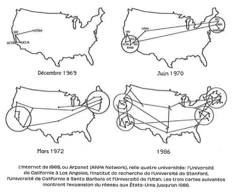
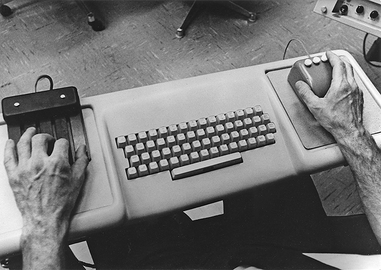

<style>
.button {
  background-color: white;
  border: 1px solid;
  border-color: black;
  font-family:"Lato",sans-serif;
  font-weight:350;
  color: black!important;
  padding: 10px 10px;
  text-align: center;
  text-decoration: none;
  display: inline-block;
  font-size: 16px;
  margin: 4px 2px;
  cursor: pointer;
}
.button:hover {
  text-decoration:none;
  background-color: black; 
  color: white!important;
}
.round-button {
    display:block;
    width:100px;
    height:100px;
    line-height:17px;
    border:0px ;
    border-radius: 50%;
    color:#1A8477;
    text-align:center;
    text-decoration:none;
    display: table-cell;
    vertical-align: middle;
    background: #1A8477;
    box-shadow: 0 0 0px gray;
    font-size:14px;
    font-weight:bold;
    }

</style>

<div align="right"> 
    <a href="http://files.modulo-info.ch/enjeux-sociaux/histoire-culture/HistoireCultureNumerique_1.pdf" class="round-button">
         <font color=white id="demo">Cliquer ici pour <br>dossier</font>
    </a>
</div>

# Histoire et culture du numérique, partie 1

<br>


Cette première partie du dossier Histoire et culture du numérique propose de retracer **l’émergence d’Internet et de l’informatique personnelle**, en replaçant les diverses innovations dans leur contexte socio-historique. Il permet de comprendre l’influence déterminante de la **contre-culture** dans l’évolution du réseau et de ses usages. Il présente également la **vision utopique** qui a porté les pionniers et qui a conditionné tout le développement d’Internet.

## Objectifs

* Comprendre le contexte socio-historique de l’émergence d’Internet et son influence sur l’architecture du réseau
* Saisir la vision utopique des pionniers d’Internet 
* Explorer la dimension politique du réseau pour saisir le caractère conventionnel, construit et évolutif de cette infrastructure

## Enjeux 

L’histoire d’Internet est marquée par des valeurs et une multitude de choix qui ont fortement influencé son développement. Il est nécessaire de les aborder pour comprendre la forme qu’a pris le réseau et les enjeux qu’il continue de présenter.

### 💾 D'Arpanet à Internet 
#### Une vision révolutionnaire de l’informatique 

L’idée au fondement d’Internet est celle de relier des ordinateurs entre eux. Elle émerge dans les années 1960, alors que les ordinateurs ne sont encore que d’imposantes machines (des mainframes), très chères et peu puissantes, résidant essentiellement dans des centres de recherche ou des grandes entreprises. Dans un contexte de guerre froide et de course à l’espace, les États-Unis investissent massivement dans la recherche militaire et créent l’agence DARPA (« Defense Advanced Research Project Agency »). Au sein du DARPA, Joseph Licklider (directeur du département « Information Processing Techniques Office ») a une vision particulière de l’informatique : il entrevoit un avenir dans lequel individus et machines évoluent en **symbiose**. Dans sa perspective, très originale à l’époque, les machines doivent servir à augmenter les capacités humaines et à développer la communication entre personnes. Pour cela, il faut faire travailler les ordinateurs en réseau. Cette vision orientera fortement la recherche et se traduira par le développement d’Arpanet, en 1969. Les premières connexions formant Arpanet voient se relier quatre instituts de recherche issus de plusieurs universités de l’ouest des Etats-Unis (fig. 1)1. 



_Évolution du réseau ARPANET_

À l’époque, il existe déjà un réseau de machines, dans le cadre de la téléphonie. Arpanet présente toutefois deux différences qui constituent des innovations majeures : il est distribué et repose sur la commutation par paquets des messages. 

Un **réseau distribué**, contrairement à un réseau centralisé (ou même décentralisé), ne présente aucun nœud gérant exclusivement la connexion entre les machines. Au-delà d’améliorer la résilience du système, un tel réseau permet surtout de faire de chaque nœud une machine « intelligente » dans le sens où chacune est un ordinateur programmable. Dans un réseau distribué, chaque nœud peut alors calculer la route que doit prendre le message pour arriver à destination. Le réseau distribué a ainsi permis de développer le concept de la **commutation par paquets**, technique centrale dans le fonctionnement du futur protocole TCP/IP.   

Arpanet s’étend au cours des années 70 pour relier les deux côtes étatsuniennes (fig. 1). Il faudra plus d’une décennie de travail pour stabiliser ce système de communication et créer la norme TCP/IP qui sous-tend Internet. Le choix technique du réseau distribué va donner à ce travail une nature profondément coopérative, car chaque utilisateur connecté au réseau peut proposer des innovations et y apporter des modifications. 

#### TCP/IP : un travail coopératif et des choix politiques 

Internet est un assemblage technique complexe de câbles, routeurs, ordinateurs, protocoles et logiciels de communication. Ces éléments n’ont toutefois pas été développés de manière coordonnée : l’articulation progressive, par petites étapes, de ces dispositifs techniques est le résultat d’une multitude d’expérimentations venant à la fois des militaires, des chercheurs et des passionnés d’informatique. Chacun y allait de son développement et le transmettait aux autres dans ce qui constituait un travail d’innovation coopératif, marqué par une culture du partage et de la communication. Une telle démarche était très originale et ne servait par ailleurs aucun client ni public, les divers acteurs ayant avant tout voulu faire fonctionner le réseau pour leur propre usage. 

Le principal support de ce travail coopératif a été les « Requests for Comments » (RFC), une série de notes circulant dans cette communauté de pairs. La première RFC, émise par l’Université de Californie en 1969, dessine les contours d’Arpanet. Les divers acteurs sont invités à en prendre connaissance et à l’enrichir. Le texte est public : tout le monde (en pratique, essentiellement des ingénieurs) peut participer à la discussion. Lorsqu’un consensus est atteint sur les spécifications techniques en question, la RFC est figée et numérotée. C’est par une succession de RFC que sera défini, en 1983, le protocole de communication TCP/IP (dans la RFC 1122), une invention émanant de Vinton Cerf et Robert Kahn, deux ingénieurs travaillant alors chez DARPA. 

Avec Arpanet a en effet débuté la réflexion autour d’un « Inter-networks » qui devait parvenir à connecter différents types de réseaux (radio, satellite, Ethernet) pour garantir la résilience du système global de communication. Les protocoles TCP et IP ont alors été développés pour permettre l’utilisation de n’importe quel réseau dans la transmission des paquets d’information. Ils furent fonctionnels dès 1978. Les militaires, convaincus par les premiers tests, ont voulu en généraliser l’usage mais se sont heurtés à la résistance des entreprises de télécommunications qui ambitionnaient aussi la création d’un réseau commun, avec leur protocole X.25 (standardisé par l’Union internationale des télécom en 1976). Leur approche se voulait toutefois monopolistique, réservant leurs services aux machines reliées à leur infrastructure et empêchant les réseaux privés de profiter de leur offre. Une des initiatives notables est la création du réseau télématique par la Direction générale des télécommunications (DGT) en France. Ce réseau se basait sur X.25 et proposait un terminal gratuit, le Minitel, permettant de relier les abonnés à des services qui se sont rapidement développés en une sorte de messagerie interactive. Celle-ci a fait le succès du dispositif auprès des usagers et favorisé la création d’un marché autour du Minitel, car le modèle économique de la DGT était très rentable pour les fournisseurs de service. Ce système, s’il n’a finalement pas été la formule gagnante, a toutefois été le premier à offrir gratuitement un terminal aux abonnés (stratégie marchande inconcevable à l’époque mais précurseur des pratiques des télécoms actuelles) et à permettre des échanges interactifs qui préfigurent le Web et les réseaux sociaux.

Internet, par contraste, utilisait un protocole compatible avec tout réseau, laissant à chacun la liberté de développer son propre modèle d’affaires. Ce « réseau de réseaux » reste toutefois cantonné aux domaines académiques et militaires jusque dans les années 1980. Il est l’apanage d’une population limitée d’experts qui s’équipent et développent, au fil des usages, des applications telles que le mail (en 1972) ou les « newsgroups » (dont le plus connu est Usenet, en 1979). Sa large diffusion est le résultat de plusieurs choix décisifs. Le premier est le passage d’Arpanet dans les mains des universitaires dès le début des années 1980, les militaires n’étant plus guère intéressés par ses nouveaux usages. Le DARPA décide ensuite de faire entrer  le protocole TCP/IP dans le domaine public, ouvrant ainsi le code à tout le monde, ce qui favorise grandement son adoption. Enfin, en 1995, les instances académiques américaines ne parviennent plus à prendre en charge la maintenance technique du réseau et transfèrent cette tâche à des entreprises privées, qui deviendront les fournisseurs d’accès à Internet (FAI). Ceux-ci développent alors leurs services, conférant au réseau la nature commerciale qu’on lui connaît aujourd’hui. Ce statut particulier d’Internet, à la fois comme bien commun et comme base d’usages marchands, crée un mouvement d’innovation très important dès la fin des années 1990 : les start-up se multiplient, augmentant les investissements dans le réseau et la qualité des services fournis. 

À l’époque d’Arpanet, le principe du réseau distribué a séduit non seulement parce qu’il était ingénieux au niveau technique et résilient au niveau militaire, mais aussi parce qu’il embarquait une vision sociétale qui résonnait fortement avec les valeurs libertaires des pionniers. 

#### Les utopies des pionniers, entre culture du hacking et contre-culture étatsunienne 

Le travail ouvert et collaboratif qui fonde le développement d’Internet s’ancre dans la culture informatique de l’époque. Chercheurs, informaticiens et passionnés écrivent, échangent et enrichissent des logiciels qui sont alors libres de toute propriété intellectuelle. 

Internet a ainsi été développé selon le modèle du logiciel libre et ses premiers usages sont marqués par le hacking, une communauté avant-gardiste qui émerge au MIT à la fin des années 1970. Ses membres – les hackers – nouent une relation intense, curieuse et expérimentale avec l’informatique (ordinateurs, réseaux, logiciels, etc.). Si le terme a évolué pour désigner essentiellement des cybercriminels aux intentions malveillantes dans les médias actuels, les hackers sont à l’origine de grands experts de leur domaine. Mus par une volonté de comprendre en profondeur les systèmes informatiques, ils font la course à la solution la plus ingénieuse. Ils acquièrent mérite et crédibilité dans leur communauté sur la seule base de leurs prouesses (attribuant peu de valeur aux diplômes et autres sources traditionnelles de reconnaissance). Au centre de l’éthique des hackers, on retrouve la notion de circulation libre de l’information et une méfiance pour l’autorité et la centralisation du pouvoir, des caractéristiques qui ont fortement imprégné l’architecture d’Internet.

De manière plus générale, le développement de l’informatique a également été marqué par les **idéaux de la contre-culture** étatsunienne de la fin des années 60. Le mouvement hippie, dont certains informaticiens font partie, cherche à libérer les individus des contraintes sociales (professionnelles, familiales, militaires, etc.) de l’époque. Ces aspirations rejoignent celles d’ingénieurs tels que Doug Engelbart qui, avec son système NLS dont il fera une démonstration très marquante en 1968, cherche à donner plus d’autonomie aux individus dans une logique d’augmentation de leurs capacités. 

C’est dans cette idée, et alors même que les industriels ne voient pas d’intérêt à démocratiser les ordinateurs, que la contre-culture va impulser, au milieu des années 1970, l’innovation informatique qui mènera à la création de l’ordinateur personnel (voir encadré), en fondant des clubs de bricolage informatique dans la banlieue de San Francisco. Steve Jobs et Steve Wozniak y présenteront le premier ordinateur Apple. 

Les ordinateurs personnels rejoignaient donc un objectif politique visant à rendre aux individus une capacité d’agir. En connectant ces machines entre elles, l’ambition était de donner du pouvoir à des communautés. L’une des premières et des plus connues est The Well (voir encadré). Alors que le mouvement hippie s’essouffle, les premières « communautés virtuelles » deviennent le nouveau lieu de convergence des espoirs d’émancipation. On les pense comme des espaces immatériels et séparés du réel ; protégés des hiérarchies sociales qui empoisonnent la société et dans lesquels tout le monde peut s’exprimer librement. Pour les pionniers, Internet est un nouveau territoire qui s’est construit par les individus, en-dehors des règles du marché ou de l’État. Il favorise la circulation libre de l’information et s’affranchit des frontières nationales et culturelles : les individus de tous horizons peuvent communiquer et collaborer, amenant chacun leurs compétences spécifiques à des projets. 

Cette vision utopique révèle un projet politique qui confère une force révolutionnaire à une infrastructure technique : en redonnant du pouvoir aux individus, en les reliant entre eux pour faire fonctionner l’intelligence collective, les pionniers font d’Internet l’instrument par excellence du changement social. On trouve un exemple emblématique de cette perspective dans un discours prononcé par John Perry Barlow en 1996 à l’occasion du World Economic Forum (WEF). Barlow fut une figure saillante de la contre-culture américaine et de l’esprit des pionniers. Il est l’un des fondateurs de l’Electronic Frontier Foundation (EFF), une organisation défendant jusqu’à ce jour les valeurs pionnières d’Internet. Alors que les premières initiatives étatiques de régulation d’Internet émergent, Barlow énonce ce qu’il appellera la « Déclaration d’indépendance du cyberespace », un texte réitérant la nécessité de conserver l’autonomie absolue d’Internet. 


_Première page de la première édition du Whole Earth Catalog, automne 1968_

Il enjoint à ses interlocuteurs (les chefs d’État et les entrepreneurs réunis au WEF) de ne pas imposer à cet espace les mêmes règles qui régissent les autres domaines de l’organisation sociale. 

```{didyouknow} LA CONTRE-CULTURE, CATALYSEUR DE L'INNOVATION

L’une des productions notables du mouvement hippie est le « Whole Earth Catalog », un magazine rassemblant une série de notes aux thèmes très variés. C’est dans ces écrits (très consultés) qu’émerge l’idée d’un nouvel usage pour les ordinateurs. Contrairement à une conception courante, le mouvement hippie n’était pas technophobe. Il était surtout opposé à l’accaparation des moyens techniques par le pouvoir. Pour les membres de la contreculture, les technologies informatiques avaient en effet le potentiel de devenir des vecteurs d’émancipation personnelle et devaient dès lors être mises à la disposition des individus. Cette idée est véhiculée en particulier par Stewart Brand, l’un des fondateurs du Catalog, qui jouera un grand rôle dans l’articulation des développements informatiques avec les enjeux politiques et culturels de l’époque. Brand n’est pas un inventeur mais un facilitateur : il a permis la rencontre des mondes informatique et contre-culturel à une multitude de niveaux. C’est par exemple lui qui a filmé la célèbre démonstration d’Engelbart en 1968. Il a également créé The Well (« The Whole Earth ‘Lectronic Link »), l’une des premières communautés en ligne. Créé en 1985, il reprend les contenus du Catalog et se constitue en une sorte de forum en ligne dans lequel se retrouvent des ingénieurs, mais aussi des militants, artistes et journalistes. Le parcours de Brand témoigne de l’influence décisive des idéaux de la contre-culture dans le développement d’Internet et de l’informatique personnelle. Il convient ainsi de ne pas la réduire à de simples anecdotes sans conséquence. Pour les historiens, ce n’est pas un hasard si l’informatique personnelle s’est développée sur la côte ouest des Etats-Unis, alors que tous les ingrédients étaient également réunis (d’un point de vue technique).
```

Les pionniers nourrissent une grande méfiance à l’égard des institutions étatiques mais se montrent moins hostiles envers le marché économique, avec lequel ils partagent des valeurs libérales (responsabilité individuelle, autorégulation, autonomie). Beaucoup vont se lancer dans l’entrepreneuriat dès les années 1990 et contribuer au développement du **modèle économique de la Silicon Valley**, qui résulte de l’intégration des valeurs de la contre-culture dans l’organisation des entreprises. Le travail devient alors un vecteur d’épanouissement personnel dont le moteur n’est plus le salaire mais la passion ; les hiérarchies sont simplifiées ; on valorise la créativité des employés et favorise leur autonomie. Les entreprises deviennent « cool », l’ambiance de travail décontractée.

Avec le recul, nous pouvons dire que Barlow avait largement sous-estimé la menace que constituait le secteur privé pour le projet politique des pionniers. Ce sont en effet les entreprises qui vont nourrir le développement du Web et de ses services dès les années 1990. L’expansion du réseau ouvre la porte à des enjeux politiques importants puisqu’elle engendre la rencontre d’une grande diversité de profils et de cultures. Si l’utopie d’un espace à l’abri des inégalités du « réel » était pensable lorsque les usagers d’Internet se limitaient à des passionnés et experts en informatique, l’évolution des usages du réseau laisse apparaître clairement qu’il prolonge, voire amplifie, des problématiques sociales et politiques préexistantes. Ainsi, avec le développement du Web (et surtout du Web participatif), la gouvernance d’Internet ne peut plus se limiter à une autorégulation basée sur une liberté absolue des utilisateurs. 

[1] Cardon, D. (2019). Culture numérique. Paris: Presses Sciences Po, p. 57.

## Ressources

* Le [Livre]( https://cfeditions.com/utopie-numerique/?) de l’historien Fred Turner Aux sources de l’utopie numérique (2012 [2006])
* Une [interview](https://www.lemonde.fr/pixels/article/2015/02/19/l-antipolitique-peche-originel-de-la-silicon-valley_4577534_4408996.html?) de Fred Turner sur le rapport de la Silicon Valley au politique (Le Monde, 19.02.2015)
* Un [podcast](https://www.radiofrance.fr/franceculture/podcasts/serie-une-histoire-de-l-internet?) de France Culture sur l’histoire d’Internet
* Le [livre](https://www.cairn.info/culture-numerique--9782724623659.htm?) Culture numérique de Dominique Cardon (2019) - chapitre « Généalogie d’Internet » 
* Le [livre](https://www.cairn.info/sociologie-du-numerique--9782200624750.htm?) Sociologie du numérique (2019) de Dominique Boullier – chapitre « Histoire d’Internet »
* Sur le développement du modèle économique de la Silicon Valley : [L’évangélisme technologique. De la révolte hippie au capitalisme high-tech de la Silicon Valley](https://boutique.fypeditions.com/products/l-evangelisme-technologique-de-la-revolte-hippie-au-capitalisme-high-tech-de-la-silicon-valley?) 
* Pour consulter le Whole Earth Catalog : archives ici et index ici
* Les RFC sont consultables sur le site [RFC Editor](https://www.rfc-editor.org?) (en anglais seulement).
 * Web-série Arte qui peut être intéressante pour créer des activités (en lien aussi avec le dossier médias sociaux) : [Jurassic Web, Une préhistoire des réseaux sociaux](https://www.arte.tv/fr/videos/RC-019960/jurassic-web/?) 

## Pistes pédagogiques

### 1. Les utopies d'internet 

**Objectif** : Discuter des utopies véhiculées par les pionniers d’Internet 

**La déclaration de l'indépendance du cyberespace**

🕑 30 min | 👩‍💻 branché

Lire la « Déclaration d’indépendance du cyberespace » de John Perry Barlow (disponible [ici](http://editions-hache.com/essais/barlow/barlow2.html?) en français). NB : supprimer le propos introductif, qui contient du langage injurieux. Par groupes, les élèves font des recherches en ligne afin de répondre aux questions ci-dessous. Pour les guider, on peut au préalable établir la liste des éléments à chercher : Barlow, le WEF, le « Telecommunications Reform Act of 1996 ». Les élèves repèrent ensuite, dans le texte, les passages qui exemplifient la vision utopique des pionniers d’Internet. 

 a) Qui est John Perry Barlow ? 
 * _Une grande figure de la contre-culture aux Etats-Unis (mouvement hippie)._
 * _L’un des fondateurs de l’Electronic Frontier Foundation, une ONG en charge de défendre les valeurs pionnières (libertaires) d’Internet. b) Dans quel contexte prononce-t-il sa « Déclaration d’indépendance du cyberespace » ?_

  b) Dans quel contexte prononce-t-il sa « Déclaration d’indépendance du cyberespace » ? 
  * _Lors du World Economic Forum à Davos, en Suisse, qui réunit les chefs d’État et les entrepreneurs._
  * _Le « Telecommunications Act » vient d’être signé aux Etats-Unis, une réforme de la loi sur les télécommunications qui inclut pour la première fois Internet. Barlow est révolté par cette nouvelle régulation, qu’il assimile à de la censure._ 
  
  c) Quel message Barlow veut-il transmettre ? 
  * _Il estime qu’Internet est un espace immatériel, qui dépasse les frontières, et qui doit rester indépendant des réglementations gouvernementales._ 
  * _La liberté d’expression doit rester absolue sur Internet, qui est conçu comme un espace égalitaire. Tout un chacun peut s’exprimer individuellement et anonymement, pour dire ce qu’il veut._ 
  
  d) Quelles utopies peuvent être identifiées dans le texte ?  
  * _Liberté d’expression ; circulation de l’information_
  * _Intelligence collective_
  * _Décentralisation du pouvoir (rejet de l’intervention des États)_ 
  *_Nouvel espace immatériel et autorégulé ; abolition des distances et des frontières_


### 2. Projets fondateurs : le système NLS de Doug Engelbart

**Objectif** : Replacer l’informatique moderne dans le contexte historique de son développement 

**Mother of all demos**

🕑 30 min | 👩‍💻 branché

Expliquer brièvement aux élèves ce qu’ils vont voir : des extraits d’une démonstration faite en 1968 par l’Institut de recherche de Stanford (SRI, aux USA). Le chercheur principal, Doug Engelbart, y utilise en direct le système NLS (oN-Line-System), un système d’exploitation novateur. Le système NLS peut nous paraitre banal aujourd’hui, voire archaïque. En 1968, il était révolutionnaire. La démo présente en détail des éléments qui sont devenus très courants. 

Demander aux élèves de visionner les extraits en restant attentifs : 
* Aux buts du projet (pourquoi ce système a été développé) 
* Aux innovations techniques qui sont présentées 

Diffuser les extraits suivants de la démonstration d’Engelbart (totalisant 13 minutes) :  

* [Introduction](https://www.youtube.com/watch?v=VScVgXM7lQQ&list=PL76DBC8D6718B8FD3?) 
* [Traitement et éditon de texte, organisation de l'information, lien hypertexte](https://www.youtube.com/watch?v=Xptc6f3Daoo&list=PL76DBC8D6718B8FD3&index=2)
* [La souris](https://www.youtube.com/watch?v=vv85FSf_6vw?)
* [Collaboration en temps réel et vidéoconférence](https://www.youtube.com/watch?v=qI8r8D46JOY&list=PL76DBC8D6718B8FD3&index=8?)

NB : Pour afficher les sous-titres en français, activez d’abord les sous-titres en cliquant sur l’icône correspondante. Ensuite, cliquer sur l’icône des paramètres, puis sur « soustitres » et « traduire automatiquement » en choisissant le français. Le résultat n’est pas parfait mais reste globalement compréhensible.

a) Quel est le but de la recherche menée au SRI ? 

* _Objectif d’augmentation technique des capacités humaines (du « travailleur intellectuel »)._ 
* _Système mis au point dans le cadre de la recherche sur « l’intellect humain augmenté ». L’idée est de rendre les humains plus intelligents grâce aux machines (et non de produire des machines intelligentes, qui est le but de l’IA). Dans l’esprit d’Engelbart, les machines peuvent être utilisées pour simplifier des tâches basiques ou routinières (production de graphiques, etc.) et ainsi libérer de l’espace pour des opérations intellectuelles plus complexes et créatives._ 

b) Demander aux élèves d’identifier les innovations présentées :
* _L’informatique interactive et en temps réel_ 
* _La souris_ 
* _L’interface graphique (fenêtres, structure logique, etc.)_ 
* _Le principe du lien hypertexte (naviguer d’un document à l’autre en cliquant dessus)_ 
* _L’édition de texte (notamment le copiercoller)_ 
* _Plusieurs ordinateurs connectés entre eux_ 
* _Le partage de documents et le travail collaboratif simultané_ 

c) Pourquoi appelle-t-on cette intervention la « Mère de toutes les démos » (« Mother of all demos ») ? 

_Cette démonstration a marqué durablement le domaine. Elle a eu une influence considérable sur le développement de l’informatique personnelle telle qu’on la connait aujourd’hui. Discuter avec les élèves : quelles applications modernes sont-elles comparables aux fonctionnalités du système NLS ? Par exemple :_ 

* _Traitement de texte : Word, etc._
* _Fichiers communs et travail collaboratif : Google docs, Moodle._
* _Liens hypertexte : le Web._ 
* _Vidéoconférences : Zoom, FaceTime, etc._ 
* _Ordinateurs connectés entre eux : Internet (ARPANET est d’ailleurs mentionné à d’autres moments de la démonstration)._


_Douglas Engelbart pendant sa présentation de 1968_




_Douglas Engelbart utilisant le NLS, un clavier QWERTY standard, et une souris à 3 boutons, en 1968_

