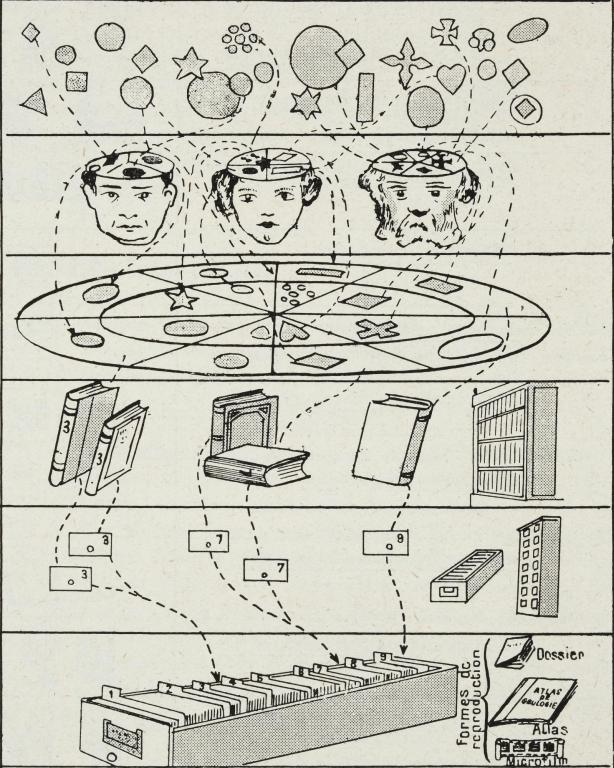
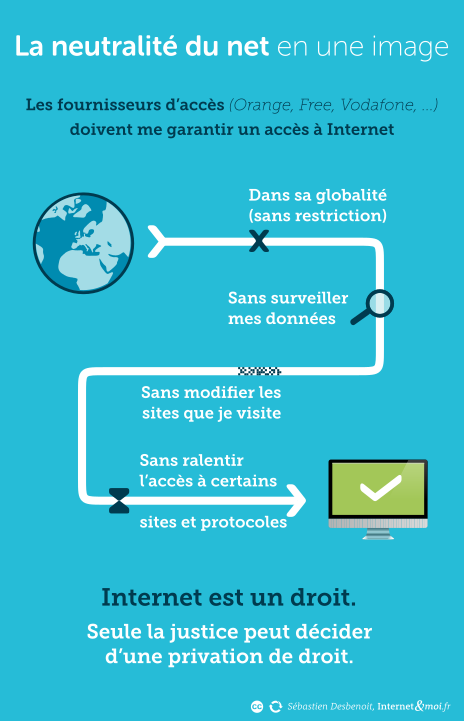
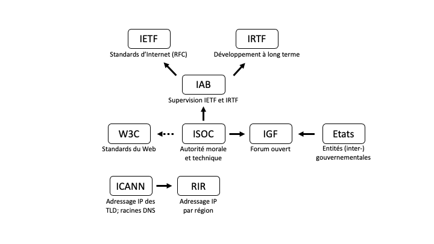

<style>
.button {
  background-color: white;
  border: 1px solid;
  border-color: black;
  font-family:"Lato",sans-serif;
  font-weight:350;
  color: black!important;
  padding: 10px 10px;
  text-align: center;
  text-decoration: none;
  display: inline-block;
  font-size: 16px;
  margin: 4px 2px;
  cursor: pointer;
}
.button:hover {
  text-decoration:none;
  background-color: black; 
  color: white!important;
}
.round-button {
    display:block;
    width:100px;
    height:100px;
    line-height:17px;
    border:0px ;
    border-radius: 50%;
    color:#1A8477;
    text-align:center;
    text-decoration:none;
    display: table-cell;
    vertical-align: middle;
    background: #1A8477;
    box-shadow: 0 0 0px gray;
    font-size:14px;
    font-weight:bold;
    }

</style>

<div align="right"> 
    <a href="http://files.modulo-info.ch/enjeux-sociaux/histoire-culture/HistoireCultureNumerique_2.pdf" class="round-button">
         <font color=white id="demo">Cliquer ici pour <br>dossier</font>
    </a>
</div>

# Histoire et culture du numérique, partie 2

<br>

Cette seconde partie du dossier Histoire et culture du numérique détaille le développement du Web. Il retrace la généalogie du lien hypertexte, décrit les premiers services du Web, introduit les biens communs numériques et discute de l’impact profond du « Web 2.0 » sur l’évolution des usages d’Internet. Il est complété par une présentation de la gouvernance d’Internet et de ses enjeux. 


## Objectifs

* Saisir l’évolution du réseau et des pratiques en ligne avec l’émergence du Web et de l’économie des plateformes.
* Explorer la dimension politique du réseau pour saisir le caractère conventionnel, construit et évolutif de cette infrastructure 
* Se familiariser avec les enjeux de la gouvernance d’Internet
Distinguer Internet du Web pour mieux étudier leurs enjeux respectifs

## Enjeux 

Le Web a lui-même déjà profondément
changé en trente ans. Nous allons en retracer
les développements afin de comprendre comment
il en est venu à structurer de manière
fondamentale notre organisation sociale.
Ensuite, et face à la constatation que les utopies
des pionniers ne se sont pas réalisées,
nous discuterons des enjeux liés à la gouvernance
d’Internet et des pratiques en ligne.

### 🌐 D’Internet au Web 2.0

Si Internet permet de relier des machines
entre elles, le Web a lui été pensé pour créer
des relations entre les documents présents
sur le réseau. Le Web repose sur le **protocole
HTTP** (_HyperText Transfer Protocol_), compatible
avec TCP/IP. Il ne doit pas être confondu
avec Internet lui-même : ce n’est que l’un des
nombreux protocoles qui mobilisent le réseau
(on trouve par exemple SMTP pour les mails
ou FTP pour les fichiers volumineux). Le Web
se situe au niveau de la couche applicative
du réseau : c’est un service qui exploite les
couches basses (l’infrastructure technique)
d’Internet. Internet contient ainsi bien plus que
le Web, même si ce dernier concentre beaucoup
d’usages.

L’innovation au fondement du Web arrive en
1990. Il s’agit du **lien hypertexte**, fruit du travail
de Tim Berners-Lee, alors informaticien
au CERN. Dans un rapport intitulé “Information
Management: A Proposal” qu’il soumet à
sa direction, Berners-Lee propose un nouveau
système de gestion de l’information. Ce projet
contient l’idée des adresses URL (Uniform
Resource Locator), attribuées aux documents
pour permettre de naviguer de l’un à l’autre.
Le lien hypertexte vient alors concrétiser simplement
et très efficacement une manière
nouvelle d’ordonner l’information.

#### Le lien hypertexte, un nouveau mode de classement de l’information 

Comme avec Internet, le développement du
Web vient ébranler des pratiques bien établies.
En l’occurrence, le recours au lien hypertexte
permet de s’éloigner des modes de
classement documentaires qui ont prévalu
jusqu’alors (penser, typiquement, à l’organisation
des bibliothèques) : au lieu de grouper les
documents selon des catégories et sous-catégories
prédéfinies, le Web permet de les relier
selon leur contenu. L’internaute peut alors
s’affranchir de tout classement pour naviguer
d’un document à l’autre, selon les liens
hypertexte définis par l’auteur. Avec le Web,
la classification de l’information se décentralise
puisqu’elle n’est plus dans les mains des
documentalistes. Le Web prolonge ainsi l’esprit
libertaire des pionniers d’Internet.

La généalogie du lien hypertexte est ancienne.
Au début du 20ème siècle déjà, l’inventeur
belge Paul Otlet se lance dans un projet
ambitieux de bibliothèque universelle, le
Mundaneum, dans laquelle les documents
sont organisés non pas selon leurs attributs
(auteur, date, etc.) mais selon les idées qu’ils
contiennent. Ainsi, les livres sont résumés dans
des fiches thématiques, classées elles-mêmes
dans des tiroirs (par milliers) en fonction des
idées qu’elles ont en commun. En perçant
les fiches de trous spécifiques aux informations
qu’elles détiennent, il devient possible,
à l’aide d’une tige, d’extraire les chapitres de
livres différents évoquant une idée semblable.
Ce système peut être considéré comme l’ancêtre
du lien hypertexte. Plus tard, Otlet imaginera
la création d’un ordinateur connecté
(la Mondothèque) permettant d’explorer les savoirs du Mundaneum. Par sa volonté
de rassembler et diffuser ouvertement les
connaissances au-delà des frontières, Otlet
a fortement contribué à nourrir l’imaginaire
utopique au fondement des développements
de l’informatique en réseau. Son ambition se
retrouvera en effet dans de nombreux autres
projets tels que le Memex de Vannevar Bush
(1945), le système NLS d’Engelbart (1968) et
Xanadu de Ted Nelson (1965). Ce dernier ne
sera jamais fonctionnel mais c’est dans ce
cadre que Nelson crée le terme « hypertexte
», en référence au fait de connecter des idées
entre elles. C’est Berners-Lee qui concrétisera le concept avec le développement du Web.
Ce n’est pas un hasard si la solution émane
de scientifiques : la structure documentaire du
Web répond d’abord à leurs besoins de gérer
une quantité grandissante de publications,
dans un système académique qui fonctionne
sur la base de citations. Les liens hypertextes
rendent ainsi possible la consultation d’une
référence à partir d’une autre.



_Diagramme de Paul Otlet représentant un
système de classement des connaissances
humaines, 1934._

Le Web est également marqué par les caractéristiques
d’Internet : le principe est simple,
ingénieux et facile à implémenter ; comme
pour TCP/IP, le code est ouvert et accessible
gratuitement (le CERN renonce à ses
droits d’auteur en 1991). Le protocole HTTP
se diffuse très rapidement et les sites Web
deviennent la forme standardisée de publication
sur Internet. En simplifiant considérablement
l’utilisation d’Internet, le Web rend la recherche d’informations accessible au grand
public. Les usages du Web, initialement académiques,
vont se diversifier et augmenter de
manière exponentielle dès 1993, avec l’apparition
des premiers navigateurs. 


_Extrait du rapport de Tim Berners-Lee expliquant
un système de gestion de l’information, 1989._

#### Les premiers services du web et la « nouvelle économie »

Divers outils se développent rapidement pour
pouvoir explorer les contenus de plus en
plus nombreux du Web : les **navigateurs**, les
annuaires et les moteurs de recherche.
Le premier navigateur à succès, Mosaïc, fut
développé par l’université de l’Illinois en 1993.
Son créateur lancera Netscape une année plus
tard, un navigateur gratuit mais qui intègre
déjà la commercialisation des publicités (via
les bannières des sites) et introduit les cookies.
Netscape est utilisé par la grande majorité des
internautes de l’époque, jusqu’au lancement
d’Internet Explorer par Microsoft en 1995, qui
parvient à dominer le marché pendant des
années en vendant Explorer avec Windows,
un système d’exploitation équipant alors 90%
des ordinateurs (Microsoft fut condamné en
2013 pour cette pratique abusive).
Les annuaires et les moteurs de recherche
précèdent l’invention du Web mais s’imposent
avec celui-ci. Avec le Web se développent en
effet des **portails**, tels que Yahoo! (le premier et celui qui a dominé le secteur dans les
années 90), dont le principe est de présenter
une grande diversité de services ou d’informations
sur une même page Web, pour mieux
accrocher les internautes et maximiser ainsi
le revenu des bannières publicitaires. À une
époque où les usages sont peu développés
et la connexion à Internet est chère, les portails
constituent la référence du Web pour la
plupart des internautes. Ils intègrent d’abord
un **annuaire**, qui constitue l’adaptation du
système des bibliothèques dans le Web (les
pages sont indexées selon des catégories prédéfinies,
elles-mêmes consultables sur le portail).
Les **moteurs de recherche**, un système
concurrent basé sur la recherche par motsclés,
apparaissent sur le Web dès 1995 avec
Altavista d’abord, puis Google dès 1998, qui a
rapidement dominé le secteur avec son algorithme
novateur (Page Rank).

Les premières entreprises du Web apparaissent
dès 1995, dans un contexte où la gestion
d’Internet a été privatisée et où le développement
d’offres numériques devient un
argument politique fort. Parmi les premières
sociétés étatsuniennes, on trouve Netscape,
Amazon et Ebay. Ce développement se
constate aussi en Europe et en Chine (avec Alibaba
notamment). Les investissements dans
l’informatique deviennent massifs entre 1995
et 2000, créant une **bulle économique**. Le
développement de services en ligne tels que
le e-commerce engendre la « nouvelle économie
», une période de croissance tirant profit
de l’exploitation des nouvelles technologies
numériques. Cette nouvelle économie repose
toutefois sur le modèle traditionnel de l’industrie.
À l’époque, l’économie du numérique est
considérée comme immatérielle : en engendrant
une suppression des intermédiaires, on
devrait diminuer les coûts de commercialisation
des produits. Les experts estiment alors
qu’il faut numériser l’économie pour engendrer
de la croissance. C’est le début de la
« société de l’information » et de l’économie de
services. Le modèle de la start-up s’impose :
les employés sont connectés ; ils travaillent en
réseau et sont autonomes.

Or, la capitalisation boursière des entreprises
du Web ne reflète en rien leurs bénéfices
effectifs. Ces start-up reposent sur un modèle
d’affaires fragile. Leurs promesses ont séduit
les marchés mais elles n’ont pu se concrétiser en générant une base de clients. La bulle
éclate en 2000 et la plupart des entreprises
du Web n’y survivent pas. Le développement
du « Web 2.0 » relance le secteur en 2005, sur
des bases différentes qui tiennent compte des
spécificités du numérique. C’est le début de
l’économie des plateformes.

D’autres services se développent parallèlement
aux start-up, parmi lesquels IMDB,
Craigslist, Wikipedia, Yahoo!, Flickr, Twitter
et Facebook. Bien que la nature de ces sites
diffère, ils constituent tous de grandes innovations
du Web, dites « **ascendantes** » : elles
n’émanent pas d’instituts de recherche ou
d’études de marché mais sont le fruit d’initiatives
privées ; de passionnés qui bricolent une
solution répondant à un problème, un besoin
ou un intérêt particulier. Celle-ci, au lieu d’être
protégée par un brevet, est partagée le plus
largement possible afin d’enrichir son développement.
Étant donné qu’il s’agit de code,
sa diffusion est facilitée et peut devenir très
large. Certaines solutions peuvent intéresser
le marché, qui cherche alors à les racheter
pour les commercialiser. Les innovations
ascendantes entretiennent l’imaginaire lié au
hacking et aux utopies numériques (bricolage,
mérite, créativité, liberté, décentralisation du
pouvoir, etc.). La réussite de certaines initiatives
ne doit toutefois pas laisser penser que
les innovations ascendantes sont automatiquement
fructueuses. En réalité, seule une
minorité d’entre elles parvient à se pérenniser.
Leur développement est un processus délicat
qui ne dépend pas tant de l’originalité de l’idée
que de son ancrage géographique (proche
d’universités américaines prestigieuses), des
ressources (sociales, financières) mobilisables
et du processus de négociation visant à l’intégrer
au marché.

#### Biens communs

Comme ce fut le cas pour Internet, la très large
diffusion du Web et le développement de ses
usages tiennent au basculement de son code
dans le domaine public. Cette action fait du
Web un bien commun, dans la lignée du projet
politique des pionniers. Ni privé ni public,
un bien commun est gouverné par la communauté
qui l’utilise et doit rester accessible à
tous. La notion précède le Web et concerne
typiquement des ressources naturelles.

Le développement des communs numériques
(voir encadré) a amené leurs communautés
à créer une organisation du travail nouvelle,
sans hiérarchie et avec une responsabilité distribuée.
Ce mode de production est en outre
rendu possible par l’infrastructure elle-même,
qui favorise la mise en réseau permettant de
bénéficier des avantages du travail collectif.
Si ces communautés sont ouvertes à tout
le monde, il s’opère toutefois une sélection
sociale de leurs membres (selon le niveau
de compétence et le genre, notamment) et
une valorisation des plus méritants. Ainsi, il
s’avère souvent que les logiciels libres ne sont
l’œuvre que d’un petit groupe de personnes
très actives.

```{didyouknow} COMMUNS NUMÉRIQUES
Outre le Web, le logiciel libre constitue
l’un des premiers communs du numérique.
Ce mouvement se forme dans les
années 1980, en réaction à la commercialisation
des logiciels (qui deviennent
propriétaires). Il émane de la culture
hacker et en particulier de Richard
Stallman. Ce dernier crée GNU, une
version ouverte et gratuite du système
d’exploitation UNIX. Stallman fonde par
ailleurs la Free Software Foundation
(FSF) en 1985, chargée de promouvoir
le logiciel libre. C’est dans le cadre de la
FSF que sont explicités ses principes :
pour qu’un logiciel soit libre, tout utilisateur
doit être en mesure d’y accéder
pour l’étudier, l’utiliser, le modifier ou le
redistribuer. Ces principes se concrétisent
juridiquement par la création de
licences libres, aussi appelées copyleft,
qui garantissent l’ouverture des codes
sources et, surtout, le partage des logiciels
ainsi retravaillés.

Les logiciels open source sont d’autres
communs numériques, très proches
du logiciel libre. Les adeptes de l’open
source délaissent les revendications
politiques pour se concentrer sur
l’efficacité du processus de travail, en
considérant simplement qu’un logiciel
est plus robuste lorsqu’il est travaillé
par une communauté de personnes. Un
exemple fameux est le développement du système d’exploitation LINUX, qui
fut mis au point, dès 1991, par des développeurs
du monde entier. Ce principe
d’ouverture est aujourd’hui présent
dans une grande diversité de domaines
(_open access, open education, open
data, etc._).

En 2001, le juriste Lawrence Lessig propose
de libérer non pas le code mais le
contenu du Web (textes, images, etc).
Il met ainsi au point les Creative Commons
(CC), un ensemble de licences
par lesquelles l’auteur du contenu
conserve ses droits tout en établissant
lui-même les conditions des usages qui
peuvent être fait de son travail (utilisation
non commerciale, modification,
etc.)
```
La diffusion du logiciel libre et la création
d’autres communs numériques provoque une
réaction des défenseurs de la propriété intellectuelle.
Celle-ci voit ses dispositions se durcir
dès les années 1980. Ce sont deux visions
de l’innovation qui s’opposent et placent des
approches totalement différentes au fondement
de la créativité : l’exclusivité dans le
cas des entreprises (les potentiels retours sur
investissement favorisent les projets) ; l’ouverture
pour les communautés du libre (le partage
des connaissances décuple l’inventivité).
Les communs numériques relèvent ainsi de
décisions éminemment politiques. Ils sont
porteurs d’un projet de changement social
– l’émancipation des individus – et viennent
prolonger des utopies vieilles de plus de 100
ans.

#### Le « Web 2.0 », un tournant majeur

Le Web a profondément changé en vingt ans.
Il devient « participatif » au début des années
2000, à mesure que les innovations techniques
rendent la publication plus accessible.
C’est l’évolution de cette application qui a fait
exploser l’usage d’Internet.

Tout d’abord, des _Content Management Systems_
(CMS) tels que Wordpress mettent à
disposition des modèles de publication qui ne
requièrent plus de manipuler du code (HTML)
pour créer des pages Web. Une solution plus facile encore (car l’usage des CMS demande
tout de même quelques compétences techniques)
apparaît avec les blogs, des pages
Web d’expression personnelle mises à disposition
par diverses plateformes (notamment
Skyrock et ses Skyblogs, très utilisés par les
internautes francophones dans les années
2000).

Les internautes investissent également les
forums et les espaces de commentaires des
sites (de presse, commerciaux, culturels, etc.)
pour donner leur opinion personnelle. La pratique
se généralise en devenant une manière
pour les sites d’améliorer leurs relations
publiques ou leurs contacts avec la clientèle.
Ces outils techniques favorisent ainsi **l’expression
personnelle** et la **présentation de soi** sur
le Web. Il en émerge également une forme de
**publication collective**, les wikis, des pages qui
regroupent les contributions d’une multitude
d’internautes anonymes sur un sujet particulier.

Le Web 2.0 se caractérise donc par une
**structure participative**. Les plateformes ainsi
créées deviennent de nouveaux médiateurs en
permettant à des personnes de se connecter
autour d’un thème ou d’un projet. Paradoxalement,
cette culture participative concentre
l’essentiel des médiations et contributions sur
une poignée de plateformes. L’effet de réseau[1]
favorise les premiers services à émerger.
Myspace, par exemple, est devenu central en
2003 s’agissant du domaine musical, en permettant
aux artistes de mettre à disposition
leurs morceaux et de se connecter avec les
internautes, qui disposaient eux-mêmes d’une
page de profil personnalisable. Myspace s’est
fait détrôner par l’apparition successive de
iTunes et de Facebook, qui géraient respectivement
les aspects de distribution musicale et
de présentation de soi.

Outre cette dimension participative, le Web
2.0 engendre la production d’une très grande
quantité de données, qui constituent les
traces de l’activité des internautes (clics, statuts,
likes, tweets, etc.). Le succès financier
des plateformes est le fait du recueil, de l’exploitation
et de la vente des données générées
par leurs services (souvent gratuits). Le
Web participatif voit ainsi se développer l’économie des plateformes, qui pose des enjeux
importants au niveau économique et de la vie
privée notamment[2]. Sous l’effet de ces développements,
Internet évolue : dans les faits,
le réseau n’est plus distribué mais son trafic
centralisé sur quelques plateformes ; il n’est
plus ouvert en raison du nombre grandissant
d’architectures propriétaires, une fermeture
nécessaire au modèle économique des plateformes,
basé sur la prédation des données. Le
Web 2.0 marque l’entrée dans l’ère des **plateformes**
et modifie profondément l’organisation
d’Internet, au préjudice des utopies et des
valeurs qui ont fondé le réseau.

Des alternatives fidèles aux valeurs pionnières
subsistent toutefois, telles que Wikipédia, qui
continue à opérer de manière non commerciale
et ouverte ; des dispositifs proposant des
services d’entraide, de _crowdsourcing_ ou de
_crowdfunding_ ; le logiciel libre ; ou le _peer-to-peer_
(P2P), qui prolonge le caractère distribué
d’Internet.

Les modes d’organisation et de travail sur
Internet sont donc multiples et orientés par
des choix politiques. Le réseau présente un
caractère ambivalent en faisant coexister des
logiques à la fois communautaires et marchandes.

### Au-delà des utopies : un espace politique 

#### La neutralité du web 

Les pionniers d’Internet rêvaient d’un espace
autorégulé, dans lequel l’information circulerait
sans entrave et toute personne pourrait
s’exprimer. Cette vision a été formalisée en
2003 par le juriste américain Tim Wu, qui a
développé le principe de neutralité du net.
Celui-ci implique que tout paquet doit circuler
librement sur Internet, sans égard à son
contenu, son origine ou sa destination. La neutralité
du net vise à garantir aux utilisateurs un
accès libre et non filtré (ni hiérarchisé) aux
informations circulant sur le réseau. La figure
ci-contre a souvent été reprise pour en illustrer
les principes essentiels. Ainsi, les fournisseurs
d’accès ne doivent pas interférer avec les paquets circulant dans leur réseau. Cette
neutralité peut concerner plusieurs éléments :
l’émetteur ou le récepteur ; le lieu d’émission ou
de réception ; le contenu ; le protocole. L’idée
est de ne pas intervenir sur ces éléments, pour
que les paquets de données circulent librement.
La neutralité du net constitue la transposition
technique d’une conception radicale
de la liberté, proche du projet cybernétique.
Il ne faut par ailleurs pas confondre la neutralité
du net avec la neutralité politique : ce principe
implique de rester neutre vis-à-vis de ce
qui circule sur le réseau mais il s’inscrit dans
une vision politique libertaire (celle des pionniers).



_Sébastien Desbenoit, la neutralité du net en une
image_ 

La neutralité du net parait souhaitable pour
assurer des principes utopiques tels que la
liberté d’expression ou l’intelligence collective.
Certains FAI, par exemple, ont porté atteinte à
la neutralité du net en cherchant à influencer
ce qui circule sur le réseau de manière à augmenter
leurs profits : ils ont tenté de privilégier
la circulation des contenus qu’eux-mêmes
produisent, de majorer les services générant
beaucoup de trafic (tels que Netflix), ou de
monétiser un accès spécifique à certains services.
Le risque est que des politiques discriminatoires
soient mises en place et qu’elles
créent un « Internet à deux vitesses », où ceux
qui en ont les moyens peuvent favoriser la cir-
Sébastien Desbenoit, la neutralité du net en une
image
culation du contenu qu’ils produisent. En ce
sens, l’atteinte à la neutralité du net implique
une atteinte à la liberté d’expression.

Toutefois, appliquée strictement, la neutralité
du net entrave toute régulation du réseau
et ne permet aucune gouvernance politique,
alors même qu’Internet met en relation des
cultures très différentes qui doivent coexister.
De plus, rester neutre dans un monde qui ne
l’est pas contribue à maintenir dans une position
de pouvoir certaines conceptions ou intérêts
politiques et économiques, sans donner
la possibilité à des visions discordantes mais
tout aussi légitimes d’émerger. Finalement, un
traitement différencié des données circulant
sur Internet peut s’avérer bénéfique, comme
c’est le cas par exemple dans la lutte antispam
ou la création de pare-feu.

Il s’agit donc surtout d’identifier les situations
dans lesquelles une atteinte à la neutralité du
net est souhaitable. L’enjeu de la régulation
est alors fondamental. La neutralité du net a
longtemps été considérée comme une règle
non écrite mais plusieurs pays ont choisi de
lui donner force de loi, pour cadrer précisément
son étendue et les pratiques acceptables.
Les USA ont déclaré Internet comme
un bien public (impliquant la neutralité du
net) avant de revenir en arrière, au nom de
la liberté de l’entrepreneur. En Europe, c’est
surtout la liberté du consommateur qui l’emporte
et la neutralité du net doit être garantie
depuis 2016, selon [un règlement de l'Union européenne.](https://eur-lex.europa.eu/legal-content/FR/TXT/?uri=CELEX:32015R2120) 


Les autorités en charge de cette régulation
sont difficiles à mettre en place. Elles doivent,
d’une part, disposer de l’expertise technique
pour contrecarrer les effets discriminants se
cachant dans les dispositifs techniques et,
d’autre part, embrasser le caractère transnational
d’Internet et constituer un contrepoids
efficace vis-à-vis des grandes entreprises du
numérique.

#### La gouvernance d'internet 

Les enjeux de régulation concernent à la fois
le fonctionnement technique d’Internet et
la gestion des services qui reposent sur le
réseau, en particulier le Web.
En écho au caractère coopératif de sa création, Internet s’est développé sans cadre juridique
formel. Sa gouvernance s’est mise en
place progressivement, au gré des problèmes
qui apparaissaient, par des collectifs composés
des personnes ayant élaboré le réseau. Une
série d’instances ont ainsi vu le jour depuis les
années 1980 et perdurent encore aujourd’hui.
Bien qu’elles soient méconnues du public, ce
sont elles qui continuent à encadrer les évolutions
techniques d’Internet.

Parmi ces instances, on retrouve la _Internet
Engineering Task Force_ (IETF) qui regroupe
la communauté pionnière ainsi que les ingénieurs
dédiés au développement des couches
basses de l’infrastructure. Axée sur le court
terme, l’IETF conçoit notamment les RFC tandis
que la _Internet Research Task Force_ (IRTF)
s’occupe du développement à plus long terme
du réseau. Ces deux entités sont gérées par
la _Internet Society_ (ISOC), fondée en 1992 par
Cerf et Kahn (les créateurs de TCP/IP) afin
de coordonner les travaux techniques sur le
réseau. L’ISOC est une organisation internationale
composée de chapitres nationaux (mais
non gouvernementaux). Bien qu’elle porte les
valeurs pionnières d’Internet et constitue l’autorité
de supervision, dans les faits, c’est surtout
le travail de l’IETF qui impacte concrètement
le fonctionnement du réseau.

Une autre entité joue un rôle décisif dans la gouvernance
d’Internet : la _Internet Corporation
for Assigned Names and Numbers_ (ICANN).
La régulation opérée par l’ICANN intervient
au niveau de l’adressage : cette instance gère
les règles d’attribution des adresses IP ainsi
que des noms de domaine de premier niveau
(les TLD, pour _Top Level Domains_). L’ICANN
assure également la gestion technique du
système de nom de domaine (_Domain Name
System_ ou DNS, chargé de résoudre les noms
de domaines en adresses IP) au niveau des
serveurs racine (ceux des TLD). La gouvernance
de l’ICANN a régulièrement été remise
en question, principalement en raison de ses
liens avec le gouvernement américain (via son
Département du commerce), qui impactent
la neutralité de cette instance chargée de
superviser un dispositif transnational. On a
ainsi accusé l’ICANN de servir les intérêts des
États-Unis. Ces débats ont mené à la rupture
des liens contractuels de l’ICANN avec l’État
nord-américain en 2016. L’ICANN reste toutefois
une association soumise au droit califorcalifornien.
Si les débats sont vifs, c’est parce que
la gestion de l’adressage (et donc le contrôle
de l’ICANN) revêt une dimension politique. La
Chine a par exemple développé son propre
DNS en 2006, indépendant de celui de l’ICANN,
suite à la lenteur de ce dernier dans la gestion
des noms de domaine non latins. Plusieurs
autres pays ont menacé de faire de même, ce
qui pourrait aboutir à un morcellement d’Internet
qui menacerait sa portée mondiale et,
par là même, l’objectif premier du réseau. Plus
généralement, la définition des TLD nationaux
(ccTLD) était à l’origine basée sur les codes
ISO des pays, mais les délimitations territoriales
peuvent évoluer ou être âprement disputées.
Les noms de domaines peuvent alors
faire l’objet d’une bataille géopolitique, car ils
attribuent un statut politique aux territoires.
Ainsi, la Catalogne s’est longtemps battue
pour obtenir la création du TLD .cat. Ce n’est
qu’en 2011 que l’ICANN a permis la création de
nouveaux TLD, qui peuvent dès lors concerner
des régions, des villes mais aussi des marques.
A la dimension politique s’ajoutent par ailleurs
des enjeux commerciaux, certains noms de
domaine faisant l’objet d’une forte concurrence
ou de _cybersquatting_.

Pour terminer sur les aspects techniques, le
_World Wide Web_ Consortium (W3C), fondé par
Berners-Lee en 1994, édicte les standards du
Web (HTML, CSS, etc.). Ce consortium réunit
les acteurs du Web pour décider des bonnes
pratiques et émettre des recommandations
reposant sur des procédures de normalisation
internationale. Si son mode de gouvernance
se veut ouvert et basé sur le consensus, il se
heurte à la puissance des grandes entreprises
du numérique. Leur poids est tel qu’elles sont
en mesure d’imposer unilatéralement leurs
pratiques ou d’avoir une influence disproportionnée
sur le processus décisionnel.

Internet est ainsi dirigé non pas par une unique
instance étatique ou privée, mais par toute une
série d’entités, elles-mêmes composées d’une
multitude de parties prenantes (utilisateurs du
réseau, gouvernements, entreprises, communautés
scientifiques, société civile, organisations
internationales). Cette organisation perdure
malgré la grande complexité du système.
Ces instances de gouvernance sont ouvertes
à tout le monde (individus et collectifs) mais,
dans les faits, il faut être très compétent
pour avoir voix au chapitre. L’administration du réseau reste dans les mains d’une poignée
d’acteurs influents. Elle ne constitue ainsi pas
un véritable pluralisme normatif.

Il est également important de noter qu’Internet
et le Web, malgré le caractère consensuel de
leur gouvernance, n’ont pas été mis au point
selon un processus démocratique. Ce sont en
effet des collectifs techniques qui ont décidé
des contours des applications numériques qui
organisent aujourd’hui de manière fondamentale
notre quotidien. Cette gouvernance se
fait, aujourd’hui encore, selon les principes du
_rough consensus_ (consensus approximatif) et
du _running code_ (code courant), définis initialement
par l’IETF dans une RFC en 1998. Ainsi, ce
ne sont pas des règlements ni des lois votées
démocratiquement qui gouvernent le domaine
numérique, mais les ingénieurs développant
le code. Les innovations sont alors adoptées
en-dehors des cadres législatifs traditionnels,
en priorisant leur opérationnalité plutôt que
leur conformité réglementaire.

Il convient par ailleurs de s’attarder sur des
acteurs externes au monde occidental. La
Chine, en particulier, poursuit depuis 2010
une stratégie de concurrence et de contestation
envers l’hégémonie étatsunienne, malgré
sa politique isolationniste (reposant sur son
propre DNS et son Great Firewall). Bénéficiant
d’un large marché intérieur, de grandes capacités
de financement ainsi que d’une grande efficacité,
le gouvernement et les firmes chinoises
commencent à faire pression sur les grandes
entreprises actuelles du numérique, que ce soit
du point de vue des technologies du réseau,
des applications commerciales ou de la captation
des traces numériques.

Finalement, les pratiques en ligne font elles
aussi l’objet d’une régulation, essentiellement
juridique. Internet n’a pas aboli le droit, comme
le voulait Barlow. La législation s’adapte progressivement
aux évolutions du numérique
depuis les années 2000, en réponse à toute
une série de problématiques portant atteinte
au fonctionnement de la sphère publique
(désinformation, harcèlement, propos haineux,
etc.). Le droit s’est en particulier emparé des
questions de la propriété intellectuelle et de la
liberté d’expression en ligne. Les grandes plateformes
du numérique, même si elles restent
peu inquiétées ou intéressées par ces normes,
doivent désormais se plier aux diverses décisions
législatives nationales. De nombreux
enjeux perdurent toutefois s’agissant de la
légifération des pratiques en ligne, notamment
celui de l’extra-judiciarisation (lorsque des
décisions juridiques sont déléguées de fait aux
plateformes numériques au lieu d’être prises
par les juges), de la séparation de la responsabilité
entre l’hébergeur et l’éditeur du contenu,
ou du brouillage de la limite entre sphère privée
et publique.

En Europe, le règlement général de l’UE sur la
protection des données (RGPD) pose un jalon
important en 2016. Avec ce texte, l’Europe propose
une stratégie de gouvernance alternative
à l’organisation ultralibérale des Etats-Unis. Le
RGPD vise à rendre aux États une capacité d’intervention
dans le marché et à mettre les entreprises
du numérique face à leur responsabilité
sociale. La configuration actuelle d’Internet
résulte en effet de choix techniques orientés par
une politique publique très libérale et un capitalisme
financier. Le RGPD marque la tentative
des pouvoirs publics de contrecarrer l’hégémonie
des grandes plateformes du numérique,
dont les promesses se sont progressivement
transformées en scandales sociaux, politiques
et économiques. Plus récemment, les [législations
sur les services et les marchés numériques](https://digital-strategy.ec.europa.eu/fr/policies/digital-services-act-package)
(_Digital Services Act et Digital Markets
Act_, respectivement), proposées par la Commission
européenne en 2020, semblent prolonger
l’initiative du RGPD.

[1] Voir dossier [Economie du numérique](https://files.edunumsec2.ch/enjeux-sociaux/economie-numerique.pdf)

[2] Voir dossiers [Economie du numérique](https://files.edunumsec2.ch/enjeux-sociaux/economie-numerique.pdf) et [Vie privée
et surveilllance](https://files.edunumsec2.ch/enjeux-sociaux/surveillance/surveillance.pdf)

## Ressources

* Le [livre](https://www.cairn.info/culture-numerique--9782724623659.htm) _Culture numérique_ (2019) de Dominique Cardon - chapitre « Le Web, un bien commun »
* Le [livre](https://www.cairn.info/sociologie-du-numerique--9782200624750.htm) _Sociologie du numérique_ (2019) de Dominique Boullier – chapitres « Histoire d’Internet
» et « Gouvernance du numérique »

**Sur les aspects documentaires du Web :**

* [Vu, lu, su. Les architectes de l’information face à l’oligopole du Web](https://www.editionsladecouverte.fr/vu_lu_su-9782707173539)
* [Paul Otlet, fondateur du Mundaneum (1868-1944). Architecte du savoir, Artisan de paix](http://archives.mundaneum.org/fr/paul-otlet-architecte-du-savoir-artisan-de-paix)
ouvrage collectif sur Otlet, pour mieux appréhender son héritage et les liens avec le Web
* Deux expositions virtuelles du [musée Mundaneum](http://archives.mundaneum.org/fr/expositions-virtuelles-1) (Belgique) sur Otlet: [A la genèse de la
société de l’information](https://artsandculture.google.com/incognito/story/awXRg4ha0wAA8A?hl=fr) et [les origines de l’internet en Europe](https://artsandculture.google.com/incognito/story/xwXRQ6RRBwAA8A?hl=fr)
* Un résumé de 3 minutes de l’évolution des usages du numérique (par Olivier Glassey) :
https://avisdexperts.ch/videos/view/9601
* Sur le site du CERN, des ressources consacrées à [la naissance du Web](https://home.web.cern.ch/fr/science/computing/birth-web).

**Sur les communs numériques et leurs enjeux :**

* [Broca, Utopie du logiciel libre](https://www.lepassagerclandestin.fr/catalogue/essais/utopie-du-logiciel-libre/)
* [Le numérique, eldorado des communs ?](https://www.radiofrance.fr/franceculture/podcasts/entendez-vous-l-eco/le-numerique-eldorado-des-communs-3127049) (émission France culture)

**Sur les enjeux de la gouvernance :**

* Emission [Internet : de la Pangée à la balkanisation](https://www.radiofrance.fr/franceculture/podcasts/cultures-monde/internet-de-la-pangee-a-la-balkanisation-3390196) sur France Culture, concernant la
gouvernance du numérique. Aborde notamment enjeux de la neutralité du net, et le projet de
« nouvel Internet » proposé par la Chine en 2020.
• Vidéo d’Arte [L’Internet en Chine selon Xi Jinping](https://www.arte.tv/fr/videos/075837-008-A/le-topo/), sur les principes et les instances de la
gouvernance chinoise.

**Sur la neutralité du net :**

* Le [livre](https://books.openedition.org/editionscnrs/15121?lang=fr) : Le Crosnier, H., & Schafer, V. (Eds.) 2011. _La neutralité de l’internet : Un enjeu de
communication_. CNRS Éditions. doi: 10.4000/books.editionscnrs.15139
* Le [livre](https://www.beaude.net/ie/) : _Les fins d’Internet_ (2014) de Boris Beaude – chapitre de conclusion, « De la neutralité
du Net à la neutralisation d’Internet »
* Une émission qui reprend l’histoire d’Internet et du Web, et de leur développement
commercial. [De l’Internet libre à l’économie de plateforme](https://www.radiofrance.fr/franceculture/podcasts/entendez-vous-l-eco/de-l-internet-libre-a-l-economie-de-plateforme-7046322) sur France Culture. Elle reprend
divers éléments des deux dossiers.

**Sur les projets fondateurs :** 

* Mother of all demos ([highlights](https://www.youtube.com/watch?v=B6rKUf9DWRI) et [video complète](https://www.youtube.com/watch?v=VScVgXM7lQQ&list=PL76DBC8D6718B8FD3))
* Memex : [version traduite](http://www.softphd.com/these/traduction/vannevar-bush-as-we-may-think) de son texte « As we may think » qui présente le Memex + une
[animation](https://www.youtube.com/watch?v=c539cK58ees) qui en présente le principe
* Xanadu : un [entretien](https://journals.openedition.org/genesis/1241) avec Ted Nelson, dans lequel il explique les concepts de son projet et
les différences avec le Web


## Pistes pédagogiques 

### 1. Le lien hypertexte comme mode de classement de l’information

**Objectif** : Prendre conscience de la spécificité de
l’organisation de l’information sur le Web

**The Wiki Game**

🕓 10 min | 👩‍💻 branché

Les élèves jouent à [The Wiki Game](https://www.thewikigame.com/), dans
lequel il faut naviguer sur Wikipédia (en
cliquant sur les liens hypertextes des articles)
pour parvenir à une certaine page à partir
d’une autre (ex : partir de « Coldplay » pour
arriver à « Sushi »), dans le temps imparti.

NB : le jeu est en anglais. Il est aussi possible
de créer soi-même une liste d’associations en
français. Les élèves partent alors directement
de la page Wikipédia de départ et notent le
chemin de liens hypertextes emprunté.

a) Quels éléments constituent des liens
hypertexte dans les pages Wikipedia (sur
quels éléments peut-on cliquer) ?

_Des concepts théoriques, des personnalités,
des lieux, des films, des livres, etc.
Potentiellement, toute information peut être
définie comme un lien hypertexte._

b) En quoi la façon de naviguer les contenus de Wikipedia (et, par extension, du
Web) est différente de la recherche d’informations dans une bibliothèque
? Pour comparer, il est possible de consulter le site des bibliothèques municipales ou de la bibliothèque
cantonale universitaire, qui reflètent le modèle traditionnel d’organisation de
l’information. Voir quels sont les champs de recherche, les possibilités de tri, etc.

* _L’organisation de l’information est
différente. Dans les bibliothèques, le
classement général des documents se
fait par matière, selon des catégories
prédéfinies (philosophie, art, histoire,
etc. ; voir la Classification décimale
universelle)._
* _Dans le Web, nous pouvons établir des
liens entre des pages selon les idées
qu’elles contiennent. Nous pouvons ainsi
relier des idées, ce qui n’est pas possibles
dans le système des bibliothèques._
* _Pour exemplifier ce point, les élèves
peuvent consulter Six Degrees of
Wikipedia. Ce site permet de trouver
et de visualiser les liens hypertextes
séparant deux articles Wikipédia._
* _Les attributs tels que l’auteur, le titre,
la date, ne sont plus déterminants dans
la classification de l’information sur le
Web. Un document n’est plus classé
selon une catégorie prédéfinie mais selon
les liens qui sont créés vers d’autres
ressources. Ce dernier élément est l’un
des paramètres pris en compte dans le
calcul du PageRank d’un site web par
Google, qui lui sert à classer les résultats
du moteur de recherche._

c) Qui définit les liens hypertexte dans
Wikipédia ?

_Sur Wikipédia, c’est l’auteur du contenu
(l’éditeur de l’article) qui définit les
liens hypertexte. Avec le Web,
l’organisation de l’information n’est donc
plus centralisée dans les mains des
documentalistes (comme c’est le cas dans les
bibliothèques)._


### 2. Gouvernance du numérique

**Objectif** : Se familiariser avec la nature et les enjeux de la
gouvernance d’Internet

**NB** : cette activité est relativement complexe ; elle se
destine à des classes de troisième année.

**La déclaration de l'indépendance du cyberespace**

🕓 45 min | 👩‍💻 branché

Les élèves prennent connaissance de la
figure « Qui dirige Internet ? » ci-contre,
qui présente un résumé de la gouvernance
d’Internet, et répondent aux questions
suivantes : Qui dirige Internet ? Comment
fonctionne la gouvernance du réseau ? Sur
quels aspects portent les décisions et les
normes ?

a) D’après cette image, qui dirige internet ?


_[Qui dirigie internet ? Par Lynnalipinski of ICANN, partagé sur Wikipedia en CC-BY-SA 3.0](https://fr.wikipedia.org/wiki/Fichier:Qui_Dirige_Internet.png)_

* _« Un réseau pluripartite décentralisé
et international de groupes » incluant
« la société civile, les gouvernements,
les communautés académiques et
scientifiques ainsi que des organisations
nationales et internationales »._
* _Internet n’est pas dirigé par une seule
entité (État, organisation internationale,
entreprise ou autre) mais par une
série d’acteurs divers : utilisateurs du
réseau, gouvernements, entreprises,
communautés scientifiques, société civile,
organisations internationales. Il s’agit
d’une gouvernance multipartite._
* _Par petits groupes, les élèves recherchent
en ligne des informations sur les entités
mentionnées dans la figure (date de
création, membres, missions, champ
d’application). Chaque groupe présente
ensuite les entités qui lui ont été attribuées. En parallèle, il est possible de
reconstituer le schéma en page 15 avec
la classe (en se référant à la section « La
gouvernance d’Internet »)._ 
* _Ces entités se sont créées
progressivement, au fur et à mesure
des besoins et sans supervision
globale. Historiquement, les premières
à apparaitre s’occupent des aspects
techniques. Les gouvernements ne
s’impliquent que bien plus tard, à partir
des années 2000, avec notamment la
création de l’IGF._

b) Comment la figure décrit-elle le
fonctionnement de la gouvernance du
réseau ?

* _Multilatéralisme : tout le monde « a son
mot à dire sur la gestion d’Internet »_.
* _« Débat ouvert » : au sein des entités, les
décisions sont prises par consensus._
* _Ces instances de gouvernance sont
ouvertes à tout le monde mais, dans les
faits, il faut être très compétent pour
pouvoir intervenir. Pour s’en rendre
compte, on peut par exemple consulter
les RFC produites par le travail de l’IAB,
l’IETF et l’IRTF (en anglais seulement).
Malgré la volonté du multilatéralisme,
ce sont donc surtout les communautés
techniques qui dirigent l’évolution
d’Internet. En effet, la gouvernance du
réseau repose aujourd’hui encore sur les
entités de gouvernance mises en place
dès les années 1980. Ainsi, ce ne sont
pas des règlements ni des lois votées
démocratiquement qui gouvernent le
domaine numérique, mais les ingénieurs développant le code. Les innovations
sont alors adoptées en-dehors des cadres
législatifs traditionnels : les entreprises
du numérique priorisent la fonctionnalité
de leur code plutôt que le respect des
lois en vigueur. Ce n’est que dans un
deuxième temps, et en réaction aux
nouveaux usages que les applications
numériques engendrent, que les entités
(inter-)gouvernementales modifient
leurs cadres législatifs pour encadrer ces
innovations, ou demandent des comptes
aux entreprises privées._

c) Sur quels aspects portent les décisions et les normes ?

* _Sur les « opérations et services » :
la régulation concerne à la fois le
fonctionnement technique d’Internet
(l’infrastructure matérielle et logicielle) et
la gestion des services qui reposent sur
le réseau, en particulier le Web (réseaux
sociaux, e-commerce, etc.)._
* _Ces dernières années, l’Union européenne
a cherché à réguler plus étroitement les
services, comme en atteste l’adoption
du RGPD en 2016 et les discussions
actuelles autour des règlements DSA
et DMA (voir section « La gouvernance
d’Internet »). Il faut voir ici une volonté
des gouvernements européens (moins
libéraux que les USA) de prendre plus de
contrôle sur la gouvernance du réseau
tout en mettant le secteur privé face à ses
responsabilités._

d) Internet est un réseau mondial, mais la
gouvernance décrite dans la figure cidessus
ne tient pas compte d’une grande
région du monde. Laquelle ?

* _La Chine. Ce pays a créé son propre
système d’adressage, déconnecté de celui
de l’ICANN, et mis en place un système de
surveillance et de censure communément
appelé « Great Firewall », qui empêche
la population chinoise d’accéder aux
applications et aux contenus occidentaux._
* _L’absence de la Chine dans la figure cidessus
(tirée elle-même de Wikipédia) est
explicable par le fait que l’image est une
production de l’ICANN. Pour comprendre
les enjeux politiques liés à la gouvernance
d’Internet, il faut toutefois également
tenir compte de la Chine (voir section «
La gouvernance d’Internet »)._
* _En guise de complément, regarder la
vidéo d’Arte L’Internet en Chine selon Xi Jinping, qui résume le fonctionnement
d’Internet en Chine et les enjeux liés au
contrôle du réseau pour ce pays (en
particulier, se positionner en opposition
à l’hégémonie américaine et aux valeurs
occidentales). On y apprend notamment
que les entreprises chinoises du
numérique sont étroitement contrôlées
par le gouvernement chinois, par le
biais de l’Administration chinoise du
cyberespace._
* _NB : sur le crédit social chinois (évoqué
dans la vidéo), se référer au dossier «
Vie privée et surveillance », qui nuance
l’efficacité de ce système à l’heure
actuelle : malgré le développement
important du secteur numérique
chinois, la surveillance opérée par le
gouvernement ne repose que peu sur les
technologies numériques. Le système de
crédit social est encore expérimental et
peu centralisé._
* _Finalement, la Chine tente depuis 2020
de faire adopter un nouveau protocole
Internet en remplacement de l’actuel.
Censé résoudre les problèmes actuels
du réseau, ce nouveau protocole n’est
toutefois pas un standard mais un
produit des entreprises chinoises. Il
marque une nouvelle tentative de la
Chine pour exercer plus d’influence sur
la gouvernance du réseau à un niveau
mondial._
* _Par contraste, la Russie (autre pays
souvent cité lorsqu’il s’agit d’opposer
l’hégémonie occidentale), ne dispose
pas d’un Internet construit sur mesure.
Pour des raisons historiques, le réseau
s’est d’abord développé sans influence
étatique, résultant dans un dispositif très
hétérogène et peu contrôlable, même si
des développements récents (notamment
les sanctions internationales en réponse
à la guerre en Ukraine) tendent à
concrétiser la possibilité de contrôle par
l’Etat russe (pour approfondir, consulter
cette ressources de SciencesPo Paris)._
* _Internet s’inscrit ainsi des enjeux
géopolitiques importants et préexistants,
qui font que l’on parle régulièrement de
« bataille » pour évoquer la gouvernance
mondiale du réseau dans les médias (Le Temps 2020)._



