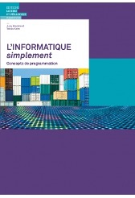

# Introduction
Au lieu d'aborder la programmation en Python sous ses éléments techniques et théoriques tel que *variable, flux, boucle, liste, dictionnaire et module*, nous avons choisi de présenter la programmation comme une série d'activités ludiques de dessin ce qui nous donne un feedback immédiat.

L'approche est basée sur les méthodes présentées dans les 3 livres :

## Mindstorms (Seymour Papert)

Seymour Papert était un des premiers éducateurs à proposer la programmation comme médium d'expression mathématique pour les enfants.

Au MIT Media Lab, il développait dans les années 1980 le langage LOGO, pour enseigner une pensée computationnelle aux enfants. Ce langage utilisait une tortue, sous forme réelle de robot dessinateur, ou sous forme virtuelle d'icône sur un écran qui laisse une trace, pour produire des dessins. La particularité de cette approche est que **chaque ligne de code produit immédiatement un résultat graphique.**

```{youtube} BTd3N5Oj2jk
```

Le module **turtle** faisant partie de la distribution de base de Python, nous avons repris l'idée de constructionisme de Papert pour cette introduction à la programmation. L'extension **Codeplay** nous donne la possibilité de pouvoir exécuter du code Python directement dans la page web, ce qui donne une simplicité et interactivité excellente.

Mindstorms, par Seymour Papert, Basic Books 1980.


## L'INFORMATIQUE simplement

L'informatique simplement, par Juraj Hromkovic, Tobias Kohn, Editions LEP, 2019.

Comme Mindstorms, ce livre propose une introduction à la programmation utilisant une approche graphique. Mais au lieu d'utiliser le module standard de Python, un logiciel open source TigerJython est utilisé.

Il nous a semblé plus pertinent d'utiliser le langage Python dans sa forme standard, avec le module ``turtle`` qui est fournie d'office.



## Informatique (Dunod)

Informatique, par Joëlle Delacroix, Dunod, 2017.

Le livre **Informatique** est un exemple récent d'introduction à la programmation au niveau gymnasial. Il est divisé en 4 thématiques.

- Mathématiques pour l'informatique (pas abordé dans modulo)
- Algorithmique et programmation
- Architecture, systèmes et réseaux
- Bases de données (pas abordé dans modulo)

Le design moderne se distingue par

- des ouvertures de chapitres montrant une image captivante,
- des quiz d'introduction,
- des personnages clés de l'histoire de l'informatique,
- des quiz et exercices de fin de chapitre.


