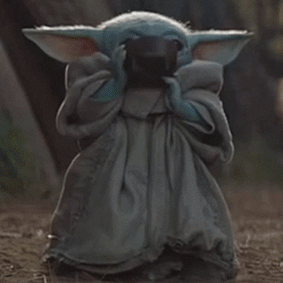

(syntaxemyst)=
# Syntaxe MyST

````{admonition} Avertissement
:class: warning
MyST est une extension de la syntaxe Markdown, qui n'est pas traitée ici. Voici un lien pour [les bases du Markdown](https://guides.github.com/pdfs/markdown-cheatsheet-online.pdf). 
````

## Déclaration d'un encart {admonition}


`````{tabbed} Aperçu
```{admonition} Aller plus loin
:class: note
Mon contenu
```
`````

`````{tabbed} Code
````{code-block} text
```{admonition} Aller plus loin
:class: note
Mon contenu
```
````
`````

(optencarts)=
### Optimisations des encarts

* les styles `:class:` disponibles sont : `note, hint, attention, caution, danger`.

`````{tabbed} Aperçu
```{admonition} Aller plus loin
:class: note
Contenus qui suggèrent des prolongements. 
```
```{admonition} Micro-activité
:class: note
Contenus qui servent "d'exercices-exemples", c'est à dire pas une série d'exercices mais plutôt l'illustration d'un concept technique par un micro-exercice. On pourrait appeler ça des "micro-activités".
```
```{admonition} Pourquoi est-ce important ? 
:class: note
Contenus qui soulignent l'importance de telle ou telle notion. 
```
```{admonition} Anecdote
:class: hint
Contenus qui illustrent un concept par une anecdote (historique, politique, faits-divers, liens avec l'actualité, etc.).
```
```{admonition} Le saviez-vous ?
:class: hint
Contenus qui apportent une information inattendue en lien avec le sujet. 
```
```{admonition} À retenir
:class: attention
Contenus fondamentaux à retenir impérativement.
```
```{admonition} Matière à réfléchir
:class: attention
Contenus importants, qui pourraient ouvrir d'éventuels débats.
```
```{admonition} Ai-je compris ? 
:class: attention
Contenus qui servent à résumer les points importants de la leçon en guise d'auto-évaluation pour l'élève. 
```
```{admonition} Important
:class: caution
Contenus qui décrivent un aspect technique, qui n'a pas de rapport avec la matière directement mais avec l'environnement, la plateforme, ou du matériel nécessaire pour suivre un cours une activité.  
```
```{admonition} Avertissement
:class: danger
Contenus liés à des avertissements de maintenance du site, des problèmes rencontrés, ou tout autre mise en garde importante. 
```
`````

`````{tabbed} Code
````{code-block} text
```{admonition} Aller plus loin
:class: note
Contenus qui suggèrent des prolongements. 
```
```{admonition} Micro-activité
:class: note
Contenus qui servent "d'exercices-exemples", c'est à dire pas une série d'exercices mais plutôt l'illustration d'un concept technique par un micro-exercice. On pourrait appeler ça des "micro-activités".
```
```{admonition} Pourquoi est-ce important ? 
:class: note
Contenus qui soulignent l'importance de telle ou telle notion. 
```
```{admonition} Anecdote
:class: hint
Contenus qui illustrent un concept par une anecdote (historique, politique, faits-divers, liens avec l'actualité, etc.).
```
```{admonition} Le saviez-vous ?
:class: hint
Contenus qui apportent une information inattendue en lien avec le sujet. 
```
```{admonition} À retenir
:class: attention
Contenus fondamentaux à retenir impérativement.
```
```{admonition} Matière à réfléchir
:class: attention
Contenus importants, qui pourraient ouvrir d'éventuels débats.
```
```{admonition} Ai-je compris ? 
:class: attention
Contenus qui servent à résumer les points importants de la leçon en guise d'auto-évaluation pour l'élève. 
```
```{admonition} Important
:class: caution
Contenus qui décrivent un aspect technique, qui n'a pas de rapport avec la matière directement mais avec l'environnement, la plateforme, ou du matériel nécessaire pour suivre un cours une activité.  
```
```{admonition} Avertissement
:class: danger
Contenus liés à des avertissements de maintenance du site, des problèmes rencontrés, ou tout autre mise en garde importante. 
```
````
`````

* tous les contenus présents dans les encarts peuvent être stylisés avec la syntaxe élémentaire du Markdown pour la stylisation des polices de caractères (*italiques*, **gras**, etc.).

## Personnages clés

`````{tabbed} Aperçu
````{panels}

:img-top: media/syntaxemyst/gracehopper.jpeg

Grace Hopper
^^^^^
* **Surnom** Amazing Grace
* **Naissance** 9 décembre 1906 / New York 🇺🇸 
* **Décès** 1<sup>er</sup> janvier 1992 / Comté d'Arlington 🇺🇸 
* **Grade** Rear admiral
```{dropdown} Bio
:animate: fade-in-slide-down
[**Grace Hopper**](https://fr.wikipedia.org/wiki/Grace_Hopper) est une informaticienne d'origine américaine. À partir de 1957, elle travaille pour IBM, où elle défend l'idée qu'un programme devrait pouvoir être écrit dans un langage proche de l'anglais plutôt que d'être calqué sur le langage machine, comme l'assembleur. De cette idée naît le langage COBOL en 1959.
```

----
:img-top: media/syntaxemyst/claudeshannon.jpg

Claude Shannon
^^^^^
* **Naissance** 30 avril 1916 / Petosky 🇺🇸 
* **Décès** 24 janvier 2001 / Medford 🇺🇸 
* **Institutions** Bell Labs & MIT
```{dropdown} Bio
:animate: fade-in-slide-down
Pendant la Seconde Guerre mondiale, [**Claude Shannon**](https://fr.wikipedia.org/wiki/Claude_Shannon) travaille pour les services secrets de l'armée américaine, en cryptographie. Il est chargé de localiser de manière automatique dans le code ennemi les parties signifiantes cachées au milieu du brouillage. C'est ce qui le mènera par la suite à développer une mesure mathématique de la quantité d'information contenue dans un message. 
```
````
`````
``````{tabbed} Code
`````{code-block} text
````{panels}

:img-top: images/accueil/gracehopper.jpeg

Grace Hopper
^^^^^
* **Surnom** Amazing Grace
* **Naissance** 9 décembre 1906 / New York 🇺🇸 
* **Décès** 1<sup>er</sup> janvier 1992 / Comté d'Arlington 🇺🇸 
* **Grade** Rear admiral
```{dropdown} Bio
:animate: fade-in-slide-down
[**Grace Hopper**](https://fr.wikipedia.org/wiki/Grace_Hopper) est une informaticienne d'origine américaine. À partir de 1957, elle travaille pour IBM, où elle défend l'idée qu'un programme devrait pouvoir être écrit dans un langage proche de l'anglais plutôt que d'être calqué sur le langage machine, comme l'assembleur. De cette idée naît le langage COBOL en 1959.
```

----
:img-top: images/accueil/claudeshannon.jpg

Claude Shannon
^^^^^
* **Naissance** 30 avril 1916 / Petosky 🇺🇸 
* **Décès** 24 janvier 2001 / Medford 🇺🇸 
* **Institutions** Bell Labs & MIT
```{dropdown} Bio
:animate: fade-in-slide-down
Pendant la Seconde Guerre mondiale, [**Claude Shannon**](https://fr.wikipedia.org/wiki/Claude_Shannon) travaille pour les services secrets de l'armée américaine, en cryptographie. Il est chargé de localiser de manière automatique dans le code ennemi les parties signifiantes cachées au milieu du brouillage. C'est ce qui le mènera par la suite à développer une mesure mathématique de la quantité d'information contenue dans un message. 
```
````
`````
``````


## Références et labels

* Pour créer une référence à un autre chapitre, sous-chapitre, image, figure, etc., je dois d'abord labeliser la cible de la référence de la façon suivante : 

* Si c'est un titre, je peux procéder ainsi au moment où je déclare le titre dans mon document : 

(lelabelquejesouhaitedonner)/=
/### Le titre que je souhaite référencer 

*Note : les "/" qui précèdent le signe "=" et la déclaration du niveau de titre n'ont d'usage que de désactiver les fonctions concernées... Il faut les enlever dans votre version.*

* Si c'est tout autre élément de contenu (équation, image, figure, encart, etc.), je vais simplement utiliser la valeur de `:name:` que je lui ai donnnée à la place du contenu entre parenthèses présenté ci-dessus.  

* Quand j'ai labelisé ma cible, je peux l'appeler en utiliser la syntaxe : {ref}`le texte qui renvoie à la réf <lelabeldelaref>`. 

* [Voir ici pour plus d'informations](https://jupyterbook.org/content/references.html).


(imagesetfigures)= 
## Images et figures

* on insère une image de la façon suivante : 


`````{tabbed} Aperçu
```{figure} media/syntaxemyst/gracehopper.jpeg
---
alt: titreimage1
width: 200px
---
Voilà une image d'exemple avec une légende d'exemple
```
`````

`````{tabbed} Code
````{code-block} text
```{figure} media/syntaxemyst/gracehopper.jpeg
---
alt: titreimage1
width: 200px
---
Voilà une image d'exemple avec une légende d'exemple
```
````
`````

### Optimisations de l'image

* les déclarations communes sont : `alt, width, height, align`. Auxquelles on peut ajouter `name` si on veut labeliser l'image. `align` prend trois positions : left, center, right. 

* le chemin relatif de l'image commence dans le dossier où est stocké le fichier actif. 


### Blocs de code

* les blocs de code se déclarent comme des encarts, mais en spécifiant le language mis en avant, juste après les curly-brackets de la déclaration de l'encart. 


`````{tabbed} Aperçu
```{code-block} python
a = 2
print('voilà un print')
```
`````

`````{tabbed} Code
````{code-block} text
```{code-block} python
a = 2
print('voilà un print')
```
````
`````


* on peut numéroter les lignes de codes avec la déclaration `lineno-start`. 

* on peut mettre l'emphase sur certaines lignes avec `emphasize-lines`. 

* voilà un exmple qui résume le tout. 


`````{tabbed} Aperçu
```{code-block} python
---
lineno-start: 10
emphasize-lines: 1, 3
---
a = 2
print('voilà un print')
print('voilà un deuxième print')
```
`````

`````{tabbed} Code
````{code-block} text
```{code-block} python
---
lineno-start: 10
emphasize-lines: 1, 3
---
a = 2
print('voilà un print')
print('voilà un deuxième print')
```
````
`````

## Panels


`````{tabbed} Aperçu
````{panels}
Contenu du panel en haut à gauche

---

Contenu du panel en haut à droite

{badge}`primary,badge-primary`
{badge}`secondary,badge-secondary`
{badge}`info,badge-info`
{badge}`success,badge-success`
{badge}`danger,badge-danger`
{badge}`warning,badge-warning`
{badge}`light,badge-light`
{badge}`dark,badge-dark`

---

```{dropdown} Panel en bas à gauche
Hidden content
```

---

```{link-button} https://example.com
:text: Panel clickable
:classes: stretched-link
```
````
`````

`````{tabbed} Code
````{code-block} text
````{panels}
Contenu du panel en haut à gauche

---

Contenu du panel en haut à droite

{badge}`primary,badge-primary`
{badge}`secondary,badge-secondary`
{badge}`info,badge-info`
{badge}`success,badge-success`
{badge}`danger,badge-danger`
{badge}`warning,badge-warning`
{badge}`light,badge-light`
{badge}`dark,badge-dark`

---

```{dropdown} Panel en bas à gauche
Hidden content
```

---

```{link-button} https://example.com
:text: Panel clickable
:classes: stretched-link
```
````
````
`````

## Couleurs

Pour de la <span style="color:red">couleur</span>, il est possible d'insérer de l'HTML directement dans le texte.

`````{tabbed} Aperçu
```html
Pour de la <span style="color:red">couleur</span>, il est possible d'insérer de l'HTML directement dans le texte.
```
`````

`````{tabbed} Code
````{code-block} text
```html
Pour de la <span style="color:red">couleur</span>, il est possible d'insérer de l'HTML directement dans le texte.
```
````
`````

## Emojis

Pour insérer des emojis, copiez simplement celui ou ceux qui vous intéressent dans et collez-le dans votre fichier source. 

😀 😃 😄 😁 😆 🤩 😅 😂 🤣 ☺️ 😊 😇 🙂 🙃 😉 😌 😍 😘 😗 😙 😚 😋 🤪 😜 😝 😛 🤑 🤗 🤓 😎 🤡 🤠 😏 😒 😞 😔 😟 😕 🙁 ☹️ 😣 😖 😫 😩 😤 😠 😡 🤬 😶 😐 😑 😯 😦 😧 😮 😲 😵 🤯 😳 😱 😨 😰 😢 😥 🤤 😭 😓 😪 😴 🥱 🙄 🤨 🧐 🤔 🤫 🤭 🤥 😬 🤐 🤢 🤮 🤧 😷 🤒 🤕 😈 👿 👹 👺 💩 👻 💀 ☠️ 👽 👾 🤖 🎃 😺 😸 😹 😻 😼 😽 🙀 😿 😾 👐 🙌 👏 🙏 🤲 🤝 👍 👎 👊 ✊ 🤛 🤜 🤞 ✌️ 🤘 🤏 👌 👈 👉 👆 👇 ☝️ ✋ 🤚 🖐 🖖 👋 🤙 💪 🖕 🤟 ✍️ 🤳 💅 🖖 💄 💋 👄 👅 👂 🦻 👃 🦵 🦶 🦾 🦿 👣 👁 👀 🗣 👤 👥 👶 👦 👧 🧒 👨 👩 🧑 👱‍♀️ 👱 🧔 👴 👵 🧓 👲 👳‍♀️ 👳 🧕 👮‍♀️ 👮 👷‍♀️ 👷 💂‍♀️ 💂 🕵️‍♀️ 🕵️ 👩‍⚕️ 👨‍⚕️ 👩‍🌾 👨‍🌾 👩‍🍳 👨‍🍳 👩‍🎓 👨‍🎓 👩‍🎤 👨‍🎤 👩‍🏫 👨‍🏫 👩‍🏭 👨‍🏭 👩‍💻 👨‍💻 👩‍💼 👨‍💼 👩‍🔧 👨‍🔧 👩‍🔬 👨‍🔬 👩‍🎨 👨‍🎨 👩‍🚒 👨‍🚒 👩‍✈️ 👨‍✈️ 👩‍🚀 👨‍🚀 👩‍⚖️ 👨‍⚖️ 🤶 🎅 👸 🤴 👰 🤵 👼 🤰 🤱 🙇‍♀️ 🙇 💁 💁‍♂️ 🙅 🙅‍♂️ 🙆 🙆‍♂️ 🙋 🙋‍♂️ 🤦‍♀️ 🤦‍♂️ 🤷‍♀️ 🤷‍♂️ 🙎 🙎‍♂️ 🙍 🙍‍♂️ 💇 💇‍♂️ 💆 💆‍♂️ 🧖‍♀️ 🧖‍♂️ 🧏 🧏‍♂️ 🧏‍♀️ 🧙‍♀️ 🧙‍♂️ 🧛‍♀️ 🧛‍♂️ 🧟‍♀️ 🧟‍♂️ 🧚‍♀️ 🧚‍♂️ 🧜‍♀️ 🧜‍♂️ 🧝‍♀️ 🧝‍♂️ 🧞‍♀️ 🧞‍♂️ 🕴 💃 🕺 👯 👯‍♂️ 🚶‍♀️ 🚶 🏃‍♀️ 🏃 🧍 🧍‍♂️ 🧍‍♀️ 🧎 🧎‍♂️ 🧎‍♀️ 👨‍🦯 👩‍🦯 👨‍🦼 👩‍🦼 👨‍🦽 👩‍🦽 🧑‍🤝‍🧑 👫 👭 👬 💑 👩‍❤️‍👩 👨‍❤️‍👨 💏 👩‍❤️‍💋‍👩 👨‍❤️‍💋‍👨 👪 👨‍👩‍👧 👨‍👩‍👧‍👦 👨‍👩‍👦‍👦 👨‍👩‍👧‍👧 👩‍👩‍👦 👩‍👩‍👧 👩‍👩‍👧‍👦 👩‍👩‍👦‍👦 👩‍👩‍👧‍👧 👨‍👨‍👦 👨‍👨‍👧 👨‍👨‍👧‍👦 👨‍👨‍👦‍👦 👨‍👨‍👧‍👧 👩‍👦 👩‍👧 👩‍👧‍👦 👩‍👦‍👦 👩‍👧‍👧 👨‍👦 👨‍👧 👨‍👧‍👦 👨‍👦‍👦 👨‍👧‍👧 👚 👕 👖 👔 👗 👙 👘 👠 👡 👢 👞 👟 👒 🎩 🎓 👑 ⛑ 🎒 👝 👛 👜 💼 👓 🕶 🤿 🌂 ☂️ 🧣 🧤 🧥 🦺 🥻 🩱 🩲 🩳 🩰 🧦 🧢 ⛷ 🏂 🏋️‍♀️ 🏋️ 🤺 🤼‍♀️ 🤼‍♂️ 🤸‍♀️ 🤸‍♂️ ⛹️‍♀️ ⛹️ 🤾‍♀️ 🤾‍♂️ 🏌️‍♀️ 🏌️ 🏄‍♀️ 🏄 🏊‍♀️ 🏊 🤽‍♀️ 🤽‍♂️ 🚣‍♀️ 🚣 🏇 🚴‍♀️ 🚴 🚵‍♀️ 🚵 🤹‍♀️ 🤹‍♂️ 🧗‍♀️ 🧗‍♂️ 🧘‍♀️ 🧘‍♂️ 🥰 🥵 🥶 🥳 🥴 🥺 🦸 🦹 🧑‍🦰 🧑‍🦱 🧑‍🦳 🧑‍🦲 🧑‍⚕️ 🧑‍🎓 🧑‍🏫 🧑‍⚖️ 🧑‍🌾 🧑‍🍳 🧑‍🔧 🧑‍🏭 🧑‍💼 🧑‍🔬 🧑‍💻 🧑‍🎤 🧑‍🎨 🧑‍✈️ 🧑‍🚀 🧑‍🚒 🧑‍🦯 🧑‍🦼 🧑‍🦽 🦰 🦱 🦲 🦳

Pale Emojis

👐🏻 🙌🏻 👏🏻 🙏🏻 👍🏻 👎🏻 👊🏻 ✊🏻 🤛🏻 🤜🏻 🤞🏻 ✌🏻 🤘🏻 👌🏻 👈🏻 👉🏻 👆🏻 👇🏻 ☝🏻 ✋🏻 🤚🏻 🖐🏻 🖖🏻 👋🏻 🤙🏻 💪🏻 🖕🏻 ✍🏻 🤳🏻 💅🏻 👂🏻 👃🏻 👶🏻 👦🏻 👧🏻 👨🏻 👩🏻 👱🏻‍♀️ 👱🏻 👴🏻 👵🏻 👲🏻 👳🏻‍♀️ 👳🏻 👮🏻‍♀️ 👮🏻 👷🏻‍♀️ 👷🏻 💂🏻‍♀️ 💂🏻 🕵🏻‍♀️ 🕵🏻 👩🏻‍⚕️ 👨🏻‍⚕️ 👩🏻‍🌾 👨🏻‍🌾 👩🏻‍🍳 👨🏻‍🍳 👩🏻‍🎓 👨🏻‍🎓 👩🏻‍🎤 👨🏻‍🎤 👩🏻‍🏫 👨🏻‍🏫 👩🏻‍🏭 👨🏻‍🏭 👩🏻‍💻 👨🏻‍💻 👩🏻‍💼 👨🏻‍💼 👩🏻‍🔧 👨🏻‍🔧 👩🏻‍🔬 👨🏻‍🔬 👩🏻‍🎨 👨🏻‍🎨 👩🏻‍🚒 👨🏻‍🚒 👩🏻‍✈️ 👨🏻‍✈️ 👩🏻‍🚀 👨🏻‍🚀 👩🏻‍⚖️ 👨🏻‍⚖️ 🤶🏻 🎅🏻 👸🏻 🤴🏻 👰🏻 🤵🏻 👼🏻 🤰🏻 🙇🏻‍♀️ 🙇🏻 💁🏻 💁🏻‍♂️ 🙅🏻 🙅🏻‍♂️ 🙆🏻 🙆🏻‍♂️ 🙋🏻 🙋🏻‍♂️ 🤦🏻‍♀️ 🤦🏻‍♂️ 🤷🏻‍♀️ 🤷🏻‍♂️ 🙎🏻 🙎🏻‍♂️ 🙍🏻 🙍🏻‍♂️ 💇🏻 💇🏻‍♂️ 💆🏻 💆🏻‍♂️ 🕴🏻 💃🏻 🕺🏻 🚶🏻‍♀️ 🚶🏻 🏃🏻‍♀️ 🏃🏻 🏋🏻‍♀️ 🏋🏻 🤸🏻‍♀️ 🤸🏻‍♂️ ⛹🏻‍♀️ ⛹🏻 🤾🏻‍♀️ 🤾🏻‍♂️ 🏌🏻‍♀️ 🏌🏻 🏄🏻‍♀️ 🏄🏻 🏊🏻‍♀️ 🏊🏻 🤽🏻‍♀️ 🤽🏻‍♂️ 🚣🏻‍♀️ 🚣🏻 🏇🏻 🚴🏻‍♀️ 🚴🏻 🚵🏻‍♀️ 🚵🏻 🤹🏻‍♀️ 🤹🏻‍♂️ 🛀🏻 🧒🏻 🧑🏻 🧕🏻 🧔🏻 🤱🏻 🧙🏻‍♀️ 🧙🏻‍♂️ 🧚🏻‍♀️ 🧚🏻‍♂️ 🧛🏻‍♀️ 🧛🏻‍♂️ 🧜🏻‍♀️ 🧜🏻‍♂️ 🧝🏻‍♀️ 🧝🏻‍♂️ 🧖🏻‍♀️ 🧖🏻‍♂️ 🧗🏻‍♀️ 🧗🏻‍♂️ 🧘🏻‍♀️ 🧘🏻‍♂️ 🤟🏻 🤲🏻 💏🏻 💑🏻 🤏🏻 🦻🏻 🧏🏻 🧏🏻‍♂️ 🧏🏻‍♀️ 🧍🏻 🧍🏻‍♂️ 🧍🏻‍♀️ 🧎🏻 🧎🏻‍♂️ 🧎🏻‍♀️ 👨🏻‍🦯 👩🏻‍🦯 👨🏻‍🦼 👩🏻‍🦼 👨🏻‍🦽 👩🏻‍🦽 🧑🏻‍🤝‍🧑🏻 🧑🏻‍🦰 🧑🏻‍🦱 🧑🏻‍🦳 🧑🏻‍🦲 🧑🏻‍⚕️ 🧑🏻‍🎓 🧑🏻‍🏫 🧑🏻‍⚖️ 🧑🏻‍🌾 🧑🏻‍🍳 🧑🏻‍🔧 🧑🏻‍🏭 🧑🏻‍💼 🧑🏻‍🔬 🧑🏻‍💻 🧑🏻‍🎤 🧑🏻‍🎨 🧑🏻‍✈️ 🧑🏻‍🚀 🧑🏻‍🚒 🧑🏻‍🦯 🧑🏻‍🦼 🧑🏻‍🦽

Cream White Emojis

👐🏼 🙌🏼 👏🏼 🙏🏼 👍🏼 👎🏼 👊🏼 ✊🏼 🤛🏼 🤜🏼 🤞🏼 ✌🏼 🤘🏼 👌🏼 👈🏼 👉🏼 👆🏼 👇🏼 ☝🏼 ✋🏼 🤚🏼 🖐🏼 🖖🏼 👋🏼 🤙🏼 💪🏼 🖕🏼 ✍🏼 🤳🏼 💅🏼 👂🏼 👃🏼 👶🏼 👦🏼 👧🏼 👨🏼 👩🏼 👱🏼‍♀️

👱🏼 👴🏼 👵🏼 👲🏼 👳🏼‍♀️ 👳🏼 👮🏼‍♀️ 👮🏼 👷🏼‍♀️ 👷🏼 💂🏼‍♀️ 💂🏼 🕵🏼‍♀️ 🕵🏼 👩🏼‍⚕️ 👨🏼‍⚕️ 👩🏼‍🌾 👨🏼‍🌾 👩🏼‍🍳 👨🏼‍🍳 👩🏼‍🎓 👨🏼‍🎓 👩🏼‍🎤 👨🏼‍🎤 👩🏼‍🏫 👨🏼‍🏫 👩🏼‍🏭 👨🏼‍🏭 👩🏼‍💻 👨🏼‍💻 👩🏼‍💼 👨🏼‍💼 👩🏼‍🔧 👨🏼‍🔧 👩🏼‍🔬 👨🏼‍🔬 👩🏼‍🎨 👨🏼‍🎨

👩🏼‍🚒 👨🏼‍🚒 👩🏼‍✈️ 👨🏼‍✈️ 👩🏼‍🚀 👨🏼‍🚀 👩🏼‍⚖️ 👨🏼‍⚖️ 🤶🏼 🎅🏼 👸🏼 🤴🏼 👰🏼 🤵🏼 👼🏼 🤰🏼 🙇🏼‍♀️ 🙇🏼 💁🏼 💁🏼‍♂️ 🙅🏼 🙅🏼‍♂️ 🙆🏼 🙆🏼‍♂️ 🙋🏼 🙋🏼‍♂️ 🤦🏼‍♀️ 🤦🏼‍♂️ 🤷🏼‍♀️ 🤷🏼‍♂️ 🙎🏼 🙎🏼‍♂️ 🙍🏼 🙍🏼‍♂️ 💇🏼 💇🏼‍♂️ 💆🏼 💆🏼‍♂️

🕴🏼 💃🏼 🕺🏼 🚶🏼‍♀️ 🚶🏼 🏃🏼‍♀️ 🏃🏼 🏋🏼‍♀️ 🏋🏼 🤸🏼‍♀️ 🤸🏼‍♂️ ⛹🏼‍♀️ ⛹🏼 🤾🏼‍♀️ 🤾🏼‍♂️ 🏌🏼‍♀️ 🏌🏼 🏄🏼‍♀️ 🏄🏼 🏊🏼‍♀️ 🏊🏼 🤽🏼‍♀️ 🤽🏼‍♂️ 🚣🏼‍♀️ 🚣🏼 🏇🏼 🚴🏼‍♀️ 🚴🏼 🚵🏼‍♀️ 🚵🏻 🤹🏼‍♀️ 🤹🏼‍♂️ 🛀🏼 🧒🏼 🧑🏼 🧓🏼 🧕🏼 🧔🏼 🤱🏼 🧙🏼‍♀️ 🧙🏼‍♂️ 🧚🏼‍♀️ 🧚🏼‍♂️ 🧛🏼‍♀️ 🧛🏼‍♂️ 🧜🏼‍♀️ 🧜🏼‍♂️ 🧝🏼‍♀️ 🧝🏼‍♂️ 🧖🏼‍♀️ 🧖🏼‍♂️ 🧗🏼‍♀️ 🧗🏼‍♂️ 🧘🏼‍♂️ 🤟🏼 🤲🏼 💏🏼 💑🏼 🤏🏼 🦻🏼 🧏🏼 🧏🏼‍♂️ 🧏🏼‍♀️ 🧍🏼 🧍🏼‍♂️ 🧍🏼‍♀️ 🧎🏼 🧎🏼‍♂️ 🧎🏼‍♀️ 👨🏼‍🦯 👩🏼‍🦯 👨🏼‍🦼 👩🏼‍🦼 👨🏼‍🦽 👩🏼‍🦽 🧑🏼‍🤝‍🧑🏼 🧑🏼‍🦰 🧑🏼‍🦱 🧑🏼‍🦳 🧑🏼‍🦲 🧑🏼‍⚕️ 🧑🏼‍🎓 🧑🏼‍🏫 🧑🏼‍⚖️ 🧑🏼‍🌾 🧑🏼‍🍳 🧑🏼‍🔧 🧑🏼‍🏭 🧑🏼‍💼 🧑🏼‍🔬 🧑🏼‍💻 🧑🏼‍🎤 🧑🏼‍🎨 🧑🏼‍✈️ 🧑🏼‍🚀 🧑🏼‍🚒 🧑🏼‍🦯 🧑🏼‍🦼 🧑🏼‍🦽

Moderate Brown Emojis

👐🏽 🙌🏽 👏🏽 🙏🏽 👍🏽 👎🏽 👊🏽 ✊🏽 🤛🏽 🤜🏽 🤞🏽 ✌🏽 🤘🏽 👌🏽 👈🏽 👉🏽 👆🏽 👇🏽 ☝🏽 ✋🏽 🤚🏽 🖐🏽 🖖🏽 👋🏽 🤙🏽 💪🏽 🖕🏽 ✍🏽 🤳🏽 💅🏽 👂🏽 👃🏽 👶🏽 👦🏽 👧🏽 👨🏽 👩🏽 👱🏽‍♀️ 👱🏽 👴🏽 👵🏽 👲🏽 👳🏽‍♀️ 👳🏽 👮🏽‍♀️ 👮🏽 👷🏽‍♀️ 👷🏽 💂🏽‍♀️ 💂🏽 🕵🏽‍♀️ 🕵🏽 👩🏽‍⚕️ 👨🏽‍⚕️ 👩🏽‍🌾 👨🏽‍🌾 👩🏽‍🍳 👨🏽‍🍳 👩🏽‍🎓 👨🏽‍🎓 👩🏽‍🎤 👨🏽‍🎤 👩🏽‍🏫 👨🏽‍🏫 👩🏽‍🏭 👨🏽‍🏭 👩🏽‍💻 👨🏽‍💻 👩🏽‍💼 👨🏽‍💼 👩🏽‍🔧 👨🏽‍🔧 👩🏽‍🔬 👨🏽‍🔬 👩🏽‍🎨 👨🏽‍🎨 👩🏽‍🚒 👨🏽‍🚒 👩🏽‍✈️ 👨🏽‍✈️ 👩🏽‍🚀 👨🏽‍🚀 👩🏽‍⚖️ 👨🏽‍⚖️ 🤶🏽 🎅🏽 👸🏽 🤴🏽 👰🏽 🤵🏽 👼🏽 🤰🏽 🙇🏽‍♀️ 🙇🏽 💁🏽 💁🏽‍♂️ 🙅🏽 🙅🏽‍♂️ 🙆🏽 🙆🏽‍♂️ 🙋🏽 🙋🏽‍♂️ 🤦🏽‍♀️ 🤦🏽‍♂️ 🤷🏽‍♀️ 🤷🏽‍♂️ 🙎🏽 🙎🏽‍♂️ 🙍🏽 🙍🏽‍♂️ 💇🏽 💇🏽‍♂️ 💆🏽 💆🏽‍♂️ 🕴🏼 💃🏽 🕺🏽 🚶🏽‍♀️ 🚶🏽 🏃🏽‍♀️ 🏃🏽 🏋🏽‍♀️ 🏋🏽 🤸🏽‍♀️ 🤸🏽‍♂️ ⛹🏽‍♀️ ⛹🏽 🤾🏽‍♀️ 🤾🏽‍♂️ 🏌🏽‍♀️ 🏌🏽 🏄🏽‍♀️ 🏄🏽 🏊🏽‍♀️ 🏊🏽 🤽🏽‍♀️ 🤽🏽‍♂️ 🚣🏽‍♀️ 🚣🏽 🏇🏽 🚴🏽‍♀️ 🚴🏽 🚵🏽‍♀️ 🚵🏽 🤹🏽‍♀️ 🤹🏽‍♂️ 🛀🏽 🧒🏽 🧑🏽 🧓🏽 🧕🏽 🧔🏽 🤱🏽 🧙🏽‍♀️ 🧙🏽‍♂️ 🧚🏽‍♀️ 🧚🏽‍♂️ 🧛🏽‍♀️ 🧛🏽‍♂️ 🧜🏽‍♀️ 🧜🏽‍♂️ 🧝🏽‍♀️ 🧝🏽‍♂️ 🧖🏽‍♀️ 🧖🏽‍♂️ 🧗🏽‍♀️ 🧗🏽‍♂️ 🧘🏽‍♀️ 🧘🏽‍♂️ 🤟🏽 🤲🏽 💏🏽 💑🏽 🤏🏽 🦻🏽 🧏🏽 🧏🏽‍♂️ 🧏🏽‍♀️ 🧍🏽 🧍🏽‍♂️ 🧍🏽‍♀️ 🧎🏽 🧎🏽‍♂️ 🧎🏽‍♀️ 👨🏽‍🦯 👩🏽‍🦯 👨🏽‍🦼 👩🏽‍🦼 👨🏽‍🦽 👩🏽‍🦽 🧑🏽‍🤝‍🧑🏽 🧑🏽‍🦰 🧑🏽‍🦱 🧑🏽‍🦳 🧑🏽‍🦲 🧑🏽‍⚕️ 🧑🏽‍🎓 🧑🏽‍🏫 🧑🏽‍⚖️ 🧑🏽‍🌾 🧑🏽‍🍳 🧑🏽‍🔧 🧑🏽‍🏭 🧑🏽‍💼 🧑🏽‍🔬 🧑🏽‍💻 🧑🏽‍🎤 🧑🏽‍🎨 🧑🏽‍✈️ 🧑🏽‍🚀 🧑🏽‍🚒 🧑🏽‍🦯 🧑🏽‍🦼 🧑🏽‍🦽

Dark Brown Emojis

👐🏾 🙌🏾 👏🏾 🙏🏾 👍🏾 👎🏾 👊🏾 ✊🏾 🤛🏾 🤜🏾 🤞🏾 ✌🏾 🤘🏾 👌🏾 👈🏾 👉🏾 👆🏾 👇🏾 ☝🏾 ✋🏾 🤚🏾 🖐🏾 🖖🏾 👋🏾 🤙🏾 💪🏾 🖕🏾 ✍🏾 🤳🏾 💅🏾 👂🏾 👃🏾 👶🏾 👦🏾 👧🏾 👨🏾 👩🏾 👱🏾‍♀️ 👱🏾 👴🏾 👵🏾 👲🏾 👳🏾‍♀️ 👳🏾 👮🏾‍♀️ 👮🏾 👷🏾‍♀️ 👷🏾 💂🏾‍♀️ 💂🏾 🕵🏾‍♀️ 🕵🏾 👩🏾‍⚕️ 👨🏾‍⚕️ 👩🏾‍🌾 👨🏾‍🌾 👩🏾‍🍳 👨🏾‍🍳 👩🏾‍🎓 👨🏾‍🎓 👩🏾‍🎤 👨🏾‍🎤 👩🏾‍🏫 👨🏾‍🏫 👩🏾‍🏭 👨🏾‍🏭 👩🏾‍💻 👨🏾‍💻 👩🏾‍💼 👨🏾‍💼 👩🏾‍🔧 👨🏾‍🔧 👩🏾‍🔬 👨🏾‍🔬 👩🏾‍🎨 👨🏾‍🎨 👩🏾‍🚒 👨🏾‍🚒 👩🏾‍✈️ 👨🏾‍✈️ 👩🏾‍🚀 👨🏾‍🚀 👩🏾‍⚖️ 👨🏾‍⚖️ 🤶🏾 🎅🏾 👸🏾 🤴🏾 👰🏾 🤵🏾 👼🏾 🤰🏾 🙇🏾‍♀️ 🙇🏾 💁🏾 💁🏾‍♂️ 🙅🏾 🙅🏾‍♂️ 🙆🏾 🙆🏾‍♂️ 🙋🏾 🙋🏾‍♂️ 🤦🏾‍♀️ 🤦🏾‍♂️ 🤷🏾‍♀️ 🤷🏾‍♂️ 🙎🏾 🙎🏾‍♂️ 🙍🏾 🙍🏾‍♂️ 💇🏾 💇🏾‍♂️ 💆🏾 💆🏾‍♂️ 🕴🏾 💃🏾 🕺🏾 🚶🏾‍♀️ 🚶🏾 🏃🏾‍♀️ 🏃🏾 🏋🏾‍♀️ 🏋🏾 🤸🏾‍♀️ 🤸🏾‍♂️ ⛹🏾‍♀️ ⛹🏾 🤾🏾‍♀️ 🤾🏾‍♂️ 🏌🏾‍♀️ 🏌🏾 🏄🏾‍♀️ 🏄🏾 🏊🏾‍♀️ 🏊🏾 🤽🏾‍♀️ 🤽🏾‍♂️ 🚣🏾‍♀️ 🚣🏾 🏇🏾 🚴🏾‍♀️ 🚴🏾 🚵🏾‍♀️ 🚵🏾 🤹🏾‍♀️ 🤹🏾‍♂️ 🛀🏾 🧒🏾 🧑🏾 🧓🏾 🧕🏾 🧔🏾 🤱🏾 🧙🏾‍♀️ 🧙🏾‍♂️ 🧚🏾‍♀️ 🧚🏾‍♂️ 🧛🏾‍♀️ 🧛🏾‍♂️ 🧜🏾‍♀️ 🧜🏾‍♂️ 🧝🏾‍♀️ 🧝🏾‍♂️ 🧖🏾‍♀️ 🧖🏾‍♂️ 🧗🏾‍♀️ 🧗🏾‍♂️ 🧘🏾‍♀️ 🧘🏾‍♂️ 🤟🏾 🤲🏾 💏🏾 💑🏾 🧑🏾‍🦰 🧑🏾‍🦱 🧑🏾‍🦳 🧑🏾‍🦲 🧑🏾‍⚕️ 🧑🏾‍🎓 🧑🏾‍🏫 🧑🏾‍⚖️ 🧑🏾‍🌾 🧑🏾‍🍳 🧑🏾‍🔧 🧑🏾‍🏭 🧑🏾‍💼 🧑🏾‍🔬 🧑🏾‍💻 🧑🏾‍🎤 🧑🏾‍🎨 🧑🏾‍✈️ 🧑🏾‍🚀 🧑🏾‍🚒 🧑🏾‍🦯 🧑🏾‍🦼 🧑🏾‍🦽

Black Emojis

👐🏿 🙌🏿 👏🏿 🙏🏿 👍🏿 👎🏿 👊🏿 ✊🏿 🤛🏿 🤜🏿 🤞🏿 ✌🏿 🤘🏿 👌🏿 👈🏿 👉🏿 👆🏿 👇🏿 ☝🏿 ✋🏿 🤚🏿 🖐🏿 🖖🏿 👋🏿 🤙🏿 💪🏿 🖕🏿 ✍🏿 🤳🏿 💅🏿 👂🏿 👃🏿 👶🏿 👦🏿 👧🏿 👨🏿 👩🏿 👱🏿‍♀️ 👱🏿 👴🏿 👵🏿 👲🏿 👳🏿‍♀️ 👳🏿 👮🏿‍♀️ 👮🏿 👷🏿‍♀️ 👷🏿 💂🏿‍♀️ 💂🏿 🕵🏿‍♀️ 🕵🏿 👩🏿‍⚕️ 👨🏿‍⚕️ 👩🏿‍🌾 👨🏿‍🌾 👩🏿‍🍳 👨🏿‍🍳 👩🏿‍🎓 👨🏿‍🎓 👩🏿‍🎤 👨🏿‍🎤 👩🏿‍🏫 👨🏿‍🏫 👩🏿‍🏭 👨🏿‍🏭 👩🏿‍💻 👨🏿‍💻 👩🏿‍💼 👨🏿‍💼 👩🏿‍🔧 👨🏿‍🔧 👩🏿‍🔬 👨🏿‍🔬 👩🏿‍🎨 👨🏿‍🎨 👩🏿‍🚒 👨🏿‍🚒 👩🏿‍✈️ 👨🏿‍✈️ 👩🏿‍🚀 👨🏿‍🚀 👩🏿‍⚖️ 👨🏿‍⚖️ 🤶🏿 🎅🏿 👸🏿 🤴🏿 👰🏿 🤵🏿 👼🏿 🤰🏿 🙇🏿‍♀️ 🙇🏿 💁🏿 💁🏿‍♂️ 🙅🏿 🙅🏿‍♂️ 🙆🏿 🙆🏿‍♂️ 🙋🏿 🙋🏿‍♂️ 🤦🏿‍♀️ 🤦🏿‍♂️ 🤷🏿‍♀️ 🤷🏿‍♂️ 🙎🏿 🙎🏿‍♂️ 🙍🏿 🙍🏿‍♂️ 💇🏿 💇🏿‍♂️ 💆🏿 💆🏿‍♂️ 🕴🏿 💃🏿 🕺🏿 🚶🏿‍♀️ 🚶🏿 🏃🏿‍♀️ 🏃🏿 🏋🏿‍♀️ 🏋🏿 🤸🏿‍♀️ 🤸🏿‍♂️ ⛹🏿‍♀️ ⛹🏿 🤾🏿‍♀️ 🤾🏿‍♂️ 🏌🏿‍♀️ 🏌🏿 🏄🏿‍♀️ 🏄🏿 🏊🏿‍♀️ 🏊🏿 🤽🏿‍♀️ 🤽🏿‍♂️ 🚣🏿‍♀️ 🚣🏿 🏇🏿 🚴🏿‍♀️ 🚴🏿 🚵🏿‍♀️ 🚵🏿 🤹🏿‍♀️ 🤹🏿‍♂️ 🛀🏿 🧒🏿 🧑🏿 🧓🏿 🧕🏿 🧔🏿 🤱🏿 🧙🏿‍♀️ 🧙🏿‍♂️ 🧚🏿‍♀️ 🧚🏿‍♂️ 🧛🏿‍♀️ 🧛🏿‍♂️ 🧜🏿‍♀️ 🧜🏿‍♂️ 🧝🏿‍♀️ 🧝🏿‍♂️ 🧖🏿‍♀️ 🧖🏿‍♂️ 🧗🏿‍♀️ 🧗🏿‍♂️ 🧘🏿‍♀️ 🧘🏿‍♂️ 🤟🏿 🤲🏿 💏🏿 💑🏿 🤏🏿 🦻🏿 🧏🏿 🧏🏿‍♂️ 🧏🏿‍♀️ 🧍🏿 🧍🏿‍♂️ 🧍🏿‍♀️ 🧎🏿 🧎🏿‍♂️ 🧎🏿‍♀️ 👨🏿‍🦯 👩🏿‍🦯 👨🏿‍🦼 👩🏿‍🦼 👨🏿‍🦽 👩🏿‍🦽 🧑🏿‍🤝‍🧑🏿 🧑🏿‍🦰 🧑🏿‍🦱 🧑🏿‍🦳 🧑🏿‍🦲 🧑🏿‍⚕️ 🧑🏿‍🎓 🧑🏿‍🏫 🧑🏿‍⚖️ 🧑🏿‍🌾 🧑🏿‍🍳 🧑🏿‍🔧 🧑🏿‍🏭 🧑🏿‍💼 🧑🏿‍🔬 🧑🏿‍💻 🧑🏿‍🎤 🧑🏿‍🎨 🧑🏿‍✈️ 🧑🏿‍🚀 🧑🏿‍🚒 🧑🏿‍🦯 🧑🏿‍🦼 🧑🏿‍🦽

Animals & Nature Emojis

🐶 🐱 🐭 🐹 🐰 🦊 🐻 🐼 🐨 🐯 🦁 🐮 🐷 🐽 🐸 🐵 🙊 🙉 🙊 🐒 🐔 🐧 🐦 🐤 🐣 🐥 🦆 🦩 🦅 🦉 🦇 🐺 🐗 🐴 🦄 🐝 🐛 🦋 🐌 🐚 🦗 🐞 🐜 🕷 🕸 🐢 🐍 🦎 🦂 🦀 🦑 🐙 🦐 🐠 🐟 🐡 🐬 🦈 🐳 🐋 🐊 🐆 🐅 🐃 🐂 🐄 🦌 🐪 🐫 🐘 🦏 🦍 🐎 🐖 🐐 🐏 🐑 🐕 🐩 🦮 🐕‍🦺 🐈 🐓 🦃 🕊 🐇 🐁 🐀 🐿 🦓 🦒 🦔 🦧 🦥 🦦 🦨 🦕 🦖 🦪 🐾 🐉 🐲 🌵 🎄 🌲 🌳 🌴 🌱 🌿 ☘️ 🍀 🎍 🎋 🍃 🍂 🍁 🍄 🌾 💐 🌷 🌹 🥀 🌻 🌼 🌸 🌺 🌎 🌍 🌏 🌕 🌖 🌗 🌘 🌑 🌒 🌓 🌔 🌚 🌝 🌞 🌛 🌜 🌙 🪐 💫 ⭐️ 🌟 ✨ ⚡️ 🔥 💥 ☄️ ☀️ 🌤 ⛅️ 🌥 🌦 🌈 ☁️ 🌧 ⛈ 🌩 🌨 ☃️ ⛄️ ❄️ 🌬 💨 🌪 🌫 🌊 💧 💦 ☔️

Food Emojis

🍏 🍎 🍐 🍊 🍋 🍌 🍉 🍇 🍓 🍈 🍒 🍑 🍍 🥝 🥑 🍅 🍆 🥒 🥕 🌽 🌶 🧄 🧅 🥔 🍠 🌰 🥜 🍯 🥐 🍞 🥖 🧀 🥚 🍳 🥓 🥞 🍤 🍗 🍖 🍕 🌭 🍔 🍟 🥙 🌮 🌯 🥗 🥘 🍝 🍜 🍲 🍥 🍣 🍱 🍛 🍚 🍙 🍘 🍢 🍡 🍧 🍨 🍦 🍰 🎂 🍮 🍭 🍬 🍫 🍿 🍩 🍪 🥛 🍼 ☕️ 🍵 🍶 🍺 🍻 🥂 🍷 🥃 🍸 🍹 🍾 🧃 🧉 🧊 🥄 🍴 🍽 🥥 🥨 🥩 🥪 🥣 🥫 🧇 🧆 🧈 🥟 🥠 🥡 🥧 🥤 🥢 

Activity & Sports Emojis

⚽️ 🏀 🏈 ⚾️ 🎾 🏐 🏉 🎱 🏓 🏸 🥅 🏒 🏑 🏏 ⛳️ 🏹 🎣 🥊 🥋 ⛸ 🎿 ⛷ 🏂 🏋️‍♀️ 🏋️ 🤺 🤼‍♀️ 🤼‍♂️ 🤸‍♀️ 🤸‍♂️ ⛹️‍♀️ ⛹️ 🤾‍♀️ 🤾‍♂️ 🏌️‍♀️ 🏌️ 🏄‍♀️ 🏄 🏊‍♀️ 🏊 🤽‍♀️ 🤽‍♂️ 🚣‍♀️ 🚣 🏇 🚴‍♀️ 🚴 🚵‍♀️ 🚵 🪂 🎽 🏅 🎖 🥇 🥈 🥉 🏆 🏵 🎗 🎫 🎟 🎪 🤹‍♀️ 🤹‍♂️ 🎭 🎨 🎬 🎤 🎧 🎼 🎹 🥁 🎷 🎺 🎸 🎻 🪕 🎲 🎯 🎳 🎮 🎰 🛷 🥌 🪀 🪁

Vehicles/Travel & Places

🚗 🚕 🚙 🚌 🚎 🏎 🚓 🚑 🚒 🚐 🚚 🚛 🚜 🛴 🚲 🛵 🛺 🏍 🦽 🦼 🚨 🚔 🚍 🚘 🚖 🚡 🚠 🚟 🚃 🚋 🚞 🚝 🚄 🚅 🚈 🚂 🚆 🚇 🚊 🚉 🚁 🛩 ✈️ 🛫 🛬 🚀 🛰 💺 🛶 ⛵️ 🛥 🚤 🛳 ⛴ 🚢 ⚓️ 🚧 ⛽️ 🚏 🚦 🚥 🗺 🗿 🗽 ⛲️ 🗼 🏰 🏯 🏟 🎡 🎢 🎠 ⛱ 🏖 🏝 ⛰ 🏔 🗻 🌋 🏜 🏕 ⛺️ 🛤 🛣 🏗 🏭 🏠 🏡 🏘 🏚 🏢 🏬 🏣 🏤 🏥 🏦 🏨 🏪 🏫 🏩 💒 🏛 ⛪️ 🕌 🕍 🕋 🛕 ⛩ 🗾 🎑 🏞 🌅 🌄 🌠 🎇 🎆 🌇 🌆 🏙 🌃 🌌 🌉 🌁 🛸 

Object Emojis

⌚️ 📱 📲 💻 ⌨️ 🖥 🖨 🖱 🖲 🕹 🗜 💽 💾 💿 📀 📼 📷 📸 📹 🎥 📽 🎞 📞 ☎️ 📟 📠 📺 📻 🎙 🎚 🎛 ⏱ ⏲ ⏰ 🕰 ⌛️ ⏳ 📡 🔋 🔌 💡 🔦 🕯 🗑 🛢 💸 💵 💴 💶 💷 💰 💳 💎 ⚖️ 🔧 🔨 ⚒ 🛠 ⛏ 🔩 ⚙️ ⛓ 🔫 💣 🔪 🗡 ⚔️ 🪓 🦯 🛡 🚬 ⚰️ ⚱️ 🏺 🔮 📿 💈 ⚗️ 🔭 🔬 🕳 💊 💉 🩸 🩹 🩺 🌡 🪒 🚽 🚰 🚿 🛁 🛀 🛎 🔑 🗝 🚪 🪑 🛋 🛏 🛌 🖼 🛍 🛒 🎁 🎈 🎏 🎀 🎊 🎉 🎎 🏮 🎐 ✉️ 📩 📨 📧 💌 📥 📤 📦 🏷 📪 📫 📬 📭 📮 📯 📜 📃 📄 📑 📊 📈 📉 🗒 🗓 📆 📅 📇 🗃 🗳 🗄 📋 📁 📂 🗂 🗞 📰 📓 📔 📒 📕 📗 📘 📙 📚 📖 🔖 🔗 📎 🖇 📐 📏 📌 📍 📌 🎌 🏳️ 🏴 🏁 🪔 ✂️ 🖊 🖋 ✒️ 🖌 🖍 📝 ✏️ 🔍 🔎 🔏 🔐 🔒 🔓

Symbols

❤️ 🧡 💛 💚 💙 💜 🖤 🤍 🤎 💔 ❣️ 💕 💞 💓 💗 💖 💘 💝 💟 ☮️ ✝️ ☪️ 🕉 ☸️ ✡️ 🔯 🕎 ☯️ ☦️ 🛐 ⛎ ♈️ ♉️ ♊️ ♋️ ♌️ ♍️ ♎️ ♏️ ♐️ ♑️ ♒️ ♓️ 🆔 ⚛️ 🉑 ☢️ ☣️ 📴 📳 🈶 🈚️ 🈸 🈺 🈷️ ✴️ 🆚 💮 🉐 ㊙️ ㊗️ 🈴 🈵 🈹 🈲 🅰️ 🅱️ 🆎 🆑 🅾️ 🆘 ❌ ⭕️ 🛑 ⛔️ 📛 🚫 💯 💢 ♨️ 🚷 🚯 🚳 🚱 🔞 📵 🚭 ❗️ ❕ ❓ ❔ ‼️ ⁉️ 🔅 🔆 〽️ ⚠️ 🚸 🔱 ⚜️ 🔰 ♻️ ✅ 🈯️ 💹 ❇️ ✳️ ❎ 🌐 💠 Ⓜ️ 🌀 💤 🏧 🚾 ♿️ 🅿️ 🈳 🈂️ 🛂 🛃 🛄 🛅 🚹 🚺 🚼 🚻 🚮 🎦 📶 🈁 🔣 ℹ️ 🔤 🔡 🔠 🆖 🆗 🆙 🆒 🆕 🆓 0️⃣ 1️⃣ 2️⃣ 3️⃣ 4️⃣ 5️⃣ 6️⃣ 7️⃣ 8️⃣ 9️⃣ 🔟 🔢 #️⃣ *️⃣ ▶️ ⏸ ⏯ ⏹ ⏺ ⏭ ⏮ ⏩ ⏪ ⏫ ⏬ ◀️ 🔼 🔽 ➡️ ⬅️ ⬆️ ⬇️ ↗️ ↘️ ↙️ ↖️ ↕️ ↔️ ↪️ ↩️ ⤴️ ⤵️ 🔀 🔁 🔂 🔄 🔃 🎵 🎶 ➕ ➖ ➗ ✖️ 💲 💱 ™️ ©️ ®️ 〰️ ➰ ➿ 🔚 🔙 🔛 🔝 ✔️ ☑️ 🔘 🔴 🟠 🟡 🟢 🔵 🟣 ⚫️ ⚪️ 🟤 🔺 🔻 🔸 🔹 🔶 🔷 🔳 🔲 ▪️ ▫️ ◾️ ◽️ ◼️ ◻️ ⬛️ ⬜️ 🟥 🟧 🟨 🟩 🟦 🟪 🟫 🔈 🔇 🔉 🔊 🔔 🔕 📣 📢 👁‍🗨 💬 💭 🗯 ♠️ ♣️ ♥️ ♦️ 🃏 🎴 🀄️ 🕐 🕑 🕒 🕓 🕔 🕕 🕖 🕗 🕘 🕙 🕚 🕛 🕜 🕝 🕞 🕟 🕠 🕡 🕢 🕣 🕤 🕥 🕦 🕧 ⏏ ♀ ♂ ⚕ ♾️ 

Mixed Color Emojis

🧑‍🤝‍🧑 🧑🏻‍🤝‍🧑🏻 🧑🏼‍🤝‍🧑🏻 🧑🏼‍🤝‍🧑🏼 🧑🏽‍🤝‍🧑🏻 🧑🏽‍🤝‍🧑🏼 🧑🏽‍🤝‍🧑🏽 🧑🏾‍🤝‍🧑🏻 🧑🏾‍🤝‍🧑🏼 🧑🏾‍🤝‍🧑🏽 🧑🏾‍🤝‍🧑🏾 🧑🏿‍🤝‍🧑🏻 🧑🏿‍🤝‍🧑🏼 🧑🏿‍🤝‍🧑🏽 🧑🏿‍🤝‍🧑🏾 🧑🏿‍🤝‍🧑🏿 👭🏻 👩🏼‍🤝‍👩🏻 👭🏼 👩🏽‍🤝‍👩🏻 👩🏽‍🤝‍👩🏼 👭🏽 👩🏾‍🤝‍👩🏻 👩🏾‍🤝‍👩🏼 👩🏾‍🤝‍👩🏽 👭🏾 👩🏿‍🤝‍👩🏻 👩🏿‍🤝‍👩🏼 👩🏿‍🤝‍👩🏽 👩🏿‍🤝‍👩🏾 👭🏿 👫🏻 👩🏻‍🤝‍👨🏼 👩🏻‍🤝‍👨🏽 👩🏻‍🤝‍👨🏾 👩🏻‍🤝‍👨🏿 👩🏼‍🤝‍👨🏻 👫🏼 👩🏼‍🤝‍👨🏽 👩🏼‍🤝‍👨🏾 👩🏼‍🤝‍👨🏿 👩🏽‍🤝‍👨🏻 👩🏽‍🤝‍👨🏼 👫🏽 👩🏽‍🤝‍👨🏾 👩🏽‍🤝‍👨🏿 👩🏾‍🤝‍👨🏻 👩🏾‍🤝‍👨🏼 👩🏾‍🤝‍👨🏽 👫🏾 👩🏾‍🤝‍👨🏿 👩🏿‍🤝‍👨🏻 👩🏿‍🤝‍👨🏼 👩🏿‍🤝‍👨🏽 👩🏿‍🤝‍👨🏾 👫🏿 👬🏻 👨🏼‍🤝‍👨🏻 👬🏼 👨🏽‍🤝‍👨🏻 👨🏽‍🤝‍👨🏼 👬🏽 👨🏾‍🤝‍👨🏻 👨🏾‍🤝‍👨🏼 👨🏾‍🤝‍👨🏽 👬🏾 👨🏿‍🤝‍👨🏻 👨🏿‍🤝‍👨🏼 👨🏿‍🤝‍👨🏽 👨🏿‍🤝‍👨🏾 👬🏿

Flag Emojis

🏴 🇦🇫 🇦🇽 🇦🇱 🇩🇿 🇦🇸 🇦🇩 🇦🇴 🇦🇮 🇦🇶 🇦🇬 🇦🇷 🇦🇲 🇦🇼 🇦🇨 🇦🇺 🇦🇹 🇦🇿 🇧🇸 🇧🇭 🇧🇩 🇧🇧 🇧🇾 🇧🇪 🇧🇿 🇧🇯 🇧🇲 🇧🇹 🇧🇴 🇧🇦 🇧🇼 🇧🇻 🇧🇷 🇮🇴 🇻🇬 🇧🇳 🇧🇬 🇧🇫 🇧🇮 🇰🇭 🇨🇲 🇨🇦 🇮🇨 🇨🇻 🇧🇶 🇰🇾 🇨🇫 🇪🇦 🇹🇩 🇨🇱 🇨🇳 🇨🇽 🇨🇵 🇨🇨 🇨🇴 🇰🇲 🇨🇬 🇨🇩 🇨🇰 🇨🇷 🇨🇮 🇭🇷 🇨🇺 🇨🇼 🇨🇾 🇨🇿 🇩🇰 🇩🇬 🇩🇯 🇩🇲 🇩🇴 🇪🇨 🇪🇬 🇸🇻 🇬🇶 🇪🇷 🇪🇪 🇪🇹 🇪🇺 🇫🇰 🇫🇴 🇫🇯 🇫🇮 🇫🇷 🇬🇫 🇵🇫 🇹🇫 🇬🇦 🇬🇲 🇬🇪 🇩🇪 🇬🇭 🇬🇮 🇬🇷 🇬🇱 🇬🇩 🇬🇵 🇬🇺 🇬🇹 🇬🇬 🇬🇳 🇬🇼 🇬🇾 🇭🇹 🇭🇲 🇭🇳 🇭🇰 🇭🇺 🇮🇸 🇮🇳 🇮🇩 🇮🇷 🇮🇶 🇮🇪 🇮🇲 🇮🇱 🇮🇹 🇯🇲 🇯🇵 🇯🇪 🇯🇴 🇰🇿 🇰🇪 🇰🇮 🇽🇰 🇰🇼 🇰🇬 🇱🇦 🇱🇻 🇱🇧 🇱🇸 🇱🇷 🇱🇾 🇱🇮 🇱🇹 🇱🇺 🇲🇴 🇲🇰 🇲🇬 🇲🇼 🇲🇾 🇲🇻 🇲🇱 🇲🇹 🇲🇭 🇲🇶 🇲🇷 🇲🇺 🇾🇹 🇲🇽 🇫🇲 🇲🇩 🇲🇨 🇲🇳 🇲🇪 🇲🇸 🇲🇦 🇲🇿 🇲🇲 🇳🇦 🇳🇷 🇳🇵 🇳🇱 🇳🇨 🇳🇿 🇳🇮 🇳🇪 🇳🇬 🇳🇺 🇳🇫 🇲🇵 🇰🇵 🇳🇴 🇴🇲 🇵🇰 🇵🇼 🇵🇸 🇵🇦 🇵🇬 🇵🇾 🇵🇪 🇵🇭 🇵🇳 🇵🇱 🇵🇹 🇵🇷 🇶🇦 🇷🇪 🇷🇴 🇷🇺 🇷🇼 🇼🇸 🇸🇲 🇸🇹 🇸🇦 🇸🇳 🇷🇸 🇸🇨 🇸🇱 🇸🇬 🇸🇽 🇸🇰 🇸🇮 🇸🇧 🇸🇴 🇿🇦 🇬🇸 🇰🇷 🇸🇸 🇪🇸 🇱🇰 🇧🇱 🇸🇭 🇰🇳 🇱🇨 🇲🇫 🇵🇲 🇻🇨 🇸🇩 🇸🇷 🇸🇯 🇸🇿 🇸🇪 🇨🇭 🇸🇾 🇹🇼 🇹🇯 🇹🇿 🇹🇭 🇹🇱 🇹🇬 🇹🇰 🇹🇴 🇹🇹 🇹🇦 🇹🇳 🇹🇷 🇹🇲 🇹🇨 🇹🇻 🇺🇬 🇺🇦 🇦🇪 🇬🇧 🇺🇸 🇺🇾 🇺🇲 🇺🇳 🇻🇮 🇺🇿 🇻🇺 🇻🇦 🇻🇪

🇻🇳 🇼🇫 🇪🇭 🇾🇪 🇿🇲 🇿🇼 🏴󠁧󠁢󠁥󠁮󠁧󠁿 🏴󠁧󠁢󠁳󠁣󠁴󠁿 🏴󠁧󠁢󠁷󠁬󠁳󠁿 🏳️‍🌈 🏴‍☠️

### GOOD LUCK 


`````{tabbed} Aperçu

`````

`````{tabbed} Code
````{code-block} text

````
`````

P.s : en effet, on peut intégrer des fichiers `.gif`. C'est exactement le même procédé que pour une image. 