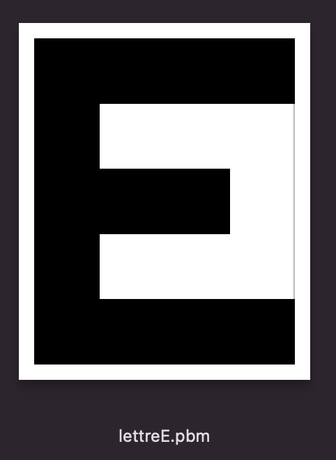
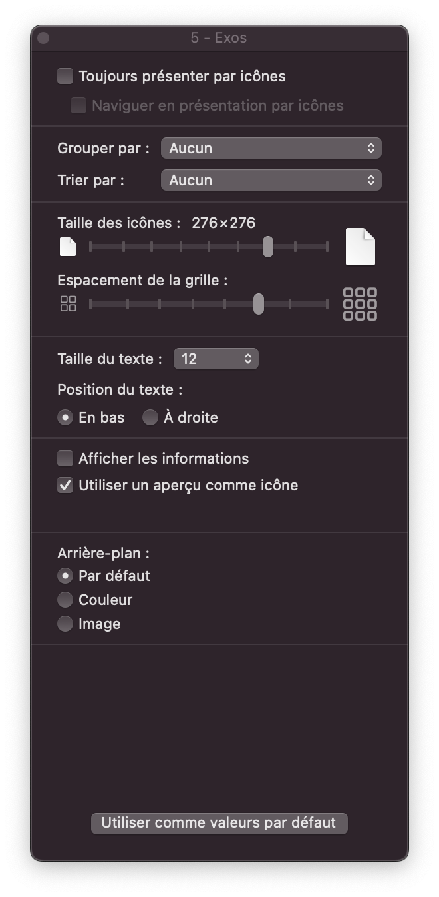

(ens:repinfo:imagesnumeriquesvar)=
# Images Numériques 

Cette activité est une variante qui n'utilise pas de langage de programmation (Python, numpy, matplotlib, etc.). Elle se base sur les formats de fichiers textes suivant:

- *.pbm* - images en noir et blanc
- *.pgm* - images en niveaux de gris
- *.ppm* - images en couleur

Les fichiers créés sont visibles en tant qu'îcones sur les systèmes d'exploitation Mac OS.

 

---- 

```{admonition} Notice
:class: hint

* **Thème** : Représentation de l'information (images et pixels)
* **Niveau** : Facile 
* **Durée** : 2 périodes
* **Objectifs pédagogiques** : Manipuler la notion de pixel
* **Notions fondamentales** : Représentation binades pixels par des nombres entiers
* **Modalité** : sur ordinateur
* **Matériel** : aucun
* **Prérequis** : Aucun
```


*Vous allez créer des images simples en écrivant des nombres*

Une introduction au codage des images en liste de pixels.

----
