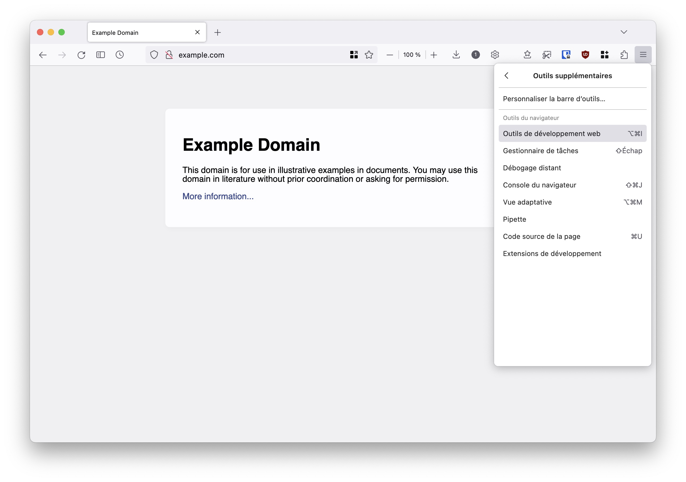
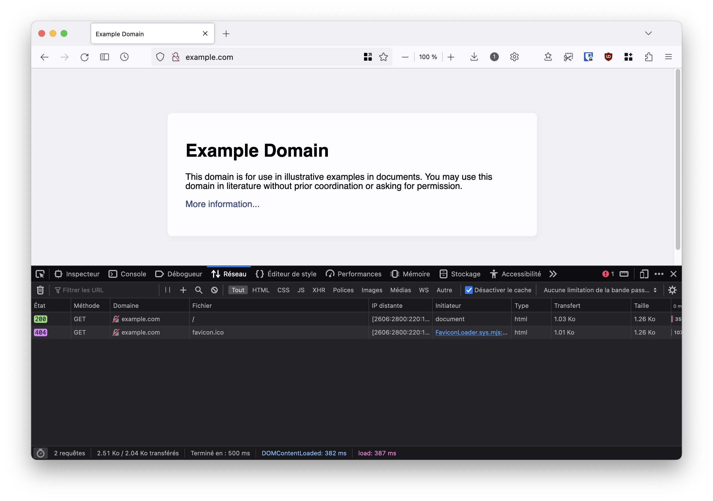

# Analyses de requêtes

```{admonition} Notice
:class: hint

* **Thème** : `Réseaux` (transversal avec `Vie privée et surveillance` et `Économie du numérique`)
* **Niveau** : `moyen` <!-- L’activité n’est pas facile, car elle demande une certaine supervision de l’enseignant·e et car les outils sont probablement inconnus des élèves. Elle n’est toutefois pas difficile car rien n’est à installer, l’activité peut se faire sans outil autre que l’ordinateur et le navigateur ce qui en simplifie l’accessibilité. Les objectifs sont d’une complexité notable mais peu exigeants sur les pré-requis et la technicité. Dépendant de l’aise des élèves et de l’avancée dans le chapitre Web, l’activité prévoit de revoir les points essentiels du web à comprendre pour effectuer l’activité à tout niveau. -->
* **Durée** : 2 périodes
* **Objectifs pédagogiques** : les objectifs de cette séquence sont associés à ceux du chapitre Réseaux, notamment `sécurité et sensibilisation aux bonnes pratiques; notions et modèles d’architectures et de protocoles`. De plus, les objectifs transversaux d’enjeux sociaux sont visés notamment `vie privée et surveillance; économie du numérique`. Plus d’explications sont données dans la partie [](webtracking.didactique)
* **Modalité** : `branché`
* **Matériel** : Ordinateur et navigateur web
* **Prérequis** : Il est préférable d’avoir étudié les éléments du chapitre [World Wide Wide](https://apprendre.modulo-info.ch/resx/web.html). Cette activité le complète (éventuellement conclut) et lui apporte une activité pratique.
* **Notions fondamentales** : Les technologies du web et leur fonctionnement, la compréhension d’une trace réseau, la modélisation d’une interaction sur le web
* **Taille du groupe** : `demi-classe`

```

(webtracking.theorietracereseau)=

## Théorie - trace réseau

*Durée : 10-15 min*

Cette étape se veut être une étape d’**introduction de TP avec les élèves** : l’idée est de les accompagner avec l’outil d’analyse du réseau de leur navigateur et leur permettre de progressivement et en autonomie croissante, pouvoir effectuer les exercices demandés. Une **phase introductive frontale et guidée** peut être une bonne idée pour s’assurer d’initialement avoir l’attention de toutes et tous et éviter d’avoir des élèves perdus.


```{admonition} Important
:class: caution
Les élèves seront amenés à naviguer par eux/elles-mêmes. Ceci est grandement encouragé mais il est important d’appuyer qu’**il sera difficile de comprendre tout le trafic observé sur n’importe quel site web (même pour l’enseignant·e)** ! Expert·e des technologies web est un métier, et même les personnes expertes sont spécialisées dans un domaine : tout comprendre du web est aujourd’hui presque utopique !

Toutefois, il faut absolument valoriser et expliquer que **les critères de réussite de la tâche ne se mesureront pas en "combien de % des requêtes je suis capable de comprendre"** mais "**suis-je capable d’expliquer le contenu et la nature de certaines requêtes ? Comment puis-je les justifier dans leur contexte ? Suis-je capable d’expliquer une requête particulière sélectionnée volontairement par mon enseignant·e ?**" (c’est ce qui rend la tâche intéressante, authentique et l’éloigne d’une forme d’évaluation mesure 😉). Voir [](webtracking.didactique)
```

Il existe de nombreux moyens d’observer une trace réseau, et à différents niveaux de la [couche OSI](https://fr.wikipedia.org/wiki/Mod%C3%A8le_OSI) (applications de monitoring dans le routeur, application dans le système d’exploitation comme [Wireshark](https://www.wireshark.org/) ou [tcpdump](https://www.tcpdump.org/)). Toutefois, pour cette proposition d’activité, nous utilisons **l’outil intégré au navigateur**, car il est :

- intégré : rien n’est à installer sur les ordinateurs du gymnase ou à la maison
- lisible et axé sur les aspects du web et moins sur les informations de la couche OSI, ce qui permettra d’identifier plus clairement les acteurs
- s’exporte en format [HAR](https://fr.wikipedia.org/wiki/Format_HTTP_Archive) ce qui permet d’avoir un format unique malgré les différences de navigateur (et peut permettre de créer des traces à l’avance et les donner aux élèves pour diminuer l’incertitude par exemple en évaluation)
- étant dans le navigateur, il est possible de toutefois voir les données transmises via HTTPS de manière déchiffrée (vu que le chiffrement se fait dans le navigateur)

Notez toutefois qu’au vu des objectifs pédagogiques visés, l’utilisation d’une autre application permettrait tout à fait de remplir les objectifs pédagogiques visés (voir [](webtracking.didactique)).

```{admonition} Avertissement
:class: danger
L’activité est principalement développée en testant **sur Firefox**. Des tests légers de fonctionnalités sur les autres navigateurs ont été effectués à la conception, mais il pourrait être raisonnable et simplifier grandement la tâche de l’enseignant·e d’**effectuer ce TP sur Firefox**.
```

```{admonition} Micro-activité
:class: note
Pour commencer à montrer aux élèves le fonctionnement de l’outil de capture, il est possible de leur proposer de se rendre sur <example.com>, et d’**activer leurs outils de développement web**.


Une fois ceci fait, il est possible de les emmener sur **l’onglet "Réseau"** où iels pourront recharger la page et voir la liste des requête réseau faîtes.


Afin de toutes et tous partir sur une base commune, il peut être pertinent de leur demander d’activer **les mêmes en-têtes pour toute le monde** en faisant un clic-droit sur la barre d’en-tête de l’onglet réseau :


Un fois ceci fait, le prochain outil essentiel est la **barre de filtre** où les élèves peuvent ajouter de nombreux types de filtres qui seront utiles plus tard.
```

```{figure} media/images/webtools-import-export.jpeg
---
alt: outils web, import-export
width: 300px
---
Vous pouvez également montrer la possibilité d’importer et d’exporter des traces réseau directement depuis la console réseau du navigateur. Ceci permettra aux élèves de vous envoyer des traces, sauvegarder leurs traces et les réutiliser, et vous permettra de créer des exercices hors-ligne.
```

(webtracking.observationdetracereseau)=

## Pratique - observation de trace réseau

*Durée : 15-20 min*

Lors de cette partie, l’objectif est de *guider les élèves progressivement à travers l’analyse de traces générées par des interactions web de plus en plus complexes*. Les élèves sont censés gagner en autonomie au cours de cette étape. Il est toujours essentiel de rappeler que **le but n’est pas de tout comprendre** au fur et à mesure que les interactions sont plus complexes, mais de pouvoir **identifier des éléments clés**.

Ainsi, il revient à l’enseignant·e de distinguer vers quels élèves intervenir pour expliquer des fondamentaux et vers quels élèves ne pas intervenir pour expliquer des détails de web moderne hors du sujet traité. Pour aider à cette distinction, l’étape suivante **donne des idées de sites où l’interaction web permet de distinguer des éléments clés et la nature de ces éléments à relever qui sont alignés sur les objectifs de la séquence**.

### Trace réseau et contenu web

```{admonition} Micro-activité
:class: note
Demander aux élèves de se rendre sur un site web très simple, comme par exemple <https://example.org> dans un nouvel onglet. Le but est ici de les forcer à **refaire la procédure d’ouverture des outils de développement web** (et se rappeler que, comme l’indiquent les navigateurs, la page doit être rechargée).

Une fois ceci fait, les élèves doivent reporter les informations suivantes (quiz Moodle, quiz papier, ...):

Choisir une requête parmi celles qui apparaissent à l’écran et compléter le tableau :
| Nom de ressource | Méthode HTTP | Domaine contacté | Protocole utilisé | Pourquoi la requête est initiée | Type de document reçu | Intérêt de la requête                                             |
| ---------------- | ------------ | ---------------- | ----------------- | ------------------------------- | --------------------- | ----------------------------------------------------------------- |
| ...              | ...          | ...              |                   |                                 |                       |                                                                   |
| /                | GET          | example.com      | HTTPS             | Car la page a été rafraîchie    | HTML                  | Cette requête permet d’obtenir le corps de la page web visualisée |

Notez les points suivants qui sont fondamentaux pour poursuivre la séquence :
- le protocole peut être lu depuis la colonne URL (pas besoin d’activer la colonne protocole, elle ne fait que donner la précision si HTTP 1, 2 ou QUIC est utilisé)
- la colonne `Initiateur` de la console Réseau peut être difficile à lire (d’autant que la nature de [son contenu n’est pas documentée](https://bugzilla.mozilla.org/show_bug.cgi?id=1848769)). **Remplir la colonne "`Pourquoi la requête est initiée`" demande aussi du jugement** : nous venons de charger la page, il est normal que nous recevions un document HTML. La colonne initiator est toutefois intéressante lorsqu’elle précise qu’un `script` ou qu’une `feuille de style` sont à l’origine d’une requête.
- il est important d’introduire la colonne "Intérêt de la requête" pour **guider les élèves vers les bons questionnements** vis à vis des traces et la remise en contexte telle que décrite par les objectifs de la séquence
```

### Différents types de ressources

```{admonition} Micro-activité
:class: note
Demander aux élèves de se rendre sur un site légèrement plus complexe mais toutefois **chargeant principalement des ressources internes** comme par exemple <https://fr.wikipedia.org> ou <https://www.vd.ch>. De nouveau, vérifier la bonne compréhension de la mise en place du moniteur de réseau.

Une fois ceci fait, il est possible de par exemple demander aux élèves de reporter les informations suivantes :
| Nom de ressource            | Méthode HTTP | Domaine contacté | Protocole utilisé | Pourquoi la requête est initiée                                 | Type de document reçu | Intérêt de la requête                                                                 |
| --------------------------- | ------------ | ---------------- | ----------------- | --------------------------------------------------------------- | --------------------- | ------------------------------------------------------------------------------------- |
| ...                         | ...          | ...              |                   |                                                                 |                       |                                                                                       |
| Wikipédia Accueil_Principal | GET          | fr.wikipedia.org | HTTPS             | Car la page a été rafraîchie                                    | HTML                  | Cette requête permet d’obtenir le corps de la page web visualisée                     |
| wikipedia.png               | GET          | fr.wikipedia.org | HTTPS             | Une image est intégrée dans le document principal (balise img)   | PNG                   | La requête permet de charger une ressource référencée dans le document HTML principal |
| load.php                    | GET          | fr.wikipedia.org | HTTPS             | Un script est inséré dans le document principal (balise script) | Code JavaScript       | La requête permet de charger une ressource référencée dans le document HTML principal |

A noter que :
- vous pouvez librement **pré-remplir certaines lignes** pour sélectionner précisément certaines ressources à étudier, communes pour tous les élèves
- il est peut être **difficile d’analyser en détail le script chargé**. Une explication simple suffit à justifier de la compréhension de l’élève. Un script comme ressource interne permet souvent d’afficher le contenu de la page : éléments dynamiques et animations, adaptation aux différents écrans, ...
```

```{admonition} Micro-activité
:class: note
:name: google-post
Un autre exercice intéressant peut être d’identifier **des requêtes de type POST**. Un bon exemple est la page d’accueil de Google : <https://www.google.com/>

Une fois ceci fait, il est possible de par exemple demander aux élèves de reporter les informations suivantes :
| Nom de ressource | Méthode HTTP | Domaine contacté | Protocole utilisé | Pourquoi la requête est initiée                             | Type de document reçu | Intérêt de la requête                                                                 |
| ---------------- | ------------ | ---------------- | ----------------- | ----------------------------------------------------------- | --------------------- | ------------------------------------------------------------------------------------- |
| ...              | ...          | ...              |                   |                                                             |                       |                                                                                       |
| -                | POST         | www.google.com   | HTTPS             | C’est un script qui la déclenche (Firefox indique (beacon)) | -                     | Cette requête permet de donner des informations sur notre navigateur et nous à Google |

A noter que :
- il est attendu que les élèves aient du mal à identifier ce qui a lancé la requête : c’est un contexte où iels doivent **utiliser leur jugement et identifier qu’iels n’ont rien fait d’autre que d’ouvrir la page**, ainsi, seule une action automatique déclenchée par un script permet de générer cette action (dans un contexte où iels auraient lancé une recherche, la réponse serait différente)
- le concept de **beacon** sera couvert plus tard dans la séance. Cette petite partie d’exercice attire l’attention des élève sur la présence des **requêtes de type POST dans un contexte où iels n’ont pas effectué d’action la générant**
```

### Ressources internes et ressources tierces

```{admonition} Micro-activité
:class: note
Demander aux élèves de se rendre sur un site légèrement plus complexe et **axé sur le chargement de ressources pouvant être tierces** comme par exemple <https://code.org/helloworld>. De nouveau, vérifier la bonne compréhension de la mise en place du moniteur de réseau.

Une fois ceci fait, il est possible de par exemple demander aux élèves de reporter les informations suivantes :
| Nom de ressource                   | Méthode HTTP | Domaine contacté      | Protocole utilisé | Pourquoi la requête est initiée                    | Type de document reçu | Intérêt de la requête                                                                                                                        |
| ---------------------------------- | ------------ | --------------------- | ----------------- | -------------------------------------------------- | --------------------- | -------------------------------------------------------------------------------------------------------------------------------------------- |
| ...                                | ...          | ...                   |                   |                                                    |                       |                                                                                                                                              |
| favicon.ico?0.0035782818514278336= | GET          | facebook.com          | HTTPS             | Une balise d’image charge cette ressource          | SVG                   | La page contient une icône Facebook en bas, celle-ci est téléchargée auprès de Facebook                                                      |
| async-api.e9f77430-1.237.1.min.js  | GET          | js-agent.newrelic.com | HTTPS             | Un script a chargé cette ressource automatiquement | Code JavaScript       | Cette requête permet de télécharger du code JavaScript auprès d’un fournisseur de contenu externe. Son intérêt spécifique est dûr à analyser |

A noter que :
- dire que **la fonction d’un script est dure à analyser est une réponse valide** (même si elle donne peu d’information, il est important de discerner entre l’analysable et le non analysable). Comme précédemment, les élèves doivent juste pouvoir décrire les fonctions habituelles standard d’un script (pour le différencier d’une image ou d’un document)
- le site chargeant beaucoup de ressources, il devient essentiel d’**indiquer clairement aux élèves comment se servir de la barre de filtre** pour identifier une ressource, et **quelles ressources cibler**. Il est possible de faire **varier les attributs ciblés pour tester la compréhension des élèves** : "identifiez la ressource chargée auprès de Facebook", "identifiez les requêtes POST" ou "identifiez les ressources de type feuille de style" permettent d’identifier des compétences de discrimination et de ciblage variées chez les élèves. Les élèves moins à l’aise avec la barre de filtre peuvent aussi **cliquer sur l’entête d’une colonne pour trier** selon les valeurs de cette dernière. 
```

### (optionnel) Chargement sécurisé et non sécurisé

```{admonition} Aller plus loin
:class: note
Cette partie est classée comme **"optionnelle" pour permettre une flexibilité vis à vis des élèves ayant plus de difficultés** avec les contenus précédents et y passer plus de temps. Cette partie s’intéresse spécifiquement aux connections sécurisées contre non-sécurisées. Cela peut être un bon appui pour un rebond lors de la **discussion sur la confidentialité dans la partie [](webtracking.proprietevieprivee)**, mais n’est pas forcément nécessaire pour comprendre les enjeux du suivi sur internet. 

La plupart des navigateurs actuels sont très informatifs sur les implications d’une connection sécurisée, mais un test en condition peut être pertinent pour encadrer et institutionaliser cette situation.
```

```{admonition} Micro-activité
:class: note
Afin de tester et identifier une connexion non sécurisée, le site web <http://testphp.vulnweb.com/login.php> propose une interface volontairement insécure. Il est important de rappeler aux élèves les implications d’une connexion non-sécurisée. La page de login permet de tester l’envoi d’un formulaire non-sécurisé (des identifiants par défauts sont disponibles et les seuls fonctionnels: username `test`, password `test`). Entrer ces informations et appuyer sur "login" permet d’obtenir une trace intéressante.

Une fois ceci fait, il est possible de par exemple demander aux élèves de reporter les informations suivantes :
| Nom de ressource | Méthode HTTP | Domaine contacté    | Protocole utilisé | Pourquoi la requête est initiée | Type de document reçu | Intérêt de la requête                                                                                    |
| ---------------- | ------------ | ------------------- | ----------------- | ------------------------------- | --------------------- | -------------------------------------------------------------------------------------------------------- |
| ...              | ...          | ...                 |                   |                                 |                       |                                                                                                          |
| -                | POST         | testphp.vulnweb.com | HTTP              | Un formulaire a été validé      | -                     | L’utilisateur·trice doit donner son identifiant et mot de passe pour prouver son droit d’accès au compte |

A noter que :
- il peut être pertinent d’**étudier avec les élèves les différents types d’avertissements donnés par les navigateurs**, et d’en discuter dans le contexte de la confidentialité (quels adversaire peuvent voir la ressource, comment peuvent-ils opérer, ...)
- cet exercice se prête bien à l’**affichage avancé d’une ligne de la trace**. Notamment en ce qui concerne la trace de POST request : un clic permet d’observer que **la requête contient littéralement le mot de passe** (si celui-ci n’est pas chiffré, il circule sur internet et peut être capturé par n’importe qui) (voir la {ref}`Figure suivante<testvulnweb>`)
```

```{figure} media/images/testvulnweb.jpeg
---
alt: screenshot password plaintext transmission
name: testvulnweb
width: 650px
---
Voir le mot de passe dans l’analyse réseau d’une requête POST d’authentification sur un site web non sécurisé
```

(webtracking.tracereseauetsuivi)=

## Trace réseau et suivi - les traqueurs

*Durée : 20-25 min*

Une fois que les élèves sont familiarisé·e·s avec l’observation de trace réseau, iels remarqueront que les sites web modernes ont **des traces réseau complexes**, difficiles à déchiffrer et comprendre. C’est ainsi qu’il faudra familiariser les élèves avec le concept d’**identification des traqueurs**, pour distinguer les requêtes liées au **contenu du site web, et celles qui ont un but de suivi** (et plus tard, parler de leur intérêt économique), toujours dans l’objectif d’enrichir leur modélisation des interactions lors d’une communication réseau sur le web.

### Différents types de traqueurs

Le premier moment clé de l’analyse de suivi ou non sur le web est l’identification de ce que sont les traqueurs. De nombreuses définitions existent : {glo}`tracker@1|Ghostery`, {glo}`tracker@2|Wikipedia` ou {glo}`tracker@3|Mozilla` proposent des définitions intéressantes et variées, qui mettent en avant différentes facettes du suivi.

Dans le cadre de cette séquence de TP, nous allons identifier différents types de traqueurs par **leur méthode de fonctionnement** et **l’information qu’ils transmettent**, afin de faire un pont entre l’identification de ces derniers dans une trace réseau et les propriétés de la vie privée mises à mal. L’idée est alors de présenter aux élèves 3 types de traqueurs :

| Type de traqueur              | Fonctionnement                                                                                                                                                                                                                                                                                                                       | Information transmise                                                                                                              | Exemple                                                                                                                                                             |
| ----------------------------- | ------------------------------------------------------------------------------------------------------------------------------------------------------------------------------------------------------------------------------------------------------------------------------------------------------------------------------------ | ---------------------------------------------------------------------------------------------------------------------------------- | ------------------------------------------------------------------------------------------------------------------------------------------------------------------- |
| Beacon ou Pixel espion ou Tag | Une ressource (souvent externe) doit être chargée et, ce faisant, contacte un domaine. Le domaine contacté sait que nous sommes censés trouver la ressource sur une page web précise (peut ou pas être combiné avec les cookies)                                                                                                     | A quelle heure et avec quelle IP une ressource a été rencontrée                                                                    | [Cet article](https://proton.me/support/email-tracker-protection) de Proton explique le fonctionnement de leur mécanisme de protection des mails contre les beacons |
| Fingerprinting                | Le navigateur reçoit du code JavaScript qui permet d’identifier des attributs précis et unique de votre navigateur et les envoie sur un domaine de suivi                                                                                                                                                                             | De nombreux attributs sont transmis, et ils permettent souvent d’identifier uniquement un navigateur (soit un·e utilisateur·trice) | [coveryourtracks.eff.org](https://coveryourtracks.eff.org/) en montre un très bon exemple                                                                           |
| Cookie tiers                 | Comme vu sous [](webtracking.interractionressourcesweb), les cookies sont des fichiers texte transmis automatiquement avec les requêtes HTTP. Sans contrôle de la part du navigateur, un site peut déposer et prendre les cookies des autres sites pour traquer un·e utilisateur·trice en lui attribuant un numéro unique par exemple | Quel utilisateur·trice visite quels sites et quand                                                                                 | [La page Wikipédia sur le sujet](https://en.wikipedia.org/wiki/HTTP_cookie#Third-party_cookie) apporte un bon exemple                                               |

Le choix de présentation de ces types de traqueurs est libre. Il est possible de s’axer sur la mise en exergue d’exemple, l’utilisation de diapositives ou d’un tableau de classification. L’idée est de permettre aux élèves de **distinguer que différents types de traqueurs existent et emploient différentes méthodes** : des plus ou moins complexes, permettant d’obtenir des **informations plus ou moins précises** (ce qui sera un rebond essentiel dans l’explication de la partie [](webtracking.proprietevieprivee)). Il est important aussi d’expliquer que la plupart de ces méthodes sont **utilisées en combinaison pour assurer les chances de succès** (la requête tente de transmettre des cookies si possible, sinon elle agit comme un simple beacon, par exemple).

```{admonition} À retenir
:class: attention
- **différentes méthodes** de suivi existent, elles sont souvent **utilisées en combinaison**
  - il sera difficile d’identifier clairement à quelle catégorie de traqueur correspond un élément de trace réseau (et c’est normal, un script peut déclencher un beacon et tenter en même temps du fingerprinting et s’aider de cookies, la nuance est fine dans la réalité)
  - le but sera d’utiliser le jugement et la compréhension des élèves pour **leur faire faire des suppositions sur la nature du traqueur** (**GET vers un site tiers : beacon, POST généré automatiquement par JavaScript : fingerprinting**)
- elles sont **plus ou moins complexes** et fournissent des **informations différentes**
- elles ont globalement pour objectif d’**identifier uniquement une personne navigant** entre plusieurs pages (concept même de suivi)
```

```{admonition} Aller plus loin
:class: note
Dépendant de l’aise des élèves dans le domaine, il est possible de mettre en avant le compromis entre **la difficulté de bloquer le traqueur** et **la précision de l’information qu’il apporte** : bloquer les beacons peut empêcher l’apparition de certaines images et la distinction entre traqueur et fournisseur de contenu est fine, cependant, ils apportent une quantité d’information limitée. Le fingerprinting est une solution intermédiaire ([fingerprintjs](https://github.com/fingerprintjs/fingerprintjs), dans sa version payante, promet 99.5% de succès dans l’identification unique), et le cookie est la solution reine en quantité d’information pour l’identification unique mais est aisément bloqué par une politique "First Party Only" comme le [Firefox Cookie Protection](https://blog.mozilla.org/security/2021/02/23/total-cookie-protection/)
```

### Comment traquer les traqueurs

Une fois les différents types de traqueurs analysés, l’objectif est de pouvoir **les identifier dans la communication avec un site web** et permettre aux élèves de faire le lien entre les technologies de tracking enseignées aux élèves et la réalité des communications réseau sous-jacente.

Afin de permettre aux élèves d’avoir les outils nécessaires pour comprendre les interactions entre client, fournisseur de service et traqueur, il semble important de leur donner accès à une **base de donnée indexée et répertoriant des traqueurs** de sites web connus afin de guider leur recherche. Les sites [whotracks.me](https://whotracks.me) et [trackography.org](https://trackography.org/) fournissent une base de données et des visualisations intéressantes permettant aux élèves de naviguer en autonomie et utiliser leur jugement pour identifier les traqueurs dans une trace réseau.

```{admonition} Anecdote
:class: hint
Le site web de [whotracks.me](https://whotracks.me) utilise des données open-source et [leur repo GitHub](https://github.com/whotracksme/whotracks.me) indique comment construire leur site en local. Il pourrait être envisageable, dans le cadre du cours, d’avoir une version locale du site pour la personnaliser.
```

```{admonition} Micro-activité
:class: note
:name: ricardo-activity
Demander aux élèves de se rendre sur le site [whotracks.me](https://whotracks.me), et d’utiliser la barre de recherche pour trouver le site ["ricardo.ch"](https://whotracks.me/websites/ricardo.ch.html). En bas de cette page, les élèves trouveront les traqueurs qu’iels peuvent s’attendre à voir et, en cliquant dessus il est possible d’obtenir quelques informations au sujet des entreprises de tracking concernées.

Les élèves peuvent maintenant se rendre sur le site web [ricardo.ch](https://ricardo.ch) et ouvrir leurs outils d’analyse du réseau. A l’aide de la base de données de traqueurs, il est possible de demander aux élèves d’identifier des connexions liées aux 10 traqueurs annoncés comme les plus présents sur le site d’après la base de données. Il est ensuite possible de leur demander de reporter les informations suivantes (notez l’addition d’une nouvelle colonne à droite) : 
| Nom de ressource | Méthode HTTP | Domaine contacté     | Protocole utilisé | Pourquoi la requête est initiée           | Type de document reçu | Intérêt de la requête                                                                                         | Technologie de tracking potentielle (et pourquoi)                                                                      |
| ---------------- | ------------ | -------------------- | ----------------- | ----------------------------------------- | --------------------- | ------------------------------------------------------------------------------------------------------------- | ---------------------------------------------------------------------------------------------------------------------- |
| ...              | ...          | ...                  |                   |                                           |                       |                                                                                                               |                                                                                                                        |
| gtm.js           | GET          | googletagmanager.com | HTTPS             | Du code javascript a généré cette requête | -                     | Ricardo.ch utilise les services de Google Tag Manager pour analyser le trafic sur son site web             | On suppose un beacon car il s’agit d’un "service de tag" (c’est dans le nom)                                           |
| map.js           | GET          | maps.google.com      | HTTPS             | Du code javascript a généré cette requête | Code JavaScript       | Ricardo.ch utilise les services de Google Maps pour permettre d’identifier la position de l’utilisateur·trice | On suppose un beacon : Google est informé de notre visite sur Ricardo.ch via cette requête                             |
| -                | POST         | sentry.io            | HTTPS             | Du code javascript a généré cette requête | -                     | Ricardo.ch utilise les services de Sentry.Io pour analyser la qualité de service de leurs clients             | On suppose du fingerprinting car une requête POST a donné des informations sans que nous n’interagissions avec le site |

A noter que :
- il n’est pas attendu que les élèves comprennent le fonctionnement de chaque entreprise de tracking, mais **identifient des moyens et méthodes et les associent à des technologies de tracking** (ce qui permettra notamment de les associer à des risques pour la vie privée)
- **plusieurs réponses** sont possibles pour un même traqueur, l’important est d’évaluer la qualité du jugement de l’élève vis à vis des objectifs
- l’enseignant·e est libre de **donner des contraintes** : "trouvez quelque chose qui ressemble à du fingerprinting et expliquez pourquoi vous pensez cela" ou "quelle entreprise semble avoir une présence dominante sur le tracking de ce site" pour **guider la recherche de traqueurs**
  - il est bien sûr plus intéressant de chercher des rétroactions auprès des élèves pour permettre de guider leur actions pour résoudre leurs difficultés, cela peut se faire de manière assez fluide en **pré-remplissant certaines colonnes de ce tableau et travaillant spécifiquement sur les autres**
```

Une fois cet exercice complété, il est possible et intéressant de le réitérer avec un ou plusieurs sites différents (par exemple [20minutes.ch](https://www.20minutes.ch) ou tout autre site de news qui sont de bonnes sources de tracking).

```{admonition} Aller plus loin
:name: trackography
:class: note
En se rendant sur la carte interactive de Trackography.org, il est possible d’observer un résumé des interactions du tracking sur une carte du monde. 

Par exemple, [ce lien](https://trackography.org/#CHE_5a27) vous montre directement le suivi (dans son aspect d’identification et d’association à votre navigation) entre les sites de news SwissInfo.ch et tdg.ch. Cette infographie montre notamment que **c’est aux états-unis que vos données pour le tracking sont envoyées, même en se rendant sur deux sites d’informations suisse** !
```

(webtracking.analysecomplete)=

## Analyse complète d’interactions web

*Durée : 35-40 min*

Cette étape se veut être une forme d’objectivation de la tâche effectuée. L’idée est d’y dédier la majeure partie de la seconde période de TP pour :

- mettre en avant les objectifs et critères de réussite attendue de la part des élèves sur la séquence (voir [](webtracking.didactique))
- créer des ponts pertinents avec la théorie des cours en classe entière (notamment dû aux différences entre les demi-groupes qui peuvent être en avance ou en retard avec la théorie)
- expliquer la forme que prendrait une tâche d’évaluation sommative liée à cette séquence (si ceci est effectivement prévu par l’enseignant·e)
- permettre une phase d’évaluation formative autour de la tâche

Les formes d’évaluations sont libres et diverses. Un exercice de report d’informations sur des interactions avec des sites web permet une bonne évaluation de leur compréhension du système. Il est également possible d’imaginer demander des diagrammes d’interaction pour modéliser la présence des différents acteurs par exemple.

Afin de sélectionner un ou plusieurs sites pour créer cette séquence de report d’informations, une bonne source de sites web avec traqueurs de types indexés est la base de donnée de [whotracks.me](https://whotracks.me/) où vous pouvez créer une collection de sites à visiter pour les élèves ou préparer des traces à l’avance.

```{admonition} Important
:class: caution
Une **évaluation complète des critères de réussite** de cette séquence **requiert d’avoir couvert toute l’activité**. Ainsi, dépendant de l’avancée des groupes de TP par rapport aux séances débranchées, il peut être pertinent d’utiliser ce temps et cette séquence formative comme une formation sur une sous-partie d’évaluation ou une évaluation complète. Suite à cela, il serait possible d’ajouter des colonnes comme "risques pour la vie privée" et "moyens de protection" pour permettre aux élèves d’exprimer un raisonnement le plus complet possible.
```
